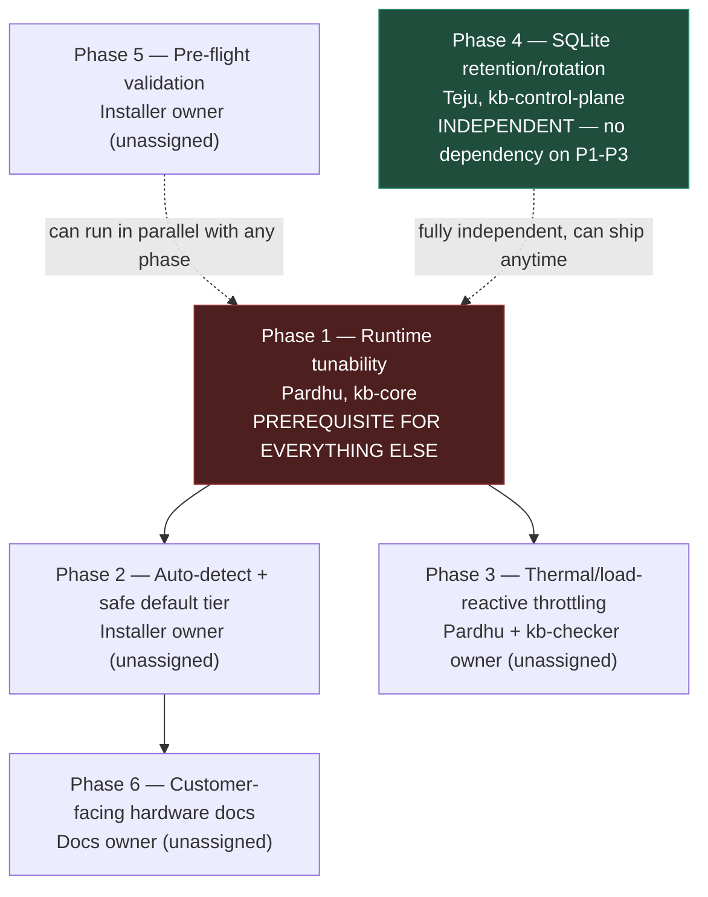

# Path to Production: Resource Management & Thermal/Footprint Roadmap

**Scope**: Cross-subsystem — `kb-core` (Pardhu Varma, Primary Maintainer), `kb-control-plane` (Tejaswini, Primary Maintainer), `kb-checker` (Pardhu Varma, Primary Maintainer — per `docs/project/kb-team.md`, correcting this doc's earlier "owner TBD" note, which was written before that file had been checked).
**Status**: Roadmap. Nothing on this page is implemented. This is the plan for turning `kb-core_system_requirements.md`'s Min/Recommended/Balanced/Max tier structure from aspirational into something a real product actually does, safely, by default.
**Why this exists as its own doc, not folded into `kb-core_system_requirements.md`**: that doc is scoped to `kb-core` and owned by Pardhu; this plan spans three subsystems and three different owners. Keeping it separate avoids misattributing cross-cutting product work to a single-subsystem requirements doc.
**Written**: 2026-07-23, following directly from the analysis in `kb-core_system_requirements.md` (measured BPF map footprint, unthrottled Tier-1 events, no runtime tunability) and this session's live testing (real `kbd_sensor` run, confirmed fan/thermal response, confirmed always-on systemd design via `boot_sequence_spec.md`'s `Restart=always` units).

---

## The problem, restated

`kb-core` is designed to run always-on, from boot, indefinitely (`Restart=always` in `kbd.service`/`kb-checker.service`, per `boot_sequence_spec.md`). As currently built, every install pays the same fixed, maximal resource cost regardless of hardware — there is no tunability, no auto-detection, and no default safer than "attach every hook, unthrottle every Tier-1 event, scan entropy on a fixed schedule, forever." That's a reasonable posture for a dedicated security appliance; it is not a safe default for, e.g., a developer's laptop that also needs to do other things and has a fan curve tuned around bursty, not sustained, load.

Six things need to happen, in roughly this order, before this can ship as a product rather than a research build operators manually tune by editing source and recompiling.

## Intended deployment model — what the docs actually say

The project's own documentation points toward **SOC-monitored server/endpoint-fleet deployment**, not laptop/mobile as a primary target:
- `operator_interfaces_spec.md`: `kb-dashboard`'s stated user is explicitly "Security Operations Center (SOC) Analysts" — a fleet-monitoring role.
- `kb-aads/swarm/orchestrator.py` assumes an *existing* Ray cluster (`ray.init(address="auto", ...)`), not a local single-node instance — a server-fleet assumption baked into the code, not just the docs.
- `kernel_borderlands_specification.md`'s own illustrative SSH example uses the hostname `kb-server`, not `kb-laptop`/`kb-workstation`.

None of this *rules out* running on a laptop — it's just not what the architecture was calibrated around. This session tested exactly that (a laptop-class VM host), which is what surfaced the tunability gap in the first place.

**Laptop-class verdict, based on this session's actual measurements** (not the general "laptops are weak" framing — see the corrected note in `kb-core_system_requirements.md` re: the "zero-overhead" claim, which is about per-hook latency, not aggregate footprint):

- **Workstation-grade / "desktop-replacement" laptops** (e.g. this session's actual test host: Intel Core Ultra 9 275HX, 24 cores, 32GB RAM, 1.5TB storage) are functionally close to a small server on every axis that matters here: large cooling solutions built for sustained multi-core boost, high core count so the sensor's load is a small fraction of total capacity, ample RAM/disk headroom against §5's tiers, and typically AC-powered rather than run on battery for extended sessions. The fan ramp-up observed in this session on exactly this class of machine is normal behavior for sustained load on an HX-series chip — not a sign the hardware is struggling, and not laptop-specific (any sustained multi-core workload triggers the same response). **These machines can run this today, at full Max-tier cost, without the tunability work in this roadmap.**
- **Medium/mainstream or older laptops are the genuinely risky case, and specifically *because* Phase 1 doesn't exist yet.** These machines typically have thinner cooling tuned for bursty (not sustained) load, less RAM/disk headroom, and are more likely to run on battery — where continuous background CPU load has a real, laptop-specific cost (battery drain) that doesn't apply to AC-powered desktops/servers at all. Today, a machine in this class pays the exact same fixed Max-tier cost as a workstation laptop or a dedicated server, with the least hardware headroom to absorb it — the worst pairing of "who needs Min/Recommended tier most" and "who can least get it," since that tier doesn't exist as a real option yet (Phase 1). Running on this class of hardware today isn't recommended without at minimum the source-level stopgap edits noted in the earlier conversation (lower `KB_MAX_PROCESSES`, drop TLS uprobe attachment) — genuine tunability (Phase 1-2 below) is what actually fixes this class of hardware properly.

### Would Phase 1+2 tunability actually make medium/old laptops safe? A graduated answer, not a blanket yes.

Tunability closes most of the gap, but not all of it — two costs are structurally independent of Phase 1's resource-tier work, so "add tunability" doesn't uniformly mean "now safe" across every machine that currently qualifies as "old."

| Hardware class | Verdict once Phase 1+2 ship | Why |
|---|---|---|
| **Mainstream/medium laptops** (meets §4's kernel floor, modest but real RAM/disk margin) | **Yes — genuinely safe zone.** | Min tier's `BPF_F_NO_PREALLOC`+`LRU_HASH` conversion drops the fixed memory cost from ~40-50MB to low single-digit MB; the reduced "core only" hook set (no TLS uprobes, no `security_capable`, no network/`mprotect` hooks) removes the most expensive per-hit hook categories and most of the aggregate Tier-1 event surface along with them. This resolves nearly all of what §2/§3 identified as the aggregate cost driver for this class. |
| **Old, but kernel-compatible** (meets §4's floor, but limited RAM/disk) | **Mostly — much improved, not unconditionally safe until Phase 4 also ships.** | Same CPU/RAM relief as above applies. But `zone_transitions`/`audit_log` still grow unbounded at *any* tier — Phase 4 (Teju, `kb-control-plane`) is completely independent of Phase 1's `kb-core` tunability work. A machine with a small/slow disk (eMMC, small SSD) is exactly the one most exposed to this, and Phase 1+2 alone doesn't touch it. Calling this class "safe" requires Phase 4 in the picture too, not just Phase 1-2. |
| **Old and kernel-incompatible** (predates solid `CONFIG_BPF_LSM=y`/`CONFIG_DEBUG_INFO_BTF=y` support) | **No — unaffected by this roadmap entirely.** | §4's kernel/BTF requirement is a hard floor, not a resource knob. Even Min tier still needs BPF LSM hooks and CO-RE relocations to function at all — tunability changes *how much* runs, not *whether the kernel can run it in the first place*. The only fix here is updating the kernel itself, which is an operator action outside this roadmap's scope. |

---

## Phase 1 — Runtime tunability (prerequisite for everything else)
**Owner**: Pardhu, `kb-core`.
**Why first**: nothing else on this page is possible until there's something to actually configure. An installer can't "pick a tier" if the only way to change footprint is editing a `#define` and rebuilding.
**Scope** (already itemized in `kb-core_system_requirements.md` §6, restated here as the roadmap's foundational milestone):
1. `KB_MAX_PROCESSES` becomes a runtime value (env var, following the existing `KBD_SOCKET_PATH` override pattern in `kbd_sensor.c`), not a compile-time constant.
2. Hook-attach set becomes selectable at runtime — a config value listing which of `file_open`/`bprm_check_security`/`socket_bind`/`socket_connect`/`file_mprotect`/`commit_creds`/`security_capable`/TLS-uprobes to attach, rather than `kbd_sensor_bpf__attach(skel)` unconditionally attaching all of them.
3. `kb_syscall_counts` gets `BPF_F_NO_PREALLOC` and moves to `LRU_HASH` (matching the pattern `kb_rate_limit_lru_map` already uses) — this is called out specifically because it's the single highest-impact change in the whole roadmap: it eliminates most of the ~40-50MB fixed kernel-memory cost *regardless of which tier ends up selected*, so it's worth doing even in isolation before the rest of Phase 1 lands.
4. `KB_ENTROPY_SCAN_EVERY_N_POLLS` and `KB_ENTROPY_MAX_MAP_ITER` become runtime-tunable.
**Acceptance criteria**: a fresh `kbd_sensor` invocation with no special config still behaves exactly as it does today (backward-compatible defaults); a new set of env vars/config fields can reproduce each of the Min/Recommended/Balanced/Max profiles from `kb-core_system_requirements.md` §5-§6 without recompiling.

## Phase 2 — Auto-detection and safe-by-default tier selection
**Owner**: Karthik (primary — `scripts` subsystem lead, "development automation... environment setup, reproducible testing" per `kb-team.md` is the closest real match to installer-time detection logic), with Rupa (collaborator — "environment provisioning" on `scripts`) and Pardhu (collaborator — `kb-core`, since it's his binary's config being generated). No subsystem is literally named "installer/packaging" in this repo, so this is inferred from the closest matching existing ownership, not a formally declared assignment — worth confirming with whoever actually plans this work rather than treating as final.
**Depends on**: Phase 1.
**What it does**: at install time, detect available RAM and core count, and select a tier automatically — Min/Recommended/Balanced based on detected hardware. **Max tier requires explicit opt-in**, never auto-selected. This directly inverts today's behavior, where every install silently gets Max-tier cost with no way to know that's what's happening short of reading source.
**Acceptance criteria**: installing on a simulated low-spec profile (e.g. 1GB RAM, 1 core) produces a Min-tier config without operator intervention; installing on a high-spec box does not auto-select Max — that still requires an explicit flag, with the installer explaining what Max costs (referencing `kb-core_system_requirements.md` §5) before the operator confirms it.

## Phase 3 — Thermal/load-reactive throttling
**Owner**: Pardhu Varma, for both halves — he's Primary Maintainer of *both* `kb-core` (the sensor-side throttle hooks) and `kb-checker` (the monitoring/signaling loop that would decide when to trigger them), per `kb-team.md`. This actually simplifies the coordination concern originally flagged here: it's not two different people who need to agree on an interface, it's one person's design call across both subsystems. The separation-of-concerns reasoning still holds architecturally (monitoring decision in `kb-checker`, separate from `kbd`/`kb-core` which get throttled) — it's just not a cross-person handoff.
**Depends on**: Phase 1 (there has to be something to throttle at runtime).
**What it does**: extends the existing `ebpf_rate_limiting_design_spec.md` graceful-degradation philosophy — which today only reacts to ring-buffer/event-volume overload — to also react to sustained CPU/thermal pressure. Under detected pressure (e.g. sustained high core utilization attributable to `kbd_sensor`, or a thermal-throttling signal from the kernel), widen the entropy-scan interval and/or temporarily drop to a reduced hook set, then restore full coverage once pressure subsides.
**Open design question, not resolved by this roadmap**: what's an acceptable temporary detection-quality reduction under thermal pressure, and who signs off on that tradeoff? This is a security/product decision, not purely an engineering one — same caveat already flagged in `kb-core_system_requirements.md` §6 point 5 regarding the Min tier's entropy-scoring tradeoff. Whoever owns detection-quality standards for this product needs to be in this decision, not just `kb-core`/`kb-checker`.
**Acceptance criteria**: not yet defined — this phase needs its own design doc before implementation starts, this roadmap only establishes that it belongs in the plan and roughly where (Phase 3, after runtime tunability exists).

## Phase 4 — SQLite retention/rotation, shipped with a default, not optional
**Owner**: Teju, `kb-control-plane`. Cross-referenced from `kb-core_system_requirements.md` §2.5 and the `kb-control-plane` catalog doc — restated here because for a shipped product, "always-on forever, disk grows forever" is a correctness requirement, not a nice-to-have.
**What it does**: a default retention window (proposed: 90 days, operator-configurable) for `zone_transitions` and `audit_log`, with the rotation/archival job designed so the hash chain in archived segments remains independently verifiable (per the existing note in `kb-core_system_requirements.md` §2.5 — a bare `DELETE` breaks the chain; this needs an archive-and-checkpoint approach with a documented new genesis hash).
**Depends on**: nothing else in this roadmap — this phase is independently schedulable and could ship before Phases 1-3 land, since it's unrelated to the BPF/thermal side of the problem.
**Acceptance criteria**: `state.db` size growth is bounded under a fixed retention window in a long-running soak test; archived audit segments can still be independently hash-verified after rotation.

## Phase 5 — Pre-flight validation baked into setup
**Owner**: Karthik (primary, same `scripts`-subsystem reasoning as Phase 2 — pre-flight validation is squarely "reproducible testing"/"environment setup"), with Pardhu (collaborator — `kb-core`, since he knows exactly what needs validating: `CONFIG_BPF_LSM`, BTF, root/`CAP_BPF`). Same caveat as Phase 2: inferred from closest match, not a formally declared role.
**Depends on**: nothing technical — this can be built in parallel with any other phase.
**What it does**: scripts the checks this session did by hand — `CONFIG_BPF_LSM=y`, `bpf` present in the active `/sys/kernel/security/lsm` list, `CONFIG_DEBUG_INFO_BTF=y`/`/sys/kernel/btf/vmlinux` present, root/`CAP_BPF` availability — so setup either passes silently or tells the operator exactly what's missing and how to fix it (e.g. "add `bpf` to your kernel's `lsm=` boot parameter"), instead of `kbd_sensor` failing to attach with a low-level error.
**Acceptance criteria**: running setup on a kernel missing `bpf` from the active LSM list produces a specific, actionable error naming the exact boot parameter fix, not a generic BPF attach failure.

## Phase 6 — Publish hardware guidance before install, not after
**Owner**: Pardhu (primary — the content is fundamentally `kb-core_system_requirements.md`'s findings, and `kb-team.md`'s Responsibility Model already assigns each Primary Maintainer "documentation and developer guidance" for their own subsystem), with Rupa (collaborator — Design & Frontend/UI-UX, for how this gets presented if it becomes part of an installer flow or onboarding material rather than a raw markdown doc). No dedicated docs/marketing role exists in `kb-team.md`, so this is the closest grounded assignment, not a formal one.
**Depends on**: Phases 1-2 existing, so the guidance describes real, working tiers rather than aspirational ones.
**What it does**: turns `kb-core_system_requirements.md` §5's tier table into customer-facing pre-install documentation, so hardware expectations (including realistic fan/thermal behavior under Balanced/Max tiers) are set before someone installs, not discovered afterward via a support ticket.

---

## Ownership at a glance

| Phase | Owner | Status |
|---|---|---|
| 1 — Runtime tunability | **Pardhu**, `kb-core` | Named owner, `kb-team.md` Primary Maintainer |
| 2 — Auto-detection & safe defaults | **Karthik** (primary, `scripts`) + Rupa, Pardhu (collaborators) | Inferred from closest matching subsystem (`scripts` = dev automation/environment setup) — no "installer" role formally exists, so treat as proposed, not declared |
| 3 — Thermal/load-reactive throttling | **Pardhu**, for both halves — Primary Maintainer of `kb-core` *and* `kb-checker` | Named owner. Originally flagged as a cross-person coordination concern; corrected once `kb-team.md` was checked — it's one person's design call across both subsystems |
| 4 — SQLite retention/rotation | **Teju**, `kb-control-plane` | Named owner, `kb-team.md` Primary Maintainer. Fully independent — no dependency on Phases 1-3 |
| 5 — Pre-flight validation | **Karthik** (primary, `scripts`) + Pardhu (collaborator) | Same inferred-not-declared caveat as Phase 2 |
| 6 — Customer-facing hardware docs | **Pardhu** (primary — it's `kb-core`'s own content) + Rupa (collaborator — presentation/UI-UX) | Inferred from Responsibility Model's "docs is each Primary Maintainer's job for their own subsystem" — no dedicated docs/marketing role exists in `kb-team.md` |

All six phases now have a proposed owner. Three of six (Phases 1, 3, 4) are named, formally-declared Primary Maintainers per `kb-team.md`. The other three (Phases 2, 5, 6) are inferred from the closest matching existing subsystem ownership, since no "installer/packaging" or "docs/marketing" role formally exists in this repo — these should be treated as proposed defaults, not confirmed assignments, until whoever plans the org's work signs off on them. See each phase's full write-up above for the detailed reasoning behind each assignment.

---

## Sequencing summary

**Two immediately-actionable, low-dependency starting points** if this roadmap gets picked up: Phase 4 (SQLite retention — fully independent, `kb-control-plane`-only) and the single highest-impact item inside Phase 1 (`BPF_F_NO_PREALLOC` + `LRU_HASH` conversion for `kb_syscall_counts` — eliminates most of the fixed memory cost on its own, before the rest of Phase 1's runtime-config work is done).

**Update**: the paragraph that previously stood here listed Phases 2, 5, 6, and Phase 3's `kb-checker` half as unassigned ownership gaps. Corrected in the "Ownership at a glance" table above, after checking `docs/project/kb-team.md`: `kb-checker` has a named Primary Maintainer (Pardhu Varma), and Phases 2/5/6 now have proposed (if inferred-rather-than-declared) owners. See that table and each phase's Owner line for current detail.

---

## Changelog

- **2026-07-23**: Initial roadmap, derived from `kb-core_system_requirements.md`'s analysis and this session's live-testing findings (real sensor run, confirmed always-on systemd design, confirmed no runtime tunability exists).
- **2026-07-23**: Added "Intended deployment model" section (SOC/fleet-oriented, workstation-vs-medium/old-laptop verdict) and the graduated Phase 1+2 hardware-safety table. Added "Ownership at a glance" summary table consolidating each phase's owner (or ownership gap) for quick reference alongside the existing detailed per-phase Owner lines.
- **2026-07-23**: Checked `docs/project/kb-team.md` (hadn't been consulted before this pass) — corrected `kb-checker`'s ownership from "TBD" to Pardhu Varma (its actual named Primary Maintainer), which also simplified Phase 3 from a two-person coordination concern to one person's cross-subsystem design call. Assigned proposed owners to Phases 2, 5, and 6 based on the closest matching existing subsystem ownership (`scripts` for 2/5, `kb-core`'s own docs responsibility for 6), flagged explicitly as inferred defaults pending confirmation, not formal declarations.
