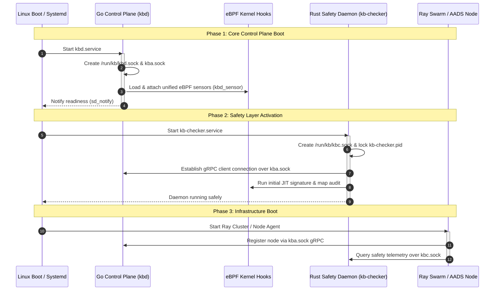
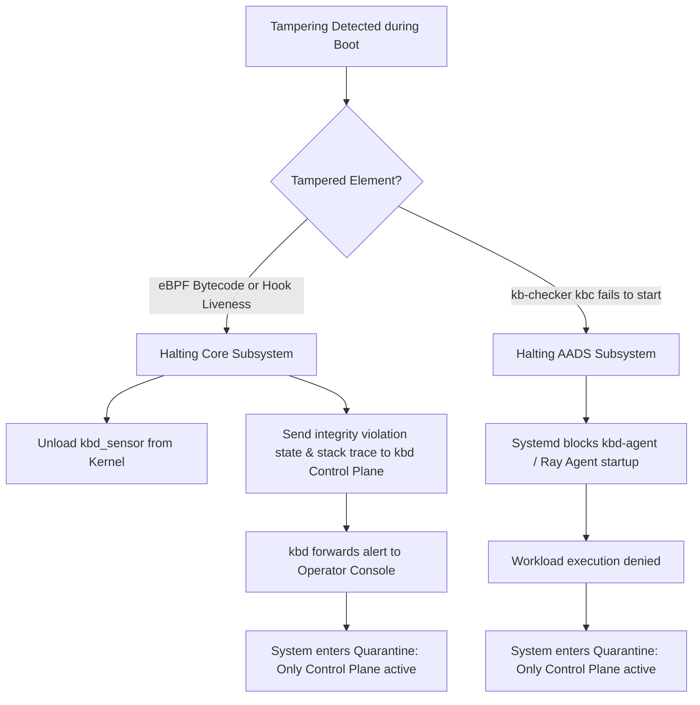

# Boot Sequence & Daemon Lifecycle Specification

This document defines the boot-time initialization sequence, socket ownership boundaries, and systemd service dependency mapping for the Kernel Borderlands (KB) platform. It ensures race-free service starts and guarantees security hooks are attached to the kernel before untrusted user space applications boot.

---

## 1. Architectural Sockets & Files

The Kernel Borderlands system relies on three primary Unix Domain Sockets (UDS) located in the `/run/kb/` runtime directory. The ownership, permission bounds, and creators are strictly defined as follows:

| Socket/File Path | Owner | Group | Permissions | Binding Process | Purpose |
| :--- | :--- | :--- | :--- | :--- | :--- |
| `/run/kb/kbd.sock` | `root` | `kb-devs` | `0660` | `kbd` (Go Control Plane) | Binary telemetry pipe for eBPF events from `kbd_sensor` to Go. |
| `/run/kb/kba.sock` | `root` | `kb-devs` | `0660` | `kbd` (Go Control Plane) | gRPC IPC socket for client registrations and enforcer directives. |
| `/run/kb/kbc.sock` | `root` | `kb-devs` | `0660` | `kb-checker` (Rust) | gRPC IPC socket for health diagnostic reporting to TUIs/CLIs. |
| `/run/kb/kb-checker.pid` | `root` | `root` | `0600` | `kb-checker` (Rust) | File lock preventing duplicate active safety daemons. |

---

## 2. Boot Timeline Sequence



### Phase 1: Core Control Plane Boot
1. **Service Launch**: Systemd starts the Go control plane daemon (`kbd.service`).
2. **Socket Setup**: `kbd` creates the `/run/kb/` directory (if not present) and binds the `kbd.sock` and `kba.sock` UNIX domain sockets.
3. **eBPF Loading**: `kbd` invokes `kb-core-loader` to compile, load, and attach `kbd_sensor.bpf.c` tracepoints and LSM hooks to the kernel.
4. **Readiness Signal**: `kbd` sends a readiness notification (`sd_notify`) back to Systemd, indicating that the IPC sockets are fully open and ready.

### Phase 2: Safety Layer Activation
1. **Safety Launch**: Systemd starts the Rust Safety Daemon (`kb-checker.service`). This service is configured to run strictly `After=kbd.service`.
2. **Single-Instance Protection**: `kb-checker` acquires an exclusive POSIX `flock` on `/run/kb/kb-checker.pid`. If blocked, the service aborts.
3. **Diagnostic Socket binding**: `kb-checker` binds `/run/kb/kbc.sock` to expose the diagnostic endpoint.
4. **Initial Verification**: `kb-checker` executes immediate blocking checks for:
   * **eBPF Bytecode Integrity**: Scans memory JIT signatures against `/etc/kb/ebpf_policies.json`.
   * **eBPF Hook Liveness**: Verifies the telemetry path by injecting a heartbeat process.
   * **BPF Map Integrity**: Verifies containment map flags in `/run/kb/contained_pids_map`.
5. **Operational State**: Once checks pass, the checker begins its scheduled auditing loops.

### Phase 3: Infrastructure Boot
1. **User Space App Activation**: The system transitions to the multi-user target, allowing AADS swarm nodes and local monitoring TUIs to start.
2. **Agent Registrations**: The Ray Node Agent connects to `/run/kb/kba.sock` to submit process registrations.
3. **Continuous Auditing**: Sockets and kernel performance are audited asynchronously by the checker.

---

### Chronological Boot Timeline

*   **`T+0.00s` — Power-On & UEFI Secure Boot**:
    *   The CPU powers on and UEFI initializes.
    *   UEFI validates the digital signature of the bootloader (`shim.efi` / `grubx64.efi`) against keys stored in the hardware NVRAM.
    *   GRUB executes, measures the boot files into TPM 2.0 PCRs, and boots the signed Linux kernel.
*   **`T+1.50s` — Initramfs & Drive Mounts**:
    *   The kernel mounts the initial RAM filesystem (initramfs) to load drivers.
    *   The root filesystem is mounted read-only initially, then read-write.
*   **`T+3.00s` — Systemd Initialization (PID 1)**:
    *   `systemd` takes control, reads unit configurations, and mounts runtime directory partitions (including the in-memory `/run/kb/` tmpfs).
*   **`T+4.50s` — Phase 1: Go Control Plane (`kbd.service`) Spawns**:
    *   Systemd starts the Go Control Plane daemon (`kbd`).
    *   `kbd` creates the `/run/kb/` directory and binds `/run/kb/kbd.sock` (telemetry loop) and `/run/kb/kba.sock` (client gRPC gateway).
*   **`T+5.00s` — eBPF Hook Deployment**:
    *   `kbd` compiles and loads `kbd_sensor.bpf.o` into kernel memory.
    *   LSM file open hooks (`lsm/file_open`) and process event tracepoints (`tp/sched/sched_process_exec`, `tp/sched/sched_process_exit`) attach to their respective kernel probes.
*   **`T+5.50s` — Readiness Notification**:
    *   `kbd` verifies its local sockets are listening and sends a `ready` signal (`sd_notify`) back to systemd.
*   **`T+6.00s` — Phase 2: Safety Watchdog (`kb-checker.service`) Spawns**:
    *   Having received the readiness notification from `kbd`, systemd spawns `kb-checker`.
*   **`T+6.10s` — PID Lock & Socket Binding**:
    *   `kb-checker` attempts to acquire a raw POSIX lock (`flock`) on `/run/kb/kb-checker.pid`.
    *   It binds the diagnostic reporting socket `/run/kb/kbc.sock`.
*   **`T+6.20s` — Blocking Boot Audits**:
    *   **JIT Bytecode Check**: Checker pulls JITed bytecode for `kbd_sensor` from kernel memory, hashes it (SHA-256), and validates it against `/etc/kb/ebpf_policies.json`.
    *   **Map Check**: Checker dumps `/run/kb/contained_pids_map` and compares it against active containments from Go database (`kbd`).
    *   **Liveness Check**: Checker subscribes to event stream on `kba.sock`, executes a test process (`/bin/true`), and waits up to **3s** for the process execution event to stream back.
    *   **Performance Check**: Calculates average runtime latency of hooks to ensure it's under 500ns.
*   **`T+7.50s` — Startup Decision**:
    *   *If checks pass*: `kb-checker` starts its scheduled background verification loops (running every 5s/30s/60s).
    *   *If checks fail*: `kb-checker` executes the **Tampering Containment Protocol**: unloads `kbd_sensor` from kernel memory, sends the failure report and stack trace to `kbd` over `kba.sock`, and exits with code 1.
*   **`T+8.50s` — Phase 3: Ray Swarm / Workload Activation**:
    *   *If `kb-checker` succeeded*: Systemd releases the gate and starts the Swarm Node Agent (`kbd-agent.service` / Ray workload manager).
    *   *If `kb-checker` failed (or crashed)*: Systemd dependency rules (`Requires=kb-checker.service`) prevent `kbd-agent.service` from ever starting. The AADS compute subsystem remains offline.
*   **`T+9.50s` — Node Registration**:
    *   The active Ray Agent establishes a connection to `/run/kb/kba.sock` and registers its GPU/CPU capacities with the Go Control Plane.
*   **`T+10.00s` — Full Operational State**:
    *   The system is fully booted. Sockets are open, safety monitoring is active in the background, and the node is safely running AADS Swarm ML workloads.


---

## 3. Production Systemd Service Unit Files

These unit files define the exact dependencies required to establish the boot sequence:

### `/etc/systemd/system/kbd.service`
```ini
[Unit]
Description=Kernel Borderlands Go Control Plane Daemon
Before=kb-checker.service
DefaultDependencies=no
After=local-fs.target

[Service]
Type=notify
ExecStart=/usr/local/bin/kbd --config /etc/kb/config.yaml
Restart=always
RestartSec=3
RuntimeDirectory=kb
RuntimeDirectoryMode=0775

[Install]
WantedBy=multi-user.target
```

### `/etc/systemd/system/kb-checker.service`
```ini
[Unit]
Description=Kernel Borderlands Safety and Integrity Watchdog Daemon
After=kbd.service
Requires=kbd.service
DefaultDependencies=no

[Service]
Type=simple
ExecStart=/usr/local/bin/kb-checker monitor --all --grpc-socket /run/kb/kbc.sock
Restart=always
RestartSec=5
PIDFile=/run/kb/kb-checker.pid

[Install]
WantedBy=multi-user.target
```

---

## 4. Race Conditions & Fail-Safe Paths

### eBPF Hook Loading Failure
* **Scenario**: The kernel lacks LSM support or `kbd` fails to attach `kbd_sensor`.
* **Behavior**: `kbd.service` fails to send the readiness signal to Systemd and terminates. `kb-checker.service` (which requires `kbd.service`) will not start, preventing the node from registering as functional.

### UDS Socket Connection Loss
* **Scenario**: `kbd` is restarted, temporarily deleting `/run/kb/kba.sock`.
* **Behavior**: `kb-checker` loops detect connection failures on `kba.sock`. The checker logs warnings and enters a retry state. If the socket remains missing for over **15 seconds**, it triggers emergency bytecode reloads and raises a kernel containment alert.

### Double Daemon Execution
* **Scenario**: An operator or malicious process attempts to run `kb-checker monitor` manually while the systemd service is active.
* **Behavior**: The manual instance fails to acquire the POSIX `flock` on `/run/kb/kb-checker.pid` and aborts immediately, keeping the primary safety daemon intact.

### Graceful Termination
* **Scenario**: A system administrator stops the watchdog daemon (`systemctl stop kb-checker`).
* **Behavior**: `kb-checker` catches the `SIGTERM` signal, terminates the active auditing loops, closes the gRPC server, and cleans up `/run/kb/kbc.sock` and `/run/kb/kb-checker.pid`.

---

## 5. Tampering Containment & Workload Gating

To secure the platform against early-boot compromises, the boot sequence enforces a strict division between the **Control Plane** (communication gateway), the **Core Subsystem** (eBPF telemetry), and the **AADS Subsystem** (Ray agent workloads). 



### Scenario A: eBPF Program Integrity Violation (Liveness / Signature Tampering)
If `kb-checker` detects an eBPF integrity violation (signature hash mismatch in memory or liveness heartbeat bypass) during the initial Phase 2 checks:
1. **Emergency Halting of Core Subsystem**: `kb-checker` immediately triggers a command to stop the `kb-sensor.service` (unloading the `kbd_sensor` bytecode from kernel memory).
2. **Watchdog Containment Fallback Hierarchy**: If `systemctl stop kb-sensor` fails (e.g. because the process is locked up or systemd is unresponsive), the watchdog initiates a three-stage hard lockdown:
   * **Layer 1: Force Kill Userspace (`SIGKILL`)**: The checker directly terminates the sensor process group using `pkill -9 kbd_sensor` (or sending `SIGKILL` directly via `/proc/`).
   * **Layer 2: Kernel-Level Hook Detachment (`bpftool`)**: If the process is killed but the eBPF program hooks remain pinned or active in kernel space, the checker runs `bpftool link detach` for all active Kernel Borderlands hooks and deletes pinned socket handles in `/sys/fs/bpf/`.
   * **Layer 3: Network Quarantine (IP Firewall Lockdown)**: If the kernel remains compromised and the hooks cannot be detached, the checker completely isolates the host by blocking all external network and internet traffic:
     ```bash
     # Drop all external traffic, preserving only local loopback (lo)
     iptables -P INPUT DROP
     iptables -P OUTPUT DROP
     iptables -P FORWARD DROP
     iptables -A INPUT -i lo -j ACCEPT
     iptables -A OUTPUT -o lo -j ACCEPT
     ```
     This completely isolates the node from the network and the Ray Swarm, preventing data exfiltration or lateral attacks, while keeping the local Control Plane alive for console debugging.
3. **Detailed Diagnostic Reporting**: The checker compiles a diagnostic dump, including:
   * The program name that failed validation.
   * Expected vs. actual SHA-256 bytecode signature hashes.
   * A call stack trace of the validation failure event.
4. **Control Plane Communication**: This report is dispatched over the UDS `/run/kb/kba.sock` to the Go Control Plane (`kbd`). 
5. **Operator Propagation**: The Go Control Plane remains active, logs the critical error, and broadcasts the `INTEGRITY_VIOLATION_CONTAIN` status to the central Operator Console.
6. **System State**: The node remains online exclusively for diagnostic query, but the core sensor monitoring is terminated to prevent false security signals.

### Scenario B: `kb-checker` (kbc) Daemon Failure
If the safety watchdog daemon `kb-checker` crashes, is killed, or fails to initialize successfully:
1. **AADS Subsystem Halt**: Because the Ray Swarm agent (`kbd-agent.service`) has a strict systemd dependency chaining of `Requires=kb-checker.service` and `After=kb-checker.service`, the Ray agent is completely blocked from starting.
2. **Workload Denial**: No ML agent distributed workloads are allowed to execute on the node.
3. **System State**: The node is quarantined from the Ray Swarm cluster. The Go Control Plane (`kbd.service`) stays active, allowing administrators to query the system state remotely over `kba.sock` to diagnose the watchdog crash.

