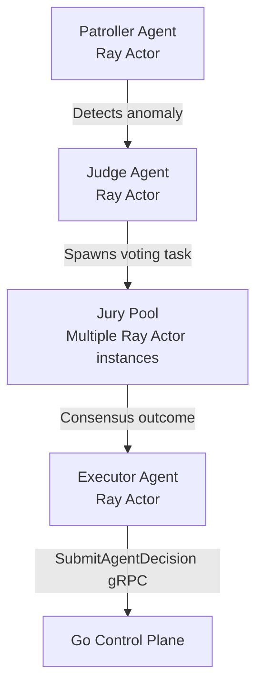

# Ray Integration Walkthrough & Development Worksheet

This guide serves as a comprehensive onboarding and technical walkthrough for **Karthik (AADS Swarm Lead)** to migrate the local Python MARL (Multi-Agent Reinforcement Learning) swarm inside `kb-aads` to a distributed **Ray Cluster** environment.

---

## 📂 Walkthrough Index
1. [Why Ray? Architectural Motivation](#1-why-ray-architectural-motivation)
2. [Migrating local Agents to Ray Actors](#2-migrating-local-agents-to-ray-actors)
3. [Distributed Message Passing Pattern](#3-distributed-message-passing-pattern)
4. [Ray Swarm Orchestrator Design](#4-ray-swarm-orchestrator-design)
5. [Judge, Jury, and Executor (JJE) Ray Integration](#5-judge-jury-and-executor-jje-ray-integration)
6. [Complete Refactoring Blueprint](#6-complete-refactoring-blueprint)
7. [Cluster Launch & Diagnostic Operations](#7-cluster-launch--diagnostic-operations)

---

## 1. Why Ray? Architectural Motivation

In high-throughput kernel security monitoring, running complex behavioral threat agents (Hunters, Patrollers, Healers) inside a single Python process is a severe bottleneck. Standard Python architectures fail under high load due to GIL restrictions and heavy serialization overhead. Ray resolves these issues, providing a high-performance framework optimized for low-latency multi-agent systems:

*   **GIL Bypass & Parallel Processing**: Standard Python cannot leverage multi-core CPUs effectively due to the Global Interpreter Lock. Ray spawns independent OS processes for each remote task/actor, bypassing the GIL entirely.
*   **Sub-Millisecond Shared Memory Speed**: Regular Python IPC chains (such as `multiprocessing` or queue pipelines) rely on `pickle` serialization to transfer objects between processes. This requires serializing data to bytes, copying it across sockets, and deserializing it at the destination, adding $10\text{--}50\text{ms}$ of latency. Ray utilizes an **in-memory object store (Apache Arrow)**. When agents on the same host pass large telemetry tensors or state logs, they share memory directly via **zero-copy serialization**, bringing inter-process communication latency down to the **sub-millisecond level**.
*   **Decoupled Asynchronous Latency Gating**: If threat detection blocked active system calls to query Python agent decisions, the kernel execution hot-path would be paralyzed. The Kernel Borderlands hybrid architecture decouples these loops:
    1. **Hot-Path (Microseconds)**: The kernel eBPF hooks and C userspace sensor evaluate telemetry and check rule lists in microseconds.
    2. **Cognitive Swarm (Sub-Milliseconds)**: Telemetry is fanned out asynchronously to the Ray cluster. The AADS swarm conducts consensus voting out-of-band at Ray's sub-millisecond execution speeds, generating quarantine orders without adding any blocking overhead to system calls.
*   **CPU Offloading**: Running complex reinforcement learning policies (RLlib models) on the monitored host risks CPU starvation. Ray allows offloading these models to dedicated GPU head nodes in the Ray cluster, keeping the host workload-agnostic.

---

## 2. Migrating local Agents to Ray Actors

In the local setup, agents are standard classes (`BaseAgent`). To migrate to Ray:
1.  **Add `@ray.remote` Decorator**: Convert the class definition to a remote actor.
2.  **Remote Creation**: Instantiate using `.remote(...)` instead of regular constructors.
3.  **State Retrieval**: Since properties cannot be read directly from remote actors, all state reads must run through async remote calls: `ray.get(agent_ref.get_status.remote())`.

---

## 3. Distributed Message Passing Pattern

The current local code uses an in-memory `asyncio.Queue` to route messages:
```python
# Stale Local Pattern:
await target.message_queue.put(message)
```
This fails in a distributed cluster because memory is not shared. The Ray-native pattern replaces this queue with **remote method invocations**:

```text
  [Agent A Actor]
         │
         ▼ (Remote Call: target.receive_message.remote(msg))
  [Agent B Actor] ──► Pushes message to its local async queue
         │
         ▼ (Processes locally via tick loop)
```

By keeping a lightweight `asyncio.Queue` *inside* each remote actor's process, we preserve the async processing logic while allowing remote actors to trigger enqueue events across nodes.

---

## 4. Ray Swarm Orchestrator Design

The updated `SwarmOrchestrator` will:
1.  Initialize connection to the local/head Ray cluster using `ray.init(address="auto")`.
2.  Spawn remote Actors for each agent role (e.g. `PatrollerAgent.remote()`).
3.  Gather and expose cluster statuses to the gRPC control plane.

---

## 5. Judge, Jury, and Executor (JJE) Ray Integration

The threat resolution pipeline in AADS relies on the **Judge, Jury, and Executor (JJE)** consensus model. When migrating to Ray, these specialized roles leverage Ray's distributed task and actor scheduling:



### A. Judge Agent Integration
* **Role**: Evaluates threat alerts from Patrollers and queries the control plane for historical events.
* **Ray Pattern**: The Judge runs as a persistent, centralized Ray Actor. When a threat event exceeds standard risk thresholds, the Judge dynamically launches a Jury consensus round.

### B. Jury Agent Pool (Consensus Quorum)
* **Role**: Multiple agents verify the event's features and cast votes to prevent false positives.
* **Ray Pattern**: Instead of maintaining a fixed set of local threads, the Judge dynamically spins up a pool of **Jury Ray Actors** across the cluster:
  ```python
  # Dynamic instantiation of multiple Jury actors across different cluster nodes
  jury_pool = [JuryAgent.remote(id=f"jury-{i}") for i in range(5)]
  
  # Trigger concurrent evaluations and gather votes
  vote_refs = [jury.evaluate_and_vote.remote(telemetry_payload) for jury in jury_pool]
  votes = ray.get(vote_refs) # Gathers votes asynchronously
  ```
  This distributed execution ensures that if a single physical cluster node goes down or gets compromised, the Jury quorum cannot be hijacked or blocked.

### C. Executor Agent
* **Role**: Enforces the consensus outcome (e.g. quarantining the threat).
* **Ray Pattern**: The Executor is a dedicated Ray Actor that acts as the gateway back to the Go Control Plane. It receives the consensus decisions from the Judge, serializes the `AgentDecision` gRPC wire packet, and pushes it over the local Unix domain socket `/run/kb/kbd-grpc.sock`.

---

## 6. Complete Refactoring Blueprint

Here is the exact code architecture for the new files:

### A. Refactored `kb-aads/agents/base_agent.py`
```python
import asyncio
import ray
from dataclasses import dataclass
from enum import Enum

class AgentRole(Enum):
    PATROLLER = "patroller"
    HUNTER = "hunter"
    HEALER = "healer"
    CONTAINMENT = "containment"
    IDLE = "idle"

class AgentStatus(Enum):
    INITIALIZING = "initializing"
    ACTIVE = "active"
    STOPPED = "stopped"

@dataclass
class AgentState:
    agent_id: str
    role: AgentRole
    status: AgentStatus = AgentStatus.INITIALIZING
    uptime: int = 0
    anomaly_score: float = 0.0

@ray.remote
class BaseAgent:
    """
    Ray Actor base class for distributed swarm agents.
    """
    def __init__(self, agent_id: str, role: AgentRole):
        self.state = AgentState(agent_id=agent_id, role=role)
        self.running = False
        self.message_queue = asyncio.Queue()

    async def start(self):
        self.running = True
        self.state.status = AgentStatus.ACTIVE
        print(f"[{self.state.agent_id}] Remote actor {self.state.role.value} started.")

        while self.running:
            await self.process_messages()
            await self.tick()
            self.state.uptime += 1
            await asyncio.sleep(1)

    async def stop(self):
        self.running = False
        self.state.status = AgentStatus.STOPPED

    async def tick(self):
        # Override in subclasses
        pass

    async def handle_message(self, message: dict):
        # Override in subclasses
        pass

    async def receive_message(self, message: dict):
        """Called remotely by other actors to route messages across cluster nodes"""
        await self.message_queue.put(message)

    async def process_messages(self):
        while not self.message_queue.empty():
            msg = await self.message_queue.get()
            try:
                await self.handle_message(msg)
            except Exception as e:
                print(f"[{self.state.agent_id}] Message failed: {e}")
            self.message_queue.task_done()

    def get_status(self) -> dict:
        return {
            "agent_id": self.state.agent_id,
            "role": self.state.role.value,
            "status": self.state.status.value,
            "uptime": self.state.uptime,
            "anomaly_score": self.state.anomaly_score,
        }
```

### B. Refactored `kb-aads/swarm/orchestrator.py`
```python
import ray
from agents.base_agent import BaseAgent, AgentRole
from agents.hunter import HunterAgent  # Ensure HunterAgent is decorated with @ray.remote
import asyncio

class RaySwarmOrchestrator:
    """
    Orchestrates distributed agents across the Ray Cluster.
    """
    def __init__(self):
        # Connect to existing Ray cluster head node automatically
        ray.init(address="auto", ignore_reinit_error=True)
        self.agents = {}
        self.agent_counter = 0

    def create_agent(self, role: AgentRole):
        self.agent_counter += 1
        agent_id = f"agent-{self.agent_counter}"
        
        # Instantiate the agent class as a remote Ray Actor process
        if role == AgentRole.HUNTER:
            # HunterAgent.remote() spawns the actor process on a Ray worker node
            agent_actor = HunterAgent.remote(agent_id)
        else:
            agent_actor = BaseAgent.remote(agent_id, role)

        self.agents[agent_id] = agent_actor
        print(f"[Swarm] Spawned remote Ray Actor for {role.value}: {agent_id}")
        return agent_actor

    async def start_swarm(self, config: dict):
        # Default swarm composition setup
        for _ in range(config.get("patrollers", 2)):
            self.create_agent(AgentRole.PATROLLER)
        for _ in range(config.get("hunters", 2)):
            self.create_agent(AgentRole.HUNTER)

        # Trigger start() lifecycle method on all remote actors concurrently
        # Note: Remote actor async methods must be invoked via .remote()
        await asyncio.gather(*[
            agent.start.remote() for agent in self.agents.values()
        ])

    def get_status(self) -> dict:
        # Collect status from remote actors via ray.get()
        status_futures = [agent.get_status.remote() for agent in self.agents.values()]
        statuses = ray.get(status_futures)
        return {
            "total": len(self.agents),
            "agents": statuses
        }
```

---

## 7. Cluster Launch & Diagnostic Operations

Follow these terminal steps to start and inspect the distributed Ray cluster:

### 1. Launch the Ray Head Node
Run this command on the primary control plane server:
```bash
# Starts the cluster head node and launches dashboard/REST server on port 8265
ray start --head --port=6379 --include-dashboard=true --dashboard-host=0.0.0.0
```

### 2. Connect Worker Nodes (Optional)
On secondary nodes, connect to the head using the address printed by `ray start`:
```bash
ray start --address='<HEAD_IP>:6379'
```

### 3. Run the Agent Swarm App
```bash
cd kb-aads
python3 main.py
```

### 4. Query Cluster Diagnostics
The Safety Daemon (`kb-checker`) queries this REST endpoint to verify AADS Swarm health:
```bash
# Check active swarm jobs and cluster status
curl http://localhost:8265/api/jobs
```
