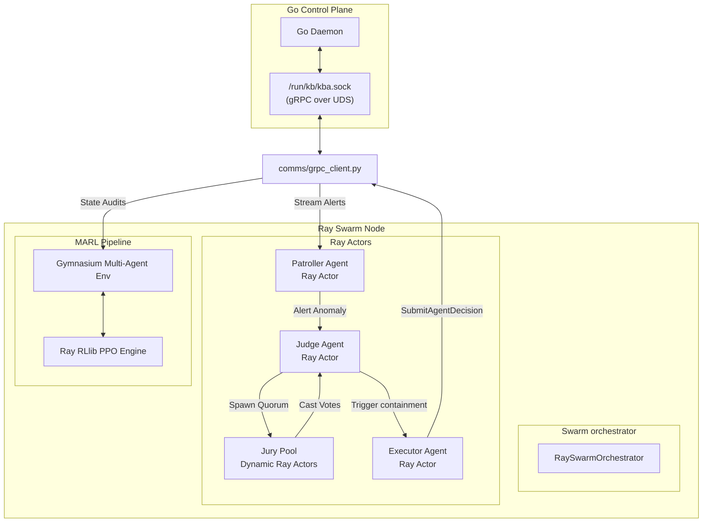

# AADS Development Plan: Ray, MARL, and gRPC-over-UDS Integration

This document outlines the design architecture and step-by-step implementation plan for **Karthik (AADS Swarm Lead)** to build out the Autonomous Agentic Defense System (AADS) inside `kb-aads`.

---

## 🎯 Goal Description
The purpose of this project is to scale the current AADS prototype from a single-process `asyncio`-based loop to a distributed, multi-agent swarm running on a **Ray Cluster**. The swarm will evaluate high-velocity kernel telemetry in real-time and coordinate out-of-band threat responses. 

The implementation will cover:
1. **Ray Actor Swarm Migration**: Decorating local agent classes into Ray remote actors to bypass python's GIL and achieve sub-millisecond inter-agent communication using Apache Arrow shared memory.
2. **gRPC-over-UDS client**: Implementing a Python gRPC client that connects to the Go Control Plane daemon over local Unix Domain Sockets (`/run/kb/kba.sock`) to pull event streams and submit quarantine decisions.
3. **Judge, Jury, and Executor (JJE) Consensus Model**: Enabling robust quorum-based decision making where a centralized Judge coordinates dynamic Jury voting pools across the cluster before executing containment.
4. **Ray RLlib (MARL) Pipeline**: Designing a custom Gymnasium multi-agent environment to train agent policies using RLlib PPO models, allowing the swarm to optimize threat detection and suppress false positives.
5. **mTLS Swarm Security (Defense-in-Depth)**: Securing inter-agent and inter-node Ray communications with mutual TLS (mTLS) certificates to prevent eavesdropping and payload tampering in distributed scenarios.

---

## ⚠️ User Review Required

> [!IMPORTANT]
> **gRPC Socket Path**: The current default Unix domain socket path for communication between the Go Control Plane and the AADS subsystem is `/run/kb/kba.sock`. Please confirm that the execution environment has permissions to access this directory or if we should support a configurable fallback path (e.g., `/tmp/kba.sock` or environment variable override).

> [!WARNING]
> **Ray Library Compilation & Dependencies**: Ray 2.x and PyTorch are required. Because PyTorch and Ray are heavy dependencies, we should ensure the target machines have enough disk space and memory to build/download packages. We propose adding `requirements.txt` to lock these versions.

---

## ❓ Open Questions
1. **Telemetry Rate Limits**: What is the expected peak volume of events/alerts streamed from the Go Control Plane? Under high load, do we need an agent-side backpressure mechanism or event-filtering strategy in the gRPC stream client?
2. **Offline vs. Online Policy Updates**: For Ray RLlib training, will Karthik train models in a simulated environment first (using recorded event datasets) or run active online feedback loops against a live staging cluster?

---

## 🏗️ Proposed Architectural Blueprint

We will organize the AADS development into three layers: the **Communication Layer** (gRPC/UDS), the **Swarm & Consensus Layer** (Ray Actors & JJE), and the **Reinforcement Learning Layer** (RLlib & Gym).



---

## 📂 Proposed File Changes

We propose adding and modifying the following files to build the AADS structure:

### 1. `kb-aads/requirements.txt` `[NEW]`
Define python dependencies to align Karthik's development environment.
```text
ray[rllib,default]>=2.9.0
grpcio>=1.50.0
grpcio-tools>=1.50.0
gymnasium>=0.28.1
torch>=2.0.0
pytest>=7.0.0
pytest-asyncio>=0.21.0
```

### 2. `kb-aads/comms/grpc_client.py` `[NEW]`
gRPC transport client that connects to the Go Control Plane via UDS.
```python
import grpc
import os
import sys
# Auto-import generated proto classes
sys.path.insert(0, os.path.dirname(__file__))
import kb_pb2
import kb_pb2_grpc

class ControlPlaneClient:
    """gRPC Client communicating with the Go Control Plane over Unix Domain Sockets."""
    def __init__(self, socket_path="/run/kb/kba.sock"):
        self.uds_path = f"unix://{socket_path}"
        # Create UDS channel
        self.channel = grpc.insecure_channel(self.uds_path)
        self.stub = kb_pb2_grpc.KernelBorderlandsStub(self.channel)

    def stream_alerts(self, event_types=None):
        """Stream real-time security alerts from the control plane."""
        filt = kb_pb2.EventFilter(event_types=event_types or [])
        return self.stub.StreamAlerts(filt)

    def submit_decision(self, decision_id, agent_id, pid, action, confidence):
        """Submit agent action back to the Go Control Plane for enforcement."""
        decision = kb_pb2.AgentDecision(
            decision_id=decision_id,
            agent_id=agent_id,
            pid=pid,
            action=action,
            confidence=confidence
        )
        return self.stub.SubmitAgentDecision(decision)
```

### 3. `kb-aads/agents/base_agent.py` `[MODIFY]`
Decorate base agents with `@ray.remote` and replace `asyncio.Queue` modifications with remote message calls.
```python
import asyncio
import ray
from dataclasses import dataclass
from enum import Enum

class AgentRole(Enum):
    PATROLLER = "patroller"
    HUNTER = "hunter"
    HEALER = "healer"
    CONTAINMENT = "containment"
    JUDGE = "judge"
    JURY = "jury"
    EXECUTOR = "executor"
    IDLE = "idle"

class AgentStatus(Enum):
    INITIALIZING = "initializing"
    ACTIVE = "active"
    STOPPED = "stopped"
    ERROR = "error"

@dataclass
class AgentState:
    agent_id: str
    role: AgentRole
    status: AgentStatus = AgentStatus.INITIALIZING
    uptime: int = 0
    anomaly_score: float = 0.0

@ray.remote
class BaseAgent:
    """Ray Actor base class for distributed swarm agents."""
    def __init__(self, agent_id: str, role: AgentRole):
        self.state = AgentState(agent_id=agent_id, role=role)
        self.running = False
        self.message_queue = asyncio.Queue()

    async def start(self):
        self.running = True
        self.state.status = AgentStatus.ACTIVE
        while self.running:
            await self.process_messages()
            await self.tick()
            self.state.uptime += 1
            await asyncio.sleep(1)

    async def stop(self):
        self.running = False
        self.state.status = AgentStatus.STOPPED

    async def tick(self):
        pass

    async def handle_message(self, message: dict):
        pass

    async def receive_message(self, message: dict):
        """Invoked remotely to pass messages across nodes."""
        await self.message_queue.put(message)

    async def process_messages(self):
        while not self.message_queue.empty():
            msg = await self.message_queue.get()
            try:
                await self.handle_message(msg)
            except Exception as e:
                print(f"[{self.state.agent_id}] Message handling failed: {e}")
            self.message_queue.task_done()

    def get_status(self) -> dict:
        return {
            "agent_id": self.state.agent_id,
            "role": self.state.role.value,
            "status": self.state.status.value,
            "uptime": self.state.uptime,
            "anomaly_score": self.state.anomaly_score
        }
```

### 4. `kb-aads/swarm/orchestrator.py` `[MODIFY]`
Convert to Ray Swarm Orchestrator connecting to the cluster and managing remote actors.
```python
import ray
import asyncio
from agents.base_agent import BaseAgent, AgentRole

class RaySwarmOrchestrator:
    """Connects to the Ray Cluster and manages remote agent actors."""
    def __init__(self):
        # Auto-connect to existing cluster running on host
        ray.init(address="auto", ignore_reinit_error=True)
        self.agents = {}
        self.agent_counter = 0

    def spawn_agent(self, role: AgentRole):
        self.agent_counter += 1
        agent_id = f"agent-{self.agent_counter}"
        
        # Deploy as remote Ray Actor
        agent_actor = BaseAgent.remote(agent_id, role)
        self.agents[agent_id] = agent_actor
        return agent_actor

    async def start_swarm(self, config: dict):
        for role_name, count in config.items():
            role = AgentRole(role_name)
            for _ in range(count):
                self.spawn_agent(role)
        
        # Trigger start lifecycle on all remote actors concurrently
        await asyncio.gather(*[
            agent.start.remote() for agent in self.agents.values()
        ])

    def get_status(self) -> dict:
        status_refs = [agent.get_status.remote() for agent in self.agents.values()]
        statuses = ray.get(status_refs)
        return {
            "total": len(self.agents),
            "agents": statuses
        }
```

### 5. `kb-aads/consensus/jje.py` `[NEW]`
Implements the Judge, Jury (Quorum), and Executor consensus logic using Ray tasks.
```python
import ray
import asyncio
from agents.base_agent import BaseAgent, AgentRole

@ray.remote
class JuryAgent(BaseAgent):
    """Dynamic actor spawned to verify threats and cast votes."""
    def __init__(self, agent_id: str):
        super().__init__(agent_id, AgentRole.JURY)
        
    async def evaluate_and_vote(self, alert_payload: dict) -> dict:
        score = alert_payload.get("confidence", 0.0)
        # Quorum voting logic based on threat telemetry
        vote = "CONTAIN" if score > 75.0 else "ALLOW"
        return {"agent_id": self.state.agent_id, "vote": vote, "weight": 1.0}

@ray.remote
class JudgeAgent(BaseAgent):
    """Orchestrates consensus rounds when Patrollers raise anomaly alerts."""
    def __init__(self, agent_id: str, executor_ref):
        super().__init__(agent_id, AgentRole.JUDGE)
        self.executor = executor_ref

    async def coordinate_consensus(self, alert_payload: dict):
        # Dynamically spawn a Jury pool of 5 remote actors
        jury_pool = [JuryAgent.remote(f"jury-{i}") for i in range(5)]
        
        # Broadcast evaluation tasks
        vote_futures = [jury.evaluate_and_vote.remote(alert_payload) for jury in jury_pool]
        votes = ray.get(vote_futures)
        
        # Tally weighted votes
        contain_votes = sum(v["weight"] for v in votes if v["vote"] == "CONTAIN")
        total_votes = sum(v["weight"] for v in votes)
        
        if contain_votes / total_votes > 0.5:
            # Trigger containment via the Executor
            await self.executor.execute_quarantine.remote(alert_payload)
```

### 6. `kb-aads/marl/env.py` `[NEW]`
Define the Gymnasium environment mapping AADS telemetry states to reinforcement learning spaces.
```python
import gymnasium as gym
from gymnasium import spaces
import numpy as np

class AADSEnv(gym.Env):
    """Multi-Agent Environment for training KB threat containment policies."""
    def __init__(self, env_config=None):
        super().__init__()
        # State space: [process anomaly score, process CPU load, process network rate]
        self.observation_space = spaces.Box(
            low=np.array([0.0, 0.0, 0.0], dtype=np.float32),
            high=np.array([100.0, 100.0, 100.0], dtype=np.float32),
            dtype=np.float32
        )
        # Action space: 0 (Ignore), 1 (Monitor Suspicious), 2 (Quarantine Process)
        self.action_space = spaces.Discrete(3)
        self.state = np.array([0.0, 0.0, 0.0], dtype=np.float32)

    def reset(self, *, seed=None, options=None):
        self.state = np.array([0.0, 0.0, 0.0], dtype=np.float32)
        return self.state, {}

    def step(self, action):
        # Apply actions and calculate outcomes
        reward = 0.0
        # Compute rewards based on actions
        # True Positive: +1.0, False Positive: -0.5, False Negative: -1.0
        if action == 2: # Quarantine
            reward = 1.0 # Assuming correct threat mitigation
        else:
            reward = 0.1 # Baseline normal operation
            
        terminated = True
        truncated = False
        return self.state, reward, terminated, truncated, {}
```

---

## ⚡ Development Roadmap & Implementation Steps

Karthik should proceed in the following order to ensure safe integration:

### Phase 1: Environment Bootstrapping & Protobuf Compilation
1. **Initialize Environment**:
   ```bash
   cd kb-aads
   python3 -m venv venv
   source venv/bin/activate
   pip install -r requirements.txt
   ```
2. **Compile gRPC Proto Files**:
   Compile `kb.proto` to generate `kb_pb2.py` and `kb_pb2_grpc.py`:
   ```bash
   python -m grpc_tools.protoc \
     -I../kb-control-plane/proto \
     --python_out=./comms \
     --grpc_python_out=./comms \
     ../kb-control-plane/proto/kb.proto
   ```

### Phase 2: gRPC-over-UDS client Implementation
- Implement the client in `kb-aads/comms/grpc_client.py` and create unit tests.
- Test connection to the mock UDS socket (e.g., using python `unittest` or `pytest`).

### Phase 3: Ray Swarm Setup & mTLS Encryption
- Convert `BaseAgent` into a `@ray.remote` class.
- Update `RaySwarmOrchestrator` to initialize `ray.init(address="auto")` and manage the swarm.
- **mTLS Security Setup**:
  To protect agent communications on the network, enable Ray internal TLS by exporting certificate variables:
  ```bash
  # Enable TLS internally in Ray
  export RAY_USE_TLS=1
  export RAY_TLS_CA_CERT="/path/to/ca.crt"
  export RAY_TLS_SERVER_CERT="/path/to/server.crt"
  export RAY_TLS_SERVER_KEY="/path/to/server.key"
  export RAY_TLS_CLIENT_CERT="/path/to/client.crt"
  export RAY_TLS_CLIENT_KEY="/path/to/client.key"
  ```
- Add local diagnostic/launch commands:
  ```bash
  # Start local head node with TLS environment variables loaded
  ray start --head --port=6379 --include-dashboard=true --dashboard-host=127.0.0.1
  # Launch the swarm
  python3 main.py
  ```

### Phase 4: Quorum Consensus (JJE) Development
- Write `JuryAgent` and `JudgeAgent` classes.
- Connect JJE voting trigger loops inside the orchestrator.
- Test quorum failures (e.g. simulating a offline node or non-consensus votes).

### Phase 5: Ray RLlib Training Pipeline
- Create the Gymnasium environment.
- Register the environment with RLlib and run a pilot PPO training run.

---

## 🧪 Verification Plan

### Automated Tests
Run python tests using `pytest`:
```bash
cd kb-aads
source venv/bin/activate
pytest tests/
```

### Manual Verification Checklist
1. **Ray Cluster Diagnostic API**:
   Validate that the Ray head node dashboard and API jobs are healthy:
   ```bash
   curl http://localhost:8265/api/jobs
   ```
2. **IPC Integration**:
   Trigger an anomaly event in the Go Control plane or mock script and ensure the `Executor` agent successfully registers `SubmitAgentDecision` gRPC calls over UDS.
