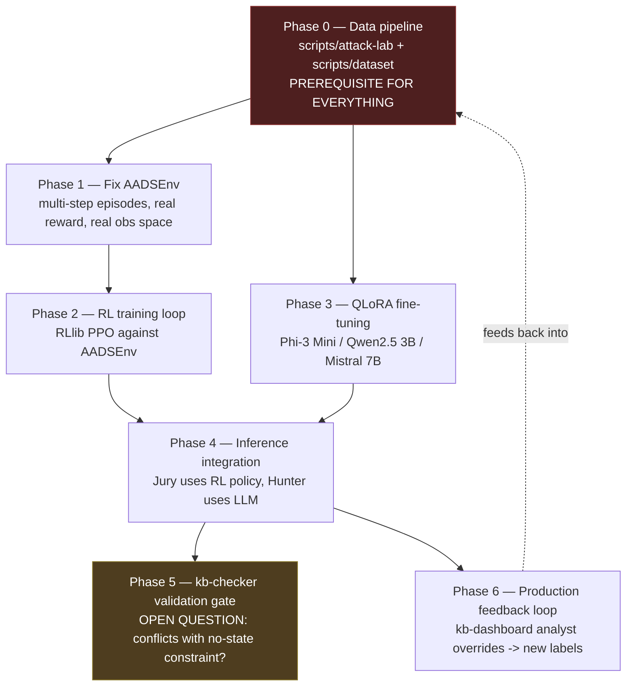

# AADS Intelligence Roadmap — From Skeleton Agents to Trained Agents

- **Document Version:** 1.0
- **Component:** `kb-aads`, with dependencies on `scripts/` (data pipeline) and `kb-checker` (policy validation gate)
- **Status:** Roadmap — needs review by **Karthik (AADS Swarm Lead)**. Nothing here is implemented. Written after this session brought the actor/consensus scaffolding from non-functional (broken import, `ActorClassInheritanceException`) to a verified-working skeleton — this doc is the next layer: what turns that skeleton into agents that actually decide things.
- **Written:** 2026-07-24

---

## Where this picks up

The Ray actor/JJE scaffolding now runs end-to-end (see prior session: single-node `ray.init()`, all 7 role actors spawn and tick, `ExecutorAgent` submits real `AgentDecision` gRPC calls to `kb-control-plane`). But every decision point in that scaffolding is currently a stub:

- `JuryAgent.evaluate_and_vote()` — a hardcoded `score > 75.0` threshold, not a model.
- `HunterAgent.investigate()` — four bare `# TODO`s (query control plane, build evidence chain, calculate confidence, submit to jury).
- `PatrollerAgent`/`HealerAgent`/`ContainmentAgent.tick()` — static status strings, no logic.
- `marl/env.py`'s `AADSEnv` — exists, but nothing imports or trains against it.

The goal stated for this roadmap: get the swarm to a point where it's genuinely monitoring, investigating, recovering from, and mitigating threats alongside `kb-core`/`kb-control-plane`/`kb-checker` — not just relaying hardcoded thresholds through a working pipe.

## The architecture is actually specified, not open — read this first

Earlier in this session I initially treated "RL vs. LLM" as an unresolved design question for Karthik. It isn't — it's already documented, just not implemented:

- `kb-aads/marl/README.md`: **Ray RLlib** policy networks, with an explicit reward table (True Positive +1.0, False Positive −0.5, True Negative +0.1, False Negative −1.0), plus a stated fine-tuned model — **Phi-3 Mini / Qwen2.5 3B / Mistral 7B, QLoRA fine-tuned**, for "security reasoning over behavioral event sequences."
- `docs/getting-started/requirements.md`: names the exact fine-tuning stack (Hugging Face Transformers, PEFT/QLoRA, bitsandbytes 4-bit, TRL) and hardware target (8GB VRAM minimum, university HPC / Colab Pro / RunPod as fallback).
- `scripts/dataset/README.md`'s planned output format is **prompt/completion pairs** ("What is the threat assessment?" → natural-language reasoning naming an IOC pattern and recommending an action) — this is LLM fine-tuning data, not RL episode data. It's the training set for the QLoRA model, not for RLlib.

So the design is: **RLlib policy → numeric vote/action decisions** (Jury), **QLoRA LLM → investigative reasoning and evidence narrative** (Hunter). Two different training pipelines, two different consumers. Nothing below should re-litigate this split — it should implement it.

---

## Phase 0 — Data pipeline (prerequisite for both training paths)

- **Owner**: Karthik (Testing & Offensive Security, per `scripts/README.md`), Rupa (Environment & Dataset Processing, collaborator).
- **Current state**: `scripts/attack-lab/` and `scripts/dataset/` contain only `README.md` files. None of the named scripts exist yet — `privilege_escalation.sh`, `reverse_shell.sh`, `lateral_movement.sh`, `credential_access.sh`, `memory_exploit.sh`, `process_injection.sh` (attack-lab), or `collect.py`, `label.py`, `format.py`, `validate.py`, `split.py` (dataset). This is Phase 0 because nothing downstream — neither RL training nor LLM fine-tuning — has real data to learn from until this exists.
- **What it does**: implements the attack-lab scenarios (isolated VM only, per the README's explicit warning) and the dataset pipeline that captures real `kb-core` eBPF events during those runs, labels them (attack/benign + category), and formats them two ways — RL-episode-shaped (state/action/reward sequences, for Phase 1) and prompt/completion-shaped (for Phase 3's QLoRA fine-tuning).
- **Acceptance criteria**: a labeled dataset covering all six attack scenarios plus a benign baseline, split train/validation/test, in both output formats.

## Phase 1 — Fix `AADSEnv` for real RL training

- **Owner**: Karthik, with Pardhu (collaborator — needs to confirm which `ProcessState`/`KBEvent` wire fields are the right observation inputs).
- **Depends on**: Phase 0 for reward ground truth; independently startable for the structural fixes below.
- **What's wrong today**, concretely:
  1. `step()` always sets `terminated=True` — every episode is exactly one step. Real investigation/consensus spans multiple ticks of evolving process state; the env needs real episode length.
  2. The reward is a stub: `+1.0` unconditionally for quarantine, `0.1` otherwise, with the comment `# Assuming correct threat mitigation`. `marl/README.md`'s actual reward table (TP +1.0 / FP −0.5 / TN +0.1 / FN −1.0) needs ground truth (was this action actually correct?) from Phase 0's labeled data — the env can't compute this from the action alone.
  3. The observation space is three placeholder floats in `[0,100]`, not connected to anything. It should be built from the real `ProcessState` message (`score`, `zone`, `uid`, `containment`) and `KBEvent` (`event_type`, `score_delta`) fields already defined in `kb-control-plane/proto/kb.proto` — not synthetic values.
  4. It's a single-agent `gymnasium.Env`. The swarm has multiple concurrent decision-makers (the Jury pool). Needs a decision: RLlib `MultiAgentEnv` with independent per-jury-member policies, or a single shared policy each Jury actor calls independently. `marl/README.md` doesn't specify this — flag as an open question, don't assume.
- **Acceptance criteria**: `AADSEnv` produces multi-step episodes with reward computed from labeled outcome data, observations sourced from real wire-contract fields, and an explicit (not implicit) single- vs. multi-agent formulation.

## Phase 2 — RL training loop

- **Owner**: Karthik.
- **Depends on**: Phase 1.
- **What it does**: nothing in the repo currently calls `ray.rllib`'s training API against `AADSEnv` — this phase builds that (a `train.py` or equivalent using `PPOConfig` or whichever algorithm is chosen, run to convergence against Phase 0's labeled episodes, with checkpointing).
- **Acceptance criteria**: a reproducible training script, checked into the repo, that produces a policy checkpoint from a fixed dataset — not a one-off manual training run.

## Phase 3 — QLoRA fine-tuning pipeline

- **Owner**: Karthik, likely with GPU access per `docs/getting-started/requirements.md`'s hardware section (university HPC / Colab Pro / RunPod).
- **Depends on**: Phase 0's prompt/completion-format dataset.
- **What it does**: fine-tunes one of the three named base models (Phi-3 Mini / Qwen2.5 3B / Mistral 7B) using the already-specified stack (HF Transformers + PEFT/QLoRA + bitsandbytes + TRL) on the labeled threat-reasoning dataset.
- **Acceptance criteria**: a fine-tuned checkpoint that, given a behavioral event sequence, produces threat-assessment completions matching the dataset's format (confidence score, IOC pattern name, recommended action) at an accuracy bar Karthik defines.

## Phase 4 — Inference-time integration

- **Owner**: Karthik.
- **Depends on**: Phase 2 (RL checkpoint) and Phase 3 (LLM checkpoint) — can integrate each independently as they land.
- **What it does**: replaces the current stubs with real inference:
  - `JuryAgent.evaluate_and_vote()`: load the RL policy checkpoint (`Policy.from_checkpoint(...)`), call `compute_single_action(obs)` instead of the `> 75.0` threshold.
  - `HunterAgent.investigate()`: load the fine-tuned LLM, replace the four TODOs with a real call — query control plane for process history, build the event-sequence prompt, run inference, parse the completion into a confidence score + evidence chain to hand to the Judge.
- **Acceptance criteria**: a live single-node swarm run (same harness used to verify the scaffolding this session) where Jury votes and Hunter investigations are traceably produced by the trained artifacts, not hardcoded logic.

## Phase 5 — Safety/validation gate before production deploy

- **Owner**: Pardhu (`kb-checker`), Karthik (coordinating what gets validated).
- **Depends on**: Phase 4.
- **Open question, not resolved by this roadmap**: `marl/README.md`'s training pipeline step 4 says "Validate new policy with kb-checker" before deployment — but `kb-checker`'s design is explicitly KISS/stateless/no-network (`kb-checker/README.md`, referenced as a load-bearing invariant in `CLAUDE.md`). "Validating a policy artifact" sounds like it needs to load and evaluate a model checkpoint against test scenarios, which may be in tension with that no-state constraint. This needs a design decision from whoever owns that invariant, not an assumption from this doc.
- **What it does once resolved**: gates any new RL/LLM checkpoint from reaching production agents until it passes whatever validation `kb-checker`'s constraints actually allow.

## Phase 6 — Production feedback loop (continual learning)

- **Owner**: Karthik, with Rupa (dashboard/UX side) since the source of outcome labels is SOC analyst action.
- **Depends on**: Phase 4 in production, `kb-dashboard` (per `operator_interfaces_spec.md`, already the documented "human-in-the-loop security oversight" surface for SOC analysts).
- **What it does**: `marl/README.md` step 1 is "Collect outcomes from production decisions" — this phase is what makes that real: capturing whether a SOC analyst confirmed or overrode a swarm decision via `kb-dashboard`, feeding that back as labeled ground truth for the next training round (Phase 1's reward table, Phase 0's dataset growth).
- **Not yet verified**: whether `kb-dashboard`/`operator_interfaces_spec.md` currently emits any analyst approve/reject signal in a form `kb-aads` or `kb-control-plane` could consume. Needs checking before this phase can be scoped further.

## Constraint that applies across every phase

`docs/index.html`'s AADS description is explicit: *"Optional, advisory only. No enforcement action may be taken solely on the basis of an agent recommendation without corresponding policy authorization."* Every phase above trains and wires in a recommendation system — it does not change the enforcement boundary. Trained-agent output still has to flow through the same `Executor → kb-control-plane` authorization path already in place; this roadmap should not be read as license to let a trained policy act unilaterally.

---

## Sequencing summary

---

## Open questions for Karthik

1. Single shared RL policy across all Jury actors, or independent per-actor policies (RLlib `MultiAgentEnv`)? `marl/README.md` doesn't specify.
2. What does "validate new policy with kb-checker" (Phase 5) actually mean given `kb-checker`'s no-state/no-network design invariant? Needs its own design doc before Phase 4 ships to production.
3. Does `kb-dashboard` currently have any mechanism for capturing SOC analyst approve/reject actions on agent recommendations (Phase 6), or does that need to be built as part of `kb-op` work first?

---

## Changelog

- **2026-07-24**: Initial roadmap. Written immediately after this session's fixes brought the `kb-aads` actor/JJE scaffolding from non-functional to a verified-running skeleton with stubbed decision logic — this doc scopes what's needed to replace those stubs with the RL/LLM hybrid already specified in `marl/README.md` and `docs/getting-started/requirements.md`.
