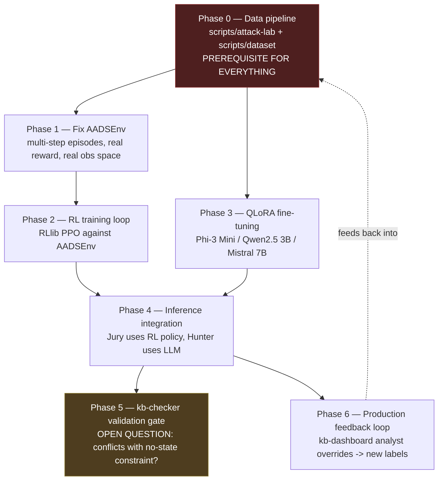

# AADS Intelligence Roadmap — From Skeleton Agents to Trained Agents

- **Document Version:** 1.0
- **Component:** `kb-aads`, with dependencies on `scripts/` (data pipeline) and `kb-checker` (policy validation gate)
- **Status:** Roadmap — needs review by **Karthik (AADS Swarm Lead)**. Nothing here is implemented. Written after this session brought the actor/consensus scaffolding from non-functional (broken import, `ActorClassInheritanceException`) to a verified-working skeleton — this doc is the next layer: what turns that skeleton into agents that actually decide things.
- **Written:** 2026-07-24

---

## Where this picks up

The Ray actor/JJE scaffolding now runs end-to-end (see prior session: single-node `ray.init()`, all 7 role actors spawn and tick, `ExecutorAgent` submits real `AgentDecision` gRPC calls to `kb-control-plane`). But every decision point in that scaffolding is currently a stub:

- `JuryAgent.evaluate_and_vote()` — a hardcoded `score > 75.0` threshold, not a model.
- `HunterAgent.investigate()` — four bare `# TODO`s (query control plane, build evidence chain, calculate confidence, submit to jury).
- `PatrollerAgent`/`HealerAgent`/`ContainmentAgent.tick()` — static status strings, no logic.
- `marl/env.py`'s `AADSEnv` — exists, but nothing imports or trains against it.

The goal stated for this roadmap: get the swarm to a point where it's genuinely monitoring, investigating, recovering from, and mitigating threats alongside `kb-core`/`kb-control-plane`/`kb-checker` — not just relaying hardcoded thresholds through a working pipe.

## The architecture is actually specified, not open — read this first

Earlier in this session I initially treated "RL vs. LLM" as an unresolved design question for Karthik. It isn't — it's already documented, just not implemented:

- `kb-aads/marl/README.md`: **Ray RLlib** policy networks, with an explicit reward table (True Positive +1.0, False Positive −0.5, True Negative +0.1, False Negative −1.0), plus a stated fine-tuned model — **Phi-3 Mini / Qwen2.5 3B / Mistral 7B, QLoRA fine-tuned**, for "security reasoning over behavioral event sequences."
- `docs/getting-started/requirements.md`: names the exact fine-tuning stack (Hugging Face Transformers, PEFT/QLoRA, bitsandbytes 4-bit, TRL) and hardware target (8GB VRAM minimum, university HPC / Colab Pro / RunPod as fallback).
- `scripts/dataset/README.md`'s planned output format is **prompt/completion pairs** ("What is the threat assessment?" → natural-language reasoning naming an IOC pattern and recommending an action) — this is LLM fine-tuning data, not RL episode data. It's the training set for the QLoRA model, not for RLlib.

So the design is: **RLlib policy → numeric vote/action decisions** (Jury), **QLoRA LLM → investigative reasoning and evidence narrative** (Hunter). Two different training pipelines, two different consumers. Nothing below should re-litigate this split — it should implement it.

## Per-agent intelligence assignment

The RL/LLM split above only covers Jury and Hunter. Extending the same reasoning — match the paradigm to what the role actually outputs, not "give every agent a model" — across the full roster:

| Agent | Assignment | Why |
|---|---|---|
| **Judge** | Rule-based orchestration, no trained model | Its job is control flow: does an alert clear the threshold to open a consensus round, spawn the Jury pool, tally weighted votes. That's coordination logic, not a judgment call that benefits from learning. A trained model here adds cost/latency for no behavioral gain over a well-tuned threshold. |
| **Jury** | RL (RLlib policy) | Fast, repeated, bounded classification (contain/allow) with a clean labeled reward (Phase 1's reward table). Numeric output, hot consensus path, high frequency — RL's strength, and the walkthrough's whole premise (sub-millisecond decisioning) depends on this staying cheap. |
| **Executor** | No model at all | A mechanical gateway — take the Judge's decision, submit `AgentDecision` over gRPC. Intelligence here would be a bug: enforcement should deterministically execute an already-made decision, not silently second-guess it. |
| **Patroller** | Rule-based / lightweight statistical scoring, not RL or LLM | Runs every tick, across every watched process — the highest-volume, most latency-sensitive role in the swarm. `kb-core`/`kb-control-plane` already compute a behavioral `score` per process (CPM/CWP scoring engine, per `docs/features/`); Patroller's job is watching that score and routing to Hunter on threshold crossing, not re-deriving it. If anything here is learned, it should be the *escalation threshold itself* (a low-dimensional bandit problem), not a full RL policy or an LLM call on every tick. |
| **Hunter** | QLoRA-fine-tuned LLM | The one role producing natural-language reasoning and an evidence chain (`scripts/dataset/README.md`'s prompt/completion format) — RL doesn't produce that. Also the one role where LLM latency is affordable, since it's triggered on a zone transition, not every tick. |
| **Healer** | RL | Structurally identical to Jury: a bounded decision (restore vs. keep contained) with a clean reward (correct restore = good, restoring a real threat = bad). Numeric, fast, learnable from the same Phase 0/6 labeled-outcome pipeline. No narrative output, so no case for an LLM. |
| **Containment** (deciding *which* level to apply) | RL | Maps directly onto `ContainmentLevel`'s 5 discrete values in the wire proto (`kb-control-plane/proto/kb.proto`) — a multi-class action-selection problem with reward feedback (over-contain and under-contain both have a cost). Same shape as Jury/Healer. |
| **Containment militia** — a coordinated squad of Containment agents that jointly contain, isolate, and eradicate a threat (per Karthik's framing: a military-style unit, not independent workers) | No model per squad member — the single Containment RL policy commands the squad | Read literally, "contain / isolate / eradicate" maps onto an *escalation sequence* across `ContainmentLevel`'s 5 stages (`CGROUP`/`SECCOMP` = contain, `NAMESPACE` = isolate, `TERMINATE` = eradicate). The design that fits: the Containment RL policy (row above) decides the target level and sequence; the militia is a squad of specialized, mechanical executors, each responsible for actually carrying out one stage of that sequence (apply cgroup limits, then escalate to seccomp, then namespace, then terminate if the threat persists) under one commanding decision — not each member independently deciding a level. This needs a light coordinator role (a "squad lead" analogous to Judge for JJE) so stages execute in the right order and don't race each other on the same PID; the squad lead is orchestration, same as Judge, so it gets no model either. If every member decided its own level independently instead, you'd get N conflicting enforcement actions on one process — a correctness bug, not the coordinated-unit behavior the "militia" framing implies. |
| **Signal relays** — per Karthik's framing: dedicated messenger agents between other agents, fast-paced and highly active, not a passive library call | No model, ever — but they should still be real long-lived actors, not inline `.remote()` calls | "Highly active" means these are closer to Patroller in shape (long-lived, always-on, tick-driven) than to a one-shot function call — a small pool of relay actors sitting on the hot path between roles (Patroller→Hunter, Hunter→Judge, Judge→Jury pool, Judge→militia squad lead), doing routing/dispatch continuously rather than agents reaching each other directly. This is exactly the layer where Ray's Plasma zero-copy shared memory matters most (see the walkthrough §1 and the earlier discussion this session) — relays are pure throughput/latency infrastructure, so they should be optimized for raw dispatch speed, never for judgment. A model anywhere in this path adds latency to the one part of the swarm that's supposed to be near-zero-overhead by design; it would undermine the whole reason a relay layer exists instead of tighter point-to-point coupling. |

**General rule**: RL wherever the output is a bounded action with a computable reward and speed matters (Jury, Healer, Containment squad lead's decision). LLM only where the output is language/reasoning and latency is affordable (Hunter). No model wherever the role is orchestration, mechanical execution, or message dispatch (Judge, Executor, militia squad members, militia squad lead, signal relays) — that last category is the one most likely to get over-engineered by default, and shouldn't be.

Neither containment militia nor signal relays exist as implemented roles in `kb-aads/agents/` yet. Containment militia needs its own scoping (squad lead vs. squad member split, spawn lifecycle mirroring the Jury pool's dynamic-per-incident spawning, and the stage-sequencing message contract between squad lead and members) before Phase 4. Signal relays need their own scoping too (pool size, which agent-pairs route through a relay vs. call each other directly, and how relay actors get discovered/registered) before Phase 4.

## JJE's second role: courthouse for the sub-agent layer

Per Karthik's design intent, JJE is not passive oversight — it's an **active courthouse for all sub-agent actions**, with real authority to stop a rogue agent (Patroller, Hunter, Healer, Containment militia, signal relays). This is a materially bigger claim than "JJE also monitors" and resolves what was open question 4: oversight is authoritative, not observational.

- **Mechanism this implies, and why it should reuse JJE's existing machinery rather than invent new authority**: JJE already has a working consensus mechanism for exactly this kind of high-stakes decision — Judge opens a round, Jury votes, Executor carries out the outcome. The natural design is to route "is this sub-agent rogue" through that *same* pipeline, with the sub-agent's actor handle as the subject instead of a monitored PID.
- **Severity → response ladder, confirmed by Karthik**: severity is scored by how dangerous the sub-agent's anomalous behavior is for operational safety, and maps to three graduated responses rather than a single "stop": **restart** (least severe — e.g. a stuck/unresponsive actor, no evidence of compromise), **revoke** (mid — pull the agent's authority/credentials or remove it from active rotation, e.g. an out-of-pool Jury member, without necessarily killing the process), and **termination** (most severe — `ray.kill(actor_handle)`, for behavior consistent with compromise). This is a materially richer action space than a binary kill switch, and it's the right shape for a courthouse metaphor — proportionate response, not one verdict for every case.
- **Quorum vs. unilateral, confirmed by Karthik**: graduated by severity, and the unilateral fast path is act-first-then-review, not unchecked — Judge can act immediately on a high-severity case, with Jury review happening *after* the action rather than gating it. Lower-severity cases (plausibly: restart) go through full Judge→Jury quorum before acting. This still leaves the exact severity thresholds (what specifically triggers unilateral-fast-path vs. full-quorum, and whether that boundary is a fixed rule or something learned later) undefined — worth its own short design note before Phase 4, not decided by this doc. Avoiding a single actor holding unchecked kill-power over the whole swarm remains the underlying reason quorum exists at all for the lower tiers — the same SPOF concern flagged earlier this session for `SwarmMemory` applies here with a larger blast radius (an entire sub-agent role going dark).
- **Resolved — not a pre-execution gate**: confirmed by Karthik — "courthouse for all sub-agent actions" means JJE continuously **monitors** sub-agent behavior, health, and actions to detect anomalies, not that every individual action (every Patroller tick, every signal-relay dispatch) has to clear JJE before it takes effect. This is consistent with the walkthrough's founding premise (§1) — the hot-path/cognitive-swarm split exists so fast, high-frequency agents aren't gated by a consensus round on every action — and avoids reintroducing the exact blocking latency Ray was adopted to eliminate. JJE watches behavior/health/actions over time (liveness, error rate, output-drift — the earlier oversight-draft signals) and opens a consensus round only when a pattern looks anomalous enough to warrant intervention. "Courthouse" here means a rare, serious escalation path, not a bottleneck on the swarm.
- **Prerequisite this needs that doesn't exist yet**: for JJE to be able to stop *any* sub-agent, it needs actor handles (or a lookup mechanism) for the whole swarm, not just Executor's handle. Today only `RaySwarmOrchestrator` holds all the actor references (`self.agents` in `kb-aads/swarm/orchestrator.py`) — Judge doesn't have them. This needs either the orchestrator handing a registry to Judge at swarm-start, or a dedicated registry actor JJE can query.
- **Resolved — clean two-layer hierarchy, not overlapping scopes**: confirmed by Karthik — `kb-checker` watches **JJE itself** (is the courthouse alive, behaving correctly, not compromised), while JJE watches the **sub-agents** beneath it (Patroller/Hunter/Healer/militia/signal relays). So the oversight chain is `kb-checker → JJE → sub-agents`, each layer supervising the one below it, not two watchdogs competing for the same scope. This is consistent with `kb-checker`'s existing external, stateless, no-network design (`kb-checker/README.md`) — it doesn't need to know about individual sub-agents at all, only whether JJE (the layer it actually talks to) is healthy.
- **Does this change any RL/LLM/no-model assignment above?** No — the courthouse *decision* (is this sub-agent rogue) is the same bounded-classification shape as Jury's existing threat vote, so it can reuse the same RL-trained Jury policy or a variant of it once there's labeled data on what "rogue sub-agent behavior" looks like (Phase 6+). Until that data exists, this should run as rule-based threshold detection (the liveness/error-rate/output-drift heuristics from the earlier draft), same as everything else in Judge's orchestration role.

### Severity thresholds — proposed design

Not yet confirmed by Karthik — a proposal, not a decision, following the same reward-table pattern `marl/README.md` already established elsewhere in this system.

`AgentState` (`kb-aads/agents/base_agent.py`) already has an `anomaly_score` field that's currently unused (always `0.0`, no producer anywhere in the codebase) — the natural fit is repurposing it as **JJE's computed severity score for that sub-agent**, distinct from `ProcessState.score` (which scores a monitored *process*, not an *agent*).

| Tier → response | Signal | Example |
|---|---|---|
| **Restart** (low) | Liveness/heartbeat failure, transient errors below a count threshold | No successful tick in N seconds; a handful of caught exceptions in `process_messages()`'s existing try/except — operational failure, no intent implied |
| **Revoke** (medium) | Statistical output drift from peer baseline, elevated sustained error rate | A Jury member's vote pattern diverging from the rest of the pool significantly and repeatedly; Hunter producing malformed/out-of-schema completions; a Containment militia member's level choices consistently disagreeing with the RL policy's target |
| **Termination** (high/emergency) | Authorization-boundary violation, not a quality issue | Any agent other than Executor attempting `SubmitAgentDecision` directly, or any attempt at a network call outside the UDS-only boundary (`kba_uds_binding_spec.md`) — a bright-line compromise signal, routes to the unilateral fast path regardless of accumulated score |

Two structural points, not just the table:

1. **The actual numeric cutoffs can't be picked yet** — same caveat as Phase 1's reward table: they need calibration against real rogue-behavior examples, which don't exist today. Natural extension of **Phase 0**: alongside the six external attack scenarios, add a **simulated rogue-agent scenario category** (a deliberately misbehaving Patroller/Jury instance) so there's labeled data to calibrate severity scoring the same way the external scenarios calibrate threat detection.
2. **Escalation on repeat offense**: a sub-agent revoked multiple times without improving is itself a signal worth an explicit rule (e.g. "N revokes within a window → escalate to termination candidate"), not just single-incident scoring.

### Registry ownership — proposed design

Also a proposal. The constraint that decides the shape of the answer: `RaySwarmOrchestrator` is a **plain Python object in the driver process, not a Ray actor** — it holds every actor handle in `self.agents`, but Judge (a remote actor) can't call methods on it directly across the process boundary. That rules out "Judge just asks the orchestrator" without turning the orchestrator itself into an actor, which is more change than this needs.

Proposed: a dedicated `SwarmRegistry` actor, reusing the same "dedicated actor owns shared mutable state" pattern already proposed for `SwarmMemory` in [`ray-shared-mutable-state.md`](ray-shared-mutable-state.md), rather than inventing a third pattern:

- `RaySwarmOrchestrator` creates one `SwarmRegistry.remote()` alongside Executor/Judge at swarm start — a third singleton.
- Every spawned agent gets the registry handle and **self-registers** in its own `start()` (`registry.register.remote(agent_id, role, ray.get_runtime_context().current_actor)`) rather than the orchestrator pushing a static snapshot that would go stale the moment Jury pools or militia squads spawn dynamically mid-round.
- Judge queries `registry.get_handle.remote(agent_id)` (or lists active agents by role) whenever a courthouse decision needs to act.

Self-registration at actor-startup time (rather than a snapshot at orchestrator-startup time) is what makes this correct for dynamically-spawned pools, which a static handoff wouldn't cover.

**Ownership**: `kb-aads`-internal infrastructure, same tier as the orchestrator itself — doesn't cross the `kb-control-plane` boundary, so this belongs with Karthik, not a cross-subsystem collaboration the way `SwarmMemory`'s durable-state question did.

**SPOF note**: the registry becoming unreachable would block JJE's courthouse actions — lower stakes than `SwarmMemory` dying (a lookup, not decision state), but still worth `max_restarts` plus a re-registration sweep on restart (agents re-announce themselves) rather than treating it as unrecoverable.

---

## Phase 0 — Data pipeline (prerequisite for both training paths)

- **Owner**: Karthik (Testing & Offensive Security, per `scripts/README.md`), Rupa (Environment & Dataset Processing, collaborator).
- **Current state**: `scripts/attack-lab/` and `scripts/dataset/` contain only `README.md` files. None of the named scripts exist yet — `privilege_escalation.sh`, `reverse_shell.sh`, `lateral_movement.sh`, `credential_access.sh`, `memory_exploit.sh`, `process_injection.sh` (attack-lab), or `collect.py`, `label.py`, `format.py`, `validate.py`, `split.py` (dataset). This is Phase 0 because nothing downstream — neither RL training nor LLM fine-tuning — has real data to learn from until this exists.
- **What it does**: implements the attack-lab scenarios (isolated VM only, per the README's explicit warning) and the dataset pipeline that captures real `kb-core` eBPF events during those runs, labels them (attack/benign + category), and formats them two ways — RL-episode-shaped (state/action/reward sequences, for Phase 1) and prompt/completion-shaped (for Phase 3's QLoRA fine-tuning).
- **Acceptance criteria**: a labeled dataset covering all six attack scenarios plus a benign baseline, split train/validation/test, in both output formats.

## Phase 1 — Fix `AADSEnv` for real RL training

- **Owner**: Karthik, with Pardhu (collaborator — needs to confirm which `ProcessState`/`KBEvent` wire fields are the right observation inputs).
- **Depends on**: Phase 0 for reward ground truth; independently startable for the structural fixes below.
- **What's wrong today**, concretely:
  1. `step()` always sets `terminated=True` — every episode is exactly one step. Real investigation/consensus spans multiple ticks of evolving process state; the env needs real episode length.
  2. The reward is a stub: `+1.0` unconditionally for quarantine, `0.1` otherwise, with the comment `# Assuming correct threat mitigation`. `marl/README.md`'s actual reward table (TP +1.0 / FP −0.5 / TN +0.1 / FN −1.0) needs ground truth (was this action actually correct?) from Phase 0's labeled data — the env can't compute this from the action alone.
  3. The observation space is three placeholder floats in `[0,100]`, not connected to anything. It should be built from the real `ProcessState` message (`score`, `zone`, `uid`, `containment`) and `KBEvent` (`event_type`, `score_delta`) fields already defined in `kb-control-plane/proto/kb.proto` — not synthetic values.
  4. It's a single-agent `gymnasium.Env`. The swarm has multiple concurrent decision-makers (the Jury pool). Needs a decision: RLlib `MultiAgentEnv` with independent per-jury-member policies, or a single shared policy each Jury actor calls independently. `marl/README.md` doesn't specify this — flag as an open question, don't assume.
- **Acceptance criteria**: `AADSEnv` produces multi-step episodes with reward computed from labeled outcome data, observations sourced from real wire-contract fields, and an explicit (not implicit) single- vs. multi-agent formulation.

## Phase 2 — RL training loop

- **Owner**: Karthik.
- **Depends on**: Phase 1.
- **What it does**: nothing in the repo currently calls `ray.rllib`'s training API against `AADSEnv` — this phase builds that (a `train.py` or equivalent using `PPOConfig` or whichever algorithm is chosen, run to convergence against Phase 0's labeled episodes, with checkpointing).
- **Acceptance criteria**: a reproducible training script, checked into the repo, that produces a policy checkpoint from a fixed dataset — not a one-off manual training run.

## Phase 3 — QLoRA fine-tuning pipeline

- **Owner**: Karthik, likely with GPU access per `docs/getting-started/requirements.md`'s hardware section (university HPC / Colab Pro / RunPod).
- **Depends on**: Phase 0's prompt/completion-format dataset.
- **What it does**: fine-tunes one of the three named base models (Phi-3 Mini / Qwen2.5 3B / Mistral 7B) using the already-specified stack (HF Transformers + PEFT/QLoRA + bitsandbytes + TRL) on the labeled threat-reasoning dataset.
- **Acceptance criteria**: a fine-tuned checkpoint that, given a behavioral event sequence, produces threat-assessment completions matching the dataset's format (confidence score, IOC pattern name, recommended action) at an accuracy bar Karthik defines.

## Phase 4 — Inference-time integration

- **Owner**: Karthik.
- **Depends on**: Phase 2 (RL checkpoint) and Phase 3 (LLM checkpoint) — can integrate each independently as they land.
- **What it does**: replaces the current stubs with real inference:
  - `JuryAgent.evaluate_and_vote()`: load the RL policy checkpoint (`Policy.from_checkpoint(...)`), call `compute_single_action(obs)` instead of the `> 75.0` threshold.
  - `HunterAgent.investigate()`: load the fine-tuned LLM, replace the four TODOs with a real call — query control plane for process history, build the event-sequence prompt, run inference, parse the completion into a confidence score + evidence chain to hand to the Judge.
- **Acceptance criteria**: a live single-node swarm run (same harness used to verify the scaffolding this session) where Jury votes and Hunter investigations are traceably produced by the trained artifacts, not hardcoded logic.

## Phase 5 — Safety/validation gate before production deploy

- **Owner**: Pardhu (`kb-checker`), Karthik (coordinating what gets validated).
- **Depends on**: Phase 4.
- **Open question, not resolved by this roadmap**: `marl/README.md`'s training pipeline step 4 says "Validate new policy with kb-checker" before deployment — but `kb-checker`'s design is explicitly KISS/stateless/no-network (`kb-checker/README.md`, referenced as a load-bearing invariant in `CLAUDE.md`). "Validating a policy artifact" sounds like it needs to load and evaluate a model checkpoint against test scenarios, which may be in tension with that no-state constraint. This needs a design decision from whoever owns that invariant, not an assumption from this doc.
- **What it does once resolved**: gates any new RL/LLM checkpoint from reaching production agents until it passes whatever validation `kb-checker`'s constraints actually allow.

## Phase 6 — Production feedback loop (continual learning)

- **Owner**: Karthik, with Rupa (dashboard/UX side) since the source of outcome labels is SOC analyst action.
- **Depends on**: Phase 4 in production, `kb-dashboard` (per `operator_interfaces_spec.md`, already the documented "human-in-the-loop security oversight" surface for SOC analysts).
- **What it does**: `marl/README.md` step 1 is "Collect outcomes from production decisions" — this phase is what makes that real: capturing whether a SOC analyst confirmed or overrode a swarm decision via `kb-dashboard`, feeding that back as labeled ground truth for the next training round (Phase 1's reward table, Phase 0's dataset growth).
- **Not yet verified**: whether `kb-dashboard`/`operator_interfaces_spec.md` currently emits any analyst approve/reject signal in a form `kb-aads` or `kb-control-plane` could consume. Needs checking before this phase can be scoped further.

## Constraint that applies across every phase

`docs/index.html`'s AADS description is explicit: *"Optional, advisory only. No enforcement action may be taken solely on the basis of an agent recommendation without corresponding policy authorization."* Every phase above trains and wires in a recommendation system — it does not change the enforcement boundary. Trained-agent output still has to flow through the same `Executor → kb-control-plane` authorization path already in place; this roadmap should not be read as license to let a trained policy act unilaterally.

---

## Sequencing summary

---

## Open questions for Karthik

1. Single shared RL policy across all Jury actors, or independent per-actor policies (RLlib `MultiAgentEnv`)? `marl/README.md` doesn't specify.
2. What does "validate new policy with kb-checker" (Phase 5) actually mean given `kb-checker`'s no-state/no-network design invariant? Needs its own design doc before Phase 4 ships to production.
3. Does `kb-dashboard` currently have any mechanism for capturing SOC analyst approve/reject actions on agent recommendations (Phase 6), or does that need to be built as part of `kb-op` work first?
4. **Resolved**: JJE's oversight is authoritative (can stop a rogue agent), and operates as continuous behavioral/health/action monitoring for anomaly detection, not a pre-execution gate on every sub-agent action — confirmed by Karthik.
5. **Resolved**: `kb-checker` and JJE don't overlap — `kb-checker` watches JJE itself, JJE watches the sub-agents beneath it. Clean two-layer hierarchy (`kb-checker → JJE → sub-agents`), confirmed by Karthik.
6. **Resolved**: severity is scored by how dangerous the sub-agent's behavior is for operational safety and maps to a restart/revoke/termination response ladder (not a single stop action); low/medium severity goes through full Judge→Jury quorum, high-severity/emergency lets Judge act unilaterally with Jury review happening after the fact, not gating it — confirmed by Karthik. Proposed designs for the two remaining pieces are now written up under "Severity thresholds — proposed design" and "Registry ownership — proposed design" above (repurposing `AgentState.anomaly_score` for severity scoring; a `SwarmRegistry` actor with agent self-registration, owned by Karthik) — **still need Karthik's sign-off**, not yet confirmed the way the rest of this section is.

---

## Changelog

- **2026-07-24**: Initial roadmap. Written immediately after this session's fixes brought the `kb-aads` actor/JJE scaffolding from non-functional to a verified-running skeleton with stubbed decision logic — this doc scopes what's needed to replace those stubs with the RL/LLM hybrid already specified in `marl/README.md` and `docs/getting-started/requirements.md`.
- **2026-07-24**: Added the per-agent intelligence assignment table (RL/LLM/no-model across all seven existing roles plus containment militia and signal relays, per Karthik's clarification of both). Added "JJE's second role: oversight of the sub-agent layer" per Karthik's design intent that JJE also monitors sub-agents, not just consensus/enforcement — flagged the authority-boundary question this raises as open question 4.
- **2026-07-24**: Upgraded that section to "courthouse for the sub-agent layer" per Karthik's clarification that JJE has active authority to stop rogue sub-agents, not just observe. Proposed reusing JJE's existing Judge→Jury→Executor consensus mechanism for this (avoids a new unilateral-kill SPOF in Judge). Flagged an unresolved tension against the walkthrough's hot-path/cognitive-swarm latency split (pre-execution gating vs. post-hoc review) and an unreconciled overlap with `kb-checker`'s existing external watchdog role — both added as open questions 4-5.
- **2026-07-24**: Resolved the gating-vs-review question per Karthik — JJE continuously monitors sub-agent behavior/health/actions for anomalies (post-hoc pattern detection), not a pre-execution approval gate.
- **2026-07-24**: Resolved the `kb-checker`/JJE overlap per Karthik — `kb-checker` watches JJE itself; JJE watches the sub-agents beneath it. Clean two-layer hierarchy, not competing scopes. Renumbered remaining open question (quorum-vs-unilateral stop authority + registry ownership) to 6.
- **2026-07-24**: Resolved question 6 per Karthik — severity is scored by operational-safety danger and maps to a restart/revoke/termination ladder; low/medium severity goes through full quorum, high-severity lets Judge act unilaterally with Jury review after the fact (not gating). Severity-threshold definition and registry ownership are confirmed as not yet discussed, left explicitly open.
- **2026-07-24**: Added proposed (not yet Karthik-confirmed) designs for both remaining pieces — severity-scoring signal table repurposing `AgentState.anomaly_score`, tied to a Phase 0 simulated-rogue-agent scenario category for calibration data; and a `SwarmRegistry` actor with agent self-registration for the actor-handle lookup JJE needs, reusing the `SwarmMemory` dedicated-actor pattern from `ray-shared-mutable-state.md`.
