# kb-events Never Reach the Swarm — No Live Ingestion Path Exists

- **Document Version:** 1.0
- **Component:** `kb-aads` (consumer side missing), `kb-control-plane` (producer side already complete — no changes needed there)
- **Status:** Gap — needs Karthik (AADS Swarm Lead, per `docs/project/kb-team.md`) to scope and implement. Nothing here is implemented; this documents what's missing and what was found while tracing it.
- **Related docs:** [`../core-control/control-plane-catalog.md`](../core-control/control-plane-catalog.md) §5.3 (socket/client inventory — this gap is called out there too), [`ray-integration-walkthrough.md`](ray-integration-walkthrough.md) (agent actor design), [`kbd-contracts.md`](../../architecture/kbd-contracts.md) (event_type contract)

---

## The gap

`kb-aads` has no live path for KB control-plane telemetry (zone transitions, alerts) to reach any agent. This isn't a performance or robustness gap — it's a completeness gap: agents that are supposed to react to threat signals currently never receive any.

Both ends are fully built and working in isolation — the missing piece is entirely the middle:

```mermaid
flowchart LR
    subgraph CORE["kb-core"]
        Sensor["kbd_sensor"]
    end

    subgraph CP["kb-control-plane (kbd)"]
        OnZone["OnZoneTransition()<br/>controlplane.go:344"]
        FanEvt["fanOutEvent()<br/>bounded chan, non-blocking"]
        FanAlert["fanOutAlert()<br/>bounded chan, non-blocking"]
        SE["StreamEvents RPC<br/>KBEvent{event_type:'zone_transition'}"]
        SA["StreamAlerts RPC<br/>Alert{alert_type:'BORDERLANDS_ENTRY'}"]
    end

    subgraph AADS["kb-aads"]
        CPC["ControlPlaneClient<br/>.stream_events()/.stream_alerts()<br/>comms/grpc_client.py"]
        RM["receive_message()<br/>base_agent.py — 0 live callers"]
        PM["process_messages()<br/>dispatch loop, already running"]
        Hunter["HunterAgent.handle_message()<br/>expects flat dict, not KBEvent shape"]
        Patroller["PatrollerAgent.handle_message()<br/>expects type:'KB_EVENT'"]
    end

    Sensor -->|telemetry, live| OnZone
    OnZone --> FanEvt
    OnZone -->|BORDERLANDS only| FanAlert
    FanEvt --> SE
    FanAlert --> SA

    SE -.->|"NOTHING CALLS THIS"| CPC
    SA -.->|"NOTHING CALLS THIS"| CPC
    CPC -.->|missing: shape translation +<br/>this call never happens| RM
    RM --> PM
    PM --> Hunter
    PM --> Patroller

    style Sensor fill:#1f4e3d,stroke:#2e8b6f,color:#fff
    style OnZone fill:#1f4e3d,stroke:#2e8b6f,color:#fff
    style FanEvt fill:#1f4e3d,stroke:#2e8b6f,color:#fff
    style FanAlert fill:#1f4e3d,stroke:#2e8b6f,color:#fff
    style SE fill:#1f4e3d,stroke:#2e8b6f,color:#fff
    style SA fill:#1f4e3d,stroke:#2e8b6f,color:#fff
    style RM fill:#1f4e3d,stroke:#2e8b6f,color:#fff
    style PM fill:#1f4e3d,stroke:#2e8b6f,color:#fff
    style Hunter fill:#1f4e3d,stroke:#2e8b6f,color:#fff
    style Patroller fill:#1f4e3d,stroke:#2e8b6f,color:#fff
    style CPC fill:#4e1f1f,stroke:#8b2e2e,color:#fff
```



Green = built and live today. Red = built (the methods exist and work standalone, verified against a real mock server in `tests/test_grpc_client.py`) but never invoked in the running system — `ControlPlaneClient.stream_events()`/`.stream_alerts()` sit exactly on the boundary between a fully-working producer and a fully-built-but-unfed consumer.

**Evidence, traced concretely, not assumed:**

1. **`HunterAgent.handle_message`** (`kb-aads/agents/hunter.py:19-21`) is built to react to zone transitions:
   ```python
   async def handle_message(self, message: dict):
       if message.get("type") == "ZONE_TRANSITION":
           if message.get("to_zone") == "SUSPICIOUS":
               await self.investigate(message["pid"], message["score"])
   ```
   `investigate()` (line 24-32) has explicit TODOs for the rest of the workflow: query control-plane history, build evidence chain, calculate confidence, submit to jury — all blocked on ever being called with real data.

2. **`base_agent.py`'s message-dispatch machinery is fully built and running**, just never fed: `start()` calls `process_messages()`, which pulls from an internal queue and dispatches to `handle_message()`. `patroller.py`, `healer.py`, `containment.py` all have their own `handle_message` too, same story.

3. **`receive_message()`** — the only way to push something into that queue — is grep-confirmed to be **defined but never called anywhere** in `kb-aads`. The consumption side is complete and idle; nothing produces input for it.

4. **On the `kb-control-plane` side, the producer is already fully implemented and correct** — nothing needs to change there:
   - `StreamEvents`/`StreamAlerts` gRPC RPCs work (`internal/controlplane/grpc.go`).
   - `OnZoneTransition` (`internal/controlplane/controlplane.go:344-406`) already fans out a `KBEvent` on every zone transition, and additionally fans out an `Alert` specifically on `BORDERLANDS` entry.
   - The fan-out itself is already safe under load — bounded per-subscriber channels, non-blocking send (`fanOutEvent`/`fanOutAlert`, drop-on-full) — so a slow/absent consumer can't back up the server. See `control-plane-catalog.md` §5.3 for the full analysis of why this doesn't need the same treatment `kbd.sock`/`kbct.sock` needed.

5. **`kb-aads/comms/grpc_client.py`'s `ControlPlaneClient`** already has `stream_events()`/`stream_alerts()` implemented and gRPC-correct — confirmed working against a live mock server in `tests/test_grpc_client.py`. It's also (as of this pass) guarded against being shared with a unary-call instance (`submit_decision`/`set_containment`/`get_process_state`) — see the class's docstring. **Whoever implements this consumer should use a separate `ControlPlaneClient` instance from `ExecutorAgent`'s**, not reuse it — the guard will raise `RuntimeError` immediately if that's attempted, rather than silently degrading under load.

## A real shape mismatch, found while tracing this — worth fixing as part of the same work

`HunterAgent.handle_message` expects a flat dict: `{"type": "ZONE_TRANSITION", "to_zone": "SUSPICIOUS", "pid": ..., "score": ...}`.

What `OnZoneTransition` actually puts on the wire (`controlplane.go:395-405`) is a `KBEvent` proto:
```go
cp.fanOutEvent(&pb.KBEvent{
    Pid:        msg.PID,
    Comm:       comm,
    EventType:  "zone_transition",          // lowercase, snake_case — not "ZONE_TRANSITION"
    ScoreDelta: float32(msg.Score),
    Timestamp:  int64(msg.TsNs),
    Metadata: map[string]string{
        "from_zone": msg.FromZone.String(),
        "to_zone":   msg.ToZone.String(),    // nested in Metadata, not a top-level field
    },
})
```
So whatever consumes `stream_events()` needs to translate `KBEvent` → the dict shape `handle_message` already expects (or `handle_message` needs to change to match the proto shape — either is a reasonable call, but someone needs to make it and it isn't free).

**Also worth Karthik's attention**: `docs/specifications/kernel_borderlands_specification.md` §"Hunter Agent" currently says Hunter "Monitors `StreamAlerts`" — but tracing `OnZoneTransition` above shows `SUSPICIOUS` transitions (what `hunter.py`'s own code actually checks for) only ever go out via `StreamEvents`' `zone_transition` `KBEvent`, never via `StreamAlerts` (that stream only ever carries `BORDERLANDS_ENTRY` alerts, a more severe/later stage). If Hunter is meant to activate on `SUSPICIOUS` entry per its own code, it needs `StreamEvents`, not `StreamAlerts` — the spec doc may be describing an earlier or different design than what `hunter.py` was actually built against. Flagging the discrepancy rather than resolving it, since it's not clear which side (the spec or the code) reflects the intended design.

---

## What implementing this would look like (sketch, not a plan — Karthik's call on shape)

Something needs to:
1. Hold its own `ControlPlaneClient` instance (separate from `ExecutorAgent`'s — see the guard note above) and call `stream_events()` (and/or `stream_alerts()`, pending the discrepancy above) in a loop.
2. Translate each `KBEvent`/`Alert` into the message shape agents already expect (or update `handle_message` implementations to consume the proto shape directly, skipping translation).
3. Route each message to the right agent(s). Checked all four `handle_message` bodies directly:
   - `HunterAgent` — real intended logic, currently blocked on TODOs (see above), triggers on `{"type": "ZONE_TRANSITION", "to_zone": "SUSPICIOUS", ...}`.
   - `PatrollerAgent` (`patroller.py:18-22`) — triggers on `{"type": "KB_EVENT", "pid": ...}`, tracks the PID into `self.monitored_pids`. This is a **third distinct message-type convention** (not `"ZONE_TRANSITION"`) and looks like it's meant to receive raw `KBEvent` traffic directly — i.e. `PatrollerAgent` may be the intended primary consumer of `StreamEvents`, with `HunterAgent` consuming a filtered/derived subset (zone transitions specifically). Worth confirming with Karthik rather than assuming.
   - `HealerAgent`/`ContainmentAgent` (`healer.py:17-19`, `containment.py:17-19`) — trigger on `{"type": "RECOVER"}`/`{"type": "CONTAIN"}` respectively. These read as **internal swarm-generated message types** (e.g. dispatched by `Judge`/`Executor` after a consensus decision), not raw KB telemetry — likely out of scope for this specific ingestion gap, but flagging since the naming convention is easy to conflate with the KB-event-sourced types above.
4. Decide where this lives architecturally — a dedicated Ray actor (consistent with how `ExecutorAgent` is structured), a plain asyncio task inside `RaySwarmOrchestrator.start_swarm`, or something else. Not scoped here; it's a design decision for whoever picks this up.

---

## Open questions for Karthik

1. Is `StreamEvents` (raw `KBEvent`s, includes `zone_transition`) or `StreamAlerts` (`Alert`s, `BORDERLANDS_ENTRY` only today) the right feed for `HunterAgent`'s `SUSPICIOUS`-zone trigger? Per the mismatch above, only `StreamEvents` currently carries that signal — worth confirming against the master spec's claim that Hunter monitors `StreamAlerts`.
2. Should the `KBEvent`/`Alert` → agent-message translation happen in the ingestion component, or should `handle_message` implementations be updated to consume the proto shapes directly? Either avoids the mismatch; different maintenance tradeoffs.
3. Is `PatrollerAgent`'s `"KB_EVENT"` handler meant to be the primary `StreamEvents` consumer (raw events), with `HunterAgent` reacting to a derived/filtered `"ZONE_TRANSITION"` subset? That's the shape the two handlers' message-type conventions suggest, but it's not stated anywhere — confirming this would settle most of the routing-design question in #2/#4 below for free.
4. Architectural home for the ingestion loop — dedicated actor vs. orchestrator-level task vs. something else?

---

## Changelog

- **2026-07-28**: Initial gap writeup. Raised while investigating a `kb-control-plane`↔`kb-core` socket-coupling fix (`kbd.sock`/`kbct.sock` split) and its `kba.sock` gRPC analog for `kb-aads`'s `ControlPlaneClient` — tracing whether the same coupling risk existed there surfaced that the streaming RPCs it would apply to have no live caller at all. `ControlPlaneClient` was given a runtime guard (unary vs. streaming calls are now mutually exclusive per instance, enforced not just documented — see `comms/grpc_client.py`) so this gap can be closed safely whenever it's picked up, rather than becoming a second landmine on top of the first.
