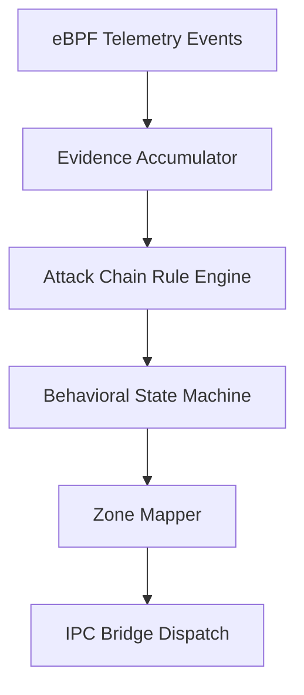

# Behavior Engine Architecture & Implementation Report

**Status:** Completed — implemented in `kb-core/userspace/behavior/` (`kb_behavior.c`, `kb_rules.c`) and `kb-core/include/kb_behavior.h`.

The scoring engine in Kernel Borderlands has been updated from a simple arithmetic weighted-average risk score to a robust, sequence-aware **Behavior Engine**. This ensures that the detection mechanism is harder to evade, explains its reasoning clearly, matches sequential attack chains, and maintains backward compatibility with the existing Go control plane.

## 1. Core Architecture

The new pipeline processes raw telemetry events as follows:



### Components Built & Integrated
- **Evidence Accumulator** ([kb_evidence.c](file:///home/emergence/Desktop/kernel-borderlands/kb-core/userspace/behavior/kb_evidence.c)): Tracks process behavioral indicators using a 64-bit bitmask and records sequential history in a chronological bounded ring buffer.
- **Rule Engine / Pattern Matcher** ([kb_rules.c](file:///home/emergence/Desktop/kernel-borderlands/kb-core/userspace/behavior/kb_rules.c)): Evaluates rules against process evidence, checking required/optional flags, temporal sequences, and time window constraints.
- **State Machine** ([kb_behavior.c](file:///home/emergence/Desktop/kernel-borderlands/kb-core/userspace/behavior/kb_behavior.c)): Maintains process state across seven ordered states: `SAFE`, `OBSERVED`, `SUSPICIOUS`, `BORDERLANDS`, `COMPROMISED`, `CONTAINED`, and `RECOVERING`.
- **Telemetry Sensor Integration** ([kbd_sensor.c](file:///home/emergence/Desktop/kernel-borderlands/kb-core/userspace/sensor/kbd_sensor.c)): Intercepts eBPF events and syscall entropy metrics, feeds the Behavior Engine, maps states to legacy zones, and transmits transitions over the Unix socket bridge.

---

## 2. Behavioral States & Rules Mapping

Process states are strictly ordered to prevent detection evasion (except for direct high-confidence compromises). State transitions are driven by specific rules:

| Source State | Target State | Rule Name | Matching Criteria | Reason |
| :--- | :--- | :--- | :--- | :--- |
| **SAFE** | **OBSERVED** | `unexpected_outbound_connection` | Outbound TCP/UDP connection | `KB_REASON_OUTBOUND_CONNECT` |
| **SAFE** | **OBSERVED** | `privilege_change_observed` | Drop in UID/EUID or cap expansion | `KB_REASON_PRIVILEGE_CHANGE` |
| **SAFE** | **OBSERVED** | `high_syscall_entropy_observed` | Syscall profile KL-divergent deviation | `KB_REASON_HIGH_SYSCALL_ENTROPY` |
| **OBSERVED** | **SUSPICIOUS** | `multi_anomaly_suspicious` | 3+ distinct anomalous indicators set | `KB_REASON_MULTI_ANOMALY` |
| **OBSERVED** | **SUSPICIOUS** | `privilege_plus_network_suspicious` | Privilege change + outbound connect | `KB_REASON_PRIVILEGE_PLUS_NETWORK` |
| **OBSERVED** | **SUSPICIOUS** | `cred_file_access_suspicious` | Touch shadow, passwd, sudoers, or SSH key | `KB_REASON_CRED_FILE_ACCESS` |
| **SUSPICIOUS** | **BORDERLANDS** | `rwx_memory_abuse` | RWX mapping or proc memory write | `KB_REASON_RWX_MEMORY` |
| **SUSPICIOUS** | **BORDERLANDS** | `ptrace_injection_borderlands` | Ptrace call from suspicious process | `KB_REASON_PTRACE_INJECTION` |
| **SUSPICIOUS** | **BORDERLANDS** | `c2_port_connection` | Connection to common C2 port (e.g. 4444) | `KB_REASON_C2_PORT_CONNECT` |
| **BORDERLANDS** | **COMPROMISED** | `reverse_shell_compromised` | Sequence: Outbound Connect $\rightarrow$ Spawn Shell | `KB_REASON_REVERSE_SHELL_CHAIN` |
| **BORDERLANDS** | **COMPROMISED** | `injection_ptrace_compromised` | Sequence: RWX Mapping $\rightarrow$ Ptrace Injection | `KB_REASON_INJECTION_CHAIN` |
| **SAFE** (Direct) | **COMPROMISED** | `known_ioc_sequence` | Sequence: Exec $\rightarrow$ Outbound $\rightarrow$ RWX (in <30s) | `KB_REASON_KNOWN_IOC_SEQUENCE` |

---

## 3. Backward Compatibility & IPC Bridge Integration

To avoid breaking the Go control plane (which relies on `KBZone` (Safe, Suspicious, Borderlands)), we map behavioral states to legacy zones before dispatching over the Unix socket:

* **SAFE** & **OBSERVED** $\rightarrow$ `KB_ZONE_SAFE`
* **SUSPICIOUS** & **RECOVERING** $\rightarrow$ `KB_ZONE_SUSPICIOUS`
* **BORDERLANDS**, **COMPROMISED** & **CONTAINED** $\rightarrow$ `KB_ZONE_BORDERLANDS`

This mapping is applied transparently inside `kbd_sensor.c`:
1. The scoring engine continues to run in the background as an **advisory tool** (providing risk score trends for visualization).
2. The Behavior Engine evaluates the process state, and the resulting state is mapped to `kb_zone_t`.
3. If the mapped zone changes, a zone transition message is sent to the Go Control Plane.
4. The control plane continues to trigger automated enforcement (e.g. throttling/cgroups) when a process enters `KB_ZONE_BORDERLANDS`.

---

## 4. Verification & Testing

A standalone unit test suite ([test_behavior.c](file:///home/emergence/Desktop/kernel-borderlands/kb-core/tests/test_behavior.c)) was built to validate the behavior engine logic:
* Checks sequential transitions (`SAFE` $\rightarrow$ `OBSERVED` $\rightarrow$ `SUSPICIOUS` $\rightarrow$ `BORDERLANDS` $\rightarrow$ `COMPROMISED`).
* Checks direct IOC compromise triggers (`SAFE` $\rightarrow$ `COMPROMISED`).
* Validates time window constraints (ensuring temporal sequences expire when they span beyond the defined window).

The unit test run completed successfully:
```bash
$ ./tests/test_behavior
Running test_initialization... PASS
Running test_sequential_transitions... PASS
Running test_direct_ioc_compromised... PASS
Running test_time_window_validation... PASS

All unit tests passed successfully!
```

Additionally, all Go Control Plane tests pass successfully, confirming that the bridge integration remains fully backward-compatible.
