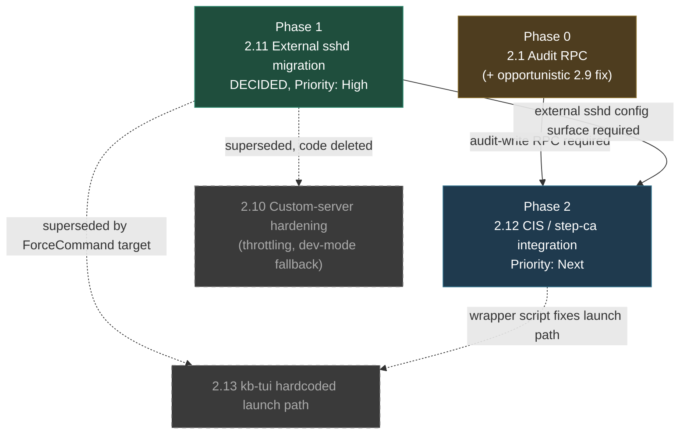
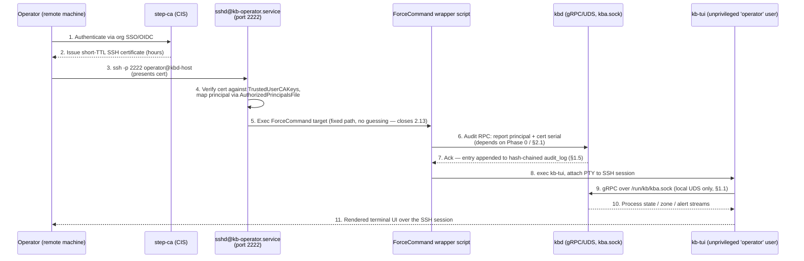
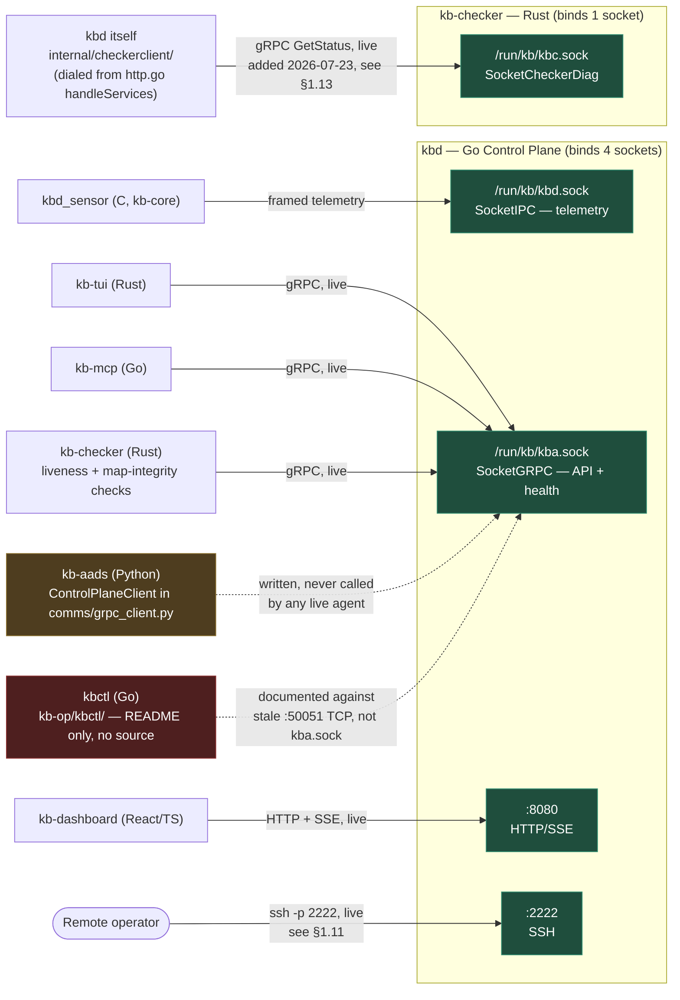

# kb-control-plane — Full Work Catalog

- **Scope**: `kb-control-plane/` (the `kbd` Go daemon) only. Not `kb-core`, `kb-checker`, or `kb-op`.
- **Purpose**: One place that lists everything that has been built in the control plane, why it exists, and everything that is known to still be missing — including gaps that were never written down anywhere else. This supersedes scattered status lines in individual spec docs for the purpose of "what's left to do"; individual specs remain the source of truth for *how* a completed feature works.
- **Owner**: Teju (Go Control Plane Lead, per [kba_uds_binding_spec.md](kba_uds_binding_spec.md)) — everything in this document is her backlog, but not all of it is solo Go work:
- **§2.1, 2.3, 2.4, 2.6, 2.7, 2.8, 2.9** — squarely hers: Go code changes inside `kb-control-plane/`, no infra dependency.
- **§2.5** — mostly hers, but co-worked with `kb-core` (not platform/infra): the fix needs a matching wire-format addition on the C sensor side per `kbd-contracts.md`, so it's cross-subsystem rather than solo, just not the Pardhu kind of cross-subsystem.
- **§2.11 (external `sshd` migration)** — has a Go component (deleting most of `internal/ssh/`), but the bulk of the work is systemd units, `sshd_config` drop-ins, and host-level config that isn't Go code at all. Hers to drive, not entirely hers to execute alone — someone needs prod access to configure `sshd@kb-operator.service` on real hosts. **Co-worked with platform/infra (Pardhu).**
- **§2.12 (CIS/`step-ca`)** — same shape, more so: standing up a certificate authority, OIDC provisioner config, and distributing `TrustedUserCAKeys` across hosts is genuinely a platform/infra task. Her piece is the `ForceCommand` wrapper script and the audit-RPC callback (Go/gRPC), not running the CA itself. **Co-worked with platform/infra (Pardhu).**

See the per-entry "Owner" line on §2.11 and §2.12 for the exact split.
- **Last compiled**: 2026-07-23.

---

## How to read this document

Each entry in "Completed Work" answers three questions: what it does, why it was needed, and where to find it (file + snippet). Each entry in "Open Gaps" answers: what's missing, why it matters, and what the fix looks like at a sketch level. Severity is my judgment call based on blast radius, not an official priority queue — reorder freely.

---

# Part 1 — Completed Work

### 1.1 UDS gRPC binding (`kba.sock`)
- **Why**: Eliminate network exposure for the control-plane RPC surface; rely on filesystem group permissions instead of a TCP port anyone on the box (or network, if misconfigured) could dial.
- **Where**: `internal/controlplane/controlplane.go` (`listenUnix`, `Start`, `Stop`).
```go
func listenUnix(path string) (net.Listener, error) {
	if err := os.Remove(path); err != nil && !os.IsNotExist(err) {
		return nil, fmt.Errorf("removing stale socket %s: %w", path, err)
	}
	lis, err := net.Listen("unix", path)
	if err != nil {
		return nil, err
	}
	if err := os.Chmod(path, 0o660); err != nil {
		lis.Close()
		return nil, fmt.Errorf("chmod socket %s: %w", path, err)
	}
	return lis, nil
}
```
No TCP fallback exists anywhere in the current code — UDS is the only transport, including local/dev (`KB_GRPC_SOCKET` env var overrides the path for tests, it doesn't change transport). Socket path is centralized in `internal/ipc/sockets.go` as `SocketGRPC = "/run/kb/kba.sock"`.
Full spec: [kba_uds_binding_spec.md](kba_uds_binding_spec.md).

### 1.2 gRPC health service
- **Why**: `kb-checker` (Rust watchdog) needs an honest, low-latency signal of whether `kbd` is actually functional, not just whether the process is alive — a hung store or a dead sensor connection should read as unhealthy even though the gRPC server itself is still answering.
- **Where**: `internal/controlplane/controlplane.go`.
```go
func registerHealthService(grpcServer *grpc.Server, hs *health.Server) {
	healthpb.RegisterHealthServer(grpcServer, hs)
	hs.SetServingStatus(ServiceName, healthpb.HealthCheckResponse_SERVING)
}
```
Health flips to `NOT_SERVING` on: graceful `Stop()` (before teardown, so an in-flight probe gets an honest answer instead of connection-refused), and on `storeFailureThreshold` (5) *consecutive* store-write failures (`recordStoreResult`). Recovery is asymmetric by design — a single success clears the unhealthy flag immediately, rather than requiring a matching consecutive-success streak. That asymmetry is a known simplification (see Open Gaps 2.8).

### 1.3 L1/L2 hybrid storage (ADR-1)
- **Why**: Sub-microsecond process-state lookups (PID-reuse verification, containment checks) can't wait on SQLite disk I/O on the hot path, but state still needs to survive a restart.
- **Where**: `internal/store/schema.go`, `internal/store/process.go`. Design record: [ADR-1](../adr/ADR-1.md).
- **L1** — `sync.Map` in-process cache, all hot-path reads/writes go here first (~30-50ns per ADR-1).
- **L2** — SQLite, WAL mode, `SetMaxOpenConns(1)` (single-writer serialization), written asynchronously through a buffered channel so L1 writers never block on disk:
```go
l2Pipe chan any // async write-behind queue to SQLite
l2Done chan struct{}
```
- **Cold-start recovery** — on every fresh start, L2 is replayed into L1 *before* the eBPF ingestion hook goes live (`Store.Restore()`), so a restart doesn't make `VerifyStartTime` miss on every already-tracked PID until a fresh `ProcessState` arrives.
- **Teardown ordering** — `Close()` closes the pipe and blocks on `l2Done` before closing the DB handle, to avoid a `sql: database is closed` race against the drain goroutine. This exact pattern is codified as a project-wide invariant in the full spec (§15.C).

### 1.4 PID-reuse guard (`VerifyStartTime`)
- **Why**: PIDs get recycled by the kernel. Without this, a stale zone-transition message for an old process could trigger containment against an unrelated new process that happens to have inherited the same PID.
- **Where**: `internal/store/process.go`, called from `ControlPlane.OnZoneTransition` before any containment decision.
```go
func (s *Store) VerifyStartTime(pid uint32, startTimeNs uint64) (bool, error) {
	if v, ok := s.l1.Load(pid); ok {
		return v.(*CachedState).StartTimeNs == startTimeNs, nil
	}
	var stored uint64
	err := s.db.QueryRow(`SELECT start_time_ns FROM process_state WHERE pid=?`, pid).Scan(&stored)
	if err != nil {
		return false, err
	}
	return stored == startTimeNs, nil
}
```
Wire-level plumbing (`StartTimeNs` field, wire version bump to 3) documented in [wire-update.md](wire-update.md).

### 1.5 Audit log with hash chain
- **Why**: Operators and incident responders need a tamper-evident record of every containment/policy action — "did anyone modify this log after the fact" has to be answerable, not just assumed.
- **Where**: `internal/audit/audit.go`.
```go
func (a *Logger) Log(action, subject, actor, reason string) error {
	ts := time.Now().UnixNano()
	content := fmt.Sprintf("%d|%s|%s|%s|%s|%s", ts, action, subject, actor, reason, a.prevHash)
	hash := fmt.Sprintf("%x", sha256.Sum256([]byte(content)))
	// INSERT ... prev_hash, entry_hash
	a.prevHash = hash
	return nil
}

func (a *Logger) VerifyChain() (bool, int, error) {
	// re-derives entry_hash for every row from ts|action|subject|actor|reason|prevHash
	// and compares against the stored hash; returns (ok, entriesVerified, err)
}
```
Each row's `entry_hash` is `SHA256(fields ‖ prevHash)`, so mutating or deleting any row breaks every hash after it. **`VerifyChain()` is fully implemented but not yet wired to anything callable** — see Open Gaps 2.1, the single most important item in this document.

### 1.6 Dynamic rule delivery
- **Why**: New attack-chain signatures need to reach the eBPF sensor without a recompile/redeploy of `kb-core`.
- **Where**: `internal/ipc/rules.go`, source config `config/rules.yaml`. Analysts edit YAML; `kbd` parses it, serializes to the packed 220-byte `kb_wire_attack_rule` binary layout, and pushes it to the C sensor at connect time.
Full spec: [dynamic-rules.md](dynamic-rules.md).

### 1.7 Wire protocol v3 + sensitive-path push
- **Why**: Keep the C↔Go state contract byte-identical as the schema evolved (added `syscall_entropy_lifetime`, then `StartTimeNs`), and let operators extend the sensitive-file blocklist without recompiling the sensor.
- **Where**: `internal/ipc/wire.go` (`WireVersion = 3`), `internal/ipc/sensitive_paths.go`.
```go
// policy.yaml's sensitive_paths is additive on top of a compiled-in floor
// (/etc/shadow, /etc/sudoers, /root/.ssh/) — never replaces it.
var sensitivePathFloor = []string{"/etc/shadow", "/etc/sudoers", "/root/.ssh/"}
```
This push happens on sensor (re)connect, not as a live reload — a running `kbd_sensor` won't see a `policy.yaml` change until it reconnects. Full detail: [in-context-mitigation.md](in-context-mitigation.md), [wire-update.md](wire-update.md), [struct-update.md](struct-update.md).

### 1.8 Graduated containment enforcement
- **Why**: Not every suspicious process deserves `SIGKILL` — the system needs a reversible ladder (cgroup throttle → seccomp/namespace restriction → terminate) so automated response doesn't nuke false positives.
- **Where**: `internal/enforcement/enforce.go`. The Go side is deliberately thin — it validates the level is known and forwards the command over the wire; the actual restriction logic (blocking `execve`, network connect/bind, `mprotect`) lives in `kb-core`'s eBPF LSM hooks, keyed off the containment level stored in `contained_pids_map`.
```go
func (e *Enforcer) Contain(pid uint32, level uint32, reason string) error {
	switch level {
	case ipc.ContainmentNone, ipc.ContainmentCgroup, ipc.ContainmentSeccomp,
		ipc.ContainmentNamespace, ipc.ContainmentTerminate:
		return e.listener.SendContainmentCmd(pid, level, reason)
	default:
		return fmt.Errorf("enforcement: unknown containment level %d", level)
	}
}
```
`ContainmentNone` (level 0) is explicitly **not** a no-op — it sends a real wire message so the C sensor calls `bpf_map_delete_elem` and actually clears the BPF map entry; without this a dashboard "restore" would update Go-side state but leave the PID kernel-contained forever.

### 1.9 gRPC API surface
- **Where**: `internal/controlplane/grpc.go`. All seven RPC methods declared in the proto are implemented (not just embedded `Unimplemented*` stubs): `GetProcessState`, `ListZone`, `SetContainment`, `StreamEvents`, `StreamAlerts`, `SubmitAgentDecision`, `GetSystemStats`. `StreamEvents`/`StreamAlerts` use a fan-out subscriber-channel pattern (`eventSubs`/`alertSubs` behind mutexes) so multiple dashboard/TUI clients can watch the same event stream concurrently.

### 1.10 HTTP/SSE API for the web dashboard
- **Where**: `internal/controlplane/http.go`, served on `:8080` alongside the gRPC/UDS server. Serves `/api/processes`, `/api/alerts`, `/api/logs`, and a `/api/services` status page that checks whether `kbd_sensor`, `kb-checker`, and the AADS agent processes are running, plus DB and gRPC reachability.
This file previously checked gRPC reachability via `net.DialTimeout("tcp", "127.0.0.1:50051", ...)` — a leftover from before the UDS migration that meant the dashboard's gRPC status tile was **always reporting "offline"** regardless of actual health. Fixed 2026-07-23 to dial the real UDS path instead:
```go
func isSocketOpen(path string) bool {
	conn, err := net.DialTimeout("unix", path, 100*time.Millisecond)
	if err != nil {
		return false
	}
	conn.Close()
	return true
}
```

### 1.11 SSH-key authenticated remote `kb-tui` bridge — cross-subsystem integration point, and the daemon's only network-facing listener
- **Why**: Operators need a remote console into the system without opening a bespoke network port or reimplementing the TUI as a network protocol — SSH gives free auth, encryption, and PTY semantics that already exist on every ops workflow.
- **Where**: `internal/ssh/` (Go, `kb-control-plane`) + `kb-op/kb-tui` (Rust, `kb-op`). **This is a cross-subsystem collaboration point** — the SSH server lives entirely in the control plane, but its whole purpose is to launch and pipe a terminal to a binary owned by a different subsystem (`kb-op`), written in a different language, that the control plane knows nothing about except a filesystem path. Worth calling out explicitly since it's easy to read `internal/ssh/` in isolation and assume it terminates in Go code — it doesn't; it terminates in `kb-tui`.

- **Correction to the rest of this document**: every other section repeatedly emphasizes that `kbd` has "no network exposure" (§1.1) via the UDS-only gRPC migration. That's true for gRPC specifically, but it is **not** true of `kbd` as a whole — this SSH service binds a real TCP listener:
```go
// internal/ssh/config.go
bindAddr := os.Getenv("KB_SSH_BIND")
if bindAddr == "" {
	bindAddr = "0.0.0.0:2222"
}
// internal/ssh/server.go
ws, err := wish.NewServer(
	wish.WithAddress(cfg.BindAddr),
	wish.WithHostKeyPath(cfg.HostKeyPath),
	wish.WithPublicKeyAuth(func(ctx ssh.Context, key ssh.PublicKey) bool {
		return ValidatePublicKey(cfg.AuthorizedKeysPath, key)
	}),
	...
)
```
`0.0.0.0:2222` is the daemon's one deliberate network-facing port, and it exists specifically *because* `kb-tui`'s own gRPC client only ever dials the local UDS socket and has no remote-connect capability of its own (see `kb-op/kb-tui/src/grpc.rs`) — SSH is the only way a remote operator reaches the TUI at all. Any threat-model discussion of `kbd`'s attack surface needs to center on port 2222, not the UDS socket.

**By design, confirmed**: collapsing the entire remote-access surface down to this one port (rather than, say, gRPC also being reachable over TCP, or a separate dashboard-auth path) is an intentional threat-space minimization decision, not an oversight — one network listener to secure/monitor/firewall instead of several. Worth preserving as an explicit invariant if this area gets touched later: **don't add a second network-facing listener** to `kbd` without a strong reason: it directly undoes this minimization.

**Concentration is a double-edged design choice, not a free win — evaluate honestly.** Fewer listeners means less to secure *and* means all remote-access risk sits behind one implementation. Two things pull in opposite directions here:

*What's good about it*: the trust boundary is crisp ("no network reach to anything except through 2222"), and `kb-tui` itself carries zero network code — it only ever dials the local UDS socket, so the component with the broadest gRPC visibility into containment/process state isn't part of the exposed surface at all.

*What concentration costs*: all of the daemon's remote-access risk now depends on one implementation being correct — the entire failure mode space is auth-bypass-in-this-library, not "one of several weaker surfaces gets popped." Two specifics worth naming:
1. **It's a custom, hand-rolled SSH server** (`charmbracelet/wish`/`ssh`, wrapping `golang.org/x/crypto/ssh`), not OpenSSH. OpenSSH has roughly 25 years of adversarial scrutiny, CVE history, and hardening baked in (PAM/MFA modules, certificate auth, `fail2ban` integrations, etc.). A niche third-party Go SSH library has a far thinner track record for exactly the thing being trusted here: authentication.
2. **Auth success leads straight to command execution with no intermediate layer** — `handleSession()` goes directly from a passed `ValidatePublicKey` check to `pty.Start(exec.Command(kb-tui))`. If auth is ever bypassed (library bug, misconfigured `authorized_keys`, the dev-mode fallback risk in §2.10), there's no partial-compromise state — the attacker lands directly in a process with gRPC control over containment.

- **A stronger alternative worth considering**: replace the custom Go SSH server with real **OpenSSH + `ForceCommand`**. An `sshd_config` block like:
```
Match User operator
    ForceCommand /usr/local/bin/kb-tui
    AuthorizedKeysCommand /usr/local/bin/kb-authkeys-lookup   # ties into CIS, see §2.11
    X11Forwarding no
    AllowTcpForwarding no
```
delivers the identical "SSH in, land straight in the TUI" UX operators get today, but inherits OpenSSH's entire hardening lineage for free instead of re-implementing session handling, PTY plumbing, and auth in a less-audited library. Tradeoff: loses the convenience of `kbd` being a single self-contained Go binary that owns its own SSH stack — `sshd` becomes an external dependency `kbd`'s deployment has to configure rather than something `internal/ssh/` fully owns. For the one open network port on a security-enforcement daemon, that trade is generally worth making, but it's a real architecture decision, not a drop-in patch — flagging it here rather than as a graded open-gap item since it's a "should we rearchitect this" question, not a bug.

Auth (as currently implemented): `ValidatePublicKey` (`internal/ssh/auth.go`) checks incoming connections against an `authorized_keys`-format file — standard public-key auth, no passwords. **This manual file is the intended next piece of work** — see Open Gap 2.12 below.

The bridge itself, `internal/ssh/session.go`:
```go
func handleSession(s ssh.Session) {
	// ... auth already passed by this point ...
	tuiPath := os.Getenv("KB_TUI_PATH")
	if tuiPath == "" {
		paths := []string{
			"/home/emergence/Desktop/kernel-borderlands/kb-op/kb-tui/target/debug/kb-tui",
			"/home/emergence/Desktop/kernel-borderlands/kb-op/kb-tui/kb-tui",
			"kb-tui",
		}
		// ... first path that exists or resolves on $PATH wins
	}

	ptyFile, _ := pty.Start(exec.Command(tuiPath))
	go io.Copy(ptyFile, s)   // SSH input  -> kb-tui stdin
	io.Copy(s, ptyFile)      // kb-tui stdout -> SSH output
}
```
Important nuance: `kb-tui` itself does **not** talk to this SSH server at all once launched — it dials `kba.sock` directly over gRPC (`kb-op/kb-tui/src/grpc.rs`, `DEFAULT_UDS_PATH`), exactly as it would if run from a local shell with no SSH involved. The SSH server's only job is remote-PTY plumbing: authenticate, spawn, forward bytes. It is a launcher, not a data path — `kb-tui` gets its actual data from the same gRPC/UDS surface documented in §1.9, independent of how its terminal got attached.

### 1.12 Policy engine
- **Where**: `internal/policy/policy.go`. Loads `policy.yaml`, exposes per-`comm` `AutoTerminate` overrides (checked in `OnZoneTransition` before deciding cgroup-throttle vs. auto-terminate on `BORDERLANDS` entry) and the sensitive-paths list. Threshold fields (`SuspiciousThresh`/`BorderlandsThresh`) are parsed but intentionally unused on the Go side — zone classification moved fully to `kb-core`'s `kb_scoring.c` and arrives pre-computed; the fields are kept parseable so an operator's existing `policy.yaml` doesn't silently break.

### 1.13 `kbd` as a real client of `kb-checker`'s diagnostic socket (`kbc.sock`) — added 2026-07-23
- **Why**: `/api/services` (§1.10) already tried to report `kb-checker`'s status, but faked it with `isProcessRunning("kb-checker")` — a `/proc` scan for a process by that name, which only proves the binary is alive, not that the watchdog considers itself healthy. `kb-checker` already computes the real answer internally (JIT-signature audits, heartbeat liveness) and exposes it over its own socket; `kbd` just wasn't asking. Same shape of bug as the `:50051` TCP proxy fixed earlier in this same file (§1.10) for the gRPC status tile.
- **Where**: new package `internal/checkerclient/checkerclient.go`, wired into `internal/controlplane/http.go`'s `handleServices`.
```go
// internal/checkerclient/checkerclient.go
func GetStatus(ctx context.Context, socketPath string, timeout time.Duration) (*checkerpb.StatusResponse, error) {
	conn, err := grpc.DialContext(dialCtx, "unix:"+socketPath,
		grpc.WithTransportCredentials(insecure.NewCredentials()),
		grpc.WithContextDialer(func(ctx context.Context, addr string) (net.Conn, error) {
			var d net.Dialer
			return d.DialContext(ctx, "unix", socketPath)
		}),
		grpc.WithBlock(),
	)
	// ...
	client := checkerpb.NewCheckerStatusClient(conn)
	return client.GetStatus(callCtx, &checkerpb.StatusRequest{})
}
```
```go
// internal/controlplane/http.go, handleServices
checkerStatus := "offline"
checkerSocketPath := os.Getenv("KB_CHECKER_SOCKET")
if checkerSocketPath == "" {
	checkerSocketPath = ipc.SocketCheckerDiag
}
if resp, err := checkerclient.GetStatus(r.Context(), checkerSocketPath, 200*time.Millisecond); err == nil && resp.Healthy {
	checkerStatus = "ok"
}
```
- **Proto contract**: `kb-checker/proto/checker.proto` is the canonical definition (Rust-owned); `kb-control-plane/proto/checker/checker.proto` is a local copy with `go_package` added so Go stubs can be generated (`protoc --go_out --go-grpc_out`) — same pattern as wire structs being independently maintained on both sides of a language boundary elsewhere in this project (`kbd-contracts.md`). If `kb-checker` changes `checker.proto`, this copy needs to be updated to match; it is not auto-synced.
- **Behavior on failure**: any dial/RPC error (checker down, socket missing, timeout) is treated as `"offline"`, same as the existing gRPC/DB checks in this handler — `kb-checker` being unreachable is itself the unhealthy signal, not something to surface as a request error.
- Also updated §5.3's socket chart — `kbc.sock` now shows a live edge from `kbd` instead of "no confirmed client."

---

# Part 2 — Open Gaps

Ordered by severity, not by effort.

### 2.1 [SECURITY] Audit hash-chain is never verified — SEV: High
- **Owner**: Teju, solo. Pure Go/gRPC/HTTP work inside `kb-control-plane/`, no infra dependency.
- **What's missing**: `Logger.VerifyChain()` (§1.5) is fully implemented and correct, but nothing in the codebase calls it — no HTTP route, no gRPC method, no CLI subcommand. Grep confirms zero callers outside `audit_test.go`.
- **Why it matters**: The entire point of a hash-chained audit log is that tampering is detectable. Right now, if someone with DB access rewrote or deleted rows in `audit_log` directly in SQLite, nothing in the running system would ever notice, alert, or refuse. The security property exists in code but delivers zero operational value until something calls it.
- **Sketch fix**: Add an HTTP route (`GET /api/audit/verify`) and/or a `kbctl audit verify` command that calls `cp.audit.VerifyChain()` and surfaces `(ok, entriesVerified, breakPointIfAny)`. Consider also running it once at `kbd` startup and logging a loud warning (not a fatal) if the existing chain is already broken.

Both `ControlPlane.audit` (`internal/controlplane/controlplane.go:38`) and `Logger.VerifyChain()` (`internal/audit/audit.go:58`) already exist — this is purely a wiring gap, not new subsystem work. Two concrete hook points:

*HTTP route* — `internal/controlplane/http.go`, next to the existing `mux.HandleFunc("/api/logs", ...)` registration. This is the smaller of the two changes, no proto/wire changes needed:
```go
mux.HandleFunc("/api/audit/verify", server.handleAuditVerify)

func (s *HTTPServer) handleAuditVerify(w http.ResponseWriter, r *http.Request) {
	if r.Method != "GET" {
		http.Error(w, "Method not allowed", http.StatusMethodNotAllowed)
		return
	}
	ok, count, err := s.cp.audit.VerifyChain()
	resp := map[string]any{"chain_intact": ok, "entries_verified": count}
	if err != nil {
		resp["error"] = err.Error()
	}
	writeJSON(w, http.StatusOK, resp)
}
```
This is what the dashboard's "tamper-check" tile would call.

*CLI / gRPC route* — `cmd/kbd/main.go`, a sibling `cobra.Command` to `rootCmd`, dialing the daemon over the existing UDS gRPC socket. Unlike the HTTP route, this one isn't purely wiring — there's no `VerifyAuditChain` RPC in the proto yet, so it needs a small addition there first:
```go
var auditVerifyCmd = &cobra.Command{
	Use:   "audit-verify",
	Short: "Verify the audit log hash chain has not been tampered with",
	Run: func(cmd *cobra.Command, args []string) {
		resp, err := grpcClient.VerifyAuditChain(ctx, &pb.Empty{})
		// print resp.ChainIntact / resp.EntriesVerified / resp.Error
	},
}
```
Pick one or both — HTTP is the cheaper win for the dashboard, the gRPC/CLI route matters more if `kbctl` or `kb-tui` should be able to check this without the HTTP server running.

### 2.2 [SECURITY] `AgentDecision.AuthorizedBy` is captured but never checked — SEV: High
- **Owner**: Teju, solo. Pure Go work in `grpc.go`, no infra dependency.
- **Where**: `internal/controlplane/grpc.go`, `SubmitAgentDecision`.
```go
cp.audit.Log(
    fmt.Sprintf("AGENT_%s", d.Action),
    fmt.Sprintf("pid=%d agent=%s conf=%.2f auth=%v", d.Pid, d.AgentId, d.Confidence, d.AuthorizedBy),
    d.AgentId, "",
)
```
- **Why it matters**: `AuthorizedBy` is logged as if it were a meaningful authorization claim, but it's just a caller-supplied string — nothing validates it against an allowlist, a signature, or any authority. Combined with 2.3, any process that can reach `kba.sock` can submit a fabricated `TERMINATE` decision, and the audit trail will faithfully record a false provenance for it.
- **Sketch fix**: Either enforce `AuthorizedBy` against a configured allowlist of known agent identities before acting on `TERMINATE`/`NAMESPACE`/`SECCOMP`, or rename/document the field as advisory-only logging and add real authorization elsewhere (e.g., per-UID socket peer credentials via `SO_PEERCRED`).

### 2.3 [SECURITY] No protected-PID gate on the Go side — SEV: High
- **Owner**: Teju, solo, for the Go-side backstop described here. (Note: the primary CPM implementation this backstops is `kb-core` work, not hers — see Part 3.)
- **Where**: `internal/enforcement/enforce.go` (`Contain`), called from both `SetContainment` and `SubmitAgentDecision` in `grpc.go`.
- **Why it matters**: CPM (Critical Process Module — see `docs/features/CPM.md`) is correctly scoped to `kb-core`, and is itself unimplemented there too. But the Go control plane is the *other* entry point through which a containment request can originate (operator RPC, agent decision), and it currently has zero exemption logic of its own — `Contain()` will forward a request for PID 1, `systemd`, or `kbd`'s own PID exactly like any other process. Relying on a single gate in `kb-core` (once it exists) means one bug or race there has no backstop.
- **Sketch fix**: A minimal, cheap check in `Contain()` or just before it — refuse (or downgrade + alert) requests targeting PID 1, `os.Getpid()` (the control plane itself), and a small configured list of critical comms, independent of whatever `kb-core` eventually does.

### 2.4 [SECURITY / ROBUSTNESS] No input validation or rate limiting on containment RPCs — SEV: Medium
- **Owner**: Teju, solo. Pure Go work, no infra dependency.
- **Where**: `SetContainment`, `SubmitAgentDecision` in `grpc.go`.
- **Why it matters**: Both accept any `int32`/`uint32` `Pid` (0, negative-cast, nonexistent) and act on it without checking existence against the store first. There's also no throttle — a buggy or compromised agent client can call `SubmitAgentDecision` in a tight loop with no backpressure.
- **Sketch fix**: Validate `Pid` exists in `store.GetProcessState` before acting; add a simple per-agent-ID token-bucket or minimum-interval check.

### 2.5 [CORRECTNESS] No dedicated `process_exit` wire message — SEV: Medium
- **Owner**: Teju, co-worked with whoever owns `kb-core` (not platform/infra this time — this is the one cross-subsystem item on the list, needing a matching wire-format change on the C sensor side per `kbd-contracts.md`). Her piece is the Go ingestion handling; the wire message itself is `kb-core` work.
- **Where**: `internal/controlplane/controlplane.go:284` (existing TODO comment).
```go
// Remove on process exit — event_count won't increment after exit,
// so use the zone: if a process_exit event came through the C side
// it already called kb_scoring_remove(), but the last state message
// may not reflect that. ...
// TODO: C side should send a dedicated process_exit wire message type.
```
- **Why it matters**: Exited processes' rows are left in the store to be silently overwritten if/when the PID is reused, rather than being cleanly marked terminated at the moment of exit. This is cross-cutting — the fix requires a matching wire-format addition on `kb-core`'s side (see `kbd-contracts.md` for the byte-identical struct rule), not just a Go change.
- **Sketch fix**: Add a `KB_WIRE_MSG_PROCESS_EXIT` message type carrying `pid` + `exit_time_ns` (+ optionally exit code, already partially modeled by `ProcessExitMsg`/`OnProcessExit` — check whether that path already covers this before assuming it's fully missing on the ingestion side; the gap is specifically in `OnProcessState`'s handling, not `OnProcessExit`).

### 2.6 [OPERABILITY] Policy has no hot-reload — SEV: Low-Medium
- **Owner**: Teju, solo. Pure Go work; the related sensor-side reconnect behavior is `kb-core`'s concern but isn't part of what this item asks for.
- **Where**: `internal/policy/policy.go`, loaded once in `controlplane.New()`.
- **Why it matters**: Changing `auto_terminate` rules or sensitive paths requires a full `kbd` restart, which also drops all sensor connections and forces a cold-start L1 rebuild. This is a known, currently-accepted limitation (documented in `in-context-mitigation.md` for the sensitive-paths case specifically), but it's not just a sensor-reconnect issue — the Go-side `Engine` itself has no reload path either.
- **Sketch fix**: `SIGHUP` handler that re-reads `policy.yaml` and atomically swaps the `Engine`'s internal maps; separately, the sensor-side push-on-reconnect behavior is a `kb-core` concern.

### 2.7 [OPERABILITY] Hardcoded HTTP port / no CLI flags for socket paths — SEV: Low
- **Owner**: Teju, solo. Pure Go/cobra work, no infra dependency.
- **Where**: `internal/controlplane/controlplane.go:154` (`:8080` hardcoded), `KB_GRPC_SOCKET` is env-var-only in `Start()`/`Stop()`, not exposed as a `cmd/kbd/main.go` cobra flag the way `--db`/`--policy` are.
- **Why it matters**: Minor, but inconsistent — two of the daemon's four config surfaces (db path, policy path) are proper CLI flags with `--help` text; the other two (HTTP port, gRPC socket path) require knowing to set an env var or editing source.
- **Sketch fix**: Add `--http-addr` and `--grpc-socket` flags to `cmd/kbd/main.go`, defaulting to current hardcoded values, env var as fallback for compatibility.

### 2.8 [ROBUSTNESS] Health-flip recovery asymmetry is an acknowledged placeholder — SEV: Low
- **Owner**: Teju, solo, whenever it's picked up. Pure Go work, no infra dependency — but per its own "Sketch fix," not worth prioritizing until there's real production failure-rate data to tune against.
- **Where**: `internal/controlplane/controlplane.go`, `recordStoreResult` — comment already flags this as "start simple, tune from real failure data."
```go
// Recovery is intentionally simple for now: a single success after
// crossing the failure threshold clears the unhealthy state immediately
// (asymmetric — fail-fast at storeFailureThreshold, recover-fast at 1).
```
- **Why it matters**: Under flaky-but-not-dead storage (e.g. intermittent disk pressure), health status could flap between SERVING/NOT_SERVING rapidly, which is noisy for `kb-checker` and any alerting built on top of the health endpoint.
- **Sketch fix**: Not urgent per the code's own comment — revisit once there's real production failure-rate data, possibly requiring N consecutive successes to recover instead of 1.

### 2.9 [DX] `GetProcessState`/`ListZone` don't distinguish "not found" from "zero value" — SEV: Low
- **Owner**: Teju, solo. Pure Go work — see Part 4 for why it's cheapest to bundle into the same changeset as §2.1's proto/`grpc.go` work rather than doing it standalone.
- **Where**: `internal/controlplane/grpc.go`, `GetProcessState`.
```go
func (cp *ControlPlane) GetProcessState(ctx context.Context, req *pb.PidRequest) (*pb.ProcessState, error) {
	cs, ok := cp.store.GetProcessState(req.Pid)
	if !ok {
		return &pb.ProcessState{}, nil
	}
	return cachedToProto(cs), nil
}
```
- **Why it matters**: A caller asking about a PID that was never tracked gets back an indistinguishable empty struct instead of a gRPC `NotFound` status — client code has no reliable way to tell "this process doesn't exist" from "this process exists with all-default field values."
- **Sketch fix**: Return `status.Errorf(codes.NotFound, "pid %d not tracked", req.Pid)` when `ok == false`.

### 2.10 [SECURITY] SSH listener (port 2222) has no auth-attempt throttling, and dev-mode fallback is meaningfully weaker than prod — SEV: Medium-High
- **Owner**: N/A — do not assign. Per Part 4, this is superseded by §2.11's migration to external `sshd`, not fixed in place; both gaps described here live entirely in code `internal/ssh/` that 2.11 deletes. Don't schedule standalone work against this item.
- **Where**: `internal/ssh/server.go`, `internal/ssh/config.go`.
- **Why it matters**: This is the daemon's only network-exposed listener (§1.11) — everything else is UDS. Two gaps stand out:
1. **No rate limiting / lockout on failed public-key attempts.** `wish.WithPublicKeyAuth` just calls `ValidatePublicKey` per attempt with no counter, backoff, or `fail2ban`-style integration point. An attacker with network reach to port 2222 gets unlimited authentication attempts against whatever's in `authorized_keys` — public-key auth makes brute-force impractical cryptographically, but there's still no protection against connection-exhaustion / resource-abuse from repeated handshakes.
2. **Dev-mode fallback is a real security posture downgrade, not just a convenience.** When `/etc/kb` isn't writable and `KB_DEV=true`, `LoadConfig()` silently switches to host keys and `authorized_keys` stored relative to the process's current working directory, and `NewService()` will auto-create an **empty** `authorized_keys` file if none exists:
```go
if cfg.DevMode {
	_ = os.WriteFile(cfg.AuthorizedKeysPath, []byte("# Add operator public keys here\n"), 0600)
}
```
An empty `authorized_keys` means public-key auth rejects everyone (fails safe) — good — but the bigger risk is CWD-relative key material: if `kbd` is ever started with `KB_DEV=true` from an unexpected working directory (a misconfigured systemd unit, a CI job, a debugging session on a semi-production box), the host key silently regenerates or resolves somewhere unexpected, which breaks host-key pinning assumptions for anyone who'd previously connected and trusted the old fingerprint (classic MITM-warning-fatigue setup, since users become trained to click through "host key changed").
- **Sketch fix**: (a) add a basic per-IP attempt counter/backoff in the `PublicKeyAuth` callback or in front of it; (b) make the dev-mode fallback path require an explicit opt-in beyond just `KB_DEV=true` + an unwritable `/etc/kb` (e.g. also require `KB_SSH_ALLOW_DEV_FALLBACK=true`), so a production host with a misconfigured `/etc/kb` fails closed with a clear error instead of silently downgrading to CWD-relative keys.

### 2.11 [ARCHITECTURE] Replace the custom Go SSH server with real OpenSSH + `ForceCommand` — **DECIDED, Priority: High** (addresses 2.10 at the root instead of patching around it)
- **Owner**: Teju + platform/infra (Pardhu), co-worked. Teju owns deleting `internal/ssh/`'s server code and anything Go-side that changes as a result; Pardhu owns provisioning the dedicated `sshd@kb-operator.service` unit, its systemd sandboxing, and host-level `sshd_config` deployment — this item doesn't complete from `kb-control-plane` changes alone.
- **Where**: `internal/ssh/` in full (`server.go`, `config.go`, `session.go`, `auth.go`, `hostkey.go`) — this entry proposes retiring the package's SSH-server responsibility, not patching it.
- **Why it matters**: §1.11 covers this in detail as a design discussion; this entry exists to track it as an actual piece of work rather than leaving it as commentary. The daemon's entire remote-access surface (§1.11) currently depends on a single custom, hand-rolled SSH server (`charmbracelet/wish`/`ssh`, wrapping `golang.org/x/crypto/ssh`) — a far less battle-tested implementation than OpenSSH for the one job that matters most here: authenticating remote operators before handing them a PTY into a process with gRPC control over containment.
- **The lever**: swap `internal/ssh/`'s server responsibility for the system's actual `sshd`, configured to land operators directly in `kb-tui` — same UX, inherited hardening:
```
# /etc/ssh/sshd_config.d/kb-operator.conf
Match User operator
    ForceCommand /usr/local/bin/kb-tui
    AuthorizedKeysCommand /usr/local/bin/kb-authkeys-lookup   # ties into CIS, see §2.12
    AuthorizedKeysCommandUser nobody
    X11Forwarding no
    AllowTcpForwarding no
    PermitTTY yes
```
- **What this buys**: OpenSSH's ~25 years of adversarial scrutiny and CVE history, PAM/MFA modules, certificate auth, `fail2ban` integration, and decades of fuzzing — all for free, instead of re-implementing session handling, PTY plumbing, and public-key auth in a less-audited third-party library. It also directly resolves 2.10's two gaps (no throttling, weak dev-mode fallback) by construction, since those become OpenSSH's problem, not this codebase's.
- **What it costs**: `kbd` stops being a single self-contained Go binary that owns its whole SSH stack — `sshd` becomes an external dependency the deployment/packaging story has to configure (`sshd_config` drop-in, `AuthorizedKeysCommand` script, host key management) rather than something `internal/ssh/` fully owns and ships. `internal/ssh/`'s Go code (auth.go, server.go, hostkey.go) would largely be deleted; `session.go`'s only surviving job is "what does the `ForceCommand` script do," which is much smaller than today's PTY-bridging responsibility.
- **Sequencing note**: this is the architecture decision that should be made *before* investing further in 2.10's patches (rate-limiting the custom server, hardening its dev-mode fallback) — if this migration happens, that work is thrown away. Worth deciding direction first, then only doing 2.10's incremental hardening if this migration is rejected or deferred long-term.

**Decided: fully external, OS-managed `sshd` — not a `kbd`-supervised child process.** A tempting middle ground is having `kbd` spawn and supervise its own `sshd` subprocess at runtime (generate a scoped config, `exec.Command("sshd", "-f", cfgPath, "-D")`, restart on crash) — this keeps `kbd` as the single service an operator starts, same as today. **Rejected for this component specifically**, because it undoes the exact property this migration exists to get:
- It re-couples the auth boundary to the containment daemon — a vulnerability anywhere in `kbd` (including unrelated gRPC/HTTP code elsewhere in this catalog) could manipulate its own child `sshd`: kill/respawn it with a rewritten `ForceCommand`, tamper with the generated config before restart, etc. A `sshd` `kbd` never touches at runtime stays outside `kbd`'s blast radius even if `kbd` is fully compromised — that's the actual goal.
- Runtime config generation (`writeScopedSSHDConfig()`) is new security-critical code written by the process it's meant to protect against — a static, packaged config file has no equivalent runtime attack surface.
- `sshd`'s own privilege-separation model (root-owned, systemd-supervised, per-connection privilege drop) is designed to run as an independent unit; nesting it under `kbd`'s process tree buys nothing and adds `kbd` needing rights to spawn/manage a privileged network-facing process.

**Full hardening spec for the external `sshd` instance:**
1. **Separate `sshd` instance dedicated to port 2222** — its own systemd unit (e.g. `sshd@kb-operator.service`), fully independent of the box's normal admin `sshd` on port 22. Standard multi-instance OpenSSH pattern; keeps operator access to `kb-tui` isolated from general host admin access, with its own config, its own host key, its own unit to enable/disable/audit.
2. **Certificates over static keys** — `TrustedUserCAKeys` + short-TTL signed certificates issued by the CIS work in §2.12, instead of long-lived entries in `authorized_keys`. Revocation becomes "let the cert expire" or a CRL, not "remember to edit a file on every host."
3. **systemd sandboxing on the unit** — `ProtectSystem=strict`, `PrivateTmp=yes`, `NoNewPrivileges=yes` (plus the usual `ProtectHome`, `ProtectKernelTunables`, etc. as far as `sshd`'s own privilege-separation model tolerates) — shrinks this unit's own blast radius independent of anything `kbd` does.
4. **`AllowTcpForwarding no` / `X11Forwarding no`** (already in the §2.11 sketch) — closes off using this port as a pivot into the rest of the network; the only thing reachable through it should be `kb-tui`, nothing else.
5. **`kb-tui` runs as an unprivileged `operator` system user**, a member of the `kb` group so it can reach `kba.sock` (already `0660`, §1.1) but nothing more. This keeps SSH auth and gRPC-socket auth as two independently-enforced layers — compromising one doesn't imply the other, since the `ForceCommand` process's OS-level permissions are the actual backstop, not just "SSH let you in."

This checklist is the target state for this migration, not a menu — treat 1–5 as the acceptance bar for calling this item done, not optional extras layered on later.

### 2.12 [SECURITY / OPERABILITY] No centralized identity/key-management (CIS) integration for SSH access — **Priority: Next** (SEV: Medium-High)
- **Owner**: Teju + platform/infra (Pardhu), co-worked, more infra-weighted than 2.11. Standing up `step-ca`, its OIDC provisioner config, and distributing `TrustedUserCAKeys`/`AuthorizedPrincipalsFile` across hosts is a platform task, not a `kb-control-plane` one. Teju's actual piece is narrower: the `ForceCommand` wrapper script and the audit-RPC callback into `kbd` (step 5 below) — she is not standing up or operating the CA itself.
- **Where**: `internal/ssh/auth.go` (`ValidatePublicKey`), `internal/ssh/config.go` (`AuthorizedKeysPath` = `/etc/kb/authorized_keys` in prod).
- **Why it matters**: Operator access to `kbd`'s only network-facing surface (§1.11, port 2222) is currently governed by a flat `authorized_keys` file that has to be manually edited on the host for every operator added or removed. This doesn't scale past a handful of operators/hosts and has the usual flat-file identity problems: no central audit trail of who has access to *which* `kbd` hosts, no automated revocation when someone leaves the team (has to be remembered and done by hand, per host), no expiry, no MFA/step-up, no tie-in to whatever the org already uses for identity (LDAP/SSO/Vault/etc.). This was flagged as an intended near-term priority, not a someday-maybe item.
**Decided direction: SSH Certificate Authority, not directory-backed `authorized_keys`.** §2.11's hardening checklist (item 2) already committed to `TrustedUserCAKeys` + short-TTL certs once the migration to external `sshd` happens, so this isn't an open "either" anymore — the CA model is the one that's consistent with what 2.11 already decided. `ValidatePublicKey`/`internal/ssh/auth.go` in its current form is retired along with the rest of `internal/ssh/`'s server code per 2.11; this item is really "stand up and wire in the CA," not "change the Go auth callback."

- **CA choice**: `step-ca` (Smallstep) as the default recommendation — purpose-built for exactly this (SSH + X.509 CA, single lightweight binary, supports OIDC provisioners so cert issuance can gate on the org's existing SSO instead of being its own identity silo). Use HashiCorp Vault's SSH secrets engine instead only if Vault is already the org's standing secrets infrastructure — don't stand up Vault solely for this.

- **Implementation plan**:
1. **Stand up the CA.** `step-ca` issues short-TTL user certificates (hours, not days) after the operator authenticates against the org's existing OIDC/SSO provider — this is the actual access-control decision point, not a file on disk.
2. **Trust the CA on every `kbd` host.** Part of the same `sshd_config.d` drop-in from §2.11:
   ```
   TrustedUserCAKeys /etc/ssh/kb_operator_ca.pub
   AuthorizedPrincipalsFile /etc/ssh/kb_principals/%u
   ```
   `AuthorizedPrincipalsFile` (or an `AuthorizedPrincipalsCommand`) maps certificate principals to allowed local users — this is what actually decides "does this cert let you in as `operator`," and it **replaces** the `AuthorizedKeysCommand` line in §2.11's original sketch entirely once certs are in play; a flat principals mapping is simpler than a key-lookup command and doesn't need the CIS round-trip on every login, only at cert-issuance time.
3. **Operators request short-lived certs**, e.g. `step ssh certificate operator@org.com ~/.ssh/id_ed25519 --not-after=8h`, gated by their existing SSO login. No key file ever needs to be pushed to `/etc/kb` on any host, ever — this is what actually kills the manual-file-editing problem in "Why it matters" above.
4. **Revocation**: short TTL is the primary defense (a stolen cert is only live for the remainder of its few-hour window). For immediate revocation (compromised laptop, terminated operator), `step-ca` maintains a KRL (`RevokedKeys` file) that hosts pull periodically — still centrally managed, no per-host manual edits.
5. **Audit tie-in — this is where 2.1, 2.11, and 2.12 interlock.** Once `sshd` is external (2.11), `internal/ssh/session.go`'s Go code is gone, so there's no longer a natural place in `kbd` to log "SSH session started" the way it does today (`log.Printf` only, not wired to `internal/audit` even now). The replacement needs to be a small callback — either a `ForceCommand` wrapper script that shells out to a tiny `kbctl` subcommand before exec'ing `kb-tui`, or a PAM `session` hook — that reports the cert principal + serial number back into `kbd`'s audit log. Because `internal/store`'s SQLite handle is single-writer or (`SetMaxOpenConns(1)`, §1.3), this can't be a second process writing to the DB file directly — it has to go through an RPC into the running `kbd`, which means **this step depends on 2.1's audit-verification endpoint work existing first** (same surface: expose a `kbd`-side audit-write/verify RPC, then this is just another caller of it). Worth sequencing 2.1 before finishing this step, even though 2.1 and 2.12 were written up independently.

### 2.13 [DEPLOYMENT] `kb-tui` launch path is a hardcoded single-developer path — SEV: Medium
- **Owner**: N/A — do not assign. Per Part 4, this is resolved as a side effect of §2.11 + §2.12's `ForceCommand` wrapper script (co-worked, Teju + Pardhu), not standalone Teju work. No separate ticket needed once those land.
- **Where**: `internal/ssh/session.go`, `handleSession` (see §1.11 for the full cross-subsystem context — this is the deployment gap in that same integration point).
```go
tuiPath := os.Getenv("KB_TUI_PATH")
if tuiPath == "" {
	paths := []string{
		"/home/emergence/Desktop/kernel-borderlands/kb-op/kb-tui/target/debug/kb-tui",
		"/home/emergence/Desktop/kernel-borderlands/kb-op/kb-tui/kb-tui",
		"kb-tui",
	}
	// ...
}
```
- **Why it matters**: The first fallback is an absolute path that only resolves on this dev machine, and it points at a Cargo **debug** build, not a release binary. Ship this as-is to any other host and every SSH session either silently falls through to `$PATH` lookup (works only if someone manually installed `kb-tui` there) or fails outright with "kb-tui binary not found." Because `kb-control-plane` (Go) and `kb-tui` (Rust) are two separately-built subsystems glued together only by this file path, there's currently no build- or install-time contract that keeps them in sync — nothing fails at compile time if `kb-tui` moves, gets renamed, or isn't built yet; it fails at SSH-login time, at runtime, for whoever tries to connect next.

**Better ways to do this** (roughly increasing effort, pick based on how `kb-control-plane` and `kb-op` actually get deployed together):

1. **Fixed install path convention, no dev-path fallback.** Standardize on one system location both subsystems' build/install tooling target — e.g. `/usr/local/bin/kb-tui` or `/opt/kernel-borderlands/bin/kb-tui` — matching how `kbd` itself would be installed. Drop the hardcoded absolute dev path entirely; keep only `KB_TUI_PATH` env var (for overrides) and the fixed install path (for the common case). Fail loudly and specifically ("kb-tui not found at /opt/.../bin/kb-tui or $KB_TUI_PATH — is kb-op installed?") instead of silently trying three guesses. Cheapest fix, and the most consistent with how `dbPath`/`policyPath` are already handled in `cmd/kbd/main.go` (explicit, defaulted, overridable — not path-sniffed).

2. **Central config, matching the `config/` pattern already used for `policy.yaml`/`rules.yaml`.** `config/README.md` documents an intended `kb.yaml` as "Main system configuration," but it doesn't exist yet — only `policy.yaml` is present and loaded today (`internal/policy/policy.go`). If/when `kb.yaml` gets built out, `tui_path` belongs there so the Go/Rust coupling is declared in one operator-editable place instead of buried in Go source. Don't introduce a second, one-off YAML loader just for this single field — either piggyback on `kb.yaml` once it exists, or fold it into the existing `policy.yaml` loader in the meantime.

3. **systemd/deployment-level wiring.** If `kbd` and `kb-tui` are deployed via systemd units (or equivalent), set `KB_TUI_PATH` as `Environment=` in `kbd`'s unit file, sourced from the packaging step that knows where `kb-op`'s build output landed. Keeps the coupling out of application code entirely — `kbd` just trusts its environment. Best long-term answer if there's already (or will be) a packaging/install story for the whole suite, since it makes the Go↔Rust path binding a packaging concern instead of a runtime guess.

Option 1 is the right minimum fix regardless of which of 2/3 gets adopted later — the debug-build path and the single-machine absolute path should not ship as fallbacks in any case.

---

# Part 3 — Explicitly Out of Scope for This Document

For completeness, so nobody re-derives these as control-plane gaps. **Owner note**: everything in this section belongs to Pardhu (Lead Kernel Space Engineer, `kb-core` subsystem, per `docs/reports/kb-core/corev1-enhancements.md`) — not Teju, and not something to schedule against her backlog. Listed here only so their absence from Part 1/Part 2 doesn't read as an oversight.

- **CPM (Critical Process Module)** and **CWP (Critical Workload Protection)** — `docs/features/CPM.md` / `CWP.md`, both `Status: Design Specification`, both scoped to `kb-core` (Component: Kernel Behaviour Sensor). Confirmed unimplemented anywhere in the repo as of this writing. **Owner**: Pardhu, `kb-core`. Related Go-side backstop is 2.3 above (that piece is Teju's), but the primary implementation is his, not control-plane work.
- **`gap-work.md` fixes** (`bpf_map_delete_elem` return check, `%.64s` reason format bound) — `kb-core` C code, already marked Completed and signed off. **Owner**: Pardhu — already done and signed off by him per `gap-work.md`, listed here for completeness only.
- Seccomp/namespace/cgroup *enforcement logic* — lives entirely in `kb-core`'s eBPF LSM hooks (`kbd_sensor.bpf.c`), keyed off the containment level the Go side writes to `contained_pids_map`. **Owner**: Pardhu, `kb-core` — already implemented. The Go side's job here (forwarding the level correctly) is done — see §1.8, that piece was Teju's and is complete.

---

# Part 4 — Sequencing & Rollout Plan for the SSH / CIS / Audit Work Cluster

2.1, 2.9, 2.10, 2.11, 2.12, and 2.13 were logged as independent gaps, but they're not independent to *implement* — several share files, and two of them (2.10, 2.13) get resolved as a side effect of the others rather than needing standalone work. This section makes the dependency graph explicit so the work gets done in an order that doesn't throw anything away.

### The dependency, stated plainly

- **2.12 (CIS) cannot finish without 2.1 and 2.11 both landing first.** It needs 2.11's external `sshd` to exist (something to attach `TrustedUserCAKeys`/`AuthorizedPrincipalsFile` to), and it needs 2.1's audit-write RPC to exist (somewhere for the new `ForceCommand` wrapper script to report session starts, since `internal/ssh/session.go`'s Go code — the only place that currently even attempts this, via a bare `log.Printf` — goes away once 2.11 ships).
- **2.10 is superseded, not fixed.** Its two gaps (no auth throttling, weak dev-mode fallback) live entirely in the custom Go SSH server that 2.11 deletes. Patching them is wasted effort if 2.11 is going ahead — this was already noted as a sequencing caution when 2.11 was written up, and it holds regardless of what else is scheduled.
- **2.13 is superseded, not fixed, for the same reason.** The hardcoded `kb-tui` path-guessing logic lives in `internal/ssh/session.go`, which 2.11 deletes. Its replacement — a `ForceCommand` target, either `kb-tui` directly or the small wrapper script 2.12 needs anyway for the audit callback — is a single static path set once in a packaged config/script, which *is* 2.13's own recommended fix ("Option 1: fixed install path convention, no dev-path fallback") arrived at for free as a side effect of 2.11+2.12, rather than as separate work against Go code that's about to be deleted.
- **2.9 is unrelated in cause but cheap to bundle.** It's a plain gRPC semantics bug (`GetProcessState` returning a zero-value struct instead of `codes.NotFound`) with no dependency on any of the above. But 2.1's work already means touching `proto/kb.proto` and `internal/controlplane/grpc.go` to add the new audit RPC — since that file is open and the proto is being regenerated anyway, fixing 2.9 in the same changeset costs almost nothing extra versus reopening the same files later for an unrelated one-line fix.

### Rollout phases

**Phase 0 — Audit RPC foundation (2.1, opportunistically 2.9).**
Add the audit-verify/audit-write RPC(s) to `proto/kb.proto` and implement them in `internal/controlplane/grpc.go`, backed by the already-implemented `Logger.VerifyChain()` (§1.5). While `grpc.go` and the generated proto code are already being touched, fix `GetProcessState`'s `NotFound` semantics (2.9) in the same pass. This phase has no dependency on the SSH work and can start immediately/in parallel with Phase 1.

**Phase 1 — External `sshd` migration (2.11).**
Replace `internal/ssh/`'s server responsibility with a dedicated `sshd@kb-operator.service` instance per §2.11's decided hardening spec (separate port-2222 instance, systemd sandboxing, `ForceCommand`, no TCP/X11 forwarding). Independent of Phase 0. Resolves 2.10 and (once the `ForceCommand` target is a fixed packaged path) most of 2.13 as side effects.

**Phase 2 — CIS integration (2.12).**
Requires both Phase 0 (audit RPC to call) and Phase 1 (external `sshd` to configure) complete. Stand up `step-ca`, wire `TrustedUserCAKeys`/`AuthorizedPrincipalsFile` into the Phase 1 `sshd` config, build the `ForceCommand` wrapper script that (a) execs `kb-tui` from its one fixed packaged path — closing out 2.13 for good — and (b) calls the Phase 0 audit RPC with the certificate's principal and serial number before doing so.

**Not phased — no longer needed as standalone work:**
- **2.10** — dies with `internal/ssh/`'s custom server in Phase 1.
- **2.13** — resolved as a side effect of Phase 1 + Phase 2's wrapper script; no ticket of its own needed once those land.

---

# Part 5 — Diagrams

### 5.1 Dependency graph for the work cluster


Dashed arrows/grey boxes = gaps resolved as a side effect, not implemented directly. Solid arrows = hard dependency that blocks Phase 2 from completing.

### 5.2 Target-state operator connection flow (post 2.11 + 2.12)


Note: steps 6–7 are the piece that doesn't exist yet even after 2.11 alone ships — they're the reason Phase 2 can't complete without Phase 0's audit RPC.

### 5.3 Every socket in the system, and who actually connects to what

Covers all sockets registered in `internal/ipc/sockets.go` plus `kbd`'s two TCP listeners — not just `kb-control-plane`'s own, since the point of this chart is showing which *other* subsystems' clients are live, orphaned, or not yet built. Status colors: green = live/wired, amber = written but not connected to anything real, red = documented but no code exists, or pointing at a stale target.



**Reading this**:
- `kba.sock` is the one socket everyone actually wants — 3 live clients: `kb-tui`, `kb-mcp`, `kb-checker`.
- Plus one written-but-orphaned client: `kb-aads` — code exists, no agent calls it (see the "AADS" question above).
- Plus one documented-but-nonexistent client: `kbctl` — `kb-op/kbctl/` is a README with no source, and that README itself is stale, describing the pre-migration `:50051` TCP endpoint instead of `kba.sock`.
- `kbc.sock` used to be the mirror-image problem — a real bound socket with a real RPC and no client — until `kbd` itself was wired up as its client (§1.13): `internal/checkerclient/` dials `kb-checker`'s `GetStatus()` from `http.go`'s `/api/services` handler, replacing the `isProcessRunning("kb-checker")` proxy that only checked whether the process existed, not whether the watchdog considered itself healthy.
- `kb-aads` and `kbctl` remain out of `kb-control-plane` scope (`kb-aads` is out of Teju's scope per the prior discussion, `kbctl` is Rupa's per its README) — this chart exists to make that ownership boundary visible, not to assign new work against it.

---

## Changelog

- **2026-07-23**: Initial catalog compiled. Fixed the stale TCP-port health check in `http.go` (§1.10) as part of this pass. Added §2.11 (decided, external OpenSSH migration) and §2.12 (CIS/step-ca implementation plan) with full hardening/rollout detail; added Part 4 (sequencing plan showing 2.10 and 2.13 are superseded rather than independently fixed, and 2.9 bundles opportunistically into 2.1's work) and Part 5 (dependency graph, target-state connection flow, and full socket/client inventory diagrams).
