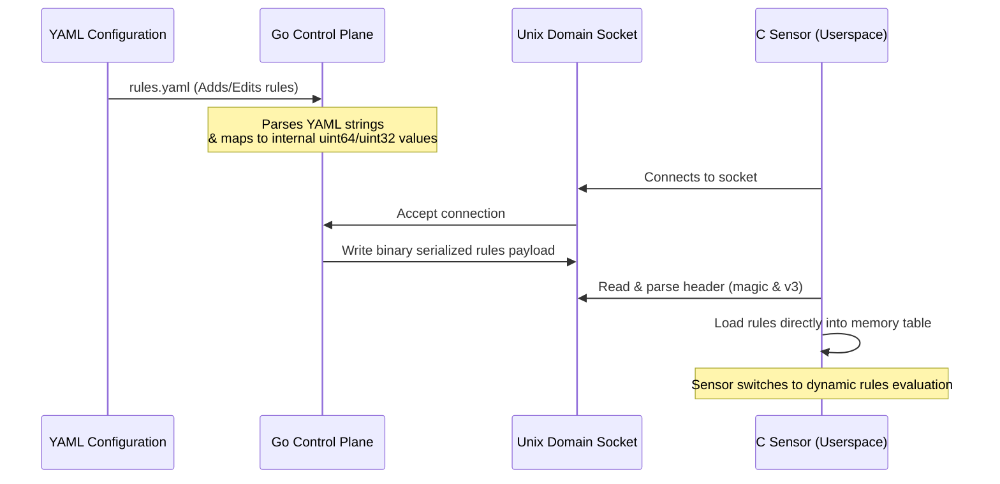

# Dynamic Rule Delivery System

We have designed and implemented a **Dynamic Rule Delivery System** to ensure Kernel Borderlands is never blind to new attacks. Analysts can now add or edit attack-chain rules in a human-readable YAML configuration file, which the Go control plane dynamically parses, serializes into a packed binary format, and delivers to the C sensor at startup or upon connection.

---

## 1. Architecture Flow



---

## 2. Implementation Components

### A. Configuration Spec (`rules.yaml`)
Defined in [rules.yaml](file:///home/emergence/Desktop/kernel-borderlands/kb-control-plane/config/rules.yaml). It lists both generic and signature-like rules:
```yaml
rules:
  - name: reverse_shell_compromised
    description: "Outbound connection followed by shell execution"
    required_flags:
      - KB_EV_OUTBOUND_CONNECT
      - KB_EV_SPAWNED_SHELL
    sequence:
      - KB_SEQ_OUTBOUND_CONNECT
      - KB_SEQ_EXEC_SHELL
    window_seconds: 60
    target_state: KB_STATE_COMPROMISED
    reason: KB_REASON_REVERSE_SHELL_CHAIN
    min_source_state: KB_STATE_BORDERLANDS
```

### B. Go Serialization & Transport (`rules.go`)
Implemented in [rules.go](file:///home/emergence/Desktop/kernel-borderlands/kb-control-plane/internal/ipc/rules.go). 
- Maps YAML strings to internal integer flags (e.g. `KB_EV_OUTBOUND_CONNECT` $\rightarrow$ `1<<32`).
- Packs the rule properties into a `KBWireAttackRule` structure matching the memory layout of C's `kb_wire_attack_rule`.
- Serializes and writes a framed payload to the socket upon sensor connection.

### C. C Memory Allocation & Handshake (`kb_rules.c` / `kbd_sensor.c`)
- **Handshake**: At startup or connection refresh in [kbd_sensor.c](file:///home/emergence/Desktop/kernel-borderlands/kb-core/userspace/sensor/kbd_sensor.c), the C sensor performs a blocking read on the Unix socket to retrieve the rules payload.
- **Dynamic Load**: Copies the wire structs directly into static arrays inside [kb_rules.c](file:///home/emergence/Desktop/kernel-borderlands/kb-core/userspace/behavior/kb_rules.c) and resolves pointer assignments, dynamically substituting the compiled-in rules.
- **Fallback**: If the Go daemon is down or fails to send rules, the sensor transparently falls back to the default compiled-in rules, ensuring high availability.

---

## 3. Validation

- **Go Unit Tests**: Added [rules_test.go](file:///home/emergence/Desktop/kernel-borderlands/kb-control-plane/internal/ipc/rules_test.go) which simulates connection handshakes, verifies YAML parsing, and asserts exact byte-alignment sizes matching C's layout.
  ```bash
  $ go test ./...
  ok  	github.com/pardhuvarmax/kernel-borderlands/kb-control-plane/internal/ipc	0.019s
  ```
- **C Compilation**: Built successfully with zero errors:
  ```bash
  $ make
  clang -g -Wall -I.output ... -o build/kbd_sensor
  ```
