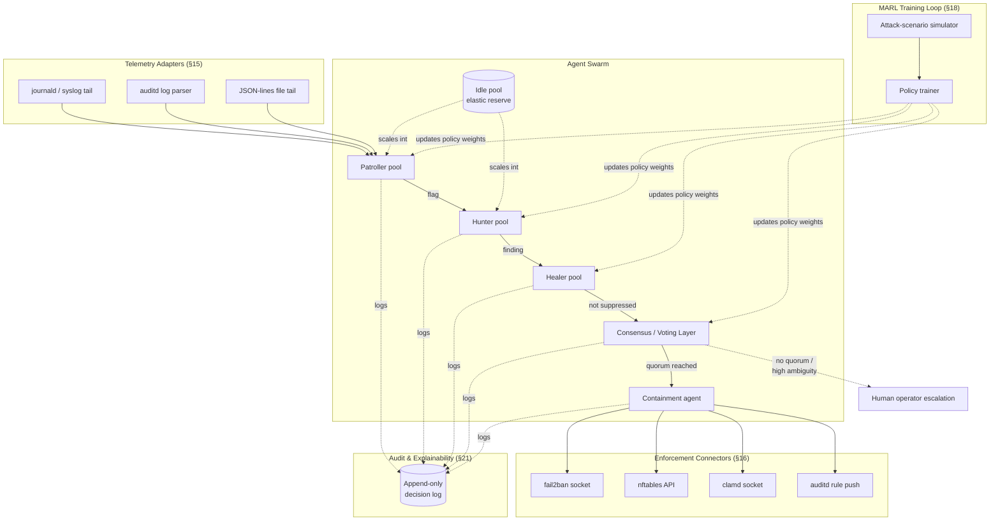
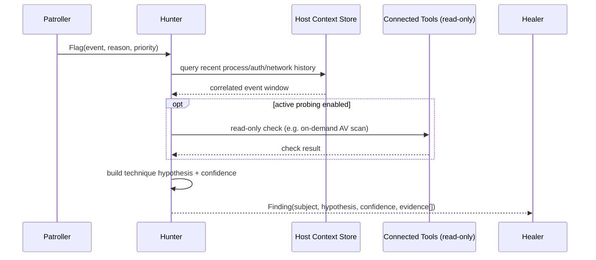
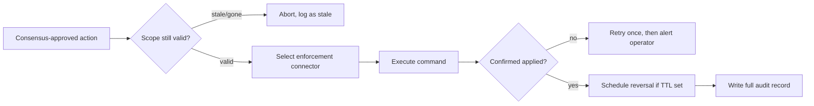
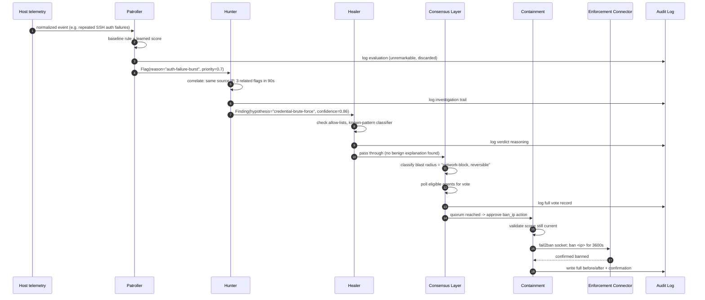
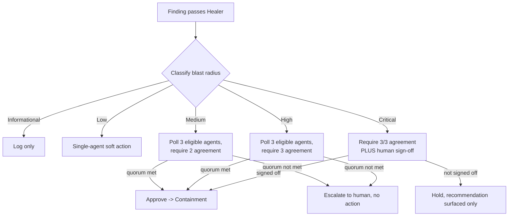
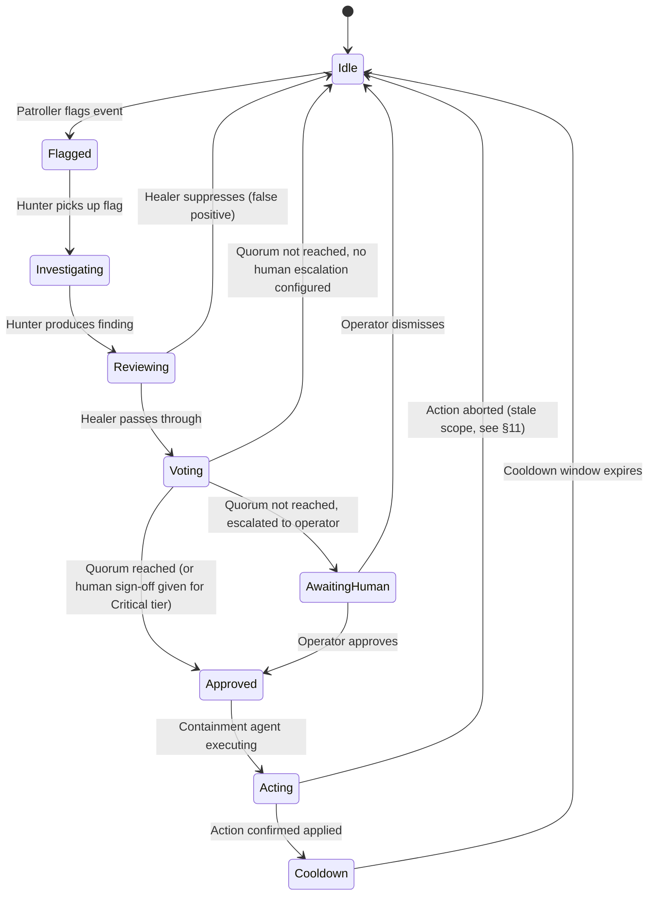
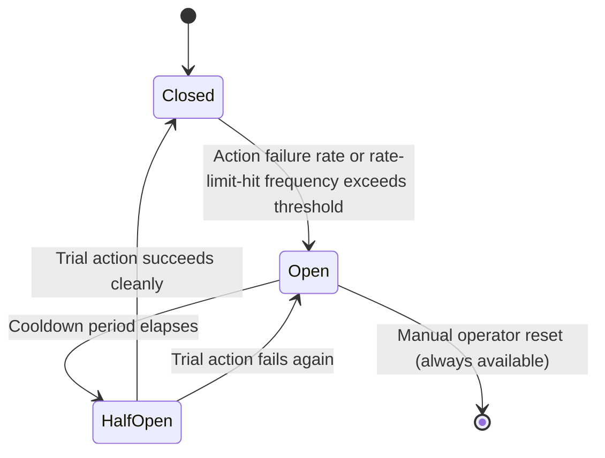
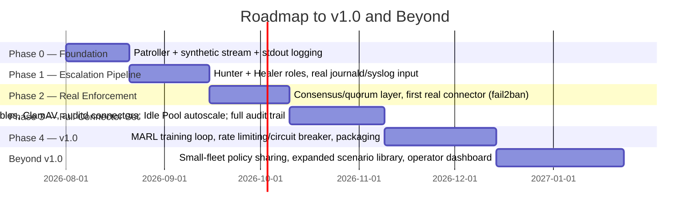
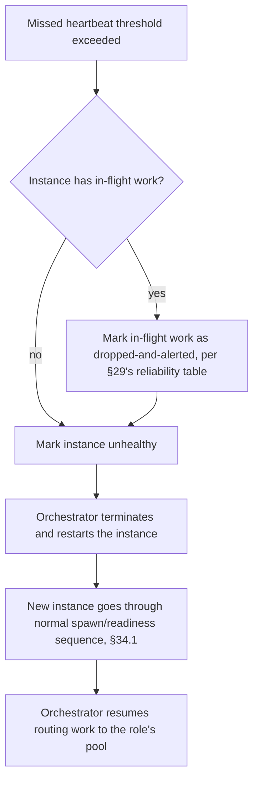

# kb-aads

**Agent-Assisted Defense Swarm — a complete, standalone agentic Linux server security product**

| | |
|---|---|
| **Status** | Full end-to-end project specification — designed to be built, shipped, and used entirely on its own |
| **Track** | Distributed systems / Multi-agent systems / Applied RL |
| **Scope** | Single-host and small-fleet Linux server defense |
| **Audience** | An engineer picking this up cold, with no other context, who needs to build it from scratch |

> **This is a whole product, not a piece of a bigger system.** Everything needed to design, build, test, and ship this on its own — vision, architecture, every agent role in depth, the reinforcement-learning approach, the safety model, the tech stack, and a phased roadmap to v1.0 — is contained in this one document. kb-aads owns its own telemetry inputs (log/journal tailing) and its own enforcement outputs (direct connectors to standard host security tools). It does not assume any other service, daemon, or platform exists. Read this document, and you can start writing code today.

---

## Table of Contents

1. [Executive Summary](#1-executive-summary)
2. [Vision & Mission](#2-vision--mission)
3. [Problem Statement & Motivation](#3-problem-statement--motivation)
4. [Landscape & Prior Art](#4-landscape--prior-art)
5. [Design Philosophy: Specialization Over One Generalist Agent](#5-design-philosophy-specialization-over-one-generalist-agent)
6. [Glossary of Terms](#6-glossary-of-terms)
7. [High-Level Architecture Overview](#7-high-level-architecture-overview)
8. [Agent Role Deep-Dive: Patroller](#8-agent-role-deep-dive-patroller)
9. [Agent Role Deep-Dive: Hunter](#9-agent-role-deep-dive-hunter)
10. [Agent Role Deep-Dive: Healer](#10-agent-role-deep-dive-healer)
11. [Agent Role Deep-Dive: Containment](#11-agent-role-deep-dive-containment)
12. [Agent Role Deep-Dive: Idle Pool](#12-agent-role-deep-dive-idle-pool)
13. [Escalation Pipeline Walkthrough](#13-escalation-pipeline-walkthrough)
14. [Consensus & Voting Mechanism](#14-consensus--voting-mechanism)
15. [Built-in Telemetry Adapters](#15-built-in-telemetry-adapters)
16. [Built-in Enforcement Connectors](#16-built-in-enforcement-connectors)
17. [Agent Communication Model](#17-agent-communication-model)
18. [Multi-Agent Reinforcement Learning: Training Loop Design](#18-multi-agent-reinforcement-learning-training-loop-design)
19. [Reward Signal Design & Labeled Outcome Feedback](#19-reward-signal-design--labeled-outcome-feedback)
20. [Hard Safety Rules Outside the Learned Policy](#20-hard-safety-rules-outside-the-learned-policy)
21. [Decision Explainability & Audit Trail](#21-decision-explainability--audit-trail)
22. [Swarm State Machine](#22-swarm-state-machine)
23. [Scenario Simulation, Attack-Lab & Testing Strategy](#23-scenario-simulation-attack-lab--testing-strategy)
24. [Tech Stack & Rationale](#24-tech-stack--rationale)
25. [Repository Layout & Build System](#25-repository-layout--build-system)
26. [Configuration Reference](#26-configuration-reference)
27. [Security & Safety Threat Model](#27-security--safety-threat-model)
28. [Rate-Limiting & Circuit-Breaking Autonomous Actions](#28-rate-limiting--circuit-breaking-autonomous-actions)
29. [Performance, Scalability & Reliability](#29-performance-scalability--reliability)
30. [Observability, Deployment & Roadmap to v1.0 and Beyond](#30-observability-deployment--roadmap-to-v10-and-beyond)
31. [Full Worked Case Study: Anatomy of One Incident](#31-full-worked-case-study-anatomy-of-one-incident)
32. [Deep Dive: Hunter State/Action/Observation Space & Reward Worked Example](#32-deep-dive-hunter-stateactionobservation-space--reward-worked-example)
33. [Threat Scenario Library Reference](#33-threat-scenario-library-reference)
34. [Agent Lifecycle Management](#34-agent-lifecycle-management)
35. [Human-in-the-Loop Escalation, Deep Dive](#35-human-in-the-loop-escalation-deep-dive)
36. [Troubleshooting & Operator FAQ](#36-troubleshooting--operator-faq)

---

## 1. Executive Summary

`kb-aads` is a self-contained, multi-agent security system for Linux servers. It watches a host (or a small fleet of hosts) through its own built-in telemetry adapters, reasons about what it sees through a swarm of specialized software agents with distinct roles, and — when warranted, and only after the right level of internal agreement — takes real enforcement action through its own built-in connectors to standard, already-trusted Linux security tools (firewall rule engines, brute-force banning tools, antivirus daemons, audit subsystems).

It is not a rules engine with an AI label stapled on, and it is not a single large model asked to "decide everything." It is an explicitly decomposed system: cheap, always-on monitoring hands off to more expensive, targeted investigation, which hands off to noise suppression, which — only for genuinely consequential actions — requires multiple independent agents to agree before anything happens to the host. Every step of that pipeline is logged in a form a human can read and question after the fact.

The system is trained and refined using multi-agent reinforcement learning against simulated attack scenarios, but the parts of the system that could cause real damage if misjudged — quorum requirements, blast-radius classification, hard "never automatically do X" rules — live in code the learning process cannot touch. This document treats that separation as the single most important architectural decision in the whole system, and returns to it repeatedly.

Everything described here — the telemetry input layer, the agent roles, the consensus mechanism, the RL training loop, the enforcement connectors — is scoped to be built, tested, and operated as one project, with no dependency on any other software system beyond the standard Linux security tools it is designed to drive (which are assumed to already be installed, exactly as a human operator would have them).

## 2. Vision & Mission

**Vision:** a Linux server that defends itself with the same judgment, caution, and explainability a competent on-call security engineer would apply — continuously, without needing that engineer awake at 3 a.m., and without needing an army of engineers to scale to a fleet.

**Mission, concretely:**

- Reduce the volume of security signal that requires human attention by an order of magnitude, without reducing the coverage of what actually gets investigated.
- Make automated response *safe enough to trust* by construction — not by hoping the model never makes a consequential mistake, but by making consequential mistakes structurally require multiple points of failure (quorum, hard safety rules, rate limits) before they can cause real damage.
- Make every autonomous action legible after the fact. An operator reviewing an incident three weeks later should be able to reconstruct exactly what the swarm saw, what each agent concluded, how the vote went, and what was actually executed on the host — with the same fidelity as if a human had written an incident report.
- Ship as a real, installable product from day one — not a research prototype that only works against canned demo data.

**Non-goals**, stated explicitly because they shape scope decisions throughout this document:

- kb-aads is not a replacement for the underlying security tools it drives (firewalls, AV engines, audit subsystems). It is a decision-making and coordination layer on top of them.
- kb-aads is not a general-purpose autonomous agent framework. Its agent roles are fixed and specialized to the security-operations domain; it is not designed to be repurposed for unrelated automation tasks.
- kb-aads does not aim to eliminate human oversight. It aims to make human oversight scale — humans review the decisions and the audit trail, not every individual raw event.

## 3. Problem Statement & Motivation

A modern Linux server, even a modestly busy one, produces a volume of security-relevant signal that outstrips what a human team can individually triage: process creation and exit, network connection attempts, authentication successes and failures, file access to sensitive paths, package and configuration changes, and the outputs of whatever detection tools are already running (intrusion detection, antivirus scans, audit subsystems). Most of this signal is benign. A small fraction is not. Telling the two apart reliably, in real time, at volume, is the entire problem.

Two failure modes bound this problem on either side:

**Failure mode A — no automation (pure alert-and-wait):** every anomaly becomes a ticket or a page. Humans experience alert fatigue, start ignoring or triaging superficially, and the mean time to respond to a genuine incident grows with the volume of noise, not shrinks. This is the default state of most security tooling deployments today, and it is why "we had an alert for that" is such a common postmortem line — the alert existed, but it was one of thousands, and nobody looked at it in time.

**Failure mode B — naive full automation (auto-block on anomaly):** any sufficiently sensitive threshold-based auto-response system eventually blocks something it shouldn't — a legitimate deploy that looks like a burst of file writes, a support engineer's SSH session that looks like brute-forcing because they fat-fingered a password three times, a monitoring probe that looks like a port scan. The system causes outages in the name of preventing them, and operators respond by disabling automated response entirely, which puts you back in failure mode A but with less trust in the tooling.

`kb-aads` targets the middle path deliberately: **automate confidently on low-risk, high-confidence decisions; require increasing scrutiny (deeper investigation, then consensus, then possibly human escalation) as either the risk or the ambiguity of a decision rises.** This is not a novel insight in security operations generally — it's how a well-run human SOC (Security Operations Center) already works, with junior analysts triaging, senior analysts investigating escalations, and genuinely consequential actions requiring sign-off. kb-aads's specific contribution is making that same shape work as software, at machine speed, without needing a 24/7 staffed team to run it.

> A system that never causes a false-positive outage but also never catches anything real is not "safe" — it's useless with better PR. A system that catches everything but breaks the box weekly is not "effective" — it's a liability. The metric that matters is the combination: true-positive catch rate at an acceptably low false-positive *consequential-action* rate. Everything in this document is in service of that one number.

## 4. Landscape & Prior Art

kb-aads sits at the intersection of three existing fields, and borrows deliberately from each rather than reinventing any of them from a blank page.

| Field | What it contributes | What kb-aads does differently |
|---|---|---|
| **SOAR** (Security Orchestration, Automation and Response) platforms | The core operational shape: ingest signal, investigate, decide, act, log — with human-in-the-loop escalation paths. Mature, well-understood in industry. | Classic SOAR tooling is almost entirely static-playbook-driven ("if alert type X, run playbook Y"). kb-aads replaces static playbooks with agents whose judgment is refined by reinforcement learning against simulated outcomes, while keeping the same auditable, staged shape SOAR practitioners already trust. |
| **Multi-agent reinforcement learning research** (e.g. Ray RLlib and the broader MARL literature) | Algorithms and infrastructure for training multiple interacting policies against shared or competing objectives, credit assignment across agents, and scalable rollout/training infrastructure. | kb-aads applies MARL to a narrow, safety-critical, well-specified domain (host security triage) rather than open-ended or competitive-game domains, and — critically — keeps the highest-stakes decisions (whether an action is even eligible to run) outside the learned policy entirely (see [§20](#20-hard-safety-rules-outside-the-learned-policy)). |
| **Attack simulation / red-team frameworks** (MITRE ATT&CK-based scenario generation, attack-lab tooling) | A structured taxonomy of adversary tactics and techniques, and tooling to generate realistic attack scenarios for testing detection and response. | kb-aads consumes ATT&CK-structured scenarios as its primary training and evaluation data source (see [§23](#23-scenario-simulation-attack-lab--testing-strategy)), treating "did the swarm correctly triage this specific ATT&CK technique" as a first-class, trackable metric rather than an afterthought. |

**Adjacent systems worth knowing about**, for calibration rather than direct reuse:

- **Wazuh / OSSEC** — mature open-source host intrusion detection with centralized management; a good reference for the shape of telemetry collection and rule-based alerting, though it does not employ learned multi-agent decision-making.
- **Falco (CNCF)** — kernel/eBPF-based runtime security detection; a plausible *upstream* telemetry source for a kb-aads deployment (see [§15](#15-built-in-telemetry-adapters)) even though it is not itself part of this project.
- **Classic IDS/IPS (Suricata, Snort)** — signature and anomaly-based network detection; another plausible upstream telemetry source, and their alert formats are worth normalizing kb-aads's own JSON-lines adapter around.

## 5. Design Philosophy: Specialization Over One Generalist Agent

The single largest design decision in kb-aads, made early and held to throughout, is **decomposition into narrow, specialized agent roles instead of one generalist decision-making agent (or model call).** The reasoning:

1. **Cost matching.** Most telemetry is benign and needs only a cheap first pass. Deploying an expensive, deep-investigation-capable process against every event is wasteful; deploying a cheap shallow check against a genuinely ambiguous, high-stakes situation is dangerous. Specialization lets cost scale with actual need.
2. **Auditability.** "The model decided to block this IP" is a much weaker audit trail than "the Patroller flagged unusual connection frequency; the Hunter correlated it against three related SSH attempts and a prior failed-auth spike; the Healer found no legitimate-traffic pattern matching this signature; three of three eligible agents voted to contain." Specialized roles produce a decision trail that maps onto how a human SOC already documents incidents.
3. **Independent failure domains.** A bug or blind spot in the Hunter's investigation logic does not automatically corrupt the Healer's false-positive judgment or the Containment agent's enforcement logic, because they are separate code paths reasoning over separate, narrower questions. A single generalist agent making an end-to-end judgment call has no such separation — one bad reasoning step compounds through the whole decision.
4. **Consensus needs multiple independent opinions to mean anything.** A voting mechanism where all "voters" share the same underlying reasoning process is theater, not a safety mechanism — correlated errors defeat the purpose of a quorum. Specialized agents, built around genuinely different signals and different questions, give quorum requirements real teeth.
5. **Incremental buildability.** Each role can be built, tested, and improved independently and shipped in stages (see the phased roadmap in [§30](#30-observability-deployment--roadmap-to-v10-and-beyond)) — a Patroller-only v0.1 is already useful, which a monolithic all-or-nothing generalist agent could never be.

> Compare to a single large model taking every alert as input and outputting a decision directly. It's simpler to build a first version of. It is a worse system: it makes cost/depth tradeoffs invisible and unmanaged, it produces a decision trail that is one paragraph of model output rather than a structured multi-party record, and any single flaw in its judgment applies uniformly to every decision it ever makes, with no independent check.

## 6. Glossary of Terms

| Term | Definition |
|---|---|
| **Agent** | A software process (in this system, a Ray actor — see [§17](#17-agent-communication-model)) with a narrow, well-defined job, holding a policy (rule-based, learned, or hybrid) that maps observed state to a decision or action. |
| **Swarm** | The full collective of running agent instances across all roles, plus the coordination layer (consensus, escalation pipeline) that connects them. |
| **Role** | One of the five agent job categories: Patroller, Hunter, Healer, Containment, Idle. Many agent *instances* can exist per role. |
| **Telemetry** | Raw or lightly-structured security-relevant event data flowing into the swarm — process events, auth events, network events, tool alerts. |
| **Finding** | A structured conclusion an agent produces about a piece of telemetry or an investigation — includes a confidence score and supporting evidence references. |
| **Escalation** | The act of one agent role handing a finding to the next role in the pipeline for deeper scrutiny (Patroller → Hunter → Healer). |
| **Blast radius** | A classification of how much damage an *incorrect* execution of a given action type could cause (see [§14](#14-consensus--voting-mechanism)). Drives how much consensus/scrutiny an action requires before it can run. |
| **Quorum** | The minimum number (or fraction) of eligible agents that must independently agree before a consequential action is permitted to execute. |
| **Consensus round** | One instance of the voting process: a proposed action, the set of eligible voting agents, their individual votes, and the outcome. |
| **MARL** | Multi-Agent Reinforcement Learning — training multiple interacting agent policies using reward signals, as opposed to hand-written rule thresholds. |
| **Reward shaping** | The practice of designing a reward function that guides an RL policy toward genuinely desired behavior, avoiding reward signals that are technically maximized by undesired shortcuts. |
| **Hard safety rule** | A rule enforced in ordinary, non-learned code that no training process can override or erode — e.g., "never auto-contain without quorum," "never exceed N contain actions per hour without human sign-off." |
| **Enforcement connector** | A built-in module translating a kb-aads containment decision into a real command against a specific host security tool (fail2ban, nftables, ClamAV, etc.), using that tool's native API/socket where one exists. |
| **Telemetry adapter** | A built-in module that reads a specific host-native data source (journald, syslog, an auditd log, a generic JSON-lines file) and normalizes it into kb-aads's internal event schema. |
| **Cooldown** | A mandatory post-action period during which the swarm suppresses further automatic action against the same subject, to prevent flapping/repeated action loops. |
| **Idle pool** | Reserve agent capacity (of any role) kept warm but unassigned, scaled up when incoming load exceeds what currently-active agents can handle. |

## 7. High-Level Architecture Overview



Everything inside the dashed "Swarm" boundary is this project's own code, running as Ray actors within a single process tree (single-node in the default deployment; horizontally scalable across a small cluster if needed — see [§29](#29-performance-scalability--reliability)). Everything in "Inputs" and "Outputs" is also this project's own code — thin, focused adapter/connector modules — talking to standard, independently-installed Linux tooling. Nothing in this diagram requires an external service that isn't either the OS itself or a standard security tool assumed to already be present on the host.

## 8. Agent Role Deep-Dive: Patroller

**Job:** be the first, cheapest pass over every piece of incoming telemetry. Decide, quickly and inexpensively, whether something is unremarkable (the overwhelming majority of events) or worth a Hunter's more expensive attention.

**Inputs:** the normalized event stream from the telemetry adapters (§15) — process exec/exit, auth success/failure, network connection attempts, file access to watched paths, and any structured alerts already produced by upstream tools (e.g., an auditd rule match or a Suricata alert ingested via the JSON-lines adapter).

**Outputs:** either silence (event judged unremarkable, logged at low verbosity and discarded from the hot path) or a **flag**: a structured escalation to the Hunter pool containing the triggering event, a preliminary reason code, and a lightweight priority score.

**Decision logic shape:** a combination of (a) hand-written baseline heuristics — rate thresholds, known-bad indicators, first-seen-process/first-seen-connection novelty checks — and (b) a lightweight learned scoring model (trained via the MARL loop, §18) that ranks how "Hunter-worthy" an event looks, given recent host context (recent process tree, recent auth history, time-of-day baseline). The heuristics exist from day one (Phase 0, §30) so the system is useful before any training has happened; the learned scorer is layered on top later to reduce both missed escalations and wasted Hunter cycles on obviously-benign events.

**Why cheap matters here specifically:** a Patroller instance runs against effectively every event on the host. Its per-event cost budget should be low single-digit milliseconds at most — no deep correlation queries, no expensive external calls. It is allowed to be wrong in the direction of over-flagging (the Hunter and Healer downstream exist specifically to correct that) but not in the direction of silently missing genuinely suspicious activity; asymmetric cost of the two error types should be reflected explicitly in its reward shaping (§19).

```python
# Illustrative sketch, not a full implementation.
class PatrollerAgent:
    def __init__(self, baseline_rules: list[Rule], scorer: LearnedScorer):
        self.baseline_rules = baseline_rules
        self.scorer = scorer

    def on_event(self, event: NormalizedEvent, host_context: HostContext) -> Flag | None:
        rule_hit = self._check_baseline_rules(event, host_context)
        score = self.scorer.score(event, host_context)

        if rule_hit or score >= self.flag_threshold:
            return Flag(
                event=event,
                reason=rule_hit.reason if rule_hit else "learned-score-threshold",
                priority=max(rule_hit.priority if rule_hit else 0, score),
            )
        return None
```

**Scaling model:** one Patroller instance per host is often sufficient for a single-server deployment; a fleet deployment runs one Patroller per host (co-located, low-latency access to that host's own `/proc` and log streams) reporting upward, rather than one centralized Patroller for the whole fleet — see [§29](#29-performance-scalability--reliability) for why locality matters here.

## 9. Agent Role Deep-Dive: Hunter

**Job:** take a Patroller's flag seriously and actually investigate it — correlate across time, across related processes/hosts, and pull in additional context the Patroller didn't have budget to gather — then produce a structured **finding** with an explicit confidence level and cited evidence.

**Inputs:** the triggering flag from a Patroller, plus on-demand access to: recent process-tree history, recent authentication history for the relevant user/source, recent network connection history for the relevant process/host, and (if configured) results from directly invoking a connected tool for more information (e.g., asking ClamAV to scan a specific file the Patroller flagged, rather than waiting for a scheduled scan).

**Outputs:** a **finding**: `{subject, technique_hypothesis (loosely mapped to an ATT&CK-style category), confidence, evidence[], recommended_severity}`, handed to a Healer.

**Investigation strategies:**

- **Temporal correlation** — is this event part of a burst of related events (e.g., repeated auth failures followed by one success, several new outbound connections from a process that's never made one before)?
- **Cross-entity correlation** — does this event relate to other recent flags against the same user, process lineage, or remote address?
- **Baseline deviation** — how far outside this specific host's/user's/process's normal behavioral envelope is this, not just outside a generic global baseline?
- **Active probing** (optional, configurable, off by default for anything with side effects) — invoking a read-only check against a connected tool (an on-demand AV scan of a specific file) to gather more evidence before concluding.



**Cost budget:** materially higher than the Patroller's — this agent is allowed to take hundreds of milliseconds to a few seconds, since it only runs against the (small) subset of events the Patroller escalated. Its own cost is a lever for tuning: raising the Patroller's flag threshold trades Hunter load for escalation coverage, and that tradeoff should be an explicit, monitored knob (see [§26](#26-configuration-reference)), not an emergent accident.

## 10. Agent Role Deep-Dive: Healer

**Job:** be the system's dedicated skeptic. Take a Hunter's finding and actively look for reasons it's a false positive, before it's allowed to reach the consensus/containment stage. This role exists because the single biggest threat to the system's long-term usefulness is not missed detections — it's a false-positive rate high enough that operators stop trusting (and eventually disable) autonomous action.

**Inputs:** a Hunter's finding, plus access to known-legitimate-pattern references: allow-lists (deploy windows, known service accounts, known maintenance IP ranges), and a learned false-positive classifier trained specifically on labeled historical findings (see [§19](#19-reward-signal-design--labeled-outcome-feedback)).

**Outputs:** one of:
- **Suppress** — finding judged a false positive; logged, but does not proceed to consensus. (Still fully retained in the audit trail — suppression is not deletion.)
- **Downgrade** — finding is plausible but low-confidence; logged and available for human review, but does not trigger automatic consensus voting.
- **Pass through** — finding stands; proceeds to the Consensus/Voting Layer.

| Healer verdict | What happens next | Typical trigger |
|---|---|---|
| Suppress | Logged only, no further action | Matches a known-legitimate pattern (deploy window, allow-listed maintenance IP, expected service-account behavior) |
| Downgrade | Logged, surfaced in operator dashboard, no auto-vote | Plausible but low Hunter confidence, or partial pattern match to a known-benign case |
| Pass through | Proceeds to Consensus (§14) | No matching benign explanation found; confidence above pass-through threshold |

> Why a *separate* agent role rather than folding false-positive judgment into the Hunter? Because the Hunter's job is to build the strongest case *for* a hypothesis being real — mixing "build the case" and "actively try to tear the case down" into one agent's reasoning process tends to produce motivated reasoning in one direction or the other. Splitting them means the finding that reaches consensus has survived a genuinely adversarial internal review, not just one agent's unchallenged conclusion.

**False-positive classifier training:** every past Consensus/Containment outcome, once its real-world correctness is later confirmed or refuted (by an operator marking it, or by an automated "did anything actually break" signal — see §19), becomes a labeled training example for this classifier. This is the primary mechanism by which the system's false-positive rate should trend downward over its operational lifetime rather than staying static.

## 11. Agent Role Deep-Dive: Containment

**Job:** once a decision to act has cleared consensus (§14), translate that decision into an actual, correctly-scoped command against the right enforcement connector (§16), execute it, confirm it took effect, and record the result.

**Inputs:** a consensus-approved action request: `{action_type, subject, scope, requested_by (which findings/votes), ttl (if temporary)}`.

**Responsibilities beyond "just execute the command":**

1. **Scope validation** — confirm the action's target is exactly what the finding chain identified (right PID, right IP, right file path) and hasn't gone stale (e.g., the flagged process has already exited naturally — executing a now-meaningless kill is not just wasted, it can be actively confusing in the audit trail).
2. **Connector selection** — route to the correct enforcement connector for the action type and the tools actually available on this host (see §16's capability-discovery note).
3. **Execution with confirmation** — after issuing the command, verify it actually took effect (e.g., after a `block_ip` call, confirm the rule is present in the ruleset) rather than trusting a non-error return code alone.
4. **Reversibility bookkeeping** — for any action with a natural expiry (a temporary IP ban, a time-boxed process suspension), schedule and track the reversal, and make manual early reversal a first-class, always-available operator action.
5. **Result logging** — write the full before/after state and outcome to the audit trail (§21).



**Failure handling:** if the underlying tool rejects the command (e.g., nftables syntax error, a socket connection refused because the daemon isn't running), that failure must propagate visibly — surfaced to the operator-facing interface and written to the audit trail as a failed action, never silently swallowed as if nothing happened. A containment agent that fails quietly is worse than no containment agent at all, because operators will believe protection exists when it doesn't.

## 12. Agent Role Deep-Dive: Idle Pool

**Job:** hold reserve agent capacity — instances of any role, pre-initialized and warm but not currently assigned work — that can be elastically assigned into the Patroller or Hunter pools when incoming load spikes (most commonly: during an actual active incident, which is exactly when Hunter-worthy events multiply and the system most needs not to fall behind).

**Why this role exists as a distinct concept rather than "just autoscale the Hunter pool":** cold-starting a new Hunter instance (loading its learned-model weights, connecting to the host-context store, warming any caches) has non-trivial latency. Keeping a pool of already-initialized-but-idle agent processes and reassigning them is materially faster than spinning up new processes from nothing at the exact moment load is spiking — the worst possible time to be slow.

**Scaling policy, illustrative:**

```yaml
idle_pool:
  min_reserve: 2          # always-warm idle agents, even at rest
  max_reserve: 12         # ceiling on reserve capacity
  scale_trigger:
    hunter_queue_depth_above: 20     # pending Hunter-worthy flags
    sustained_for_seconds: 10
  scale_step: 4            # agents activated per scaling event
  cooldown_after_scale_seconds: 60   # avoid thrashing
```

**Relationship to autoscaling infrastructure:** in a single-node deployment, "scaling" the idle pool means activating already-spawned-but-dormant Ray actors on the same machine, bounded by the host's own CPU/memory headroom. In a small-cluster deployment, it can additionally mean the Ray cluster provisioning new worker nodes — but that's an infrastructure-layer concern the Idle Pool's scaling *policy* stays agnostic to; see [§29](#29-performance-scalability--reliability).

## 13. Escalation Pipeline Walkthrough

Putting §8–§12 together, here is one event's full journey through the swarm, end to end, in the common case where it turns out to be a real, consequential finding:



Every arrow in this diagram that touches the audit log is mandatory, not optional instrumentation — see [§21](#21-decision-explainability--audit-trail). The pipeline is designed so that at *any* stage, the answer to "why did/didn't this proceed" is reconstructable from what got logged at that stage alone, without needing to infer it from side effects.

## 14. Consensus & Voting Mechanism

Not every action deserves the same scrutiny. A finding that results in "log this and downgrade its priority" needs none; a finding that results in "isolate this host from the network" needs the strongest available internal agreement before it happens. Consensus requirements scale with **blast radius**.

| Blast radius class | Example actions | Quorum requirement | Rationale |
|---|---|---|---|
| **Informational** | Log-only flag, priority tag, dashboard annotation | None — any single agent can do this | Fully reversible, zero external effect, cheap to be wrong about |
| **Low** | Rate-limit a specific connection, soft-alert to operator | Single Hunter+Healer agreement (no formal vote) | Reversible, narrowly scoped, low cost if wrong |
| **Medium** | Temporary IP ban, quarantine a single file, kill a single non-critical process | Quorum: 2 of 3 eligible agents (Hunter, Healer, and a second independently-initialized Hunter instance if available) | Real but bounded and largely reversible effect; worth a second independent opinion |
| **High** | Persistent firewall rule change, account lockout, process-tree-wide containment | Quorum: 3 of 3, plus mandatory cooldown before any repeat action against the same subject | Broader or harder-to-reverse effect; errors here are genuinely costly |
| **Critical** | Host network isolation, service shutdown | Quorum: 3 of 3 **plus** human operator sign-off required — the swarm can *recommend*, never *unilaterally execute* | Blast radius large enough that full autonomy is not an acceptable default, regardless of confidence |



**Vote eligibility:** an agent is eligible to vote on a given finding only if it has independently reasoned about that finding's evidence (not merely rubber-stamping another agent's conclusion) — practically, this means the Hunter that produced the finding, the Healer that reviewed it, and (where the blast-radius class requires a third opinion) a second Hunter instance given the same raw evidence independently, without seeing the first Hunter's conclusion, to avoid anchoring bias between agent instances.

**Blast-radius classification itself is a hard-coded lookup table, not a learned judgment** — see [§20](#20-hard-safety-rules-outside-the-learned-policy) for why.

## 15. Built-in Telemetry Adapters

kb-aads ships with its own input layer. No external event bus, message broker, or third-party collector agent is required — these adapters read data sources already present on any standard Linux server.

| Adapter | Reads from | Notes |
|---|---|---|
| **journald tail** | `journalctl --follow --output=json`, or direct sd-journal API bindings | Primary adapter on systemd-based distributions; captures auth, service, and kernel-message logs uniformly |
| **syslog tail** | `/var/log/syslog`, `/var/log/auth.log` or distro-equivalent paths, tailed with rotation-aware following | Fallback/complement for non-systemd or additionally-configured syslog destinations |
| **auditd log parser** | `ausearch`/`auparse` output or direct read of the audit log, parsing structured audit records | Captures fine-grained syscall/file-access audit events when auditd rules are configured on the host |
| **JSON-lines file tail** | Any file emitting one JSON object per line | Generic adapter for ingesting structured alerts from other already-installed tools (e.g. Suricata's `eve.json`, a Falco JSON output stream) without kb-aads needing bespoke per-tool integration for every possible upstream source |

**Normalization:** every adapter converts its native format into one shared internal event schema before it ever reaches a Patroller — this is what lets Patroller logic stay source-agnostic:

```python
@dataclass
class NormalizedEvent:
    timestamp: float
    source_adapter: str          # "journald" | "syslog" | "auditd" | "jsonlines"
    event_category: str          # "auth" | "process" | "network" | "file" | "tool-alert"
    subject: str                 # user, pid, ip, or file path, depending on category
    raw: dict                    # original record, preserved for drill-down
    host: str
```

**Design principle:** adapters are pure translators. They do not filter, score, or make any judgment call about what's interesting — that's the Patroller's job, entirely. Keeping this boundary strict means adding a new adapter never risks silently changing decision behavior, and testing an adapter is purely a format-correctness question, independent of testing agent judgment.

## 16. Built-in Enforcement Connectors

Symmetric to §15: kb-aads ships its own output layer, with direct connectors to standard, already-installed Linux security tools, preferring each tool's native socket/API over shelling out to its CLI wherever one exists (faster, and immune to breaking when help text or output formatting changes).

| Connector | Target tool | Interface used | Actions supported |
|---|---|---|---|
| **Firewall** | `nftables` (preferred) / `iptables` (fallback) | nftables JSON API where available; CLI invocation with parsed structured output otherwise | `block_ip`, `unblock_ip`, `rate_limit_ip` |
| **Brute-force ban** | `fail2ban` | fail2ban's own control socket (`/var/run/fail2ban/fail2ban.sock`) | `ban_ip`, `unban_ip`, `query_banned` |
| **Antivirus/malware scan** | `ClamAV` | `clamd` daemon socket | `scan_file` (on-demand, used by Hunter for active probing too — §9), `quarantine_file` |
| **Audit rules** | `auditd` | `auditctl` rule push / `ausearch` query | `add_watch_rule`, `query_audit_events` |
| **Process control** | Host OS directly (no third-party tool) | `kill`/`SIGSTOP`/cgroup freeze via standard syscalls | `suspend_process`, `kill_process` |

```python
# Illustrative connector interface — every connector implements this shape.
class EnforcementConnector(Protocol):
    def capability_check(self) -> ConnectorCapabilities:
        """Report whether the underlying tool is installed/reachable and what it supports."""

    def execute(self, action: ActionRequest) -> ActionResult:
        """Apply the action, return confirmed before/after state."""

    def reverse(self, action_id: str) -> ActionResult:
        """Undo a previously-applied reversible action."""
```

**Capability discovery:** at startup (and periodically thereafter), each connector reports whether its target tool is actually installed and reachable on this host. The Containment agent consults this before ever selecting a connector — attempting to route a `ban_ip` action to a fail2ban connector on a host where fail2ban isn't installed should fail fast and clearly at routing time, not opaquely at execution time.

**Fallback ordering:** where a capability is offered by more than one tool (e.g., `block_ip` via either nftables or iptables), the connector layer picks the best available option per host rather than requiring a specific tool — this is what lets the same kb-aads deployment work correctly across hosts with different tool sets installed.

## 17. Agent Communication Model

**Agent-to-agent (within the swarm):** native, in-process actor calls, using a distributed-actor runtime (Ray actors is the reference choice — see [§24](#24-tech-stack--rationale)) rather than a separate message broker (Kafka, RabbitMQ, NATS, etc.).

**Why not a message bus:** the investigate→vote→act loop is latency-sensitive and tightly coupled — a Hunter handing a finding to a Healer, and a Healer handing a pass-through finding into a consensus round, benefits from direct, low-latency actor calls with straightforward request/response and failure semantics. Introducing a message broker in the middle adds an operational dependency (a broker to run, monitor, and keep available), adds latency, and adds a whole class of "message delivered but actor state stale" bugs that simply don't exist with direct actor calls in a single logical process tree. For a system whose entire value proposition is fast, low-friction coordination, that tradeoff isn't close.

```python
# Illustrative Ray actor sketch.
import ray

@ray.remote
class HunterActor:
    def __init__(self, model_weights_path: str):
        self.scorer = load_model(model_weights_path)

    def investigate(self, flag: Flag, host_context: HostContext) -> Finding:
        evidence = self._correlate(flag, host_context)
        confidence = self.scorer.evaluate(flag, evidence)
        return Finding(subject=flag.event.subject, evidence=evidence, confidence=confidence)

# Coordinator code elsewhere in the swarm:
hunter = HunterActor.remote(model_weights_path="models/hunter_v3.pt")
finding_ref = hunter.investigate.remote(flag, host_context)
finding = ray.get(finding_ref)
```

**Swarm-to-host boundary:** the only I/O the swarm's internal actor graph performs outside itself is through the telemetry adapters (in, §15) and enforcement connectors (out, §16) — both owned by this project, both with narrow, well-typed interfaces. There is no other network-facing surface in the default single-host deployment; a multi-host fleet deployment adds one additional, explicitly scoped concern (cross-host actor communication over the Ray cluster's own transport), discussed in [§29](#29-performance-scalability--reliability).

## 18. Multi-Agent Reinforcement Learning: Training Loop Design

**What's learned vs. what isn't:** the *scoring and judgment* components of Patroller, Hunter, and Healer (how novel/suspicious does this look, how confident is this hypothesis, how likely is this a false positive) are learned policies, refined over time via MARL. The *control-flow* around them (who gets to vote, how many votes are required, what blast-radius class an action type belongs to, hard prohibitions) is not learned — see [§20](#20-hard-safety-rules-outside-the-learned-policy).

```mermaid
flowchart LR
    subgraph Sim["Attack-Scenario Simulator (§23)"]
        SC[ATT&CK-structured<br/>scenario library]
        REPLAY[Replay engine:<br/>synthetic telemetry stream]
    end

    subgraph Rollout["Rollout"]
        ENV[Simulated host environment]
        SWARM[Swarm under training<br/>(current policy weights)]
    end

    subgraph Learn["Learning"]
        REWARD[Reward computation (§19)]
        UPDATE[Policy gradient update<br/>per agent role]
        REPLAYBUF[(Experience replay buffer)]
    end

    SC --> REPLAY --> ENV
    ENV <--> SWARM
    SWARM --> REWARD
    REWARD --> REPLAYBUF
    REPLAYBUF --> UPDATE
    UPDATE -->|new weights| SWARM
```

**Training loop, step by step:**

1. Draw a scenario (or a mix of benign-baseline-only and injected-attack scenarios) from the scenario library (§23).
2. Replay it as a synthetic telemetry stream into a training instance of the swarm, running the *current* policy weights for each learnable role.
3. Let the full pipeline run end to end — Patroller flags, Hunter investigates, Healer judges, consensus votes, (simulated) containment executes.
4. Compare the swarm's actual sequence of decisions against the scenario's ground truth (was this genuinely an attack, and if so, was the correct response taken, at the correct point in the pipeline, without unnecessary escalation of benign activity).
5. Compute per-agent-role reward (§19) and push it through a policy-gradient update (algorithm choice: PPO is the reference default, chosen for its relative training stability across the multiple simultaneously-updating policies this system involves — a genuine practical concern in MARL, not a detail).
6. Periodically evaluate the updated policy against a held-out scenario set (never trained on directly) to catch overfitting to the training scenario distribution before promoting new weights to production.

**Independent per-role policies, shared training infrastructure:** each agent role has its *own* policy network and its own reward function (§19) — they are not one shared multi-task model — because the roles are answering genuinely different questions with genuinely different cost/error tradeoffs. What's shared is the training infrastructure (the simulator, the rollout harness, the replay buffer, the evaluation pipeline).

## 19. Reward Signal Design & Labeled Outcome Feedback

Reward design is the part of this system most likely to produce silently-wrong behavior if done carelessly — a reward function technically maximized by an undesired shortcut will get exactly that shortcut, reliably. Each role's reward is designed around a specific, named failure mode to avoid:

| Role | Reward signal (positive) | Reward signal (negative) | Failure mode this guards against |
|---|---|---|---|
| Patroller | Correctly flags an event later confirmed genuinely worth Hunter attention | Misses an event later confirmed to be part of a real incident (heavily weighted negative — see below); flags an event that wastes Hunter attention on clearly-benign activity | A Patroller that never flags anything technically has zero false-positive-caused Hunter waste and would look good on a naive "flags per hour" metric — the heavy miss penalty exists specifically to prevent this degenerate policy |
| Hunter | Produces a finding whose confidence score correlates well with eventual ground-truth correctness (calibration, not just accuracy) | Overconfident wrong findings penalized more than underconfident right ones | A Hunter that always reports high confidence "to be safe" would look aggressive-but-thorough on raw accuracy while actively undermining the Healer's ability to use confidence as a real signal |
| Healer | Correctly suppresses genuine false positives; correctly passes through genuine true positives | Suppresses a genuine true positive (heavily weighted — this is the single worst outcome a Healer can produce); passes through an easily-recognizable false positive | A Healer that suppresses almost everything technically minimizes "unnecessary consensus rounds triggered" — the heavy suppression-of-true-positive penalty exists specifically to prevent this |
| Consensus / vote-eligible agents | Votes align with eventual ground-truth correctness of the action taken | Contributing to a quorum that approves an action later confirmed unjustified | Standard — this reward is intentionally the most directly outcome-tied of all the roles, since it's the last learned checkpoint before real-world effect |

**Where does "eventual ground truth" come from?** Two sources, both first-class parts of the system rather than an afterthought:

1. **Simulated scenarios (training time):** the scenario library (§23) is generated with known ground truth by construction — you know exactly which injected events are the real attack and which are benign background noise, because you built the scenario that way.
2. **Operator feedback (production time, ongoing fine-tuning):** every consequential action the swarm takes is surfaced to an operator-facing review interface where it can be marked correct, incorrect, or unclear after the fact. This labeled production feedback becomes additional training data, closing the loop between real deployments and the learned policies — this is the mechanism by which the false-positive rate should trend down over the system's operational life, not just at initial training time.

> Reward shaping note, stated explicitly because it's easy to get backwards: **penalize misses of real incidents more heavily than false-positive escalations, but penalize consequential wrong *actions* (not mere escalations) more heavily still.** The asymmetry is deliberate at each stage — an over-cautious Patroller/Hunter/Healer chain that escalates too much just costs compute and, at worst, an unnecessary consensus round; an under-cautious Consensus stage that approves a wrong high-blast-radius action costs an outage. The reward gradient should make that cost asymmetry structurally true, not just a hoped-for emergent property.

## 20. Hard Safety Rules Outside the Learned Policy

This is the chapter the rest of the document defers to whenever safety is mentioned, and it deserves to be stated as directly as possible: **the mechanisms that bound the blast radius of a wrong decision must not themselves be learnable, tunable-by-training, or capable of drifting as policy weights update.** They are ordinary, reviewed, version-controlled code, not model output.

**What specifically must stay hard-coded:**

- The **blast-radius classification table** (§14) — which action types require which quorum level. This is a lookup table maintained by humans reviewing the actual capabilities of each enforcement connector, not a learned mapping.
- **Quorum thresholds** and **vote-eligibility rules** — how many independent agents must agree, and what "independent" means (§14's anchoring-bias note).
- **The Critical-tier human-sign-off requirement** — no scenario, no confidence score, no training outcome ever removes the requirement that Critical-blast-radius actions get a human in the loop before execution.
- **Rate limits and circuit breakers** on autonomous action (§28) — a fixed ceiling on consequential actions per time window, enforced regardless of how justified each individual action looked to the swarm.
- **The cooldown mechanism** — mandatory minimum time between repeat actions against the same subject, preventing flapping.
- **Enforcement connector scope validation** (§11) — the specific, mechanical checks that an action's target is exactly what the finding chain identified.

**Why this can't just be "a very confident learned policy" instead:** a learned policy, however well-trained, is a statistical approximation that can be wrong in ways that are hard to predict in advance, can drift as it continues to update on new data, and — in the worst case — could in principle be influenced by an adversary feeding it misleading training signal over time (see [§27](#27-security--safety-threat-model)). A hard rule enforced in ordinary code has none of those failure modes; it is simply either satisfied or not, deterministically, every time, and any change to it goes through the same code review process as any other safety-critical change — not through a retraining run.

```python
# Illustrative: this check runs on EVERY proposed action, unconditionally,
# regardless of what any learned policy concluded. It is not a suggestion.
def enforce_hard_safety_rules(action: ActionRequest, recent_history: ActionHistory) -> None:
    blast_radius = BLAST_RADIUS_TABLE[action.action_type]   # static lookup, not learned

    if blast_radius == BlastRadius.CRITICAL and not action.human_signed_off:
        raise SafetyViolation("Critical-tier action requires human sign-off, no exceptions.")

    if recent_history.count_in_window(action.subject, window_seconds=3600) >= RATE_LIMIT[blast_radius]:
        raise SafetyViolation("Rate limit exceeded for this subject/blast-radius class.")

    if recent_history.in_cooldown(action.subject):
        raise SafetyViolation("Subject is in mandatory cooldown after a recent action.")
```

> Put simply: the learned parts of kb-aads decide *what looks suspicious and how confident to be about it*. The hard-coded parts decide *what the system is and isn't allowed to do about that, no matter how confident it is*. Confusing those two categories, or letting the second erode into the first over time "because the model's really good now," is the single most likely way this kind of system eventually causes real damage.

## 21. Decision Explainability & Audit Trail

Every stage of the escalation pipeline (§13) writes to a single, append-only decision log, structured so that any consequential outcome can be fully reconstructed without inference or guesswork.

**Per-stage log record shape:**

```python
@dataclass
class AuditRecord:
    record_id: str
    timestamp: float
    stage: str                     # "patroller" | "hunter" | "healer" | "consensus" | "containment"
    subject: str
    input_refs: list[str]          # record_ids this stage consumed as input
    decision: str                  # e.g. "flag", "suppress", "pass-through", "vote:approve", "executed"
    confidence: float | None
    evidence: list[dict]           # structured, not free text where possible
    policy_version: str            # which model weights / rule-table version produced this
    actor_id: str                  # which specific agent instance
```

**What "explainable after the fact" concretely requires**, and how each is satisfied:

| Question an operator must be able to answer | How the audit trail satisfies it |
|---|---|
| What raw event(s) started this chain? | `input_refs` trace back through every stage to the originating `NormalizedEvent` |
| Which specific agents were involved, and what did each conclude? | Every record carries `actor_id` and `decision`; the full chain for a subject is queryable by following `input_refs` |
| How confident was each stage, and did confidence increase or decrease through the pipeline? | `confidence` field at every stage that produces one; a review interface should plot this as a simple sequence |
| How did the vote go, specifically — who voted which way? | Consensus-stage records include one sub-record per voting agent, not just the aggregate outcome |
| What model/policy version made this call, in case it's later found to have a bug? | `policy_version` on every record — this is what makes a later "was this a known-bad policy version" audit possible |
| What actually happened on the host, and was it confirmed? | Containment-stage records include full before/after state and the connector's confirmation result (§11) |

**Tamper-evidence:** the log is append-only and hash-chained (each record includes a hash of the previous record) so that a compromise occurring *after* an incident can't quietly rewrite the history of what the swarm did — a control specifically important for a system whose own compromise is part of its threat model (§27).

**Human-facing surface:** while this document doesn't specify a full operator UI (that's naturally a separate concern — a dashboard or CLI consuming this log), the log schema is deliberately designed to be directly renderable as a readable incident timeline without additional processing, because a security audit trail that requires a data engineer to make sense of defeats its own purpose.

## 22. Swarm State Machine

Per-subject (a subject being a specific process, IP, user, or file the swarm is reasoning about), the swarm's engagement with that subject moves through a well-defined state machine — useful both as an implementation model and as a way to reason about what "currently investigating X" vs. "currently in cooldown on X" concretely means operationally.



**Why per-subject, not per-swarm:** the swarm as a whole is always concurrently handling many subjects in many different states — one IP might be in `Cooldown` while an unrelated process is freshly `Flagged`. Modeling state per-subject (keyed in the host-context store referenced throughout §8–§11) rather than globally is what makes that concurrency straightforward to reason about and test, rather than an emergent mess of shared mutable state.

## 23. Scenario Simulation, Attack-Lab & Testing Strategy

**Scenario library structure:** scenarios are organized around MITRE ATT&CK-style tactics and techniques (initial access, persistence, privilege escalation, lateral movement, exfiltration, etc.), each scenario specifying: a sequence of synthetic telemetry events representing the attack technique, an interleaved background of realistic *benign* telemetry (this matters as much as the attack signal itself — a scenario with only attack events and no noise doesn't test the Healer's judgment at all), and ground-truth labels for what the correct swarm response would have been at each decision point.

```yaml
# Illustrative scenario definition
scenario_id: T1110-credential-brute-force-with-benign-noise
attack_technique: "T1110 - Brute Force"
duration_seconds: 900
injected_events:
  - t: 12
    type: auth_failure
    subject: "203.0.113.44 -> user:deploy"
  - t: 15
    type: auth_failure
    subject: "203.0.113.44 -> user:deploy"
  - t: 41
    type: auth_success
    subject: "203.0.113.44 -> user:deploy"
background_noise:
  - profile: "typical-business-hours-ssh-traffic"
    density: medium
ground_truth:
  should_flag_at_t: 15
  should_hunt: true
  should_suppress: false
  correct_action: "ban_ip"
  correct_blast_radius: "medium"
```

**Testing strategy layers**, from fastest/narrowest to slowest/broadest:

1. **Unit tests per agent role** — given a fixed, canned input (a single flag, a single finding), assert the agent's output shape and basic decision-logic correctness (rule-based paths especially — these should be exhaustively tested since they're the safety-relevant hard-coded logic from §20).
2. **Adapter/connector integration tests** — for each telemetry adapter, assert correct normalization against recorded sample log fragments; for each enforcement connector, assert correct command translation against a mocked or sandboxed instance of the real tool (a disposable container running the actual tool is preferred over mocking its protocol, to catch real integration drift).
3. **Pipeline integration tests** — replay a full scenario (§23's format) through the entire swarm end-to-end (with enforcement connectors pointed at sandboxed tool instances, never production tools) and assert the final outcome matches ground truth.
4. **Scenario-suite regression evaluation** — run the *entire* scenario library against any candidate policy-weight update before promoting it, tracking per-technique catch rate and false-positive rate over time as a first-class tracked metric, not a one-off check.
5. **Adversarial / red-team scenario testing** — scenarios specifically designed to probe the failure modes named in §27 (telemetry manipulation, edge-of-threshold gaming) rather than straightforward attack replay.

**Attack-lab environment:** a disposable, isolated (network-namespaced or fully virtualized) environment where scenarios can additionally be run as *live* synthetic traffic against a real, running instance of the swarm and real (but disposable/sandboxed) instances of the enforcement-connector target tools — this is the highest-fidelity test tier, reserved for pre-release validation rather than every-commit CI, given its cost.

## 24. Tech Stack & Rationale

| Layer | Choice | Rationale |
|---|---|---|
| **Core language** | Python | Fastest iteration speed for ML/RL-heavy logic; unmatched ecosystem for both the MARL tooling and the standard data-science tooling needed for scenario analysis and reward-function development |
| **Distributed actor runtime** | Ray | Mature actor model with `@ray.remote`; scales from a single laptop/server in dev straight through to a small cluster in a fleet deployment without a rewrite; Ray RLlib (§4) provides directly-usable MARL training infrastructure rather than requiring one to be built from scratch |
| **RL algorithm (default)** | PPO (Proximal Policy Optimization), per-role independent policies | Well-understood stability properties, which matters more here than squeezing out marginal sample efficiency — training instability in a safety-relevant system is a cost, not just an inconvenience |
| **Telemetry adapters** | Native Python, using `systemd-python` (journald), standard log-tailing with rotation awareness (syslog), `python-audit`/direct audit-log parsing (auditd), and a generic file-tail module (JSON-lines) | Keeps the whole adapter layer in the same language as the agent logic — no cross-language serialization boundary on the input path |
| **Enforcement connectors** | Native Python socket clients where the target tool exposes one (fail2ban, clamd); structured subprocess invocation with parsed output where it doesn't (nftables CLI, auditctl) | Matches each tool's actual best-available interface rather than forcing a uniform-but-suboptimal integration strategy |
| **Host-context store** | Embedded, in-process key-value/time-series store (e.g. an embedded database, not a separately-run service) for recent-event-history lookups | Keeps the whole system dependency-free of an external database service; a single-host or small-fleet deployment doesn't need distributed-database-grade infrastructure for this |
| **Audit log storage** | Append-only, hash-chained local log (flat file or embedded database with a WAL) | No external log-aggregation service required to be a functioning, auditable system out of the box; exportable to an external SIEM later is a nice-to-have, not a dependency |
| **Configuration** | YAML, validated against a schema at load time | Human-editable, diffable in version control, matches the style of the config examples used throughout this document |

## 25. Repository Layout & Build System

```
kb-aads/
├── agents/                  # Agent role implementations
│   ├── patroller.py
│   ├── hunter.py
│   ├── healer.py
│   ├── containment.py
│   └── idle_pool.py
├── swarm/                   # Coordination: escalation pipeline, state machine, orchestration
│   ├── pipeline.py
│   ├── state_machine.py
│   └── orchestrator.py
├── consensus/                # Quorum/voting layer, blast-radius table, hard safety rules
│   ├── blast_radius.py
│   ├── voting.py
│   └── safety_rules.py
├── marl/                     # Training loop, reward functions, policy definitions
│   ├── training_loop.py
│   ├── rewards/
│   │   ├── patroller_reward.py
│   │   ├── hunter_reward.py
│   │   └── healer_reward.py
│   └── policies/
├── adapters/                 # Telemetry adapters (§15)
│   ├── journald_adapter.py
│   ├── syslog_adapter.py
│   ├── auditd_adapter.py
│   └── jsonlines_adapter.py
├── connectors/                # Enforcement connectors (§16)
│   ├── firewall_connector.py
│   ├── fail2ban_connector.py
│   ├── clamav_connector.py
│   ├── auditd_connector.py
│   └── process_connector.py
├── audit/                     # Decision log, hash-chaining, query interface
│   ├── log_writer.py
│   └── log_query.py
├── scenarios/                  # Attack-scenario library (§23)
│   ├── library/
│   │   └── T1110-credential-brute-force.yaml
│   ├── simulator.py
│   └── replay_engine.py
├── config/                     # Runtime configuration (§26)
│   ├── agents.yaml
│   ├── quorum.yaml
│   └── connectors.yaml
├── tests/
│   ├── unit/
│   ├── integration/
│   └── pipeline/
├── docs/
├── pyproject.toml
└── main.py                     # Entrypoint: boots the swarm
```

**Build/dependency management:** standard Python packaging (`pyproject.toml`), with Ray and its RLlib extras as the core runtime dependency. No compiled/native build step is required for the core system — the only place native tooling enters is if a specific enforcement connector needs to link against a tool's native client library rather than talking to a plain socket (uncommon, and isolated to that one connector module if it happens).

## 26. Configuration Reference

```yaml
# config/agents.yaml
patroller:
  instances_per_host: 1
  flag_threshold: 0.55
  baseline_rules_path: "config/rules/patroller_baseline.yaml"
  learned_scorer_model: "models/patroller_v4.pt"

hunter:
  min_pool_size: 2
  max_pool_size: 8
  investigation_timeout_seconds: 5
  active_probing_enabled: false     # opt-in; see §9

healer:
  suppression_confidence_floor: 0.3
  allowlist_path: "config/allowlists/"
  classifier_model: "models/healer_fp_classifier_v2.pt"

containment:
  scope_revalidation_required: true
  execution_retry_count: 1
```

```yaml
# config/quorum.yaml  — hard-coded safety config, see §20
blast_radius_table:
  log_only: informational
  soft_alert: informational
  rate_limit_ip: low
  ban_ip_temporary: medium
  quarantine_file: medium
  kill_process_noncritical: medium
  firewall_rule_persistent: high
  account_lockout: high
  process_tree_containment: high
  network_isolation: critical
  service_shutdown: critical

quorum_requirements:
  informational: 0
  low: 1
  medium: 2
  high: 3
  critical: 3            # plus mandatory human sign-off, non-configurable

rate_limits_per_hour:
  medium: 10
  high: 3
  critical: 1             # this ceiling exists even though critical always needs sign-off too

cooldown_seconds:
  medium: 300
  high: 1800
  critical: 3600
```

```yaml
# config/connectors.yaml
firewall:
  prefer: nftables
  fallback: iptables
fail2ban:
  socket_path: "/var/run/fail2ban/fail2ban.sock"
clamav:
  clamd_socket_path: "/var/run/clamav/clamd.ctl"
auditd:
  rules_path: "/etc/audit/rules.d/kb-aads.rules"
```

**Configuration validation:** every config file is validated against a schema at swarm startup; the swarm refuses to start (rather than starting with silently-defaulted or partially-invalid safety configuration) if `config/quorum.yaml` fails validation — this file specifically is treated as safety-critical, not merely operational.

## 27. Security & Safety Threat Model

Two distinct threat categories apply to this system, and they require different mitigations.

**Category 1 — threats the swarm exists to detect** (ordinary host intrusion, brute force, malware, privilege escalation): covered throughout §8–§16; this is the system's core purpose and not further elaborated here.

**Category 2 — threats *to* the swarm itself**, which is the category worth being explicit about, since a defense system that can itself be turned into an attack vector is a worse outcome than having no automated defense at all:

| Threat | Description | Mitigation |
|---|---|---|
| **Adversarial telemetry manipulation** | An attacker who can influence what telemetry the swarm sees (e.g., generating a flood of decoy events) attempts to either desensitize the Patroller (drown real signal in noise) or manipulate it into a costly false containment action against an innocent target | Rate-aware baseline modeling that treats sudden volume shifts themselves as a signal (not just individual events); hard rate limits (§28) bound the damage even if desensitization partially succeeds; blast-radius/quorum requirements (§14, §20) mean no single manipulated signal path can trigger a high-consequence action alone |
| **Reward/training-data poisoning** | If production operator feedback (§19) is itself attacker-influenced (e.g., an attacker with limited access marks real detections as false positives to erode the Healer's future judgment) | Operator feedback used for fine-tuning is itself logged and reviewable (§21); a sustained, unusual pattern of "operator" dismissals should be a monitored anomaly in its own right; production fine-tuning updates are reviewed/promoted deliberately, not applied instantly and unsupervised |
| **Enforcement connector abuse** | Compromise of the swarm's own process (or a bug) attempts to issue enforcement commands outside its legitimate scope | Scope validation on every containment action (§11); connectors run with least-privilege OS credentials scoped only to their one tool's needs (§16); hard rate limits and cooldowns apply regardless of what "requested" the action |
| **Audit trail tampering** | An attacker who gains sufficient access attempts to rewrite history to hide what the swarm did or didn't do | Hash-chained, append-only log (§21) makes post-hoc silent edits detectable |
| **Denial of service against the swarm itself** | Overwhelming the Patroller pool with volume specifically to exhaust resources and create a window where real activity goes unmonitored | Idle-pool elastic scaling (§12) absorbs legitimate load spikes; hard backpressure/load-shedding behavior (dropping to logging-only mode rather than crashing) if genuinely overwhelmed, with that degraded state itself alerted loudly rather than silently |

> The unifying principle across every mitigation in this table: **no single compromised or manipulated input, anywhere in the system, should be sufficient on its own to cause a high-blast-radius real-world action.** That guarantee comes entirely from the hard safety layer (§20), not from any learned component being "robust enough" — robustness against a determined adversary is not a property a purely learned system should be trusted to have on its own.

## 28. Rate-Limiting & Circuit-Breaking Autonomous Actions

Even a swarm making individually well-justified decisions can produce a bad aggregate outcome — most concretely, a subtly flapping condition (a load balancer health check that intermittently looks like a port scan, say) that the swarm correctly-but-repeatedly responds to, each individual response justified, the cumulative effect still an outage. Rate limiting and circuit breaking exist specifically to bound that aggregate risk, independent of per-decision correctness.

**Rate limits** (see §26's `rate_limits_per_hour`): a hard ceiling on the number of consequential actions per blast-radius tier, per time window, globally and per-subject. Exceeding the ceiling does not mean "take the action anyway because it's justified" — it means the action is held and escalated to a human, unconditionally, because the rate limit being hit is itself evidence that something about the situation (or the swarm's judgment of it) needs a second, human look.

**Circuit breaker states:**



- **Closed** (normal operation): actions proceed per the ordinary consensus/quorum flow.
- **Open** (tripped): all autonomous consequential actions are held and escalated to a human, regardless of individual quorum outcome, until the cooldown elapses. Informational/logging behavior continues uninterrupted — tripping the breaker degrades *autonomous action*, never *observation*.
- **Half-open** (probation): a single trial action is allowed through the normal flow to test whether conditions have genuinely normalized before fully re-closing.

**Why this lives outside the learned policy too:** exactly the same reasoning as §20 — the circuit breaker's entire purpose is to catch situations where the learned policy's individual decisions are each locally reasonable but collectively wrong, so the breaker cannot itself be a product of that same policy.

## 29. Performance, Scalability & Reliability

**Latency budget per pipeline stage** (targets, not hard guarantees, but the numbers the system should be designed and tested against):

| Stage | Target latency | Why this budget |
|---|---|---|
| Telemetry adapter normalization | < 5 ms per event | Runs on effectively every event; must not become the bottleneck |
| Patroller evaluation | < 10 ms per event | Same reasoning — high volume, low per-event budget |
| Hunter investigation | < 2 s per flag | Runs only on escalated flags (a small fraction of volume); budget for genuine correlation work |
| Healer review | < 500 ms per finding | Lighter than Hunter's work — mostly classifier inference + allowlist lookups |
| Consensus round | < 1 s (excluding Critical-tier human sign-off wait, which is unbounded by design) | Should not become the perceived bottleneck in the "how fast did we respond" story |
| Containment execution + confirmation | < 2 s per action | Bounded mostly by the underlying tool's own command latency, not kb-aads's own overhead |

**Single-host vs. small-fleet deployment:**

- **Single host (default/reference deployment):** one full swarm instance per host, entirely self-contained, no cross-host coordination at all. This is the simplest, most reliable deployment shape and should remain fully supported and well-tested even as fleet support matures — most of this document's value is realized at this scope alone.
- **Small fleet:** each host still runs its own Patroller/Hunter/Healer/Containment chain locally (locality matters — a Patroller reasoning over a remote host's `/proc` over the network is both slower and a worse security boundary than one running on that host), but the Idle Pool and the training/policy-distribution pipeline (§18) can be shared across the fleet via the Ray cluster, so learned-policy improvements propagate fleet-wide without each host training independently from scratch.

**Reliability / failure modes:**

| Failure | Behavior |
|---|---|
| A single agent instance crashes | The actor runtime restarts it; in-flight work for that instance is retried or, if not idempotently retryable, logged as a dropped-and-alerted gap rather than silently lost |
| Host-context store becomes corrupted or unavailable | Swarm degrades to correlation-free Patroller-only baseline-rule mode (no Hunter escalation without context) rather than crashing outright, with this degraded mode itself loudly alerted |
| An enforcement connector's target tool is down | Containment agent's capability check (§16) catches this at routing time; action is logged as failed and escalated to a human rather than silently no-op'd |
| Sustained overload beyond Idle Pool capacity | Load-shedding to logging-only mode (§27's DoS mitigation), loudly alerted, never a silent drop to "processing nothing while claiming to be fine" |

## 30. Observability, Deployment & Roadmap to v1.0 and Beyond

**Observability:** beyond the decision audit trail (§21, which is the security-relevant record), the swarm exposes standard operational telemetry about *itself* — per-role queue depths, per-stage latency distributions, Idle Pool utilization, circuit-breaker state, rate-limit headroom — as metrics any standard metrics scraper can consume, and structured operational logs (distinct from the security audit trail) for debugging the swarm's own runtime behavior.

**Deployment & packaging:** ships as an installable Python package plus a systemd unit for the main swarm process; installation performs capability discovery (§16) against the host's installed tools and generates an initial `connectors.yaml` reflecting what's actually available, rather than requiring fully manual configuration from zero. A single `kb-aads install` / `kb-aads status` / `kb-aads dashboard` style bundled CLI is sufficient for day-one operability — a fuller operator interface is an optional extension, not a v1.0 requirement.

**Operations runbook essentials** (documented fully in `docs/` at implementation time, summarized here):
- How to manually reset a tripped circuit breaker (§28).
- How to review and clear the `AwaitingHuman` escalation queue (§22).
- How to roll back to a previous policy-weight version if a newly promoted policy regresses on production feedback.
- How to add a new enforcement connector or telemetry adapter without touching core swarm logic (both are designed as pluggable modules against the interfaces in §15/§16 specifically to make this low-friction).



1. **Phase 0 (Foundation)** — Single agent role (Patroller) consuming a synthetic event stream, hand-written baseline rules only (no learned scorer yet), decisions logged to stdout. Already runnable and demonstrable end to end.
2. **Phase 1 (Escalation Pipeline)** — Add Hunter and Healer roles; wire in real journald/syslog telemetry adapters; basic escalation pipeline fully functional against real (not just synthetic) host data, with no enforcement yet — pure detection-and-triage v0.2.
3. **Phase 2 (Real Enforcement)** — Consensus/voting layer with the full blast-radius table and hard safety rules (§20) in place from the start, not bolted on later; Containment agent wired to one real enforcement connector (fail2ban is the reference first choice — simplest native socket protocol).
4. **Phase 3 (Full Connector Set)** — Remaining enforcement connectors (nftables, ClamAV, auditd) and the auditd telemetry adapter; Idle Pool elastic scaling; the full decision-explainability audit trail (§21) reaches its final schema.
5. **Phase 4 (v1.0)** — MARL training loop stood up against an initial scenario library (§23); rate limiting and circuit breaking (§28) in production; packaging and installer; this is the first release considered feature-complete against this document.
6. **Beyond v1.0** — Small-fleet policy sharing across hosts; an expanded, continuously-growing scenario library covering more ATT&CK techniques; a proper operator-facing review dashboard consuming the audit log; deeper active-probing investigation capabilities for the Hunter role.

## 31. Full Worked Case Study: Anatomy of One Incident

§13 walked through the pipeline in the abstract. This chapter walks through one fully concrete, fictional-but-realistic incident end to end — every value, every log record, every vote — so an implementer has a complete reference trace to test their own implementation against.

**Scenario:** a host running a public-facing SSH service and an internal deployment pipeline. An external IP begins a slow, low-and-slow credential-stuffing attempt against SSH, timed specifically to stay under naive rate-threshold detection (a handful of attempts per minute, not a burst) — a more realistic adversary behavior than the simple burst used in the §23 example scenario, chosen deliberately for this case study to show the system's behavior against a *harder* case.

### 31.1 Timeline of raw events

| t (s) | Event |
|---|---|
| 0 | `auth_failure`, source `198.51.100.23`, user `admin` |
| 47 | `auth_failure`, source `198.51.100.23`, user `admin` |
| 95 | `auth_failure`, source `198.51.100.23`, user `root` |
| 140 | `auth_failure`, source `198.51.100.23`, user `deploy` |
| 190 | `auth_failure`, source `198.51.100.23`, user `deploy` |
| 233 | `auth_success`, source `198.51.100.23`, user `deploy` |
| 235 | `process_exec`, subject `deploy`, `/usr/bin/scp -r /var/backups ...` (new outbound connection to an address never previously seen from this host) |

### 31.2 Patroller pass

Each `auth_failure` individually falls *below* the Patroller's naive rate-threshold baseline rule (which is tuned for bursts, not slow drips) — this is exactly the gap the learned scorer exists to close. The learned scorer's host-context input includes a *rolling username-diversity* feature (how many distinct usernames has this source IP attempted against recently) which climbs sharply across events at t=0, 95, 140 — three distinct usernames from one source in under 150 seconds is anomalous even at low absolute volume. The scorer crosses the flag threshold at the t=140 event.

```json
{"record_id": "r-8841", "stage": "patroller", "subject": "198.51.100.23",
 "decision": "flag", "confidence": null,
 "evidence": [{"feature": "username_diversity_5min", "value": 3},
              {"feature": "auth_failure_count_5min", "value": 3}],
 "policy_version": "patroller_v4-2026.07.10", "actor_id": "patroller-0"}
```

### 31.3 Hunter investigation

The Hunter pulls the full recent window for `198.51.100.23` and additionally correlates forward — critically, past the flag-triggering event — and picks up the t=233 `auth_success` and the t=235 `scp` process exec, which is what turns this from "suspicious auth pattern" into "suspicious auth pattern that then succeeded and immediately moved data." This forward correlation is why the Hunter's investigation window isn't strictly bounded to the past.

```json
{"record_id": "r-8845", "stage": "hunter", "subject": "198.51.100.23",
 "input_refs": ["r-8841"], "decision": "finding",
 "confidence": 0.91,
 "evidence": [
   {"type": "auth_pattern", "detail": "3 distinct usernames, low-frequency, 150s window"},
   {"type": "auth_outcome", "detail": "eventual success on 4th attempt, user=deploy"},
   {"type": "post_auth_action", "detail": "scp to previously-unseen outbound address within 2s of login"}
 ],
 "policy_version": "hunter_v6-2026.07.10", "actor_id": "hunter-2"}
```

Hypothesis: `credential-access` (successful, low-and-slow) followed by likely `exfiltration`. Confidence 0.91 — high, driven primarily by the post-auth `scp` correlation, which is a much stronger signal than the auth pattern alone.

### 31.4 Healer review

The allow-list check finds no maintenance window, no known deploy-automation source matching `198.51.100.23`, and no record of this address in the internal CMDB of known-good infrastructure. The learned false-positive classifier, trained on past labeled outcomes, scores this finding's *shape* (successful low-and-slow auth immediately followed by data movement to a new destination) as a strong true-positive pattern, not resembling any recorded benign class. Verdict: pass through.

```json
{"record_id": "r-8849", "stage": "healer", "subject": "198.51.100.23",
 "input_refs": ["r-8845"], "decision": "pass-through", "confidence": 0.88,
 "evidence": [{"check": "allowlist_match", "result": false},
              {"check": "fp_classifier_score", "result": 0.06}],
 "policy_version": "healer_v3-2026.07.10", "actor_id": "healer-1"}
```

### 31.5 Consensus round

Action under consideration: `ban_ip(198.51.100.23)` plus `kill_process` on the in-flight `scp` (two separate action requests, evaluated and voted on independently — bundling unrelated actions into one vote would blur the audit trail). `ban_ip` classifies as blast radius `medium` (§14); the in-flight-transfer `kill_process` also classifies `medium` (it's a `deploy`-user process, not a system-critical one, and the connection is already suspect). Both require 2-of-3 agreement.

| Voter | Vote on `ban_ip` | Vote on `kill_process` | Rationale logged |
|---|---|---|---|
| hunter-2 (originating) | Approve | Approve | "Evidence chain strong, post-auth exfil pattern" |
| healer-1 | Approve | Approve | "No benign explanation found, high fp-classifier confidence" |
| hunter-5 (independent second opinion, evidence given without seeing hunter-2's conclusion) | Approve | Abstain — insufficient evidence on process legitimacy alone | Independently reached the same auth-pattern conclusion; flagged that it could not independently confirm the `scp` destination was illegitimate from process metadata alone |

`ban_ip`: 3-of-3 (exceeds the 2-of-3 requirement). `kill_process`: 2 approvals + 1 abstain — quorum policy in this deployment treats abstain as "does not count toward or against," so 2-of-2 non-abstaining voters approve, which the configured `quorum.yaml` allows to satisfy a `medium` requirement (an implementer may choose stricter abstain-handling; this is called out explicitly as a configuration decision in §26, not a hard-coded universal rule).

### 31.6 Containment execution

```json
{"record_id": "r-8853", "stage": "containment", "subject": "198.51.100.23",
 "input_refs": ["r-8849", "consensus-round-2291"], "decision": "executed",
 "evidence": [
   {"action": "ban_ip", "connector": "fail2ban", "result": "confirmed", "ttl_seconds": 3600},
   {"action": "kill_process", "connector": "process_connector", "target_pid": 41029,
    "result": "confirmed", "scope_check": "pid still bound to flagged connection at execution time"}
 ],
 "policy_version": "containment_v2-2026.07.10", "actor_id": "containment-0"}
```

### 31.7 Sequence diagram of the full trace

```mermaid
sequenceDiagram
    autonumber
    participant Host
    participant Pat as Patroller
    participant Hun as Hunter
    participant Hun2 as Hunter (2nd opinion)
    participant Hea as Healer
    participant Con as Consensus
    participant Cnt as Containment

    Host->>Pat: auth_failure x3 (low-and-slow, t=0..140)
    Pat->>Pat: username-diversity feature crosses threshold
    Pat->>Hun: Flag(subject=198.51.100.23)
    Hun->>Hun: correlate forward: auth_success (t=233), scp exec (t=235)
    Hun->>Hea: Finding(hypothesis=credential-access+exfil, confidence=0.91)
    Hea->>Hea: allowlist miss, fp-classifier score=0.06
    Hea->>Con: pass-through
    Con->>Hun: request 2nd independent opinion
    Con->>Hun2: same raw evidence, no access to Hun's conclusion
    Hun2-->>Con: approve ban_ip; abstain on kill_process
    Con->>Con: tally: ban_ip 3/3, kill_process 2/2-non-abstain
    Con->>Cnt: approve both actions
    Cnt->>Cnt: revalidate scope (pid still live, connection still bound)
    Cnt->>Host: fail2ban ban + process kill, both confirmed
```

### 31.8 What this case study is meant to demonstrate

- The Hunter's forward-correlation behavior (§9) is what turned a marginal auth-pattern signal into a high-confidence finding — this is why Hunter investigation windows should not be arbitrarily bounded to "only look backward from the flag."
- The independent-second-opinion mechanic (§14) produced a genuinely different, more conservative conclusion on the process-kill action than on the ban — this is the consensus mechanism doing real work, not rubber-stamping, and it's a concrete illustration of why correlated single-reasoning-process "votes" would be theater.
- Every value in every log record above should be reproducible by literally running this scenario (encoded per §23's format) against a from-scratch implementation — this case study doubles as an acceptance-test fixture, and implementers are encouraged to check their own build's output against it record-for-record.

## 32. Deep Dive: Hunter State/Action/Observation Space & Reward Worked Example

§18 and §19 describe the training loop and reward design at a system level. This chapter goes one level deeper on a single role — the Hunter — as a template other roles' MARL specifications should follow.

### 32.1 Observation space

The Hunter's policy network receives a fixed-shape observation vector per investigation, assembled from the flag plus host-context lookups:

| Feature group | Example fields | Encoding |
|---|---|---|
| Flag metadata | Patroller priority score, reason code (one-hot) | Scalar + one-hot |
| Recent auth history | failure count (5m/1h windows), distinct-username count, distinct-source count | Scalars, log-scaled |
| Recent network history | new-destination flag, connection count deltas | Scalars, booleans |
| Recent process history | process novelty (first-seen-on-host flag), parent-process reputation score | Scalars, booleans |
| Temporal context | time-of-day bucket, is-deploy-window flag | One-hot / boolean |
| Cross-entity signal | count of other currently-open findings referencing the same subject or related subjects | Scalar |

All continuous features are normalized against a rolling per-host baseline (not a fixed global constant) so the same absolute event volume means something different on a quiet single-purpose host than on a busy multi-tenant one — an unnormalized feature space would force one policy to either overreact on quiet hosts or underreact on busy ones.

### 32.2 Action space

The Hunter's action space is not "investigate or don't" — investigation always happens once flagged. Its learned action is the **hypothesis and confidence it commits to**, discretized as:

- `technique_hypothesis`: a categorical choice over a fixed ATT&CK-aligned technique taxonomy (credential-access, privilege-escalation, exfiltration, lateral-movement, persistence, discovery, benign-anomaly), plus an explicit `insufficient-evidence` option — the policy is not forced to commit to a specific technique when the evidence genuinely doesn't support one; choosing `insufficient-evidence` is a legitimate, separately-rewarded action, not a fallback failure.
- `confidence`: a continuous value in `[0, 1]`, trained to be *calibrated* (§19) rather than simply maximized.
- `active_probe`: a boolean — whether to invoke an available read-only active probe (§9) before finalizing, trading investigation latency for additional evidence.

### 32.3 Worked reward calculation

Using the reward table from §19, here is the actual arithmetic for three example training rollouts against the Hunter's reward function `R = w1·hypothesis_correct + w2·calibration_term − w3·overconfidence_penalty`, with illustrative weights `w1=1.0, w2=0.5, w3=1.5`:

| Scenario | Ground truth | Hunter output | `hypothesis_correct` | `calibration_term` (1 − |confidence − actual_correctness|) | `overconfidence_penalty` | Reward |
|---|---|---|---|---|---|---|
| True positive, correctly identified | credential-access, real | hypothesis=credential-access, confidence=0.85 | 1.0 | 1 − |0.85 − 1| = 0.85 | 0 (confidence roughly matches correctness) | 1.0 + 0.5(0.85) − 0 = **1.425** |
| False positive, overconfident | benign (deploy script mimicking a scan pattern) | hypothesis=lateral-movement, confidence=0.93 | 0.0 | 1 − |0.93 − 0| = 0.07 | (0.93 − 0.5)² × scale ≈ 0.62 | 0.0 + 0.5(0.07) − 1.5(0.62) = **−0.895** |
| Correct low-confidence call on genuinely ambiguous input | benign, but superficially unusual | hypothesis=insufficient-evidence, confidence=0.4 | 1.0 (insufficient-evidence was the right call) | 1 − |0.4 − 1| = 0.4 | 0 | 1.0 + 0.5(0.4) − 0 = **1.2** |

> The middle row is the important one to internalize: an *incorrect but appropriately low-confidence* call would score much better than this overconfident wrong call does — the steep overconfidence penalty is what specifically discourages the failure mode named in §19's table (a Hunter that always reports high confidence "to look thorough"). Implementers tuning `w3` should validate against held-out scenarios specifically containing ambiguous benign cases, not just clear-cut attack/benign pairs, since that's where an under-tuned overconfidence penalty will silently fail to bite.

### 32.4 Training data sourcing

Two complementary sources feed the Hunter's training distribution, and both should be present from the start of training rather than one being deferred:

1. **Synthetic, scenario-library-generated rollouts** (§23) — cheap to generate at volume, with perfect ground truth by construction, but systematically limited to the diversity of technique patterns the scenario authors thought to write. Used for the bulk of early-stage training and for the held-out regression suite.
2. **Replayed historical incidents** — real (anonymized/sanitized) past findings with operator-confirmed ground-truth labels (§19's production feedback loop), replayed as training rollouts once enough have accumulated. This is what exposes the Hunter to the genuine messiness of real host behavior that scenario authors won't always think to write into synthetic data, and is the primary mechanism by which training data diversity should grow over the system's operational life rather than staying fixed at whatever the initial scenario library covered.

## 33. Threat Scenario Library Reference

A starter set of scenarios every implementation's scenario library (§23) should include before v1.0, spanning a representative slice of common ATT&CK-style techniques. Each row is a minimum viable scenario spec to author in the format shown in §23; treat this table as the floor, not the ceiling, of library coverage.

| # | Scenario | ATT&CK-style category | Primary engaging roles | Expected correct response |
|---|---|---|---|---|
| 1 | Slow credential-stuffing against SSH, single source (this chapter's §31 case study) | Credential Access | Patroller (learned scorer) → Hunter → Healer → Consensus | `ban_ip`, medium blast radius |
| 2 | Fast brute-force burst against SSH, single source | Credential Access | Patroller (baseline rule) → Hunter → Consensus | `ban_ip`, medium blast radius, fast path (baseline rule triggers immediately, no learned-scorer dependency) |
| 3 | Legitimate CI/CD deploy triggering file-write burst on a known deploy window | Benign (negative scenario) | Patroller → Hunter → **Healer suppresses via allowlist** | No action; suppression is the correct — and tested — outcome |
| 4 | Non-root process invoking `setuid(0)` outside expected service accounts | Privilege Escalation | Patroller (baseline rule, high priority) → Hunter → Consensus | `kill_process` + `firewall_rule_persistent` if network activity follows, high blast radius |
| 5 | Sudden large outbound transfer to a never-before-seen external address from a sensitive-data-adjacent process | Exfiltration | Patroller → Hunter (active probing enabled: on-demand file classification) → Healer → Consensus | `kill_process` + `rate_limit_ip`, escalating to `network_isolation` recommendation (critical, human sign-off) if transfer volume crosses a defined threshold |
| 6 | New, unrecognized listening port opened by a process with no prior network-service history | Persistence / Command-and-Control setup | Patroller (novelty feature) → Hunter → Consensus | `kill_process`, medium blast radius |
| 7 | Repeated `/proc/*/mem` access attempts against an unrelated process | Lateral Movement / Defense Evasion (memory injection precursor) | Patroller (baseline rule) → Hunter → Consensus | `kill_process` on the accessing process, high blast radius (uncommon, high-signal pattern) |
| 8 | Malware signature match from an on-access or scheduled ClamAV scan | Execution | Patroller (tool-alert ingestion via JSON-lines adapter) → Hunter (corroborate with process ancestry) → Consensus | `quarantine_file` + `kill_process` on the executing process if still running, medium-to-high depending on process criticality |
| 9 | Distributed low-volume auth attempts against many accounts from many distinct source IPs (credential-stuffing botnet pattern, not a single-source pattern) | Credential Access (distributed variant) | Patroller (cross-entity correlation feature) → Hunter → Consensus | Batched `ban_ip` across the correlated source set, evaluated as one consensus round citing the aggregate pattern, not N independent single-IP votes |
| 10 | Operationally identical to #1 but the source IP matches a known, allow-listed penetration-testing engagement window | Benign (negative scenario, adversarial to Healer specifically) | Patroller → Hunter → **Healer suppresses via explicit engagement allowlist entry** | No action; this scenario exists specifically to regression-test that time-boxed allowlist entries are honored precisely and expire correctly |

**Coverage principle:** the library should always include a roughly matched benign ("this looks similar but isn't") counterpart for every attack-pattern scenario (as #3 and #10 are to #1) — a library skewed entirely toward attack scenarios trains a system that has never had to practice *not* reacting, and will predictably over-trigger against novel benign edge cases in production that it was never exposed to during training.

## 34. Agent Lifecycle Management

### 34.1 Spawn and initialization

An agent instance's cold-start sequence, common across roles: (1) load its policy — learned model weights, or the current baseline-rule set, or both; (2) establish its connection to the host-context store; (3) register itself with the swarm orchestrator, reporting its role and readiness; (4) begin accepting work only after readiness is confirmed, never optimistically before its policy/context are actually loaded. Step 4 matters specifically because a Hunter instance that starts accepting flags before its model weights finish loading would silently fall back to whatever partially-initialized state its policy object is in — a class of bug that is easy to introduce and unpleasant to debug in production, worth guarding against explicitly at the interface level (the orchestrator should refuse to route work to an actor that hasn't reported ready).

### 34.2 Retirement

Idle Pool instances scaled down after a load spike subsides (§12) are retired, not killed abruptly: an instance finishing its current unit of work, deregistering from the orchestrator, and only then being torn down (or returned to a dormant, memory-retained-but-inactive state, if the deployment favors faster future reactivation over memory reclamation — a tunable tradeoff, not a fixed choice).

### 34.3 Health checking

Every agent instance emits a periodic liveness heartbeat to the orchestrator, independent of and in addition to whatever work-completion signals it produces — this distinction matters because an instance can be alive-but-stuck (deadlocked on a bad external call, say) in a way that pure "did it finish its last unit of work" monitoring wouldn't catch. A missed heartbeat beyond a configured threshold triggers:



### 34.4 Handling a crash mid-investigation

The specific failure case worth designing for deliberately: a Hunter instance crashes partway through investigating a flag that later evidence suggests was a genuine incident. Because the flag itself was already durably logged by the Patroller (§21 — every stage logs on its own, not only on successful handoff to the next stage), the flag is not lost; the orchestrator's crash-detection (§34.3) re-queues the flag to a healthy Hunter instance rather than silently dropping it. The audit trail for that subject then shows two Hunter-stage attempts — the crashed one (logged as `decision: "aborted-crash"`, with whatever partial evidence had been gathered before the crash, if recoverable) and the successful retry — which is itself useful information (a Hunter instance crashing specifically while investigating a particular kind of input pattern is a signal worth noticing, not just papering over with a silent retry).

## 35. Human-in-the-Loop Escalation, Deep Dive

§14 and §22 introduce the `AwaitingHuman` state and the Critical-tier sign-off requirement. This chapter specifies what that experience concretely consists of, since "escalate to a human" is meaningless without a defined interface and a defined expectation for how quickly a human is expected to respond.

### 35.1 What triggers human escalation

Three distinct triggers, each logged with a different `escalation_reason` so the eventual review interface can distinguish them:

1. **Quorum not reached** (§14) — eligible agents genuinely disagreed, or too few were available to reach the required count.
2. **Critical blast radius** (§14, §20) — quorum was reached, but the action's blast-radius tier hard-requires sign-off regardless of agreement level.
3. **Circuit breaker open** (§28) — the action would otherwise have proceeded normally, but the breaker is tripped and is unconditionally routing consequential actions to a human until it resets.

### 35.2 What the escalation record contains

Everything a human needs to decide without having to separately dig through raw logs: the full finding, the full evidence chain, the vote tally (if any vote occurred), the specific escalation reason, and a **recommended action** (what the swarm would have done, absent the trigger that caused escalation) presented clearly as a recommendation, never pre-selected as a default in a way that could bias a rushed reviewer toward rubber-stamping it.

```python
@dataclass
class HumanEscalation:
    escalation_id: str
    subject: str
    escalation_reason: str          # "quorum-not-reached" | "critical-tier" | "circuit-breaker-open"
    finding: Finding
    vote_record: VoteRecord | None
    recommended_action: ActionRequest | None
    created_at: float
    sla_deadline: float | None      # see §35.3
```

### 35.3 Response-time expectations

Not every escalation carries the same urgency, and treating them uniformly either creates alert fatigue on low-urgency items or dangerous complacency on high-urgency ones:

| Escalation reason | Default SLA | What happens if the SLA lapses with no response |
|---|---|---|
| Quorum not reached, `medium` blast radius | Best-effort, no hard deadline | Finding remains queryable in the review interface indefinitely; no automatic action taken |
| Quorum not reached, `high` blast radius | 30 minutes | Re-notification escalation (e.g. paging a secondary on-call), still no automatic action |
| Critical-tier sign-off required | 15 minutes | Re-notification escalation; the recommended action never executes without sign-off no matter how long it waits — an unanswered Critical escalation degrades to "the system did nothing," which is the deliberately safe failure direction |
| Circuit breaker open | Immediate visibility (breaker state itself is a standing alert, §28) | N/A — this is a standing condition, not a single time-boxed decision point |

> The consistent design choice across every row: **the failure mode of an unanswered escalation is always "the system takes no action," never "the system falls back to auto-approving after a timeout."** A timeout that silently converts to auto-approval would completely defeat the purpose of requiring human judgment in the first place — it would just be a slower, more complicated way of arriving back at full autonomy for exactly the decisions this mechanism exists to keep a human in.

### 35.4 Operator disposition options

An operator reviewing an `AwaitingHuman` escalation has exactly three dispositions, each producing a distinct audit record and — critically — each becoming a labeled training example (§19, §32.4):

- **Approve** — the recommended action executes, through the normal Containment path (§11), exactly as if quorum had been reached natively.
- **Reject** — no action taken; the finding is retained in the audit trail as operator-confirmed-benign (or operator-confirmed-insufficient-evidence), directly feeding future Healer/Hunter training.
- **Modify-and-approve** — the operator adjusts the action's scope (e.g., approve a `rate_limit_ip` instead of the recommended `ban_ip`) before execution; this is deliberately supported rather than forcing a binary approve/reject, since real operator judgment often lands between "do exactly what was recommended" and "do nothing."

## 36. Troubleshooting & Operator FAQ

**"Two agents keep disagreeing on the same class of finding — what do I do?"**
Persistent disagreement between, say, hunter-2 and hunter-5 on a recurring pattern is a signal to investigate, not just route around. Check whether the two instances are actually running the same `policy_version` (§21) — a partially-rolled-out policy update where some instances have new weights and some don't will manifest exactly as this symptom. If versions match, pull the specific `AuditRecord`s for the disagreeing pattern and check whether one instance has access to a context feature the other doesn't (a stale host-context connection is a common concrete cause). Persistent, version-matched, context-matched disagreement on a specific pattern is itself worth adding to the scenario library (§33) as a new named case, since it indicates a genuinely ambiguous input class the training distribution hasn't resolved.

**"The false-positive rate is climbing — where do I look first?"**
Pull the Healer's `fp_classifier_score` distribution (§10, §26) over the recent window and compare it against the historical baseline — a shift toward the classifier being less confident across the board usually means the production traffic pattern has drifted from what the classifier was trained on (a new legitimate service, a new deploy tool, a changed usage pattern) rather than an actual increase in attacks. Cross-check against the `AwaitingHuman` disposition log (§35.4) — a spike in operator `Reject` dispositions against a specific finding shape is the most direct signal, and should be fed back into Healer retraining (§19) as a priority, not queued behind unrelated training work.

**"How do I tune quorum thresholds without weakening safety?"**
Quorum *counts* (§14, §20) should stay conservative and change rarely, with explicit code review — they are hard safety rules, not a knob to casually turn during an incident. What's actually safe and expected to be tuned more often: the Patroller's `flag_threshold` and the Healer's `suppression_confidence_floor` (§26), which affect *how much reaches* consensus, not *how much agreement consensus requires*. If quorum requirements themselves feel wrong for a given action type, that's a signal to re-examine the action's blast-radius *classification* (is it really `medium`, or should it be `high`?) rather than lowering the quorum count for its current classification.

**"An enforcement connector keeps failing — is the swarm still protecting the host?"**
Check the Containment agent's capability-discovery status (§16) first — a connector reporting its target tool unreachable degrades gracefully (actions routed to it fail loudly and get escalated, per §11's failure-handling rule) rather than silently no-op'ing, so "still protecting" in this state means "still detecting and escalating to a human, but not autonomously enforcing for that specific connector's action types." Other connectors and all detection/investigation logic continue operating normally — a single connector outage is scoped to that connector's action types only, never a whole-system fail-open or fail-closed event.

**"How do I safely test a new policy version before it affects production behavior?"**
Never promote a newly trained policy version directly to the production swarm. Run it through the full scenario-suite regression evaluation (§23, item 4) first, compare its per-technique catch rate and false-positive rate against the currently-deployed version, and — if the deployment supports it — run it in shadow mode (receiving real production input, producing real decisions, but with those decisions logged and compared against the live policy's actual decisions rather than being executed) before a full promotion. A policy version that regresses on the held-out scenario suite should never reach production regardless of how well it appears to perform on the training distribution alone — that gap is specifically what the held-out set exists to catch.

---

*End of document. Every chapter above is intended to be sufficient, on its own terms, for an engineer to begin implementation without needing to consult any other project or document.*
