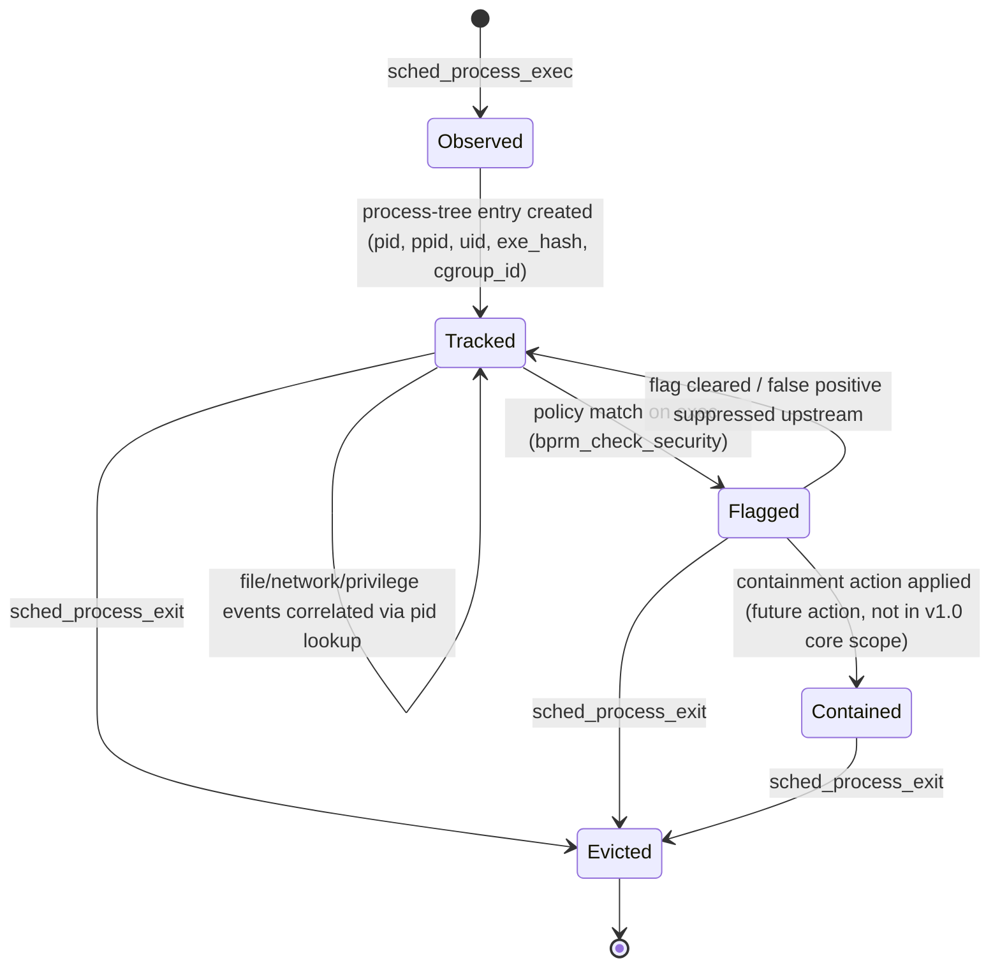
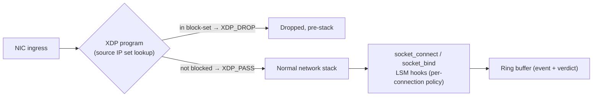
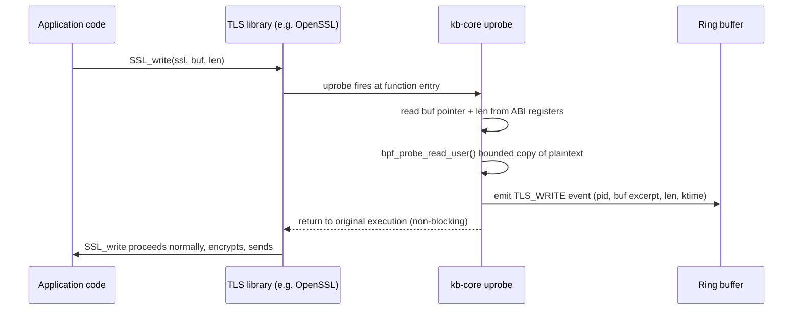
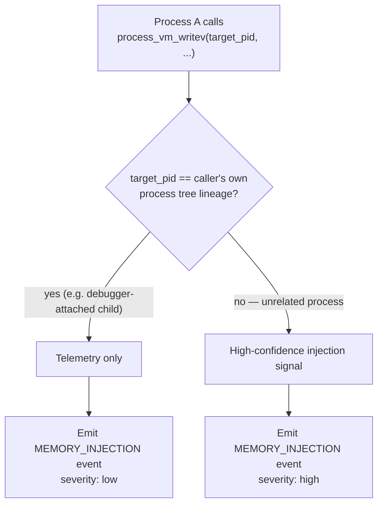
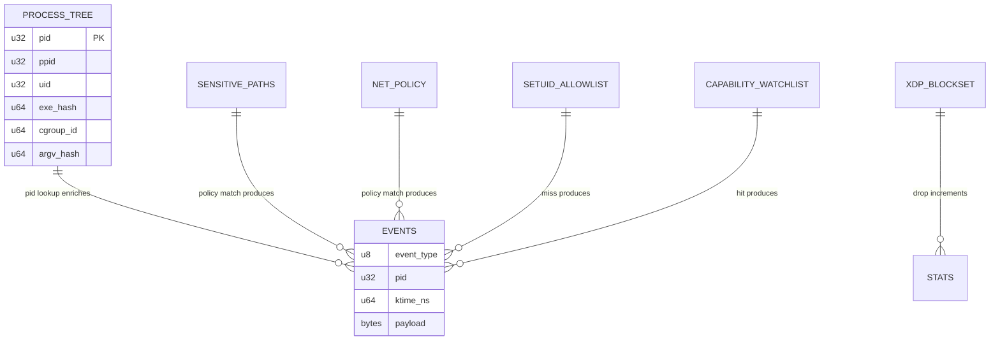
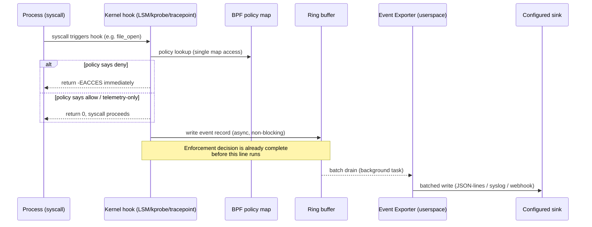
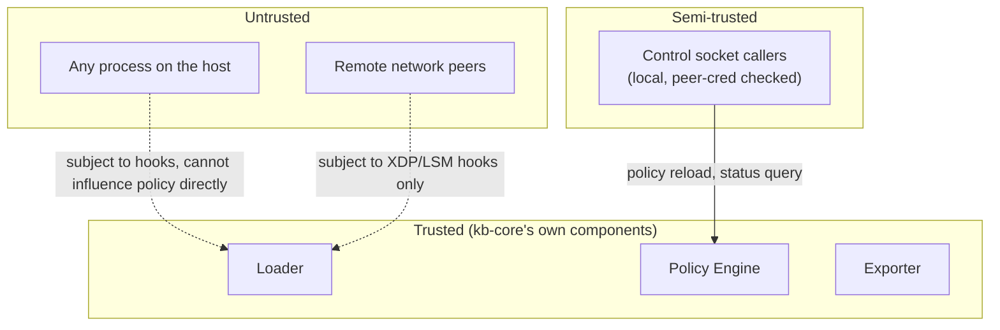
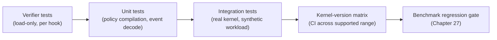
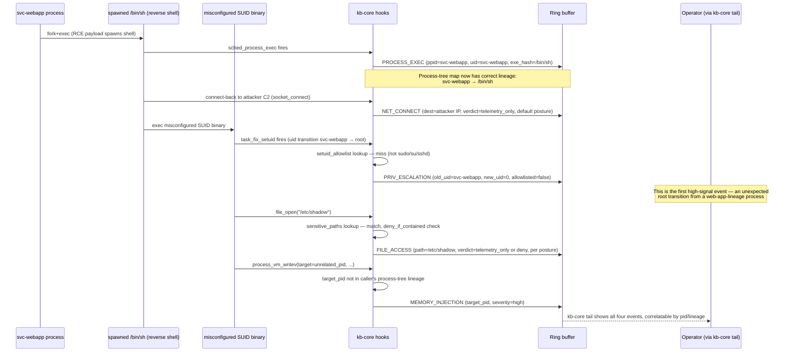

# kb-core

**A complete, standalone eBPF kernel security product for Linux server workloads**

Status: full end-to-end project specification — designed to be built, shipped, and used entirely on its own
Track: Kernel / eBPF
Document version: 1.0

> **This is a whole product, not a piece of a bigger system.** Everything needed to design, build, ship, and operate this — vision, architecture, every kernel hook, tech stack, configuration reference, threat model, testing strategy, and a phased roadmap to v1.0 — is in this one document. A solo engineer or a small team should be able to start a brand-new repository from nothing but this file and reach a working v0.1 within the first roadmap phase. It happens to compose cleanly with other independent tools later (see Chapter 23), but nothing in this document requires them to exist.

---

## Table of Contents

1. [Executive Summary](#1-executive-summary)
2. [Vision & Mission](#2-vision--mission)
3. [Problem Statement & Motivation](#3-problem-statement--motivation)
4. [Landscape & Prior Art](#4-landscape--prior-art)
5. [Design Philosophy & Principles](#5-design-philosophy--principles)
6. [Glossary of Terms](#6-glossary-of-terms)
7. [High-Level Architecture](#7-high-level-architecture)
8. [Kernel-Space Program Catalog](#8-kernel-space-program-catalog)
9. [Userspace Component Breakdown](#9-userspace-component-breakdown)
10. [Process Lifecycle & Process-Tree Modeling](#10-process-lifecycle--process-tree-modeling)
11. [File Integrity & Sensitive-Path Enforcement](#11-file-integrity--sensitive-path-enforcement)
12. [Network Hooking & XDP Ingress Filtering](#12-network-hooking--xdp-ingress-filtering)
13. [Privilege Escalation Detection](#13-privilege-escalation-detection)
14. [Out-of-Band TLS Plaintext Inspection](#14-out-of-band-tls-plaintext-inspection)
15. [Cross-Process Memory Injection & Hijacking Protection](#15-cross-process-memory-injection--hijacking-protection)
16. [BPF Map Design](#16-bpf-map-design)
17. [Event Schema & Wire Format](#17-event-schema--wire-format)
18. [Data Flow & Enforcement Lifecycle](#18-data-flow--enforcement-lifecycle)
19. [Policy Engine & Rule Language](#19-policy-engine--rule-language)
20. [CO-RE, BTF & Cross-Kernel Portability](#20-co-re-btf--cross-kernel-portability)
21. [Verifier Constraints & Program Complexity Management](#21-verifier-constraints--program-complexity-management)
22. [Tech Stack & Rationale](#22-tech-stack--rationale)
23. [Repository Layout & Build System](#23-repository-layout--build-system)
24. [Configuration Reference](#24-configuration-reference)
25. [Security Model & Threat Model](#25-security-model--threat-model)
26. [Self-Protection: Detecting Tampering With kb-core Itself](#26-self-protection-detecting-tampering-with-kb-core-itself)
27. [Performance Engineering & Benchmarking Methodology](#27-performance-engineering--benchmarking-methodology)
28. [Reliability, Fail-Safe Behavior & Failure Modes](#28-reliability-fail-safe-behavior--failure-modes)
29. [Observability, Logging & Debugging](#29-observability-logging--debugging)
30. [Testing Strategy](#30-testing-strategy)
31. [Deployment & Packaging](#31-deployment--packaging)
32. [Operations Runbook](#32-operations-runbook)
33. [Extensibility Model](#33-extensibility-model)
34. [Roadmap to v1.0 and Beyond](#34-roadmap-to-v10-and-beyond)
35. [Worked Case Study: Reverse Shell to Privilege Escalation](#35-worked-case-study-reverse-shell-to-privilege-escalation)
36. [Kernel Version Compatibility Matrix (Detailed)](#36-kernel-version-compatibility-matrix-detailed)
37. [Troubleshooting & FAQ](#37-troubleshooting--faq)
38. [Capacity Planning & Resource Budgeting](#38-capacity-planning--resource-budgeting)
39. [Appendix: Struct & Schema Reference](#39-appendix-struct--schema-reference)

---

## 1. Executive Summary

`kb-core` is a Linux kernel-level security observability and enforcement product built entirely on eBPF. It gives a single server, or a fleet of them, **kernel-ground-truth visibility** into process execution, network activity, file access, privilege changes, and in-memory cross-process interference — with per-hook overhead in the low hundreds of nanoseconds — and the ability to enforce policy (deny, kill, quarantine) at the exact point a syscall is issued, rather than reacting after the fact from a log line.

It ships as one static binary plus one embedded BPF object. Nothing else needs to be installed, provisioned, or running for it to be useful: load it on a box, point it at a local YAML policy file, and it is immediately a working host intrusion-detection-and-prevention tool that competes on its own merits with established projects like Falco, Tetragon, and auditd — not a fragment of some larger platform.

The four pillars of the design are:

1. **In-kernel enforcement.** The decision to allow or deny a security-relevant action is made by a BPF map lookup inside the kernel hook itself — never by round-tripping to userspace. This means enforcement latency does not depend on userspace being alive, scheduled promptly, or even running at all.
2. **CO-RE portability.** One compiled BPF object runs unmodified across a wide range of kernel versions using BPF Type Format (BTF) relocations, eliminating the traditional pain of recompiling kernel-facing code per target kernel.
3. **Fail-safe kernel presence.** A crash in the userspace control process must never take down enforcement — pinned BPF programs continue running the last-loaded policy independently of the loader process's lifecycle.
4. **Depth beyond generic syscall tracing.** Beyond the expected process/file/network telemetry, kb-core includes two capability classes most comparable tools omit entirely: out-of-band plaintext TLS interception via userspace uprobes, and cross-process memory-injection detection — both genuinely hard problems that pay for themselves in a red-team or incident-response context.

This document is the complete specification: every kernel hook point, every userspace component, the wire and map schemas, the policy language, the threat model, the test plan, and the phased roadmap from a single-hook proof of concept to a packaged v1.0 release.

---

## 2. Vision & Mission

**Vision:** every Linux server should have kernel-ground-truth answers to "what is actually happening on this machine right now," delivered with observability-tool latency and enforcement-tool authority, without requiring an out-of-tree kernel module or a fragile userspace polling loop.

**Mission:** ship a single, self-contained eBPF-based sensor and enforcement engine that:

- Observes process execution, file access, network activity, privilege transitions, and in-memory cross-process interference at the kernel boundary.
- Enforces declarative policy in-kernel, with zero added latency from userspace scheduling.
- Runs identically across a wide kernel-version range via CO-RE, with no per-kernel build step.
- Fails safe: a userspace crash degrades gracefully to "last known policy still enforced," never to "no protection at all."
- Is operable by one person: one binary, one config file, one systemd unit, clear logs.

> **Design rationale:** the "one person can run this" bar is not a nice-to-have. Every additional moving part (a database, a message queue, a second daemon) is a reason an on-call engineer at 3 a.m. has one more thing that can be the problem. kb-core is deliberately built to minimize that surface.

### 2.1 Non-goals

Explicitly out of scope for this project, to keep the spec honest about what it is and is not:

- **Not a full EDR suite with a cloud backend.** No SaaS component, no multi-tenant management plane. Those can be built *on top of* kb-core's event stream by someone else, but they are not part of this spec.
- **Not a general-purpose tracing framework.** kb-core is opinionated about which hooks matter for security; it is not `bpftrace` or a generic dynamic-tracing toolkit.
- **Not a replacement for network-layer IDS/IPS.** The XDP filtering in Chapter 12 is a coarse, fast first line of defense at the host boundary — not a substitute for a real network intrusion detection system doing deep packet inspection across a fleet.
- **Not a container runtime security product**, though nothing here prevents it from being cgroup-aware and useful inside containerized workloads (see §10.3).

---

## 3. Problem Statement & Motivation

Traditional Linux host security tooling forces an uncomfortable set of tradeoffs:

1. **Netlink-based auditing (`auditd`) has too much overhead for high-throughput workloads.** Its single netlink socket becomes a serialization bottleneck under event bursts, and a burst is exactly when you most need the audit trail to keep up.
2. **Polling/inotify-based file watchers react too late.** By the time an `inotify` event is delivered and processed in userspace, the file write it describes has already completed — useful for forensics, useless for prevention.
3. **Out-of-tree kernel modules are a liability in their own right.** A hand-rolled LSM or syscall-hooking kernel module is fragile across kernel upgrades, and a bug in it is not "a bug in a security tool" — it is a kernel exploit waiting to be found, running with the highest possible privilege.
4. **Most host security tools stop at metadata.** They can tell you a process wrote to a socket; they cannot tell you what was actually written, because TLS makes the payload opaque without a network-level man-in-the-middle the host tool doesn't want to run.
5. **Cross-process memory attacks are usually invisible to file/network-focused tooling.** Shellcode injection via `process_vm_writev`, or a read of `/proc/<pid>/mem`, doesn't touch the filesystem or the network at all — it exists entirely below the sightline of most host agents.

eBPF resolves the first three problems structurally: verified, sandboxed programs run inside the kernel, attached to stable hook points, with a controlled and cheap way to exchange data with userspace via ring buffers and maps — no out-of-tree module, no polling delay, and the verifier statically rules out whole classes of kernel-crashing bugs before the program is even allowed to load.

The remaining two problems — TLS opacity and cross-process memory attacks — require deliberate design choices this document makes explicitly (Chapters 14 and 15). kb-core exists to be the project that takes all five seriously in one coherent, shippable tool, rather than solving three of them and leaving the other two as "future work" forever.

---

## 4. Landscape & Prior Art

No project should be built in ignorance of what already exists. The following table positions kb-core against the closest prior art, honestly, including where those projects are simply better-resourced or more mature.

| Project | Approach | Strengths | Gaps kb-core targets |
|---|---|---|---|
| **auditd** | Kernel audit subsystem + netlink | Ubiquitous, mature, POSIX audit trail semantics | Netlink bottleneck under load; no in-kernel enforcement; no TLS/memory-injection visibility |
| **Falco (CNCF)** | eBPF/kernel-module syscall tracing, rule engine | Huge rule ecosystem, strong community, CNCF-graduated maturity | Detection-focused; enforcement is typically indirect (response engine calls out to something else); no built-in TLS plaintext inspection |
| **Cilium Tetragon** | eBPF + LSM hooks, in-kernel enforcement | Excellent CO-RE engineering, real in-kernel blocking, strong k8s integration | Primarily oriented around Kubernetes/Cilium ecosystem; heavier operational footprint for a bare-metal single-host use case |
| **Tracee (Aqua Security)** | eBPF syscall/event tracing | Good signature-based detection library, forensics-oriented | Detection, not enforcement; no TLS interception |
| **osquery** | Userspace SQL-queryable system state | Great ad hoc investigation ergonomics | Pull-based, not a real-time enforcement path; kernel visibility is shallower than a native eBPF sensor |
| **kb-core (this project)** | eBPF CO-RE + LSM, in-kernel enforcement, TLS uprobes, memory-injection hooks | Combines in-kernel enforcement + TLS plaintext visibility + memory-injection detection in one self-contained binary | Newer, smaller ecosystem, no built-in rule marketplace (v1.0 scope is deliberately narrower — see Chapter 34) |

> **Note:** kb-core does not aim to out-feature Falco or Tetragon across the board on day one — both are mature, well-funded projects. The differentiated bet is the *combination* of in-kernel enforcement with TLS-plaintext and memory-injection visibility in a single, minimal-dependency binary, which is a narrower but sharper value proposition than "replace everything."

### 4.1 What to borrow, deliberately

- Falco's event-schema design is a good reference for keeping event records self-describing without becoming bloated.
- Tetragon's CO-RE and LSM-hook attachment patterns are the strongest available reference for verifier-safe program structure at this level of ambition.
- osquery's "everything is queryable" ergonomics are worth studying even though kb-core is push- not pull-oriented — the query console idea (Chapter 32) borrows from it.

---

## 5. Design Philosophy & Principles

1. **Performance is a feature, not an afterthought.** Every design decision in this document is evaluated first against "what does this cost in the hot path," and only second against "is this convenient to implement."
2. **In-kernel enforcement, asynchronous telemetry.** The single most important architectural invariant in this project: the *decision* to block something happens entirely inside the kernel hook via a map lookup. The *record* of that decision is drained to userspace asynchronously and must never be allowed to block the enforcement path.
3. **Fail safe, not fail open, and not fail catastrophic.** If the userspace loader dies, the kernel keeps enforcing the last policy it was given (fail safe). If a BPF program itself hits an unexpected state, it must degrade to a no-op for that one hook, never crash the kernel (this is mostly guaranteed by the verifier, but map-lookup-miss handling still needs to default correctly).
4. **CO-RE first, no per-kernel builds.** A single compiled artifact must run across the supported kernel range. Any hook that cannot be made CO-RE-portable is flagged and isolated rather than silently breaking portability for the whole object.
5. **Minimum viable privilege.** Request the smallest capability set the current kernel version actually requires (`CAP_BPF`/`CAP_PERFMON` where available, falling back to `CAP_SYS_ADMIN` only on older kernels that require it) — document this per kernel version, don't just default to the broadest capability everywhere.
6. **Self-contained by default, extensible by design.** The default deployment has zero external dependencies. Extension points (pluggable event sinks, a control socket) exist for people who want to plug this into something bigger, but the default path never requires them.
7. **Every enforcement decision must be reconstructable after the fact.** If kb-core blocked something, an operator must be able to answer "why" from the event log alone, without needing to reproduce the state that triggered it.

---

## 6. Glossary of Terms

| Term | Definition |
|---|---|
| **BPF** | Berkeley Packet Filter — originally packet filtering, now a general in-kernel virtual machine for verified, sandboxed programs (eBPF = "extended BPF"). |
| **CO-RE** | Compile Once – Run Everywhere. A technique using BTF relocations so one compiled BPF object works across kernel versions without recompilation. |
| **BTF** | BPF Type Format — kernel-embedded type/debug information that CO-RE relocations read to resolve struct field offsets at load time. |
| **LSM hook** | Linux Security Module hook — a stable kernel interception point (e.g. `file_open`, `bprm_check_security`) originally designed for modules like SELinux/AppArmor, now attachable by BPF LSM programs. |
| **Tracepoint** | A static, stable kernel instrumentation point (e.g. `sched_process_exec`) with a defined argument format. |
| **Kprobe / Kretprobe** | Dynamic kernel probes attachable to (almost) any kernel function's entry/return — less stable across kernel versions than tracepoints or LSM hooks, used only where no stable hook exists. |
| **Uprobe** | A dynamic probe attached to a userspace function (e.g. `SSL_write` in `libssl.so`), used here for TLS plaintext interception. |
| **Ring buffer (`BPF_MAP_TYPE_RINGBUF`)** | A single-producer/multi-consumer-friendly, memory-efficient buffer for streaming events from kernel to userspace with minimal overhead. |
| **Verifier** | The kernel component that statically analyzes a BPF program before allowing it to load, rejecting anything that could crash, leak memory, or loop unboundedly. |
| **Tail call** | A BPF-to-BPF jump (`bpf_tail_call`) that transfers execution to another loaded program, used to keep individual programs under the verifier's complexity limits. |
| **Pinning** | Persisting a loaded BPF program or map to the BPF filesystem (`/sys/fs/bpf`) so it survives the loader process exiting. |
| **XDP** | eXpress Data Path — the earliest possible hook point on packet ingress, run before the kernel's normal networking stack, used for line-rate filtering. |
| **CEL** | Common Expression Language — a small, embeddable expression language used here as the basis of the policy rule grammar. |

---

## 7. High-Level Architecture

```mermaid
flowchart TB
    subgraph User["Userspace"]
        direction TB
        PE["Policy Engine<br/>(YAML + CEL rules)"]
        LM["Loader / Manager<br/>(libbpf-rs)<br/>load · verify · attach · pin"]
        EE["Event Exporter<br/>(ring buffer consumer)"]
        CLI["Bundled CLI<br/>(load/unload, tail, policy edit)"]
        PE -->|compiles rules into| LM
        CLI --> LM
        CLI --> EE
    end

    subgraph Kernel["Kernel space"]
        direction TB
        LSM["LSM hooks<br/>file_open · bprm_check_security<br/>socket_connect · socket_bind<br/>cred_prepare · task_fix_setuid"]
        TP["Tracepoints<br/>sched_process_exec/exit<br/>syscalls:sys_enter_*"]
        KP["Kprobes/Kretprobes<br/>security_capable<br/>process_vm_writev"]
        UP["Uprobes<br/>SSL_write · gnutls_record_send<br/>PR_Write · Go crypto/tls"]
        XDP["XDP program<br/>ingress packet filter"]
        MAPS["BPF Maps<br/>LRU hash (process tree)<br/>policy hash maps<br/>ring buffer<br/>per-CPU array (stats)<br/>prog array (tail calls)"]
        LSM --> MAPS
        TP --> MAPS
        KP --> MAPS
        UP --> MAPS
        XDP --> MAPS
    end

    LM -->|bpf() syscall: load, attach, pin| Kernel
    PE -->|policy map writes| MAPS
    MAPS -->|ring buffer drain| EE
    EE -->|JSON-lines / syslog / webhook| Sink[("Local disk /<br/>syslog / webhook")]

    style User fill:#1f2937,color:#fff
    style Kernel fill:#7f1d1d,color:#fff
    style Sink fill:#374151,color:#fff
```

The system has exactly two runtime processes: the **loader/manager**, which owns the privileged `bpf()` syscall interactions and exposes a local control socket, and the **event exporter**, which drains the ring buffer and ships records onward. Both can run in the same OS process (recommended for the default deployment — one binary, one systemd unit) or be split into two for operational reasons in a more advanced deployment; the spec treats them as logically separate components regardless.

> **Design rationale:** the diagram deliberately shows policy map writes going *directly* from the Policy Engine to the kernel maps, not through the Loader. This is intentional — policy updates are a hot-reload path that should not require re-running the load/verify/attach sequence, which is comparatively expensive and carries a small window of hook-detachment risk if done carelessly.

---

## 8. Kernel-Space Program Catalog

This chapter is the authoritative list of every kernel-space program kb-core attaches, its hook type, its purpose, and its stability characteristics.

| # | Program | Hook type | Hook point | Purpose | Kernel version note |
|---|---|---|---|---|---|
| 1 | `on_process_exec` | Tracepoint | `sched_process_exec` | Populate process-tree map on exec | Stable since early tracepoint support |
| 2 | `on_process_exit` | Tracepoint | `sched_process_exit` | Evict process-tree entry, emit lifecycle event | Stable |
| 3 | `on_bprm_check` | LSM | `bprm_check_security` | Pre-exec policy check (allow/deny binary execution) | Requires BPF LSM enabled (`lsm=...,bpf` on boot cmdline) |
| 4 | `on_file_open` | LSM | `file_open` | Sensitive-path access control (Chapter 11) | Requires BPF LSM |
| 5 | `on_path_mknod` | LSM | `path_mknod` | Detect creation of device nodes / suspicious file types | Requires BPF LSM |
| 6 | `on_inode_unlink` | LSM | `inode_unlink` | Detect deletion of monitored/sensitive files | Requires BPF LSM |
| 7 | `on_socket_connect` | LSM | `socket_connect` | Outbound connection policy + telemetry | Requires BPF LSM |
| 8 | `on_socket_bind` | LSM | `socket_bind` | Inbound listen policy + telemetry | Requires BPF LSM |
| 9 | `on_cred_prepare` | LSM | `cred_prepare` | Credential-transition telemetry | Requires BPF LSM |
| 10 | `on_setuid` | Kprobe | `task_fix_setuid` (or equivalent per-arch symbol) | Privilege escalation detection (Chapter 13) | Kprobe stability caveat — see §8.1 |
| 11 | `on_capable` | Kprobe | `security_capable` | Sensitive capability probing (`CAP_SYS_ADMIN`, `CAP_SYS_PTRACE`, `CAP_SYS_RAWIO`, `CAP_DAC_OVERRIDE`) by non-root callers | Kprobe stability caveat |
| 12 | `on_process_vm_writev` | Tracepoint | `syscalls:sys_enter_process_vm_writev` | Cross-process memory injection detection (Chapter 15) | Stable syscall tracepoint |
| 13 | `on_proc_mem_access` | LSM | `file_open` (path-filtered to `/proc/*/mem`) | Detect procfs-based memory read/write attempts | Shares hook 4's attach point, dispatched via tail call |
| 14 | `ssl_write_uprobe` | Uprobe | `SSL_write` in `libssl.so` | TLS plaintext capture (OpenSSL) — Chapter 14 | Attach-time symbol resolution per target binary |
| 15 | `gnutls_write_uprobe` | Uprobe | `gnutls_record_send` in `libgnutls.so` | TLS plaintext capture (GnuTLS) | Same caveat |
| 16 | `nss_write_uprobe` | Uprobe | `PR_Write` in `libnss3.so` | TLS plaintext capture (NSS) | Same caveat |
| 17 | `go_tls_uprobe` | Uprobe | dynamic offset in target Go binary's `.text` | TLS plaintext capture (Go `crypto/tls`) | Requires per-binary offset resolution — see §14.4 |
| 18 | `xdp_ingress_filter` | XDP | NIC ingress (driver or generic mode) | Line-rate coarse packet filtering | Best performance in native/offload XDP mode; generic mode as fallback |
| 19 | `dispatch_file_policy` | Tail-call target | (called from #4, #13) | Policy-specific sub-logic, kept out of the main hook to respect verifier complexity limits | N/A |
| 20 | `dispatch_net_policy` | Tail-call target | (called from #7, #8) | Same pattern for network policy | N/A |

### 8.1 On kprobe stability

> **Note:** kprobes attach to internal kernel function symbols that are not part of any stable ABI and can be renamed, inlined, or removed across kernel versions. Programs #10 and #11 are the two places in this catalog that rely on kprobes rather than a stable tracepoint or LSM hook, specifically because no stable equivalent exists for "setuid transition" or "capability check" at the time of writing. Each kprobe target is version-guarded at load time: if the expected symbol is not resolvable via BTF, the loader logs a clear degradation warning and continues without that one hook rather than failing the whole load.

### 8.2 Hook dispatch pattern

Every LSM/tracepoint entry point is kept intentionally small — parse arguments, do one map lookup, `bpf_tail_call` into a dispatcher — to stay well under the verifier's per-program instruction and complexity limits even as the number of supported policy rule types grows. See Chapter 21 for the full rationale.

```c
/* Illustrative — not the full implementation */
SEC("lsm/file_open")
int BPF_PROG(on_file_open, struct file *file, int ret)
{
    if (ret != 0)
        return ret; /* don't override an existing deny */

    struct path_key key = {0};
    if (build_path_key(file, &key) < 0)
        return 0; /* fail open on key-build failure: never crash, never over-block */

    __u32 dispatch_id = FILE_POLICY_DISPATCH;
    bpf_tail_call(ctx, &prog_array, dispatch_id);

    /* unreachable if tail call succeeds; fallback allow if the tail call itself fails */
    return 0;
}
```

---

## 9. Userspace Component Breakdown

### 9.1 Loader / Manager

Responsibilities:

- Open the compiled BPF object, resolve BTF for the running kernel, load every program in the catalog above.
- Attach each program to its hook point, in a defined order (LSM hooks first, since a failure there is the most consequential to detect early).
- Pin every loaded program and map under `/sys/fs/bpf/kb-core/` so they survive the loader process exiting or restarting.
- Expose a local Unix domain control socket for: policy hot-reload requests, status queries, and graceful unload requests.
- On startup, check for already-pinned programs from a previous run (crash recovery / restart case) and re-attach to the existing pinned objects rather than blindly re-loading, to avoid a hook-detach gap.

### 9.2 Policy Engine

Responsibilities:

- Parse the YAML policy file (Chapter 24) and validate it against the CEL-subset grammar (Chapter 19).
- Compile validated rules into the exact BPF map key/value encoding each policy-consuming hook expects (Chapter 16).
- Own the hot-reload path: on a `SIGHUP` or a control-socket "reload" request, re-parse, re-validate, and atomically swap map contents — never leaving the maps in a half-updated state a concurrent hook invocation could observe.
- Reject and clearly report invalid policy at load time rather than silently ignoring malformed rules.

### 9.3 Event Exporter

Responsibilities:

- Drain the ring buffer continuously, in a dedicated thread/task that never shares a lock with anything on the enforcement path.
- Decode fixed-size event structs (Chapter 17) into the appropriate output representation.
- Batch writes to whichever sink is configured (local JSON-lines file, syslog, or a generic HTTP webhook) — batching amortizes I/O cost and is essential to keeping up with high event-rate bursts.
- Apply backpressure correctly: if the configured sink is slow, the *ring buffer* is allowed to drop the oldest un-consumed events (with a drop counter incremented and surfaced in status output) rather than ever blocking back into the kernel path.

### 9.4 Bundled CLI

A thin wrapper for day-to-day operation without needing a separate project (see Chapter 32 for full command reference): load/unload programs, tail live events, validate/apply policy changes, and query current status (attached hooks, drop counters, uptime).

---

## 10. Process Lifecycle & Process-Tree Modeling

Maintaining an in-kernel process tree (pid → {ppid, uid, exe path hash, cgroup id, argv hash}) means every other hook can answer "who is my parent, what is my lineage" via a single map lookup, without ever needing a userspace round-trip on the hot path.



> **Note:** "Contained" is shown for completeness of the state model but containment *action* orchestration (deciding when to escalate a flag into an actual containment command, and executing that command) is explicitly out of scope for kb-core itself — kb-core's job stops at "flagged and recorded in the audit trail via the event stream." A separate consumer of that event stream is where containment decisions belong. This keeps kb-core's own trust boundary small: it observes and can deny individual syscalls in-kernel, but it does not orchestrate multi-step response.

### 10.1 Process-tree map schema

| Field | Type | Notes |
|---|---|---|
| `pid` (key) | `u32` | Process ID, map key |
| `ppid` | `u32` | Parent PID at time of exec |
| `uid` | `u32` | Effective UID at time of exec |
| `exe_hash` | `u64` | FNV-1a hash of resolved executable path (fixed-width, avoids variable-length string storage in-map) |
| `cgroup_id` | `u64` | From `bpf_get_current_cgroup_id()` — enables per-container/per-service scoping |
| `argv_hash` | `u64` | Hash of a bounded prefix of argv (first N bytes) — full argv capture is a userspace-side enrichment, not stored in-kernel |
| `exec_ktime_ns` | `u64` | Kernel timestamp of exec, for lineage/ordering |

### 10.2 Map type choice

`BPF_MAP_TYPE_LRU_HASH` is used rather than a plain hash map specifically so that a process-table leak (e.g. missed exit events under extreme load) cannot grow the map unboundedly — the LRU eviction bounds memory automatically without hand-rolled cleanup logic. The tradeoff, documented deliberately: under sustained extreme load, the least-recently-used *tracked* process could be evicted before its exit event arrives, producing a rare "orphaned" audit record with an unresolvable parent lookup. This is judged an acceptable, clearly-labeled degradation rather than a reason to risk unbounded memory growth.

### 10.3 Cgroup-awareness for containerized workloads

Because `cgroup_id` is captured on every process-tree entry, policy rules can be scoped per-cgroup (Chapter 19), which is what makes kb-core usable inside a containerized host without being a container-runtime-specific product: "deny sensitive-path access for this cgroup" works whether that cgroup is a systemd service, a plain `cgroup-tools` group, or a container runtime's per-container cgroup, with no runtime-specific integration code required.

---

## 11. File Integrity & Sensitive-Path Enforcement

### 11.1 Hook point and ordering

The `file_open` LSM hook fires after symlink and relative-path resolution, which matters: policy is evaluated against the *resolved* absolute path, not the string the calling process passed in, closing the obvious symlink-based bypass a naive string-match implementation would be vulnerable to.

### 11.2 Enforcement scope

> **Design rationale:** a blanket "deny all access to `/etc/shadow`" policy breaks routine, legitimate system operation (`sudo`, PAM, and dozens of other tools legitimately read sensitive files as part of normal function). kb-core's default posture is therefore **scoped, not blanket**: sensitive-path *reads* are always recorded as telemetry regardless of who's asking, but the hard in-kernel *block* (`-EACCES`) is targeted specifically at processes already flagged/contained at a configurable severity threshold — not applied indiscriminately to every process on the box. This single design choice is what makes the feature usable in production rather than something every operator disables within a day.

### 11.3 Path matching implementation

Path matching against the sensitive-path policy set is implemented as a verifier-safe unrolled directory-traversal loop (`#pragma unroll`), walking parent directories and checking each against the policy map — this avoids unbounded loop constructs the verifier would reject, at the cost of a fixed maximum traversal depth (configurable, default 16 levels, generous for real filesystem layouts).

```c
/* Illustrative structure, not full implementation */
#pragma unroll
for (int i = 0; i < MAX_PATH_DEPTH; i++) {
    if (!dentry)
        break;
    __u64 component_hash = hash_dentry_name(dentry);
    struct policy_action *action = bpf_map_lookup_elem(&sensitive_paths, &component_hash);
    if (action && action->deny_if_contained && is_pid_contained(pid))
        return -EACCES;
    dentry = get_parent_dentry(dentry);
}
```

### 11.4 Default sensitive-path set

| Path pattern | Rationale |
|---|---|
| `/etc/shadow`, `/etc/gshadow` | Credential material |
| `/etc/ssh/` (private host keys) | Host identity material |
| `/root/.ssh/`, `/home/*/.ssh/` | User SSH key material |
| systemd unit directories (`/etc/systemd/system/`, `/lib/systemd/system/`) | Persistence mechanism |
| `/etc/sudoers`, `/etc/sudoers.d/` | Privilege configuration |
| `/proc/*/mem` | Cross-process memory (see Chapter 15) |

This set is the shipped default and is fully operator-editable via policy (Chapter 24) — it is a starting point, not a hardcoded list.

---

## 12. Network Hooking & XDP Ingress Filtering

### 12.1 LSM-level connection visibility

`socket_connect` and `socket_bind` LSM hooks provide policy-capable visibility into outbound connection attempts and inbound listen calls, tagged with the initiating process's pid/cgroup from the process-tree map (Chapter 10) — this is what lets an event downstream say "this specific service tried to connect outbound to this address," not just "a connection happened."

### 12.2 XDP as a coarse, fast first line

XDP runs at the earliest possible point on packet ingress — before the kernel's normal socket buffer allocation and networking stack — making it the right place for line-rate, coarse filtering (e.g. drop traffic from an actively-blocked source IP set) where LSM-level per-connection policy would be comparatively expensive to evaluate on every single packet.



> **Design rationale:** XDP and LSM socket hooks are complementary, not redundant. XDP handles "this source is already known-bad, drop it before it costs anything," while the LSM hooks handle "evaluate this specific new connection against policy" — trying to do all filtering at either layer alone would be either too coarse (XDP-only) or too expensive at line rate (LSM-only).

### 12.3 Connection metadata capture

| Field | Captured at | Notes |
|---|---|---|
| 5-tuple (src/dst IP, src/dst port, protocol) | `socket_connect`/`socket_bind` | Standard connection identity |
| `pid`, `cgroup_id` | Process-tree lookup at hook time | Attribution |
| `verdict` | Policy evaluation result | Allow / deny / telemetry-only |
| `ktime_ns` | Hook invocation time | Ordering/correlation |

### 12.4 Deployment modes

XDP supports native (driver-offloaded), generic (works on any NIC driver, software fallback), and hardware-offloaded modes. kb-core targets **generic mode as the guaranteed-portable baseline**, with native mode auto-detected and preferred when the loaded driver supports it — documented explicitly in status output so operators know which mode is actually active on their hardware.

---

## 13. Privilege Escalation Detection

### 13.1 What's being watched

- `task_fix_setuid` (via kprobe, see §8.1's stability caveat): flags uid transitions outside a configured allow-list — e.g. a non-root process calling `setuid(0)` outside of a small set of expected binaries (`sudo`, `su`, service-manager-spawned processes with an expected capability transition).
- `security_capable` (via kprobe): flags checks for a configured watch-list of high-value capabilities (`CAP_SYS_ADMIN`, `CAP_SYS_PTRACE`, `CAP_SYS_RAWIO`, `CAP_DAC_OVERRIDE`) requested by non-root callers, which is frequently a stronger signal of exploitation-in-progress than the setuid transition itself.

### 13.2 Why both signals matter together

A privilege escalation exploit doesn't always call `setuid()` directly — many techniques instead directly request a specific capability the exploited process shouldn't have. Watching both the outcome (`setuid` transition) and the request (`security_capable` check) catches both direct and indirect escalation paths; a tool watching only one is blind to the other class of exploit.

### 13.3 Allow-list rationale

Default allow-list is deliberately short and precise rather than broad:

```yaml
privilege_escalation:
  setuid_allowlist:
    - path: /usr/bin/sudo
    - path: /usr/bin/su
    - path: /usr/sbin/sshd
  capability_watchlist:
    - CAP_SYS_ADMIN
    - CAP_SYS_PTRACE
    - CAP_SYS_RAWIO
    - CAP_DAC_OVERRIDE
  action: telemetry_only   # default posture — see §13.4
```

### 13.4 Default posture: telemetry, not automatic block

> **Note:** privilege-escalation detection defaults to `telemetry_only`, not automatic denial. A false positive here (blocking a legitimate `setuid` transition) can break routine system operation in ways far more disruptive than a false positive on, say, sensitive-file telemetry. Operators who want hard enforcement can opt in per-rule once they've validated the allow-list against their own environment — see Chapter 24.

---

## 14. Out-of-Band TLS Plaintext Inspection

### 14.1 Why this is worth the complexity

TLS makes network payloads opaque to any tool that isn't either terminating the connection (a proxy, which changes the trust and latency model) or holding the private key (which most host-security deployments won't have access to). Intercepting the plaintext directly in the process's own memory, at the point it's handed to (or received from) the TLS library — before encryption on write, after decryption on read — sidesteps both problems entirely: no MITM, no key material needed, and it works for the process's *actual* view of its own traffic.

### 14.2 Target libraries and hook points

| Library | Hooked function | Calling convention | Notes |
|---|---|---|---|
| OpenSSL (`libssl.so`) | `SSL_write` | System V ABI: buffer in `RSI`, length in `RDX`, `SSL*` receiver in `RDI` | Most common on Linux server workloads |
| GnuTLS (`libgnutls.so`) | `gnutls_record_send` | System V ABI, same register pattern | Common in Debian-family default toolchains |
| NSS (`libnss3.so`) | `PR_Write` (NSPR socket layer) | System V ABI | Used by some legacy/enterprise stacks |
| Go runtime (`crypto/tls`) | Dynamic offset in target binary's `.text`, resolved per binary | Go `ABIInternal`: backing-array address in `RBX`, length in `RCX` (register assignment is Go-version-sensitive — see §14.4) | Statically linked Go binaries have no shared `libssl.so` to hook, hence the different approach |



### 14.3 Capture bounds and privacy posture

> **Design rationale:** capturing full-length payloads for every TLS write is both a performance risk and a data-handling liability. kb-core caps captured plaintext to a configurable maximum excerpt length per event (default 4KB) and supports a configurable set of path/process exclusions (e.g. exclude a known-sensitive internal service from plaintext capture entirely while still recording that a write occurred). This is a deliberate policy knob, not a hardcoded behavior — see Chapter 24.

### 14.4 Go runtime offset resolution

Statically linked Go binaries don't call into a shared `libssl.so`, so there is no fixed, symbol-resolvable function to uprobe across all Go binaries the way there is for OpenSSL. Instead, offset resolution happens per target binary at attach time: parse the binary's symbol table (Go binaries retain enough symbol information by default to locate `crypto/tls.(*Conn).Write` unless explicitly stripped), and attach the uprobe to that resolved offset. Register conventions for Go's `ABIInternal` calling convention are Go-version-sensitive (Go's internal ABI is not a public stability guarantee the way the System V ABI is) — this hook explicitly documents which Go compiler version range it has been validated against, and is expected to need periodic maintenance as new Go versions ship, unlike the OpenSSL/GnuTLS/NSS hooks which are stable against a long-standing public ABI.

---

## 15. Cross-Process Memory Injection & Hijacking Protection

### 15.1 The blind spot this closes

Shellcode injection and other in-memory hijacking techniques frequently never touch the filesystem or the network — a process reads or writes another process's memory directly, via `/proc/<pid>/mem` or the `process_vm_writev`/`process_vm_readv` syscalls, and file/network-focused tooling has nothing to observe.

### 15.2 Mechanisms watched

- **`/proc/*/mem` access**: the path auditor (reusing the `file_open` LSM hook's path-matching machinery from Chapter 11, since `/proc/<pid>/mem` is itself just a sensitive path pattern) flags any open of another process's `/proc/<pid>/mem`.
- **`process_vm_writev`**: hooked directly via a syscall tracepoint (`syscalls:sys_enter_process_vm_writev`) — this is the syscall most cross-process shellcode-injection techniques use specifically because it avoids `ptrace`'s more heavily-scrutinized API surface. Capturing the calling pid, target pid, and write length gives a direct, high-confidence signal: legitimate reasons for one unrelated process to write into another's memory are rare.



### 15.3 Why not block automatically by default

As with privilege escalation (§13.4), the default posture is telemetry with a high-confidence severity marker rather than automatic denial — legitimate debuggers and profilers do use these same mechanisms, and default-blocking would break `gdb`, `strace`-adjacent tooling, and APM agents out of the box. The severity distinction in §15.2 (same-lineage vs. unrelated-process) is precisely what lets an operator safely opt into blocking only the high-confidence case once validated in their environment.

---

## 16. BPF Map Design

| Map name | Type | Key | Value | Purpose |
|---|---|---|---|---|
| `process_tree` | `LRU_HASH` | `u32` (pid) | `struct proc_entry` (§10.1) | In-kernel process lineage lookup |
| `sensitive_paths` | `HASH` | `u64` (path-component hash) | `struct path_policy` | File-access enforcement policy |
| `net_policy` | `HASH` | `struct net_key {saddr, daddr, dport, proto}` | `struct net_action` | Connection allow/deny/telemetry policy |
| `setuid_allowlist` | `HASH` | `u64` (exe path hash) | `u8` (allowed flag) | Privilege-escalation allow-list |
| `capability_watchlist` | `HASH` | `u32` (capability number) | `u8` (watched flag) | Capability-probe watch set |
| `xdp_blockset` | `LPM_TRIE` | CIDR prefix | `u8` (block flag) | Line-rate ingress IP blocking |
| `events` | `RINGBUF` | — | variable-length encoded event (§17) | Kernel-to-userspace event stream |
| `stats` | `PERCPU_ARRAY` | fixed index per counter | `u64` | Per-CPU counters (hook hit count, drop count) merged in userspace |
| `prog_array` | `PROG_ARRAY` | dispatch id | program fd | Tail-call dispatch table (§21) |
| `tls_excerpt_cfg` | `ARRAY` | single-element | `struct tls_capture_cfg` | Runtime-tunable TLS capture bounds (§14.3) |



> **Design rationale:** `LPM_TRIE` for the XDP block set specifically (not a plain hash map) because it needs CIDR-prefix matching — "block this /24" — not just exact-IP matching, and longest-prefix-match is exactly what an `LPM_TRIE` is built for at line-rate cost.

---

## 17. Event Schema & Wire Format

All events share a common fixed-size header, followed by a type-specific fixed-size body — no variable-length fields in the kernel-to-userspace representation, to keep ring buffer encoding/decoding branch-free and cheap.

### 17.1 Common header

| Field | Type | Size | Notes |
|---|---|---|---|
| `magic` | `u16` | 2B | Format sanity marker |
| `version` | `u8` | 1B | Wire format version, incremented on any layout change |
| `event_type` | `u8` | 1B | See §17.2 |
| `pid` | `u32` | 4B | |
| `ktime_ns` | `u64` | 8B | Kernel monotonic timestamp |
| `cgroup_id` | `u64` | 8B | |

Header size: 24 bytes, packed, little-endian.

### 17.2 Event type registry

| `event_type` | Name | Body summary |
|---|---|---|
| `0x01` | `PROCESS_EXEC` | ppid, uid, exe_hash, argv_hash |
| `0x02` | `PROCESS_EXIT` | exit_code |
| `0x03` | `FILE_ACCESS` | path_hash, verdict, access_flags |
| `0x04` | `NET_CONNECT` | 5-tuple, verdict |
| `0x05` | `NET_BIND` | 5-tuple, verdict |
| `0x06` | `PRIV_ESCALATION` | old_uid, new_uid, allowlisted (bool) |
| `0x07` | `CAPABILITY_CHECK` | capability_number, verdict |
| `0x08` | `MEMORY_INJECTION` | target_pid, write_len, severity |
| `0x09` | `PROC_MEM_ACCESS` | target_pid, access_flags |
| `0x0A` | `TLS_WRITE` | excerpt_len, excerpt_bytes[MAX_EXCERPT] |
| `0x0B` | `XDP_DROP` | src_ip, drop_reason |

> **Note:** `version` is checked by the userspace exporter on every batch — a mismatch between the running kernel object's emitted version and the exporter's expected version fails loudly (logged, refuses to mis-decode) rather than silently misinterpreting bytes. This is the same discipline applied to any cross-language wire contract: the two sides must change together, and a version field is what makes a mismatch detectable instead of a silent corruption.

---

## 18. Data Flow & Enforcement Lifecycle



This diagram is the single most important artifact in this document to internalize: **the enforcement decision is fully resolved by the time the ring buffer write happens.** Nothing about the syscall's outcome depends on the exporter being alive, fast, or even running. A crashed exporter means telemetry is lost until it restarts (and ring buffer contents up to its capacity are retained meanwhile) — it never means enforcement stops working.

### 18.1 Failure isolation table

| Component state | Effect on enforcement | Effect on telemetry |
|---|---|---|
| Exporter process crashed | None — hooks still enforce from pinned programs | Paused; ring buffer retains events up to capacity, resumes on exporter restart |
| Loader process crashed (after initial load) | None — programs remain pinned and attached | Depends on whether exporter is a separate process; if co-located, same as above |
| Configured sink (disk/syslog/webhook) unavailable | None | Exporter buffers internally up to a bound, then drops oldest with a counted metric — never blocks the ring buffer drain |
| Policy map corrupted/unexpected state | Falls back to per-hook safe default (documented per hook; generally "allow + telemetry" to avoid an availability incident from a policy bug) | Unaffected |

---

## 19. Policy Engine & Rule Language

### 19.1 Grammar (CEL subset)

The policy rule language is a deliberately small subset of CEL (Common Expression Language) — enough expressiveness for real policy needs, small enough to fully validate and compile down to map entries without needing a general-purpose expression evaluator at runtime (evaluation happens entirely in userspace at *compile* time, producing static map entries; nothing CEL-like executes in the kernel itself).

```
rule        := "when" condition "then" action
condition   := field operator value ( "and" condition )*
field       := "path" | "uid" | "cgroup" | "exe" | "capability" | "dest_ip" | "dest_port"
operator    := "==" | "!=" | "in" | "matches"
value       := string | int | list
action      := "allow" | "deny" | "telemetry_only"
```

### 19.2 Example policy document

```yaml
version: 1
rules:
  - name: block-shadow-read-if-contained
    when:
      path: matches "/etc/shadow"
    then: deny
    condition_extra: only_if_contained   # see §11.2 scoping

  - name: alert-on-outbound-to-known-bad
    when:
      dest_ip: in ["203.0.113.0/24"]
    then: telemetry_only
    severity: high

  - name: allow-sudo-setuid
    when:
      exe: == "/usr/bin/sudo"
    then: allow

default_posture:
  file_access: telemetry_only
  network: telemetry_only
  privilege_escalation: telemetry_only
  memory_injection: telemetry_only
```

> **Design rationale:** every category defaults to `telemetry_only` unless a rule explicitly opts into enforcement. This is a deliberate "observe first, enforce once validated" posture — an operator should be able to run kb-core in a pure-audit mode indefinitely, build confidence in the rule set against their real traffic, and only then flip specific rules to `deny`, rather than being forced into enforcement from hour one.

### 19.3 Compilation and hot reload

The policy engine compiles the validated YAML into the exact byte layout each consuming map expects (Chapter 16), then performs an atomic map-update sequence on reload: build the new entries in a scratch area, then swap — never leaving a window where a concurrent hook invocation sees a half-updated policy set.

---

## 20. CO-RE, BTF & Cross-Kernel Portability

### 20.1 The problem CO-RE solves

Historically, BPF programs that read kernel struct fields (e.g. `task_struct->pid`) had to be compiled against the exact kernel headers of the target machine, because struct layouts change across kernel versions and even across distro-specific patches. This meant "compile once, run everywhere" was impossible without either shipping a compiler and headers to every target, or maintaining a build matrix per kernel version — both operationally painful for a security tool that needs to deploy broadly.

### 20.2 How CO-RE works here

BTF (BPF Type Format) is kernel-embedded type information describing the *actual* struct layouts of the running kernel. CO-RE relocations, resolved by libbpf at *load* time (not compile time), rewrite field-offset accesses in the BPF bytecode to match the target kernel's real layout — so a single compiled `.bpf.o` artifact, built once against a reference kernel's BTF, loads correctly on any target kernel that exposes BTF (mainline kernels since roughly 5.2+ with `CONFIG_DEBUG_INFO_BTF=y`, which is the default on most modern distributions).

### 20.3 Supported kernel range

| Kernel range | Support level | Notes |
|---|---|---|
| 5.8 – latest stable | Fully supported | Full hook catalog available, including BPF LSM |
| 5.2 – 5.7 | Partial | BTF present but BPF LSM support is inconsistent pre-5.7; LSM-hook-dependent features (Chapters 11, 12, 13's LSM half) degrade to tracepoint-only equivalents where possible |
| < 5.2 | Unsupported | No BTF; would require the legacy per-kernel-header build path this project deliberately does not maintain |

### 20.4 BPF LSM prerequisite

Several hooks in the catalog (Chapter 8) require the kernel to be booted with `lsm=...,bpf` on the kernel command line, enabling the BPF LSM alongside any existing LSM (SELinux, AppArmor). The loader checks for BPF LSM availability at startup and reports precisely which catalog entries are active vs. degraded/unavailable — this is a first-class status output, not a silent partial failure.

---

## 21. Verifier Constraints & Program Complexity Management

### 21.1 What the verifier actually checks

Before any BPF program is allowed to load, the kernel verifier statically proves: every possible execution path terminates (no unbounded loops), all memory accesses are within bounds, no uninitialized memory is read, and the total instruction/state-exploration complexity stays under a kernel-enforced limit. This is what makes eBPF safe to run in kernel context at all — but it also means program *structure* has to be designed around these constraints, not just around desired behavior.

### 21.2 Tail calls as the complexity-management strategy

Rather than writing one large program per hook type that handles every possible policy rule inline (which would blow past verifier complexity limits as the rule set grows), each hook entry point does the minimum work to identify which policy category applies, then `bpf_tail_call`s into a dispatcher program specific to that category (§8.2). This keeps each individual program small and simple enough for the verifier to analyze quickly, while the *effective* logic available across the whole tail-call chain can be much larger than any single program's limit would allow alone.

### 21.3 Unrolled loops for bounded traversal

Where a genuinely loop-shaped operation is needed (directory-parent traversal in Chapter 11), `#pragma unroll` produces a fixed, verifier-provable-bounded sequence of iterations at compile time rather than a runtime loop the verifier would need to prove terminates on its own — at the cost of a fixed maximum depth, chosen generously relative to real-world usage (default 16 levels for path traversal).

### 21.4 Practical guidance for contributors extending the hook catalog

> **Note:** when adding a new hook, budget verifier complexity the same way you'd budget a hot-path performance budget in any other systems project — keep new entry-point programs small, push any category-specific branching into a tail-call target, and always test against the *oldest* supported kernel's verifier, since verifier capability (how much complexity it can prove, how smart its bounds inference is) has genuinely improved release over release — a program that verifies on kernel 6.x may fail to verify on 5.8 even with identical logic.

---

## 22. Tech Stack & Rationale

| Layer | Choice | Rationale |
|---|---|---|
| BPF programs | C (libbpf CO-RE toolchain) | Verifier maturity and tooling depth are best-in-class in C; the overwhelming majority of LSM-hook prior art and documentation targets this toolchain |
| Userspace loader/manager | Rust (`libbpf-rs`) | Memory safety for the one process that holds elevated capabilities and touches the `bpf()` syscall surface directly; `aya` (pure-Rust eBPF) considered as an alternative if a zero-C-toolchain build is preferred, at some cost to LSM-hook tooling maturity |
| Event exporter | Rust, async runtime (`tokio`) | Non-blocking batched I/O to whichever sink is configured, sharing the loader's process and memory-safety guarantees |
| Policy language | CEL subset, compiled in Rust | Small, embeddable, well-specified semantics; avoids needing a general scripting-language runtime just for policy |
| Build toolchain | `clang`/`llvm`, `bpftool` (for BTF/skeleton generation), `vmlinux.h` generation from the build host's kernel BTF | Standard, well-documented CO-RE build pipeline |
| Packaging | Single static binary with the compiled BPF object embedded via `bpf_object__open_mem`, plus a systemd unit | No runtime dependency on kernel headers or a separate BPF object file being present on the target host |
| CLI | Rust, sharing the loader's control-socket client code | One implementation language across the whole userspace surface reduces cross-language contract risk |

> **Design rationale:** Rust for every userspace component (not just the loader) is a deliberate consistency choice — one language across the whole non-kernel surface means one build system, one dependency-audit surface, and no FFI boundary risk between userspace components that don't need one.

---

## 23. Repository Layout & Build System

```
kb-core/
├── ebpf/
│   ├── hooks/                 # one .bpf.c per catalog entry (Chapter 8)
│   ├── dispatch/               # tail-call dispatcher programs
│   ├── maps.bpf.h              # shared map definitions (Chapter 16)
│   └── vmlinux.h               # generated, gitignored — regenerated per build host
├── userspace/
│   ├── loader/                 # Rust: load/attach/pin, control socket server
│   ├── policy/                 # Rust: YAML+CEL parsing, compilation, hot-reload
│   ├── exporter/                # Rust: ring buffer drain, sink writers
│   └── cli/                    # Rust: bundled operator CLI
├── schemas/
│   ├── event.proto-like.md      # Chapter 17 as machine-checkable source of truth
│   └── policy.schema.yaml       # JSON-Schema-equivalent for policy validation
├── tests/
│   ├── verifier/                 # per-hook load/verify-only tests (Chapter 30)
│   ├── integration/               # full-stack tests against real kernels
│   └── fixtures/                   # synthetic policy + event fixtures
├── benchmarks/                     # Chapter 27 harness + recorded baselines
├── deploy/
│   ├── systemd/kb-core.service
│   └── install.sh
├── docs/
│   └── (this document and future ADRs)
├── Makefile
└── README.md
```

### 23.1 Build pipeline summary

1. Generate `vmlinux.h` from the build host's kernel BTF (`bpftool btf dump file /sys/kernel/btf/vmlinux format c`).
2. Compile each `.bpf.c` with `clang` targeting the BPF backend, CO-RE relocations enabled.
3. Link/embed the resulting BPF object into the Rust loader binary at build time.
4. Produce one static Rust binary containing the loader, policy engine, exporter, and CLI as subcommands of one executable (default packaging — see Chapter 31 for the rationale on single-binary distribution).

---

## 24. Configuration Reference

### 24.1 Top-level config file (`kb-core.yaml`)

```yaml
version: 1

hooks:
  enabled:
    - process_lifecycle
    - file_access
    - network
    - privilege_escalation
    - memory_injection
    - tls_inspection
    - xdp_filter
  # any catalog category (Chapter 8) can be individually disabled

policy_file: /etc/kb-core/policy.yaml

export:
  sink: disk           # disk | syslog | webhook
  disk:
    path: /var/log/kb-core/events.jsonl
    rotate_mb: 500
  syslog:
    facility: local3
  webhook:
    url: null           # required if sink == webhook
    timeout_ms: 2000
  batch_size: 256
  batch_interval_ms: 100

tls_inspection:
  max_excerpt_bytes: 4096
  exclude_processes:
    - /usr/bin/internal-secrets-agent
  targets:
    - openssl
    - gnutls
    - nss
    - go_runtime

xdp:
  mode: auto            # auto | native | generic
  interface: eth0

control_socket:
  path: /run/kb-core/control.sock
  peer_cred_required: true

logging:
  level: info            # trace | debug | info | warn | error
  self_log_path: /var/log/kb-core/kb-core.log
```

### 24.2 Full option reference table

| Key | Type | Default | Description |
|---|---|---|---|
| `hooks.enabled` | list | all catalog categories | Which Chapter 8 categories to load |
| `policy_file` | path | `/etc/kb-core/policy.yaml` | Rule document (Chapter 19) |
| `export.sink` | enum | `disk` | Output sink |
| `export.batch_size` | int | 256 | Events per batch write |
| `export.batch_interval_ms` | int | 100 | Max time before a partial batch flushes |
| `tls_inspection.max_excerpt_bytes` | int | 4096 | Cap on captured TLS plaintext per event |
| `tls_inspection.exclude_processes` | list of paths | `[]` | Processes exempted from plaintext capture |
| `xdp.mode` | enum | `auto` | XDP attach mode preference |
| `control_socket.peer_cred_required` | bool | `true` | Enforce `SO_PEERCRED` check on control socket (§25.2) |
| `logging.level` | enum | `info` | Self-logging verbosity, independent of the security event stream |

---

## 25. Security Model & Threat Model

### 25.1 Trust boundaries



### 25.2 Threat / mitigation table

| Threat | Mitigation |
|---|---|
| Arbitrary local process rewrites policy | Control socket restricted to a Unix domain socket with `SO_PEERCRED` verification against an allow-listed uid/gid; no network-reachable policy-write path exists |
| Malicious/malformed policy file crashes the loader | Full schema + CEL-subset grammar validation before any map write is attempted; invalid policy is rejected with a clear error, previous valid policy remains active |
| Attacker attempts to unload/detach kb-core's own programs | Self-protection monitoring (Chapter 26) watches for `bpf(BPF_PROG_DETACH, ...)` targeting kb-core's own program IDs |
| Kernel panic / crash from a buggy hook | Structurally prevented by the verifier's static guarantees (no unbounded loops, no OOB memory access); this is eBPF's core safety property, not something kb-core has to separately re-implement |
| Sensitive TLS plaintext excerpts leak via an insecure sink | `webhook` sink requires TLS by default (config validation rejects a plaintext `http://` webhook URL unless an explicit insecure override is set); `exclude_processes` (§24.1) lets operators opt specific sensitive processes out of capture entirely |
| Privilege requested beyond what's needed | Capability set requested is the minimum the running kernel version requires (`CAP_BPF`/`CAP_PERFMON` preferred over blanket `CAP_SYS_ADMIN` where the kernel supports the split) |
| Denial of service via ring buffer flooding | Ring buffer has a bounded size; under sustained flood, oldest un-drained events are dropped with a counted, alertable metric — this trades telemetry completeness for guaranteed non-blocking enforcement, which is the correct tradeoff (§18.1) |

### 25.3 Explicit non-threats (out of scope)

- Physical access / cold-boot attacks against the host.
- A fully root-compromised host attacking kb-core itself with kernel-level privilege equal to kb-core's own — if an attacker already has the ability to load their own kernel modules or unrestricted `bpf()` access, they are, definitionally, at kb-core's own privilege level or higher, and no userspace security tool can fully defend against that. Chapter 26's self-protection is about raising the cost/visibility of tampering attempts, not claiming to be unbypassable against a fully privileged adversary.

---

## 26. Self-Protection: Detecting Tampering With kb-core Itself

### 26.1 Why a security tool needs to watch itself

A host security tool that can be silently disabled by whatever it's supposed to be defending against provides false confidence, which is worse than no tool at all. kb-core includes a dedicated self-protection hook watching for attempts to interfere with its own kernel presence.

### 26.2 Mechanism

An additional LSM/kprobe hook (program #21 in an extended catalog beyond §8's core 20 — enabled by default, category `self_protection`) watches `bpf(2)` syscall invocations with `BPF_PROG_DETACH`/`BPF_OBJ_DELETE`-class commands, and specifically checks whether the target program/map IDs match kb-core's own pinned program set. A match triggers an immediate, highest-severity event, emitted through a separate, small, always-on-and-never-configurable-off status channel (deliberately not subject to the same `export.sink` configuration as regular events, so that disabling normal export doesn't also silence this specific alert class).

### 26.3 Persistence via pinning

Programs and maps pinned under `/sys/fs/bpf/kb-core/` survive the loader process being killed — an attacker who only manages to kill the userspace loader (rather than achieving actual kernel-level unload) finds enforcement still fully active on their next attempted action, with the loader simply restarting (via systemd `Restart=always`, Chapter 31) and re-attaching to the still-live pinned programs rather than needing a fresh load.

### 26.4 Limits of self-protection

As noted in §25.3, self-protection raises the bar and the visibility of tampering attempts; it does not claim to be unbypassable against an adversary who already has kernel-equivalent privilege. The goal is: any tampering attempt that goes through the normal `bpf()` syscall path is observed and alerted before it succeeds or immediately after, closing the "quietly disabled and nobody noticed for three weeks" failure mode that matters most in practice.

---

## 27. Performance Engineering & Benchmarking Methodology

### 27.1 Targets

| Metric | Target |
|---|---|
| Per-hook overhead (LSM/tracepoint, no policy match) | Low hundreds of nanoseconds |
| Per-hook overhead (policy match + map lookup) | Under 1 microsecond |
| XDP ingress filter, native mode | Line-rate at 10GbE on reference hardware, sub-1% CPU overhead |
| Ring buffer drain throughput | Sustain the 99th-percentile production event rate of a representative high-churn host workload with zero drops |
| Memory footprint (steady state) | Bounded by LRU/array map sizing, documented per default config — no unbounded growth under any load pattern |

### 27.2 Benchmark methodology

> **Design rationale:** always report *two* numbers — the null-hook baseline (attach-with-no-op, measuring unavoidable kernel hook-invocation cost) and kb-core's actual overhead on top of it. Reporting only the combined number conflates "cost of eBPF hooking in general" with "cost of kb-core's specific logic," and makes it impossible to tell whether a regression is this project's fault or a kernel-version characteristic.

Benchmark harness structure:

1. **Micro-benchmarks per hook**: synthetic syscall-generation loop, measured via `bpf_ktime_get_ns()` deltas recorded directly in-program, aggregated via the per-CPU stats map — avoids userspace timing overhead contaminating the measurement.
2. **Macro-benchmarks**: representative workload replay (a recorded trace of a real high-churn server workload — process spawns, file access, network connections at realistic rates) with kb-core attached vs. detached, measuring end-to-end workload completion time delta.
3. **Comparative benchmarks**: same macro-benchmark run against auditd and Falco where feasible, published alongside kb-core's own numbers — comparative claims should always be reproducible by a third party, not just asserted.

### 27.3 Regression gating

Every hook added to the catalog (Chapter 8) requires a corresponding micro-benchmark before merge, and CI tracks the null-hook-baseline-adjusted overhead per hook over time, failing a build that regresses a hook's overhead beyond a defined threshold without an explicit, reviewed justification.

---

## 28. Reliability, Fail-Safe Behavior & Failure Modes

### 28.1 Failure mode catalog

| Failure | Detection | Behavior |
|---|---|---|
| Loader process crash | systemd unit `Restart=always`, restart detected via absent heartbeat on control socket | Pinned programs continue enforcing; loader restarts and re-attaches to existing pinned objects (no re-load, no hook gap) |
| Exporter falls behind (slow sink) | Ring buffer fill-level monitoring, drop counter | Oldest events dropped with counted, alertable metric; enforcement unaffected (§18.1) |
| Policy file becomes invalid mid-operation (e.g. edited by hand incorrectly) | Validation on reload attempt | Reload rejected, previous valid policy remains active in the maps, error surfaced in logs and CLI status |
| Kernel BTF unavailable on target host | Startup capability probe | Clear startup failure with an actionable error message — this is treated as a hard prerequisite failure, not a silent degraded mode, since CO-RE fundamentally depends on it |
| BPF LSM not enabled on target kernel | Startup capability probe | LSM-dependent hook categories degrade to their tracepoint-only equivalents where one exists, or are marked unavailable in status output; non-LSM categories load normally |
| Disk sink target filesystem full | Write error on batch flush | Same drop-with-counted-metric behavior as a slow sink; does not block ring buffer drain |

### 28.2 The fail-safe invariant, restated

Every failure mode in the table above is designed against one invariant: **a failure anywhere in the userspace stack degrades telemetry completeness before it ever degrades enforcement correctness.** This ordering is a deliberate, load-bearing design choice threaded through every chapter above, not an incidental property.

---

## 29. Observability, Logging & Debugging

### 29.1 Two distinct log/event streams

kb-core deliberately separates its **security event stream** (Chapter 17 — what it observed on the host) from its **self-log stream** (operational logs about kb-core's own health: hook attach success/failure, policy reload results, drop-counter warnings). Conflating the two makes both harder to consume: an operator building alerting on the security event stream shouldn't need to filter out "policy reloaded successfully" noise, and someone debugging kb-core's own health shouldn't have to wade through security telemetry to find it.

### 29.2 Status/debug surface

The bundled CLI (§9.4) exposes:

- `kb-core status` — attached hooks (including which are degraded/unavailable and why), uptime, drop counters, current policy version/hash.
- `kb-core tail` — live-follow the security event stream in human-readable form (a thin decode layer over the JSON-lines sink).
- `kb-core policy validate <file>` — dry-run validation of a policy document without applying it.
- `kb-core policy diff` — show what would change between the currently-active policy and a candidate file, before reload.
- `kb-core hooks list` — full catalog (Chapter 8) with per-hook active/degraded/disabled state and cumulative hit counts from the stats map.

### 29.3 Debug-level tracing

At `logging.level: debug` or `trace`, the loader additionally logs every map-update operation and every hook attach/detach transition — verbose enough to reconstruct exactly what happened during a policy reload or a startup sequence, intended for local debugging, not production-default verbosity.

---

## 30. Testing Strategy

### 30.1 Test layers



### 30.2 Verifier tests

Each hook in the catalog (Chapter 8) has a standalone test that attempts to load and attach it in isolation, asserting successful verification — this catches verifier-complexity regressions (Chapter 21) early and in isolation, before they're entangled with integration-level behavior.

### 30.3 Integration tests

Full-stack tests against a real (or nested-VM) kernel: apply a known policy, generate a specific triggering action (open a sensitive-path file, spawn a disallowed setuid transition, send a TLS write through a test harness process), and assert both the correct enforcement outcome (allowed/denied) and the correct resulting event record.

### 30.4 Kernel-version matrix

CI runs the full integration suite across the supported kernel range (Chapter 20's table) — at minimum, the oldest supported version and the current stable — since verifier behavior and BTF completeness genuinely differ across that range, and a change that passes on a recent kernel is not proof it passes on the floor of the supported range.

### 30.5 Fixture-driven policy tests

A library of policy YAML fixtures (valid and deliberately invalid) exercises the policy engine's validation and compilation path independent of any kernel interaction, keeping this fast layer of the test suite runnable without root/kernel access at all — useful for quick local iteration and for contributors without a test kernel environment set up.

---

## 31. Deployment & Packaging

### 31.1 Distribution artifact

A single static binary (loader + policy engine + exporter + CLI as subcommands) with the compiled BPF object embedded, plus:

- `deploy/systemd/kb-core.service` — a systemd unit with `Restart=always`, appropriate `AmbientCapabilities=` set to the minimum required (Chapter 5, principle 5), and `ReadOnlyPaths=`/`ProtectSystem=` hardening applied to the unit itself where compatible with the loader's actual filesystem needs (`/sys/fs/bpf`, config paths, log paths).
- `deploy/install.sh` — installs the binary, default config, and systemd unit, and runs the startup capability probe (§28.1) once as a post-install verification step so installation failures surface immediately rather than on first real boot.

### 31.2 Why single-binary, not a package of several

> **Design rationale:** a single binary with subcommands (rather than four separate binaries for loader/policy/exporter/CLI) minimizes the version-skew failure mode entirely — there is no scenario where an operator has mismatched component versions running against each other, because there is only ever one version to reason about. The internal separation of concerns (Chapter 9) is a code-organization boundary, not a deployment boundary.

### 31.3 Upgrade path

Because programs are pinned (Chapter 26.3) and independent of the loader process's lifecycle, an in-place binary upgrade followed by a service restart re-attaches to (and, if the BPF object changed, atomically replaces) the pinned programs without a meaningful enforcement gap — the exact sequence (detach old, attach new, verify success, only then remove old pins) is specified precisely enough in the loader's startup logic that this upgrade path is a first-class, tested operation, not an afterthought.

---

## 32. Operations Runbook

### 32.1 Day-2 operational tasks

| Task | Command |
|---|---|
| Check overall status | `kb-core status` |
| Tail live security events | `kb-core tail` |
| Validate a candidate policy before applying | `kb-core policy validate /path/to/new-policy.yaml` |
| See what a policy change would actually change | `kb-core policy diff /path/to/new-policy.yaml` |
| Apply a new policy (hot reload, no restart) | `kb-core policy reload /path/to/new-policy.yaml` |
| List all hooks and their active/degraded state | `kb-core hooks list` |
| Cleanly unload everything (maintenance) | `kb-core unload` |
| Reload after a binary upgrade | `systemctl restart kb-core` (loader re-attaches to/replaces pinned programs per §31.3) |

### 32.2 Incident response playbook: self-protection alert fires

1. Treat as high-severity by default — this alert class exists specifically because it should be rare and always worth investigating (§26.2).
2. Identify the process that attempted the `bpf(BPF_PROG_DETACH, ...)` call from the alert's captured pid/exe-hash.
3. Cross-reference against the process-tree map's recorded lineage (Chapter 10) for that pid to establish parentage and how it got there.
4. Confirm kb-core's own enforcement state is still intact via `kb-core status` (pinned programs still attached) — this alert fires on the *attempt*, which is not necessarily the same as successful removal.
5. Escalate through the operator's normal incident process; this document does not prescribe organizational response steps, only the technical detection and verification path.

### 32.3 Incident response playbook: TLS inspection reveals sensitive data in an unexpected location

1. Confirm the flagged process against the `tls_inspection.exclude_processes` list (§24.1) — if it should have been excluded and wasn't, that's a configuration gap to fix first.
2. If the finding is genuine, treat the plaintext excerpt in the event record as sensitive data in its own right for handling purposes — it now exists in kb-core's own event stream/sink and should be governed by the same data-handling policy as the original traffic.

---

## 33. Extensibility Model

### 33.1 Adding a new kernel hook

1. Identify the stable hook point (prefer LSM hook or tracepoint over kprobe — §8.1's stability caveat applies to any new kprobe-based addition too).
2. Write the entry-point program following the small-entry-point-plus-tail-call-dispatch pattern (§21.2).
3. Add a verifier test (§30.2) before writing any integration behavior.
4. Add the event type to the registry (§17.2) with a new, never-reused `event_type` value.
5. Add a micro-benchmark (§27.3) — no new hook merges without one.
6. Document it in the catalog (Chapter 8) as part of the same change.

### 33.2 Adding a new export sink

The exporter's sink interface (§9.3) is intentionally a small, swappable trait/interface — disk, syslog, and webhook are the three shipped implementations, but a fourth (e.g. a message-queue producer) is an isolated, additive change that touches no kernel-side code at all, precisely because the enforcement/telemetry separation (Chapter 18) means sinks are purely a userspace-side concern.

### 33.3 Composing with other independent tools

As noted in the opening callout, kb-core's pluggable export sinks and hot-reloadable control socket exist as extension points for anyone who wants to plug this project's event stream or policy control into something larger later — a SIEM ingesting the JSON-lines/webhook output, or a separate orchestration layer driving policy reloads via the control socket. This is explicitly optional composition, not a dependency: everything in this document produces a complete, useful product with these extension points unused.

---

## 34. Roadmap to v1.0 and Beyond

```mermaid
gantt
    title kb-core Roadmap
    dateFormat X
    axisFormat %s
    section Phase 0
    Single-hook PoC, CO-RE build validated across 2+ kernels :p0, 0, 3
    section Phase 1 (v0.1)
    Process tree + file-access LSM hooks, local YAML policy, JSON-lines export :p1, after p0, 4
    section Phase 2
    Network hooks, XDP filter, privilege-escalation detection, TLS uprobes :p2, after p1, 5
    section Phase 3
    Hot-reload policy, self-protection monitoring, pinned-program persistence, bundled CLI :p3, after p2, 4
    section Phase 4 (v1.0)
    Packaging, benchmark suite vs. auditd/Falco, docs site, pluggable sinks finalized :p4, after p3, 4
    section Beyond v1.0
    Memory-injection detection depth, additional TLS library targets, XDP hardware-offload mode :p5, after p4, 6
```



### 34.1 Phase detail

1. **Phase 0 — Foundations.** Single-hook proof of concept: process-exec tracepoint → ring buffer → stdout. Validate the CO-RE build pipeline actually produces one artifact that loads correctly across at least two meaningfully different kernel versions before building anything else on top of it.
2. **Phase 1 — v0.1, usable audit tool.** Process tree (Chapter 10), file-access LSM hooks (Chapter 11), local YAML policy (telemetry-only default), JSON-lines export. This phase alone already ships something genuinely useful — an audit tool a real operator could run.
3. **Phase 2 — Breadth.** Network hooks and XDP filtering (Chapter 12), privilege-escalation detection (Chapter 13), and the TLS plaintext uprobes (Chapter 14) — the differentiated capability relative to most prior art (Chapter 4).
4. **Phase 3 — Operability.** Hot-reloadable policy via the control socket (§19.3), self-protection monitoring (Chapter 26), pinned-program persistence across loader restarts (§26.3), and the bundled CLI (§9.4) — this phase turns a working prototype into something operable day-to-day by one person.
5. **Phase 4 — v1.0.** Full packaging (Chapter 31), a published benchmark suite comparing against auditd and Falco (Chapter 27), a docs site, and the export-sink/control-socket extension surface (Chapter 33) finalized as a stable interface for anyone composing this with something larger.
6. **Beyond v1.0.** Deeper memory-injection detection (additional syscall coverage beyond `process_vm_writev`), broader TLS library/runtime target coverage, and XDP hardware-offload mode support for the highest-throughput deployments.

### 34.2 Definition of done for v1.0

- All 20 cataloged hooks (Chapter 8) implemented, verifier-tested, and benchmarked.
- Full kernel-version matrix (Chapter 20.3) green in CI.
- Published, reproducible comparative benchmark numbers against at least one established prior-art tool.
- Complete configuration reference (Chapter 24) matches the actual shipped default config file byte-for-byte.
- Operations runbook (Chapter 32) validated by someone other than the original implementer successfully operating a live instance from the docs alone.

---

## 35. Worked Case Study: Reverse Shell to Privilege Escalation

This chapter traces one realistic attack scenario end to end through the hook catalog (Chapter 8), showing exactly which program fires at each step, what its event record contains, and what the operator sees. It exists because a schema reference (Chapter 17) and a hook catalog (Chapter 8) are necessary but not sufficient to understand the *system's* behavior — that only becomes concrete when you follow one incident through the whole pipeline.

### 35.1 Scenario

A vulnerable internal web application (running as an unprivileged service account, `svc-webapp`) has a remote code execution flaw. An attacker exploits it to spawn a reverse shell, then attempts to escalate privileges via a misconfigured SUID binary, then attempts to read `/etc/shadow`, and finally attempts to inject a payload into an unrelated running process to establish persistence.



### 35.2 What the operator actually sees

Four independent events, each individually recorded and each carrying enough context (pid, cgroup, lineage-resolvable ppid) to be correlated after the fact without needing external enrichment:

```json
{"event_type":"PROCESS_EXEC","pid":41822,"ppid":41810,"uid":1001,"exe_hash":"0x7ab3...","ktime_ns":8213004112233}
{"event_type":"PRIV_ESCALATION","pid":41830,"old_uid":1001,"new_uid":0,"allowlisted":false,"ktime_ns":8213009887410}
{"event_type":"FILE_ACCESS","pid":41830,"path_hash":"0x91fe...","verdict":1,"ktime_ns":8213010012980}
{"event_type":"MEMORY_INJECTION","pid":41830,"target_pid":38221,"severity":2,"ktime_ns":8213011400122}
```

> **Note:** no single one of these events is, by itself, unambiguous proof of compromise — a root `setuid` transition, a shadow-file read, and a cross-process memory write can each occur for legitimate reasons in isolation. What makes this sequence high-confidence is exactly what the process-tree map (Chapter 10) makes cheap to reconstruct: all four events trace back through an unbroken pid/ppid lineage to `svc-webapp`, a service account with no legitimate reason to reach root, read shadow, or write into an unrelated process's memory. This is the practical payoff of maintaining process lineage in-kernel rather than leaving correlation entirely to a downstream consumer with none of that context.

### 35.3 What kb-core does and does not do here

Consistent with the default `telemetry_only` posture (§13.4, §15.3) and the explicit non-goal of orchestrating multi-step response (§10's note on the "Contained" state), kb-core's job in this scenario ends at producing these four correlatable, high-fidelity event records with enough lineage context to make the incident legible immediately. Deciding to actually contain `svc-webapp`'s process tree, and executing that containment, is the job of whatever consumes this event stream — this is a deliberate scope boundary, not an oversight (§2.1's non-goals).

---

## 36. Kernel Version Compatibility Matrix (Detailed)

Chapter 20 established the overall supported kernel range. This chapter breaks that down per hook category against specific widely-deployed kernel lines, since "supported" is not uniform across every hook — some categories degrade gracefully on older kernels while others simply aren't available.

| Hook category | 5.4 (old LTS) | 5.10 LTS | 5.15 LTS | 6.1 LTS | 6.6 LTS | 6.8+ (recent stable) |
|---|---|---|---|---|---|---|
| Process lifecycle (tracepoints) | ✅ Full | ✅ Full | ✅ Full | ✅ Full | ✅ Full | ✅ Full |
| File access (`file_open` LSM) | ❌ No BPF LSM | ⚠️ Partial, unstable | ✅ Full | ✅ Full | ✅ Full | ✅ Full |
| Network LSM (`socket_connect`/`bind`) | ❌ No BPF LSM | ⚠️ Partial, unstable | ✅ Full | ✅ Full | ✅ Full | ✅ Full |
| XDP ingress filter | ✅ Generic mode only | ✅ Generic + most native | ✅ Full | ✅ Full | ✅ Full | ✅ Full |
| Privilege escalation (kprobes) | ⚠️ Symbol-dependent | ⚠️ Symbol-dependent | ✅ Validated | ✅ Validated | ✅ Validated | ✅ Validated |
| TLS uprobes (userspace) | ✅ Full (uprobes are BTF-independent) | ✅ Full | ✅ Full | ✅ Full | ✅ Full | ✅ Full |
| Memory injection (`process_vm_writev` tracepoint) | ✅ Full | ✅ Full | ✅ Full | ✅ Full | ✅ Full | ✅ Full |
| `/proc/*/mem` LSM check | ❌ No BPF LSM | ⚠️ Partial, unstable | ✅ Full | ✅ Full | ✅ Full | ✅ Full |
| Self-protection monitoring | ⚠️ Reduced (relies on LSM for full coverage) | ⚠️ Partial | ✅ Full | ✅ Full | ✅ Full | ✅ Full |

> **Design rationale:** the practical floor for the *full* feature set is 5.15 LTS, which is where BPF LSM support genuinely stabilized across mainstream distributions. 5.4 and early 5.10 are listed for completeness because they remain deployed on some long-lived enterprise hosts, but kb-core's own supported-range claim (§20.3) is intentionally conservative: "supported" means every hook category, not "boots and does something."

### 36.1 Distribution-specific notes

| Distribution | Default kernel | BTF availability | BPF LSM enabled by default |
|---|---|---|---|
| Ubuntu 22.04 LTS | 5.15 | ✅ Yes (`CONFIG_DEBUG_INFO_BTF=y`) | ❌ No — requires `lsm=...,bpf` added manually (Chapter 20.4) |
| Ubuntu 24.04 LTS | 6.8 | ✅ Yes | ❌ No — same manual step required |
| Debian 12 (bookworm) | 6.1 | ✅ Yes | ❌ No — same manual step |
| RHEL 9 / compatible | 5.14 (backport-heavy) | ✅ Yes | ⚠️ Varies — RHEL's 5.14 carries extensive backports; verify BPF LSM support directly rather than trusting the upstream version number |
| Amazon Linux 2023 | 6.1 | ✅ Yes | ❌ No — same manual step |

> **Note:** RHEL-family kernels are explicitly called out because their version numbers are misleading — a "5.14" RHEL kernel carries years of backported fixes and features that make raw upstream-version comparisons unreliable. Always verify BPF LSM and BTF availability directly (the loader's startup capability probe, §28.1, does exactly this) rather than inferring support from the reported kernel version string alone.

---

## 37. Troubleshooting & FAQ

### 37.1 Verifier rejection: "back-edge from insn N to M"

**Symptom:** the loader fails at load time with a verifier error referencing a back-edge between two instruction offsets.

**Cause:** almost always a loop the verifier cannot statically bound — commonly introduced by accident when a contributor writes an ordinary `for`/`while` loop instead of using `#pragma unroll` (§21.3) for something like directory-parent traversal.

**Before (rejected):**

```c
/* Rejected: verifier cannot prove this terminates */
struct dentry *d = file->f_path.dentry;
while (d) {
    check_component(d);
    d = d->d_parent;
}
```

**After (accepted):**

```c
/* Accepted: fixed, verifier-provable iteration count */
#pragma unroll
for (int i = 0; i < MAX_PATH_DEPTH; i++) {
    if (!d) break;
    check_component(d);
    d = d->d_parent;
}
```

### 37.2 Verifier rejection: "invalid indirect read from stack"

**Symptom:** a verifier error when reading a struct field via a pointer derived from `bpf_probe_read_user`/`bpf_probe_read_kernel` output.

**Cause:** usually a missing or incorrect bounds check before dereferencing a value copied from user/kernel memory — the verifier requires provable bounds on every pointer dereference, and a raw copied pointer without a preceding size/null check will not verify.

**Fix pattern:** always pair a `bpf_probe_read_*` call with an explicit length check against the destination buffer size before any subsequent access, and check the return value of the read itself before using the copied data.

### 37.3 CO-RE portability pitfall: field renamed across kernel versions

**Symptom:** a hook that verified and worked correctly on the development kernel fails to load (or worse, silently reads a wrong field) on a different target kernel.

**Cause:** a struct field referenced by name that was renamed, or a struct that was restructured, between kernel versions — CO-RE relocations handle *offset* changes automatically via BTF, but a genuinely renamed field needs an explicit fallback in source.

**Fix pattern:** use `bpf_core_field_exists()` to check for a field's presence before relying on it, with an explicit fallback code path for kernels where it doesn't exist — never assume a struct shape is universal across the entire supported range (Chapter 36) without checking.

### 37.4 False positive: legitimate `sudo` flagged as privilege escalation

**Symptom:** routine `sudo` usage generates `PRIV_ESCALATION` events even though it's expected behavior.

**Cause:** the `setuid_allowlist` (§13.3) doesn't yet include the calling binary's exact resolved path, or the binary was invoked via a symlink/wrapper whose resolved path differs from what's in the allow-list.

**Fix:** verify the *resolved* executable path (not the invoked command name) via `kb-core tail` on a triggering event, and add that exact resolved path to `setuid_allowlist`. This is expected first-run tuning, not a bug — see §19.2's "observe first, enforce once validated" design rationale.

### 37.5 High ring-buffer drop count under normal load

**Symptom:** `kb-core status` shows a non-zero and growing drop counter (§18.1) even though the host isn't obviously under attack or unusual load.

**Cause:** almost always either (a) `export.batch_interval_ms`/`batch_size` tuned too conservatively for the host's real event rate, or (b) the configured sink (disk/syslog/webhook) is intermittently slow — check sink-specific latency before assuming the ring buffer itself is undersized.

**Fix:** first check sink health; if the sink is healthy, increase `export.batch_size` and/or decrease `batch_interval_ms` to drain faster, and consult Chapter 38 for ring-buffer sizing guidance relative to the host's actual workload class.

---

## 38. Capacity Planning & Resource Budgeting

### 38.1 Expected event volume by workload type

| Workload type | Typical process churn | Typical file-access rate | Typical connection rate | Guidance |
|---|---|---|---|---|
| Static web server / reverse proxy | Low (long-lived worker processes) | Low | High (many short connections) | Network-hook volume dominates; size the ring buffer for connection rate, not process churn |
| Application server (request-per-process or high fork rate) | High | Medium | Medium | Process-lifecycle volume dominates; process-tree LRU map sizing (§10.2) matters most here |
| Database server | Very low process churn | High (data file access) | Low (few long-lived connections) | File-access-hook volume dominates; ensure `sensitive_paths` matching isn't accidentally scoped over hot data-file paths |
| Batch/CI worker | Very high (short-lived job processes) | Medium | Low | Process-tree LRU eviction pressure is the primary sizing concern (§10.2's documented tradeoff) |
| General-purpose bastion/jump host | Low | Low | Low | Lowest-volume profile; default sizing is generally sufficient without tuning |

### 38.2 Ring buffer sizing guidance

The ring buffer (`events` map, Chapter 16) must be sized to absorb the gap between peak event-production rate and actual drain rate without dropping — a function of both the workload's burstiness and the configured `export.batch_interval_ms` (§24.1).

A practical sizing formula:

```
min_ringbuf_bytes ≈ peak_events_per_second
                     × avg_event_size_bytes
                     × (batch_interval_ms / 1000)
                     × safety_factor (recommended: 3x)
```

For a representative application-server workload producing ~2,000 events/second at an average encoded size of ~96 bytes, with the default 100ms batch interval and a 3x safety factor: `2000 × 96 × 0.1 × 3 ≈ 57,600 bytes` — rounded up to the nearest power-of-two ring buffer size the kernel API expects, this lands comfortably within a 128KB ring buffer, which is a reasonable default-tier starting point for that workload class.

> **Design rationale:** the 3x safety factor exists specifically to absorb burst traffic (a sudden process-spawn storm, a brief connection flood) without immediately hitting the drop path (§18.1) — sizing exactly to the *average* rate guarantees drops on the very first burst, which is precisely when telemetry completeness matters most.

### 38.3 BPF map memory budget by deployment scale

| Deployment scale | `process_tree` LRU size | `sensitive_paths` entries | Ring buffer size | Approx. total BPF map memory |
|---|---|---|---|---|
| Small (single low-traffic host) | 4,096 entries | ~50 (default set, §11.4) | 64KB | ~1–2 MB |
| Medium (typical application server) | 16,384 entries | ~50–200 (default + custom rules) | 128–256KB | ~4–6 MB |
| Large (high-churn batch/CI host) | 65,536 entries | ~50–200 | 256–512KB | ~10–14 MB |

> **Note:** these figures are for the kernel-resident BPF map memory only, not userspace process memory (loader/exporter working set, which is comparatively small and dominated by batch buffers, not held state). All figures assume default struct layouts from Chapter 35's appendix; a deployment with heavily customized policy (many more `sensitive_paths`/`net_policy` entries) should scale the relevant map size estimate linearly with entry count.

---

## 39. Appendix: Struct & Schema Reference

### 35.1 `struct proc_entry` (process_tree map value, §10.1)

```c
struct proc_entry {
    __u32 ppid;
    __u32 uid;
    __u64 exe_hash;
    __u64 cgroup_id;
    __u64 argv_hash;
    __u64 exec_ktime_ns;
} __attribute__((packed));
```

### 35.2 `struct event_header` (§17.1)

```c
struct event_header {
    __u16 magic;
    __u8  version;
    __u8  event_type;
    __u32 pid;
    __u64 ktime_ns;
    __u64 cgroup_id;
} __attribute__((packed));  /* 24 bytes */
```

### 35.3 `struct path_policy` (sensitive_paths map value, §11)

```c
struct path_policy {
    __u8 deny_if_contained;
    __u8 telemetry_always;
    __u8 severity;   /* 0=low, 1=medium, 2=high */
} __attribute__((packed));
```

### 35.4 `struct net_key` / `struct net_action` (net_policy map, §12.3)

```c
struct net_key {
    __u32 saddr;
    __u32 daddr;
    __u16 dport;
    __u8  proto;
} __attribute__((packed));

struct net_action {
    __u8 verdict;    /* 0=allow, 1=deny, 2=telemetry_only */
} __attribute__((packed));
```

### 35.5 `struct tls_capture_cfg` (§14.3, §24.1)

```c
struct tls_capture_cfg {
    __u32 max_excerpt_bytes;
} __attribute__((packed));
```

### 35.6 Event-type body layouts (§17.2), summarized

| `event_type` | Body fields (in addition to the 24-byte common header) |
|---|---|
| `0x01 PROCESS_EXEC` | `u32 ppid, u32 uid, u64 exe_hash, u64 argv_hash` |
| `0x02 PROCESS_EXIT` | `s32 exit_code` |
| `0x03 FILE_ACCESS` | `u64 path_hash, u8 verdict, u32 access_flags` |
| `0x04 NET_CONNECT` / `0x05 NET_BIND` | `struct net_key, u8 verdict` |
| `0x06 PRIV_ESCALATION` | `u32 old_uid, u32 new_uid, u8 allowlisted` |
| `0x07 CAPABILITY_CHECK` | `u32 capability_number, u8 verdict` |
| `0x08 MEMORY_INJECTION` | `u32 target_pid, u32 write_len, u8 severity` |
| `0x09 PROC_MEM_ACCESS` | `u32 target_pid, u32 access_flags` |
| `0x0A TLS_WRITE` | `u32 excerpt_len, u8 excerpt_bytes[MAX_EXCERPT]` |
| `0x0B XDP_DROP` | `u32 src_ip, u8 drop_reason` |

---

*End of document. This specification is intended to be sufficient, on its own, to take kb-core from an empty repository to a shipped v1.0 as described in Chapter 34.*
