# kb-cp

**A complete, standalone porting/adapter product that unifies established Linux server security software behind one fast, uniform protocol**

Status: full end-to-end project specification — designed to be built, shipped, and used entirely on its own
Track: Systems integration / Adapter layer
Document version: 1.0

> **This is a whole product, not a piece of a bigger system.** Everything needed to design, build, ship, and operate this on its own — vision, architecture, protocol, adapter internals, security model, performance targets, and a roadmap to v1.0 — is contained in this one document. A solo engineer (or a small team) should be able to start a brand-new repository, use this as the sole design reference, and build a working product without consulting any other project.

---

## Table of Contents

1. [Executive Summary](#1-executive-summary)
2. [Vision & Mission](#2-vision--mission)
3. [Problem Statement & Motivation](#3-problem-statement--motivation)
4. [Landscape & Prior Art](#4-landscape--prior-art)
5. [Design Philosophy: Capability Model, Not Tool Model](#5-design-philosophy-capability-model-not-tool-model)
6. [Glossary of Terms](#6-glossary-of-terms)
7. [High-Level Architecture Overview](#7-high-level-architecture-overview)
8. [The Capability Abstraction](#8-the-capability-abstraction)
9. [Adapter Registry & Router Deep-Dive](#9-adapter-registry--router-deep-dive)
10. [Adapter: Firewall (nftables / iptables / firewalld / ufw)](#10-adapter-firewall-nftables--iptables--firewalld--ufw)
11. [Adapter: Brute-Force Protection (fail2ban)](#11-adapter-brute-force-protection-fail2ban)
12. [Adapter: Audit (auditd)](#12-adapter-audit-auditd)
13. [Adapter: Antivirus / Malware Scan (ClamAV)](#13-adapter-antivirus--malware-scan-clamav)
14. [Adapter: IDS/IPS (Suricata / Zeek)](#14-adapter-idsips-suricata--zeek)
15. [Adapter: Mandatory Access Control (AppArmor / SELinux)](#15-adapter-mandatory-access-control-apparmor--selinux)
16. [Event Normalization & the Unified SecurityEvent Schema](#16-event-normalization--the-unified-securityevent-schema)
17. [Command Safety Layer: Validation, Dry-Run & Audit](#17-command-safety-layer-validation-dry-run--audit)
18. [Capability Discovery API](#18-capability-discovery-api)
19. [Unified Protocol Specification](#19-unified-protocol-specification)
20. [Data Flow Walkthroughs](#20-data-flow-walkthroughs)
21. [Adapter Plugin Interface](#21-adapter-plugin-interface)
22. [Tech Stack & Rationale](#22-tech-stack--rationale)
23. [Repository Layout & Build System](#23-repository-layout--build-system)
24. [Configuration Reference](#24-configuration-reference)
25. [Security Model & Threat Model](#25-security-model--threat-model)
26. [Performance Engineering](#26-performance-engineering)
27. [Reliability & Failure Modes](#27-reliability--failure-modes)
28. [Observability, Logging & Audit Trail](#28-observability-logging--audit-trail)
29. [Testing, Deployment & Operations](#29-testing-deployment--operations)
30. [Roadmap to v1.0 and Beyond](#30-roadmap-to-v10-and-beyond)
31. [Adapter: File Integrity & Rootkit Detection (rkhunter / chkrootkit / AIDE)](#31-adapter-file-integrity--rootkit-detection-rkhunter--chkrootkit--aide)
32. [Tool Version Compatibility Matrix](#32-tool-version-compatibility-matrix)
33. [Rollback & Undo Semantics](#33-rollback--undo-semantics)
34. [Worked Case Study: Blocking a Suspicious IP End-to-End](#34-worked-case-study-blocking-a-suspicious-ip-end-to-end)
35. [Troubleshooting & FAQ](#35-troubleshooting--faq)
36. [Appendix A: Full Protobuf Schema Reference](#appendix-a-full-protobuf-schema-reference)

---

## 1. Executive Summary

`kb-cp` is a userspace daemon and companion CLI that gives a Linux server **one fast, typed, uniform interface** to the security tools it almost certainly already runs — `nftables`/`iptables`, `fail2ban`, `auditd`, `ClamAV`, `Suricata`/`Zeek`, and `AppArmor`/`SELinux`. It does not detect threats, filter packets, or scan files itself. It **ports** each of those established tools' native control and event surfaces into one protobuf-defined protocol, so that anything that needs to drive or observe host security posture — a script, an operator CLI, an automation pipeline, a dashboard — writes against one stable API instead of six incompatible ones.

The core engineering bet is the **capability model**: callers ask for `block_ip` or `scan_file`, not for "the nftables adapter" or "the ClamAV adapter." kb-cp resolves the call to whatever concrete tool is actually installed and configured on the host. This keeps the calling code stable even as the underlying tool selection varies across a fleet of heterogeneous machines — a Debian box running `ufw`, a RHEL box running `firewalld`, and a minimal box running raw `nftables` all answer `block_ip` identically from the caller's point of view.

kb-cp is a complete, shippable product on its own. A single binary running on a single host, wired up to whatever tools happen to be installed there, is immediately useful: one CLI, one API, one audit trail, in front of tools that would otherwise each need their own integration effort. Multi-host fleet operation and a third-party adapter plugin ecosystem are natural extensions once the single-host core is solid, not prerequisites for it to matter.

## 2. Vision & Mission

**Vision:** every meaningfully capable, already-trusted Linux security tool should be reachable through one fast, typed, auditable interface — without anyone having to rewrite what that tool already does well.

**Mission:** ship a daemon that ports the control and event surfaces of the most common Linux server security tools into a single protobuf-defined protocol, with a design that makes adding the next tool a bounded, well-understood unit of work (one adapter, one set of tests) rather than an open-ended integration project.

Three commitments shape every decision in this document:

> **Reuse, never replace.** kb-cp does not compete with `nftables` at being a firewall, or with `ClamAV` at being an antivirus engine. It competes with *nothing* — it is glue, on purpose. The moment a design decision starts looking like "let's just implement this ourselves instead of talking to the real tool," that is a signal something has gone wrong.

> **Capabilities are the contract, not tools.** A caller should never need to know or care which concrete tool answered `block_ip`. This is what makes the protocol stable across hosts, across tool upgrades, and across tool *replacements* (swap `ufw` for `firewalld` on a host and nothing upstream of kb-cp needs to change).

> **Native integration beats CLI shell-out, always, where a native integration exists.** Every adapter chapter in this document defaults to the tool's own socket, D-Bus interface, or structured API. CLI-and-parse is the fallback of last resort, used only when a tool genuinely offers nothing better — and even then, output is parsed defensively, versioned, and tested against real tool output, not assumed stable forever.

## 3. Problem Statement & Motivation

A single hardened Linux server commonly runs five or six independent, excellent security tools at once. None of them were designed with each other — or with a unifying control layer — in mind. Each has its own:

- Command-line syntax and flag conventions
- Configuration file format and location
- Log/event format (plain text, syslog, JSON, binary)
- IPC mechanism, if it has one at all (a Unix socket, a D-Bus interface, nothing)
- Notion of identity for the same underlying concept (an IP address, a file path, a process) that doesn't line up with any other tool's notion

Without a unifying layer, an organization wanting programmatic control over its security posture ends up choosing between three bad options:

| Option | What it looks like | Why it's bad |
|---|---|---|
| **Shell out to each CLI** | `subprocess.run(["fail2ban-client", "set", jail, "banip", ip])` scattered across scripts | Slow (process spawn per call), fragile (breaks silently when help text/output format changes across tool versions), no structured events, no unified audit trail |
| **One-off integration per tool per consumer** | Each internal tool (a dashboard, a cron job, an incident-response script) writes its own fail2ban client, its own nftables wrapper, its own ClamAV client | N tools × M consumers = N×M brittle, duplicated integrations, each with its own bugs and its own drift from the tool's actual current behavior |
| **Standardize on only API-friendly tools** | Discard `auditd` in favor of something with a nicer API, even if `auditd` is otherwise the best tool for the job | You end up choosing tools for integration convenience instead of security effectiveness — the wrong axis to optimize |

kb-cp collapses this to a fourth option: **N adapters, written once, one protocol, unlimited consumers.** Each supported tool gets exactly one adapter maintained inside this project. Every consumer — a CLI user, an automation script, a future dashboard, anything else — talks to the same typed, versioned, documented protocol regardless of which tool is actually doing the work underneath.

### 3.1 Who this is for

- An operator who wants `kb-cpctl block 203.0.113.7` to work the same way whether the box runs `nftables` or `firewalld`.
- An automation pipeline that wants to query "what security events happened on this host in the last hour" as one typed stream instead of tailing five different log files in five different formats.
- A future integrator (human or software) who wants to add a new capability — "quarantine this file," "check this host's compliance posture" — without needing deep expertise in every tool's internals, just in the one tool being ported.

### 3.2 Non-goals

- kb-cp is not an intrusion detection engine. It ports Suricata's and auditd's *output*; it does not analyze traffic or syscalls itself.
- kb-cp is not a firewall implementation. It ports `nftables`'/`iptables`'/`firewalld`'s *control surface*; it does not implement packet filtering.
- kb-cp is not a SIEM. Event normalization (Chapter 16) makes downstream analysis easier, but long-term storage, correlation, and alerting are explicitly out of scope for the core product — a consumer built on top of kb-cp's event stream can do that.

## 4. Landscape & Prior Art

| Project / Pattern | What it does well | What kb-cp takes from it | What kb-cp does differently |
|---|---|---|---|
| **OSSEC / Wazuh** | Normalizes many local security data sources (log files, file integrity, rootkit checks) into one manager-side event stream | The core idea of normalizing heterogeneous local sources into one schema | OSSEC/Wazuh is agent→manager telemetry-only; kb-cp is bidirectional (it also *issues commands* to the underlying tools, not just reads their output) |
| **SOAR platforms (Splunk SOAR, Tines, etc.)** | Orchestrate multi-tool response playbooks with a visual/scripted workflow layer | The "one action, many possible backing tools" mental model | SOAR platforms sit above a fleet of already-integrated tools and orchestrate *between* them; kb-cp *is* the integration layer those platforms would otherwise have to build per tool, per host |
| **firewalld's D-Bus API** | A real, structured, versioned control API for firewall state — no CLI parsing required | Concrete proof that "native API over CLI shell-out" is achievable and worth doing | kb-cp treats this as one of several possible backing adapters for the `firewall` capability, not the whole firewall story (a host without firewalld still needs `block_ip` to work) |
| **nftables' JSON API** (`nft -j`) | Structured input/output for rule manipulation without fragile text parsing | The adapter pattern: talk JSON in, JSON out, no scraping human-readable CLI text | Wrapped behind the capability abstraction so callers never see nftables-specific JSON shapes |
| **fail2ban's control socket** (`/var/run/fail2ban/fail2ban.sock`) | A clean, already-existing local control protocol for a security tool | Direct evidence that well-designed tools already expose exactly the kind of interface kb-cp wants to talk to — don't reinvent, just speak it | N/A — used close to as-is by the fail2ban adapter |
| **Kubernetes CRI / CSI / CNI** | The "many implementations, one interface contract" pattern at massive scale — kubelet doesn't know or care which container runtime is behind CRI | The interface-contract-first design discipline: define the capability contract before any adapter, and hold every adapter to it | kb-cp's scope is a single host's security tooling, not cluster orchestration — much smaller surface, much simpler runtime model |

### 4.1 Why not just standardize logs into a SIEM and call it done?

A SIEM answers "what happened." It generally does not answer "now do something about it" in a structured, typed, host-local way — that's usually bolted on afterward as tool-specific scripts, which is exactly the N×M problem this document opened with. kb-cp is deliberately positioned upstream of that: it is the thing a SIEM integration, a SOAR playbook, or a simple cron script would all rather talk to than each independently reinventing tool-specific glue.

## 5. Design Philosophy: Capability Model, Not Tool Model

The single most consequential design decision in kb-cp is that its public protocol is expressed in terms of **capabilities** — `block_ip`, `ban_host`, `scan_file`, `query_audit_events`, `get_ids_alerts`, `enforce_mac_profile` — never in terms of tool names.

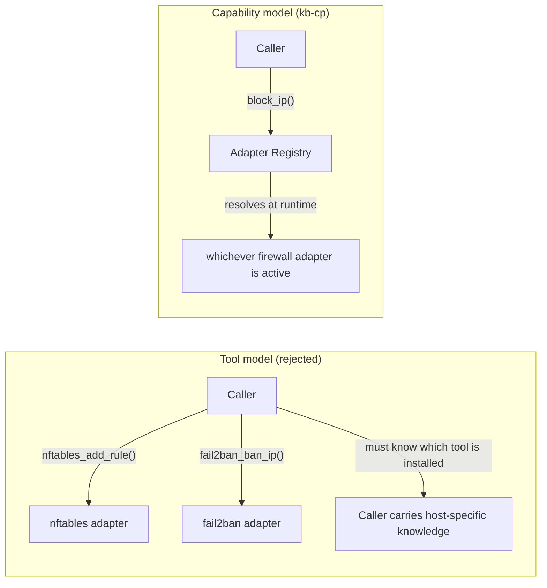

This has four concrete consequences that ripple through the rest of the design:

1. **Host heterogeneity is absorbed at one point.** A fleet with mixed `ufw`/`firewalld`/raw-`nftables` hosts needs zero caller-side branching logic. The Adapter Registry (Chapter 9) is the only place that knows or cares what's actually installed.
2. **Tool replacement is a non-event for callers.** Migrating a host from `iptables` to `nftables` is an operational change to that host's adapter configuration, not a breaking change to anything that calls kb-cp.
3. **New capabilities are added deliberately, not accidentally.** Because the protocol is capability-shaped, adding a new capability is a real design decision (does this generalize across multiple possible backing tools?) rather than just "expose whatever this one tool happens to support."
4. **Capability discovery becomes a first-class API** (Chapter 18) — callers can and should ask "what can this host actually do" rather than assuming.

> **Why not just wrap everything as generically as possible and call it good enough?** Because over-genericizing loses exactly the information that makes a tool useful. `enforce_mac_profile` for AppArmor and SELinux is a reasonable shared capability because both tools fundamentally do the same job (constrain what a process can do). `block_ip` for nftables and ClamAV would not be — there is no meaningful shared capability there, and pretending otherwise produces a worse API than not unifying at all. Capabilities are grouped by what tools *actually do the same job*, not by a desire to have fewer capability names.

## 6. Glossary of Terms

| Term | Definition |
|---|---|
| **Capability** | A named, typed action or query exposed by kb-cp's protocol (e.g. `block_ip`), independent of which tool implements it |
| **Adapter** | A translation unit inside kb-cp that implements one or more capabilities against one specific established tool's native interface |
| **Adapter Registry** | The component that discovers which adapters are viable on the current host and routes capability calls to the right one |
| **Native integration** | An adapter talking to a tool via that tool's own socket, D-Bus interface, or structured API, rather than shelling out to its CLI |
| **CLI shell-out** | An adapter invoking a tool's command-line binary and parsing its text output — used only when no native integration exists |
| **SecurityEvent** | The single normalized protobuf event shape every adapter's native events/logs are translated into |
| **Command safety layer** | The validation/dry-run/audit layer every state-changing capability call passes through before reaching the real adapter |
| **Capability discovery** | The mechanism by which kb-cp determines and reports what a given host can actually do, based on which tools are actually installed and reachable |
| **Fleet mode** | The optional multi-host extension of kb-cp where a remote transport lets one caller address many hosts' daemons (Chapter 30) |
| **Adapter plugin** | A third-party-authored adapter loaded into kb-cp without modifying the core daemon (Chapter 21) |

## 7. High-Level Architecture Overview

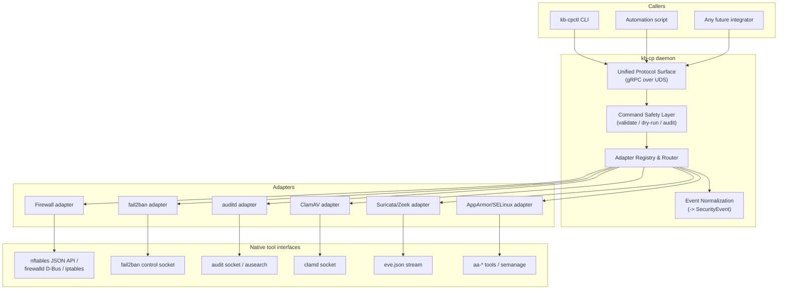

At rest, kb-cp is one long-running daemon process per host, listening on a Unix domain socket, with a set of adapter goroutines/threads each responsible for exactly one backing tool. There is no required external dependency — no database, no message broker, no network service — for single-host operation.

### 7.1 Component responsibilities

| Component | Responsibility | Does NOT do |
|---|---|---|
| Unified Protocol Surface | Accept gRPC calls, deserialize, authenticate caller | Business logic, tool-specific translation |
| Command Safety Layer | Validate, optionally dry-run, always audit-log state-changing calls | Decide *what* action to take — that's the caller's decision |
| Adapter Registry | Discover installed tools, route capability calls, expose discovery API | Talk to tools directly — that's the adapters' job |
| Adapters | Translate one capability into one tool's native calls; normalize that tool's events | Cross-tool logic, policy decisions |
| Event Normalization | Convert adapter-native event shapes into `SecurityEvent` | Filtering/alerting logic — that belongs to a consumer |

## 8. The Capability Abstraction

A capability is defined by three things: a name, a typed request message, and a typed response message — all expressed in protobuf (Chapter 19 has the full service definition; Appendix A has the full schema). Example capability definitions:

```protobuf
// capability: block_ip
message BlockIPRequest {
  string ip_or_cidr = 1;
  string reason = 2;
  uint32 ttl_seconds = 3;   // 0 = permanent until explicitly unblocked
  bool dry_run = 4;
}
message BlockIPResult {
  bool applied = 1;
  string adapter_used = 2;  // e.g. "nftables", "firewalld" -- informational only
  string rule_reference = 3; // adapter-native handle for later removal
}

// capability: scan_file
message ScanFileRequest {
  string path = 1;
  bool quarantine_on_detect = 2;
}
message ScanFileResult {
  bool clean = 1;
  repeated string signatures_matched = 2;
  string adapter_used = 3;
}
```

Two properties are non-negotiable for every capability definition:

1. **The response never leaks tool-specific shapes.** `adapter_used` is informational (useful for debugging and audit review) but callers must never be required to branch on it to interpret the result.
2. **Every state-changing capability accepts `dry_run`.** This is enforced at the protocol level, not left to individual adapters to remember — see Chapter 17.

### 8.1 Capability resolution at call time

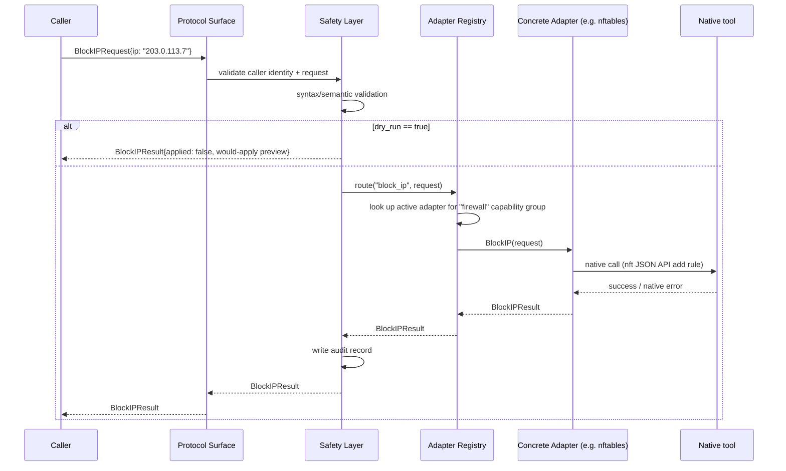

## 9. Adapter Registry & Router Deep-Dive

The Adapter Registry has two jobs: **discovery** (what's installed and healthy right now) and **routing** (given a capability call, which adapter instance handles it).

### 9.1 Discovery

At startup, and periodically thereafter (default: every 60 seconds, configurable), the registry asks every registered adapter type to self-report:

```go
type AdapterStatus int

const (
    StatusUndiscovered AdapterStatus = iota
    StatusDiscovered                  // tool binary/socket found
    StatusActive                      // tool responded to a health probe
    StatusDegraded                    // tool was active, now failing probes
    StatusUnavailable                 // tool not present on this host
)

type Adapter interface {
    Name() string
    CapabilityGroup() string          // e.g. "firewall", "brute_force_protection"
    Discover(ctx context.Context) AdapterStatus
    HealthCheck(ctx context.Context) error
}
```

### 9.2 Adapter lifecycle state machine

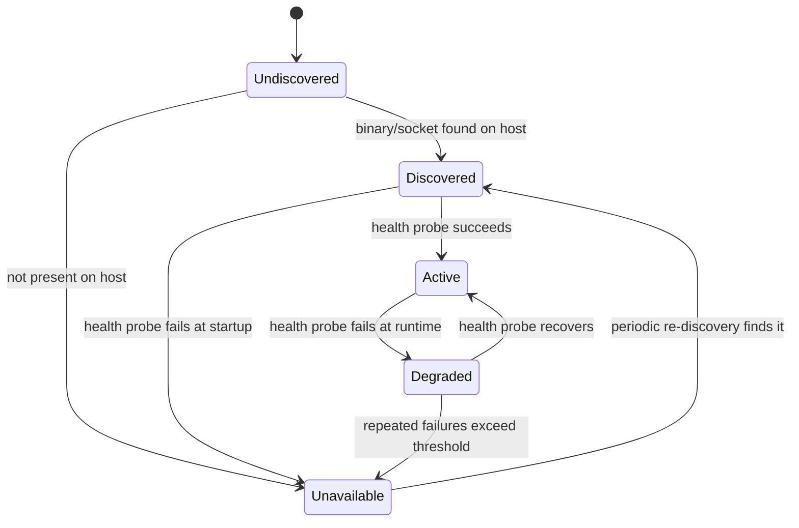

A capability call to a `Degraded` adapter is still attempted (the tool might genuinely still work even if the last probe failed transiently) but is annotated in the response and audit record so callers/operators know the answer came from a shaky source. A capability call to an `Unavailable` adapter fails fast with a clear `CAPABILITY_UNAVAILABLE` error rather than hanging or silently no-op'ing.

### 9.3 Routing when multiple adapters could serve one capability group

On a host where both `ufw` and raw `nftables` happen to be present (unusual, but possible during a migration), the registry needs a deterministic precedence order. This is host-configurable (Chapter 24) but defaults to a documented priority list per capability group — e.g. for `firewall`: `nftables` > `firewalld` > `ufw` > `iptables-legacy`, on the reasoning that more specific/modern APIs are preferred over broader/older ones when a choice exists. The resolved adapter for each capability group is logged once at startup and on every change, so "why did this rule end up in nftables and not ufw" is always answerable from the daemon's own logs.

## 10. Adapter: Firewall (nftables / iptables / firewalld / ufw)

**Capability group:** `firewall`
**Capabilities:** `block_ip`, `unblock_ip`, `allow_port`, `deny_port`, `rate_limit`, `list_rules`

| Backing tool | Native integration | Fallback |
|---|---|---|
| `nftables` | `nft -j` JSON API (structured input/output, no text scraping) | none needed |
| `firewalld` | D-Bus API (`org.fedoraproject.FirewallD1`) | `firewall-cmd` CLI shell-out |
| `ufw` | none — ufw has no structured API | CLI shell-out (`ufw` output is stable enough to parse reliably; still versioned against tested ufw releases) |
| `iptables` (legacy) | none | CLI shell-out via `iptables-save`/`iptables-restore` for atomic rule application |

```rust
// Illustrative sketch, not full implementation
trait FirewallAdapter {
    fn block_ip(&self, ip: IpCidr, ttl: Option<Duration>) -> Result<RuleHandle>;
    fn unblock_ip(&self, handle: &RuleHandle) -> Result<()>;
    fn list_rules(&self) -> Result<Vec<FirewallRule>>;
}

struct NftablesAdapter { /* holds a persistent netlink/JSON connection */ }

impl FirewallAdapter for NftablesAdapter {
    fn block_ip(&self, ip: IpCidr, ttl: Option<Duration>) -> Result<RuleHandle> {
        let rule = nft_json_rule(ip, ttl); // build structured JSON payload
        self.apply(rule)                    // via `nft -j -f -` stdin, not text flags
    }
    // ...
}
```

> **Why nftables' JSON API over `iptables`-style flag invocation?** Flag-based CLI invocation for firewall rules is exactly the kind of interface that's fragile to parse output from and easy to get subtly wrong constructing (quoting, ordering, implicit rule insertion position). The JSON API takes and returns structured data with an explicit schema — errors are structured too, so the adapter can distinguish "rule already exists" from "malformed rule" from "permission denied" instead of grepping stderr text.

### 10.1 TTL-based temporary blocks

`ttl_seconds` on `BlockIPRequest` is implemented adapter-side, not by the caller polling — the firewall adapter maintains its own lightweight expiry table (persisted so it survives a kb-cp restart) and issues the corresponding `unblock_ip` automatically when a TTL elapses. This keeps "block for 10 minutes" a one-call operation for the caller.

### 10.2 Rule ownership and coexistence

kb-cp-managed rules are tagged distinctly (an nftables comment/set membership, a firewalld rich-rule with a recognizable description) so `list_rules` can distinguish "rules kb-cp put here" from "rules that were already on this host for other reasons." kb-cp never removes or modifies a rule it did not create.

## 11. Adapter: Brute-Force Protection (fail2ban)

**Capability group:** `brute_force_protection`
**Capabilities:** `ban_ip`, `unban_ip`, `list_banned`, `get_jail_status`

fail2ban already exposes a clean local control socket (`/var/run/fail2ban/fail2ban.sock`) speaking a simple line-based protocol. The adapter connects to it directly rather than shelling out to `fail2ban-client`, which itself is just a thin wrapper around the same socket.

```python
# Illustrative sketch
class Fail2banAdapter:
    def __init__(self, sock_path="/var/run/fail2ban/fail2ban.sock"):
        self._sock_path = sock_path

    def ban_ip(self, jail: str, ip: str) -> BanResult:
        response = self._send(["set", jail, "banip", ip])
        return BanResult(applied=response.ok, jail=jail)

    def list_banned(self, jail: str) -> list[str]:
        response = self._send(["get", jail, "banip"])
        return response.data  # already structured, no text scraping needed
```

> **Why not just edit `jail.local` and restart fail2ban?** Config-file editing is the *policy* layer (which jails exist, what their thresholds are) — a much slower-moving, human-reviewed concern. The socket protocol is the *runtime control* layer (ban this IP right now, tell me what's currently banned) — exactly the layer kb-cp operates at. kb-cp does not manage fail2ban's jail configuration; that remains the operator's/config-management's job.

### 11.1 Jail selection

A host typically runs several fail2ban jails (`sshd`, `nginx-http-auth`, etc.). `ban_ip` accepts an optional `jail` field; when omitted, the adapter bans across all currently-active jails that the host's fail2ban config exposes, discovered via `get jails` on the same socket at adapter startup and refreshed on the same discovery interval as the rest of the registry.

## 12. Adapter: Audit (auditd)

**Capability group:** `audit`
**Capabilities:** `query_audit_events`, `get_audit_rules`, `stream_audit_events`

Two integration paths, chosen based on latency requirement:

| Path | Used for | Mechanism |
|---|---|---|
| `ausearch`/`auparse` invocation | One-shot historical queries (`query_audit_events` with a time range) | CLI shell-out, but output is `auparse`'s structured format, not free text — low risk, well-defined grammar |
| Direct audit netlink socket | Live streaming (`stream_audit_events`) | Reads the same multicast audit netlink group auditd itself listens on, decoding records directly — avoids the latency and buffering behavior of going through auditd's own log file |

```go
// Illustrative sketch
func (a *AuditdAdapter) StreamAuditEvents(ctx context.Context, out chan<- *pb.SecurityEvent) error {
    conn, err := netlink.Dial(netlink.NETLINK_AUDIT, 0)
    if err != nil { return err }
    for {
        raw, err := conn.Receive()
        if err != nil { return err }
        if evt, ok := decodeAuditRecord(raw); ok {
            out <- normalizeAuditEvent(evt) // -> SecurityEvent, Chapter 16
        }
    }
}
```

> **Reading the netlink socket directly, alongside auditd, is safe** — the audit multicast group supports multiple listeners; kb-cp does not need exclusive access and does not interfere with auditd's own logging. This is explicitly documented so it doesn't look like an accidental race condition on first read.

## 13. Adapter: Antivirus / Malware Scan (ClamAV)

**Capability group:** `malware_scan`
**Capabilities:** `scan_file`, `scan_path`, `get_scan_engine_status`, `update_signatures`

`clamd` (ClamAV's daemon) exposes a fast local socket protocol (`INSTREAM`, `SCAN`, `CONTSCAN` commands) specifically so callers don't have to pay full engine-startup cost per scan the way the `clamscan` CLI does. The adapter is a thin client over that socket.

```python
class ClamAVAdapter:
    def scan_file(self, path: str) -> ScanResult:
        with self._connect_clamd() as sock:
            sock.send(f"SCAN {path}\n".encode())
            response = sock.recv_until_terminator()
        return parse_clamd_response(response)  # structured: "OK" | "FOUND: <sig>" | "ERROR"

    def update_signatures(self) -> UpdateResult:
        # delegates to freshclam, the tool's own dedicated updater —
        # kb-cp does not reimplement signature distribution
        return self._run_freshclam()
```

> **Why `clamd`'s socket instead of the `clamscan` CLI?** `clamscan` reloads the entire virus definition database into memory on every invocation — acceptable for an interactive one-off scan, unacceptable for anything called repeatedly by automation. `clamd` loads once and stays warm; the socket protocol is specifically designed for exactly this use pattern.

### 13.1 Quarantine

`quarantine_on_detect: true` moves a detected file into a configurable quarantine directory (default `/var/lib/kb-cp/quarantine/`, non-executable permissions, original path recorded in metadata) rather than deleting it — deletion is a human/operator decision, not an automatic one, since false positives on a production file are far more disruptive than a few days of quarantined storage.

## 14. Adapter: IDS/IPS (Suricata / Zeek)

**Capability group:** `intrusion_detection`
**Capabilities:** `get_ids_alerts`, `stream_ids_alerts`, `get_engine_status`

Unlike the previous adapters, this one is primarily an **event source**, not a command target — kb-cp does not configure Suricata/Zeek's detection rules (that remains the security team's dedicated ruleset-management workflow) but does normalize and expose their alert stream.

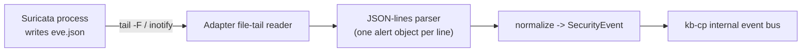

The adapter tails `eve.json` (Suricata) or Zeek's structured log directory using `inotify`, parsing each JSON-lines record as it's written — never re-parsing the whole file, and resuming from a saved file offset across daemon restarts so no alerts are lost or double-counted.

## 15. Adapter: Mandatory Access Control (AppArmor / SELinux)

**Capability group:** `mac_enforcement`
**Capabilities:** `enforce_profile`, `set_complain_mode`, `get_mac_status`, `list_profiles`

| Backing tool | Native integration |
|---|---|
| AppArmor | `aa-status`/`aa-enforce`/`aa-complain` CLI (AppArmor has no daemon/socket; these tools are themselves thin wrappers over the same kernel LSM interface kb-cp would otherwise need to touch directly) |
| SELinux | `libselinux` bindings where the implementation language has them (preferred — avoids process-spawn-per-call), `semanage`/`getenforce`/`setenforce` CLI as fallback |

> **Why CLI shell-out is acceptable here despite the general preference against it:** AppArmor genuinely has no better interface — its own maintainers ship `aa-*` as the intended control surface, there is no socket or D-Bus API being bypassed. Shell-out is only a smell when it's a *workaround* for a better interface that exists and is being ignored; here it is the tool's actual designed interface.

## 16. Event Normalization & the Unified SecurityEvent Schema

Every adapter, regardless of what it wraps, translates that tool's native event/log records into one shared shape:

```protobuf
message SecurityEvent {
  string event_id = 1;           // UUID, generated at normalization time
  google.protobuf.Timestamp occurred_at = 2;
  Severity severity = 3;         // INFO, LOW, MEDIUM, HIGH, CRITICAL
  string source_tool = 4;        // "fail2ban", "suricata", "auditd", ...
  string capability_group = 5;   // "brute_force_protection", "intrusion_detection", ...
  string subject = 6;            // the IP/path/pid/user this event is about
  string action_taken = 7;       // "banned", "alerted", "blocked", "" if observational
  string summary = 8;            // one-line human-readable description
  bytes raw_payload = 9;         // original tool-native record, preserved verbatim
  map<string, string> tags = 10; // adapter-specific extra context
}

enum Severity {
  INFO = 0;
  LOW = 1;
  MEDIUM = 2;
  HIGH = 3;
  CRITICAL = 4;
}
```

| Field | Design rationale |
|---|---|
| `raw_payload` | Normalization is a convenience layer, never a replacement for the source of truth — every event can always be traced back to exactly what the underlying tool actually said |
| `subject` | Deliberately a single string, not a typed union — different tools' "subject" concepts (an IP, a file path, a pid) don't share a natural common type, and forcing one loses information |
| `severity` | Mapped per-adapter using a documented, tool-specific translation table (Suricata's own severity scale, auditd's rule-defined priority, etc.) — never invented from scratch by guessing |
| `tags` | Escape hatch for adapter-specific context that doesn't deserve its own top-level field but is still useful for filtering/debugging |

### 16.1 Severity mapping example (Suricata)

| Suricata alert.severity | SecurityEvent Severity |
|---|---|
| 1 (highest) | CRITICAL |
| 2 | HIGH |
| 3 | MEDIUM |
| 4+ | LOW |
| n/a (stats/flow events, not alerts) | INFO |

Every adapter ships its own such table in its source, reviewed as part of that adapter's test suite (Chapter 29) — a mapping is a claim about the tool's semantics and needs to be verified against real tool output, not assumed.

## 17. Command Safety Layer: Validation, Dry-Run & Audit

Every capability call that changes state (as opposed to a query like `list_rules`) passes through three mandatory stages before it reaches an adapter:

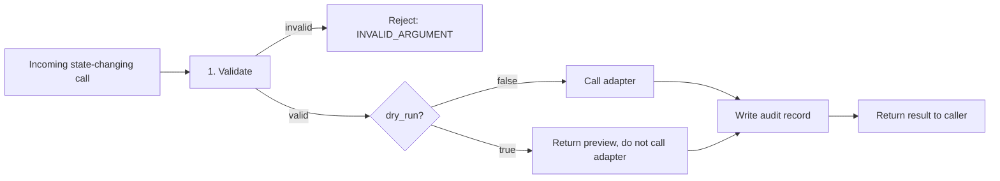

1. **Validation** — syntax (is this a well-formed IP/CIDR/path) and semantic (is this TTL within configured bounds, is this jail name one that actually exists) checks, entirely before any adapter is touched. Invalid requests never reach a native tool.
2. **Dry-run** — every state-changing capability supports `dry_run: true`, which runs validation and, where the adapter can support it cheaply (e.g. rendering the nftables rule JSON without submitting it), returns a preview of what *would* happen, with zero real-world effect.
3. **Audit** — every call that actually reaches an adapter, successful or not, produces an audit record (Chapter 28) before the result is returned to the caller — not asynchronously afterward, so there is no window where an action happened but wasn't yet recorded.

> **Why is audit-before-return mandatory rather than best-effort/async?** Because the alternative — an action takes effect, then the process crashes before the audit write completes — creates exactly the kind of gap a security control plane cannot tolerate: an unexplained firewall rule with no record of who added it or why.

## 18. Capability Discovery API

```protobuf
service Discovery {
  rpc GetHostCapabilities(Empty) returns (HostCapabilities);
}

message HostCapabilities {
  repeated CapabilityGroupStatus groups = 1;
}

message CapabilityGroupStatus {
  string group = 1;                 // "firewall", "malware_scan", ...
  string active_adapter = 2;        // "nftables", "" if none active
  AdapterStatus status = 3;         // see Chapter 9 state machine
  repeated string available_alternatives = 4; // other adapters discovered but not active
}
```

Any caller can ask, before attempting an action, "what does this host actually support" — this is what lets a single automation script behave correctly across a heterogeneous fleet without hardcoding per-host tool assumptions, and it's what a `kb-cpctl status` command surfaces directly to a human operator.

## 19. Unified Protocol Specification

kb-cp exposes one gRPC service per capability group, all reachable over a single Unix domain socket (default `/run/kb-cp/kb-cp.sock`, configurable). Splitting by capability group (rather than one giant service) keeps each `.proto` file focused and independently versionable.

| Service | Key methods |
|---|---|
| `Firewall` | `BlockIP`, `UnblockIP`, `AllowPort`, `DenyPort`, `RateLimit`, `ListRules` |
| `BruteForceProtection` | `BanIP`, `UnbanIP`, `ListBanned`, `GetJailStatus` |
| `Audit` | `QueryAuditEvents`, `GetAuditRules`, `StreamAuditEvents` (server-streaming) |
| `MalwareScan` | `ScanFile`, `ScanPath`, `GetScanEngineStatus`, `UpdateSignatures` |
| `IntrusionDetection` | `GetIDSAlerts`, `StreamIDSAlerts` (server-streaming), `GetEngineStatus` |
| `MACEnforcement` | `EnforceProfile`, `SetComplainMode`, `GetMACStatus`, `ListProfiles` |
| `Discovery` | `GetHostCapabilities` |

### 19.1 Authentication & authorization

Local callers authenticate via `SO_PEERCRED` on the Unix socket — the daemon reads the connecting process's uid/gid and checks it against a configured allowlist (Chapter 24). There is no username/password or bearer-token model for local calls; the OS's own process-identity guarantee is the trust anchor. Remote/fleet-mode calls (Chapter 30) use mutual TLS client certificates instead, since peer-cred has no equivalent over a network socket.

### 19.2 Versioning

The protocol is versioned at the package level (`kbcp.v1`, `kbcp.v2`, ...). Within a major version, only additive, backward-compatible changes are allowed (new optional fields, new methods) — matching standard protobuf evolution discipline. A breaking change requires a new major version package, served alongside the previous one for a documented deprecation window, never a silent replacement.

## 20. Data Flow Walkthroughs

### 20.1 Walkthrough: an operator blocks an IP via the CLI

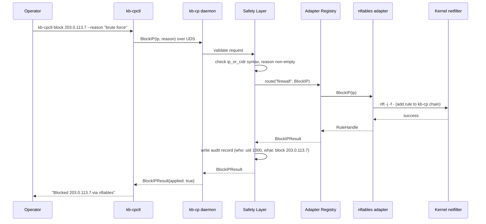

### 20.2 Walkthrough: event normalization pipeline, fail2ban ban to unified stream

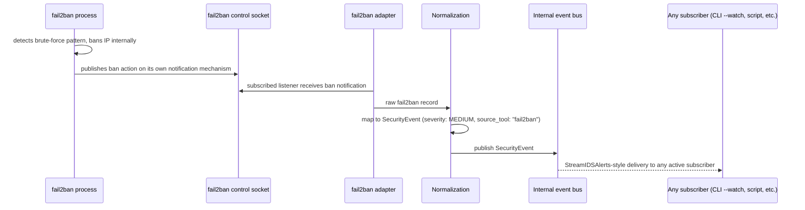

## 21. Adapter Plugin Interface

To let a third party (or a future maintainer) port a new tool in without modifying the core daemon, adapters implement a small, stable Go interface and are loaded either as compiled-in adapters (for tools shipped with the core project) or as separate plugin binaries communicating over a local gRPC socket (for third-party adapters, using the same `hashicorp/go-plugin`-style pattern that keeps a misbehaving plugin from crashing the host daemon).

```go
type AdapterPlugin interface {
    Metadata() AdapterMetadata // name, capability group, min supported tool version
    Discover(ctx context.Context) AdapterStatus
    HealthCheck(ctx context.Context) error
    HandleCapability(ctx context.Context, req CapabilityRequest) (CapabilityResponse, error)
    NormalizeEvent(raw []byte) (*pb.SecurityEvent, error)
}
```

### 21.1 Contribution checklist for a new adapter

1. Identify the capability group it belongs to, or propose a new one with justification (does this generalize across more than one possible tool?).
2. Implement `AdapterPlugin` using the tool's native socket/API wherever one exists; document explicitly if falling back to CLI shell-out and why.
3. Provide a severity-mapping table (Chapter 16.1 style) if the tool produces events.
4. Ship adapter-specific tests against both a mocked tool interface and, in CI, a real installed instance of the tool (Chapter 29).
5. Document the adapter's own chapter following the pattern of Chapters 10–15.

## 22. Tech Stack & Rationale

| Layer | Choice | Why |
|---|---|---|
| Daemon | Go | Mature concurrency primitives suit a daemon managing many independent adapter connections concurrently; strong gRPC tooling; easy static-binary packaging |
| Unified protocol | gRPC (protobuf) over Unix domain socket | Typed, codegen'd clients in any language; fast for local callers with no network stack overhead |
| CLI | Go (Cobra) | Shares language and generated client code with the daemon; single static binary distribution |
| Adapters | Native socket/API integration per tool by default (fail2ban socket, clamd socket, nftables JSON API, D-Bus for firewalld, netlink for auditd); CLI shell-out only where no native integration exists (AppArmor, ufw) | Native integrations are faster, don't break on CLI help-text changes, and expose structured errors |
| Plugin transport (third-party adapters) | Local gRPC over a dedicated per-plugin Unix socket | Process isolation — a misbehaving third-party adapter cannot crash the core daemon |
| Config | YAML, schema-validated at daemon startup | Human-editable, well-understood, easy to diff in version control |

## 23. Repository Layout & Build System

```
kb-cp/
├── cmd/
│   ├── kb-cpd/            # daemon entrypoint
│   └── kb-cpctl/          # CLI entrypoint
├── internal/
│   ├── protocol/          # gRPC service implementations, UDS listener
│   ├── safety/            # validation, dry-run, audit-record writing
│   ├── registry/          # adapter discovery + routing
│   └── audit/             # append-only audit log writer
├── adapters/
│   ├── firewall/          # nftables, firewalld, ufw, iptables sub-adapters
│   ├── fail2ban/
│   ├── auditd/
│   ├── clamav/
│   ├── suricata/
│   └── mac/                # AppArmor, SELinux sub-adapters
├── proto/                  # .proto source files, one per capability group
├── plugin-sdk/              # public Go interface + helpers for third-party adapters
├── config/                  # example kb-cp.yaml, JSON schema for validation
├── tests/
│   ├── unit/
│   └── integration/         # spins up real tool instances in CI containers
└── docs/
```

### 23.1 Build

```bash
# Generate gRPC code from proto definitions
buf generate

# Build daemon and CLI as static binaries
go build -o build/kb-cpd ./cmd/kb-cpd
go build -o build/kb-cpctl ./cmd/kb-cpctl

# Run the full test suite (unit + integration against containerized real tools)
make test
```

## 24. Configuration Reference

```yaml
# /etc/kb-cp/kb-cp.yaml
socket_path: /run/kb-cp/kb-cp.sock

auth:
  allowed_uids: [0, 1000]     # SO_PEERCRED allowlist for local callers

discovery:
  interval_seconds: 60

adapters:
  firewall:
    preference_order: [nftables, firewalld, ufw, iptables]
  fail2ban:
    socket_path: /var/run/fail2ban/fail2ban.sock
  auditd:
    mode: netlink              # or "ausearch_only" if netlink access is restricted
  clamav:
    clamd_socket: /var/run/clamav/clamd.ctl
    quarantine_dir: /var/lib/kb-cp/quarantine
  suricata:
    eve_json_path: /var/log/suricata/eve.json
  mac:
    backend: auto               # auto-detect apparmor vs selinux

safety:
  default_dry_run_ttl_seconds: 3600   # max TTL a dry-run preview claims

audit:
  log_path: /var/log/kb-cp/audit.log
  chain_hash: true                     # tamper-evident hash-chained records
```

Every field is schema-validated at daemon startup (Chapter 29); an invalid config fails the daemon fast with a specific error rather than starting in a partially-configured, surprising state.

## 25. Security Model & Threat Model

kb-cp holds real, consequential privilege — it can reconfigure a host's firewall, ban hosts, and change mandatory-access-control enforcement. Its own security posture must be treated with at least the rigor of the tools it fronts.

| Risk | Mitigation |
|---|---|
| Unauthorized local process calls a state-changing capability | `SO_PEERCRED`-based uid/gid allowlist (Chapter 19.1); no capability is reachable without passing this check |
| Malformed/malicious request crashes an adapter or corrupts a native tool's state | Strict validation in the Safety Layer before any adapter is touched (Chapter 17); adapters treat their own inputs as untrusted even though they originate in-process |
| An adapter's native tool is itself compromised and feeds kb-cp malicious event data | Event normalization treats all adapter input as untrusted; `raw_payload` is size-capped; parsers are fuzz-tested (Chapter 29) |
| Audit log tampering after a compromise | Hash-chained append-only audit records (Chapter 28) — a modified historical record breaks the chain and is detectable |
| A third-party adapter plugin misbehaves or is compromised | Plugins run as separate processes over a local gRPC socket, not in-process — a plugin crash or hang cannot take down the core daemon (Chapter 21) |
| Privilege creep — one adapter ends up able to affect another adapter's domain | Per-adapter OS-level privilege scoping (Chapter 25.1) — enforced by systemd unit capabilities, not just code discipline |
| Remote (fleet-mode) calls intercepted or spoofed | Mutual TLS with short-lived client certificates for all remote transport (Chapter 30); local UDS is the default and preferred path when remote isn't needed |

### 25.1 Least privilege per adapter

Each adapter runs with only the OS-level capability it actually needs, enforced via systemd unit hardening (`CapabilityBoundingSet`, `ProtectSystem`, dedicated service accounts where the underlying tool supports non-root operation):

| Adapter | Minimum required privilege |
|---|---|
| Firewall (nftables) | `CAP_NET_ADMIN` only |
| fail2ban | Read/write on its Unix control socket only — no elevated OS capability needed, fail2ban itself holds the real privilege |
| auditd | `CAP_AUDIT_READ` for netlink; no write capability needed (kb-cp does not modify audit rules) |
| ClamAV | Read access to scanned paths, read/write to quarantine dir; no elevated OS capability |
| Suricata/Zeek | Read-only access to the eve.json log path |
| AppArmor/SELinux | `CAP_MAC_ADMIN` (or SELinux equivalent) only |

The fail2ban adapter, concretely, must never be granted `CAP_NET_ADMIN` — it has no legitimate reason to touch firewall state directly, and scoping it out entirely means a bug or compromise in that one adapter cannot escalate into firewall manipulation.

## 26. Performance Engineering

| Path | Target latency (p99) | Notes |
|---|---|---|
| `block_ip` (nftables JSON API) | < 5ms | Dominated by netlink round-trip, not kb-cp's own overhead |
| `ban_ip` (fail2ban socket) | < 3ms | Simple line-protocol round-trip |
| `scan_file` (clamd, small file) | < 50ms | Dominated by clamd's own scan time, not adapter overhead |
| `query_audit_events` (ausearch, 1hr window) | < 200ms | CLI shell-out path; documented as the slowest capability by design |
| `stream_ids_alerts` per-event delivery | < 10ms from eve.json write to subscriber delivery | Bounded by inotify wake-up latency + JSON parse |
| Discovery cycle (all adapters) | < 500ms total | Runs on a background timer, never blocks a live capability call |

### 26.1 Benchmarking methodology

Every adapter ships a benchmark harness that measures kb-cp's *own* overhead separately from the underlying tool's inherent latency — e.g. for `block_ip`, benchmark the raw `nft -j` round-trip time independently, then benchmark the full kb-cp call path, and report the delta. A regression in the delta (kb-cp's own overhead growing) is a build-blocking CI failure; a regression in the raw tool's own time is not kb-cp's problem to fix, only to report honestly.

## 27. Reliability & Failure Modes

| Failure | Behavior |
|---|---|
| Underlying tool's socket/binary is gone entirely | Adapter transitions to `Unavailable` (Chapter 9.2); capability calls fail fast with `CAPABILITY_UNAVAILABLE`, never hang |
| Underlying tool is present but misconfigured (e.g. fail2ban running with zero jails) | Adapter stays `Active` but reports the specific limitation via `Discovery` (e.g. `available_alternatives` / status detail) rather than silently no-op'ing |
| Underlying tool is slow/hung | Every adapter call has a bounded timeout (default 5s, configurable); a timeout surfaces as a specific `ADAPTER_TIMEOUT` error, is audited as a failed attempt, and flips the adapter to `Degraded` |
| kb-cp daemon itself crashes mid-call | No in-flight action is left half-applied at the daemon layer — each adapter call is a single atomic native operation (a single `nft` transaction, a single socket round-trip); on restart, the daemon re-runs discovery and resumes serving, with no attempt to "recover" in-flight calls since none can be left partially applied by design |
| Config file is invalid at startup | Daemon refuses to start, logs the specific schema violation, exits non-zero — never starts in a partially-valid state |

## 28. Observability, Logging & Audit Trail

Three distinct log/record streams, kept separate on purpose:

1. **Daemon operational log** — standard structured logging (adapter discovery transitions, config load, errors) for debugging kb-cp itself. Rotated, not tamper-evident, not a security record.
2. **SecurityEvent stream** — the normalized event flow (Chapter 16), available to any authorized subscriber in real time; not itself the audit trail, since it includes observational events (an IDS alert) as well as kb-cp-caused ones.
3. **Audit trail** — append-only, hash-chained records of every state-changing capability call kb-cp itself made: who called it (uid, from `SO_PEERCRED`), what was requested, what the Safety Layer decided, what the adapter actually did, and the result. This is the record that answers "why is this firewall rule here" months later.

```protobuf
message AuditRecord {
  string record_id = 1;
  google.protobuf.Timestamp timestamp = 2;
  uint32 caller_uid = 3;
  string capability = 4;          // "firewall.BlockIP"
  bytes request_payload = 5;
  bytes result_payload = 6;
  bool dry_run = 7;
  string prev_record_hash = 8;    // hash-chaining
  string record_hash = 9;
}
```

Each record's `record_hash` covers its own content plus `prev_record_hash`, so any retroactive edit to an earlier record breaks every subsequent hash — tamper-evidence without needing an external append-only storage system, though shipping the chain to write-once external storage (e.g. a remote syslog target configured for append-only delivery) is recommended for defense in depth.

## 29. Testing, Deployment & Operations

### 29.1 Testing strategy

| Layer | Approach |
|---|---|
| Adapter unit tests | Mock the native tool interface (a fake fail2ban socket server, a fake clamd socket) — fast, no real tool installation required, run on every commit |
| Adapter integration tests | Run against real installed tool instances inside CI containers (a container with actual `nftables`, actual `fail2ban` running) — catches drift against real tool behavior, run pre-merge |
| Safety layer tests | Exhaustive validation-boundary testing (malformed CIDRs, out-of-range TTLs, empty required fields) — this layer is the last line of defense before a native tool is touched, so its test coverage bar is the highest in the project |
| Fuzz testing | Event-normalization parsers (Suricata eve.json, audit netlink records) fuzzed against malformed/adversarial input, since these parse data that could originate from a compromised or malfunctioning source |
| End-to-end tests | Full call path through a real daemon instance against real containerized tools, verifying protocol correctness, audit record generation, and dry-run accuracy together |

### 29.2 Deployment & packaging

- Single static binary per component (`kb-cpd`, `kb-cpctl`), no runtime dependency beyond the OS and whatever security tools are actually being adapted.
- systemd unit for `kb-cpd` with capability-scoped hardening (`CapabilityBoundingSet` matching Chapter 25.1's table, `ProtectSystem=strict`, dedicated non-root user where the daemon's own operation permits it — some adapters unavoidably need root or specific capabilities, scoped per-adapter, not blanket-granted to the whole daemon process).
- Install script performs discovery on first run and prints a human-readable capability report (`kb-cpctl status`), so an operator immediately sees what got detected on this specific host.

### 29.3 Operations runbook (excerpt)

| Symptom | First checks |
|---|---|
| `kb-cpctl status` shows an adapter `Unavailable` unexpectedly | Confirm the underlying tool's own service is running (`systemctl status fail2ban`, etc.) — kb-cp reflects reality, it doesn't cause tool outages |
| A `block_ip` call succeeds per kb-cp but the IP isn't actually blocked | Check `list_rules` output against the tool's own native inspection command (`nft list ruleset`) — look for a rule-ownership/precedence conflict with a pre-existing manual rule |
| Audit log hash chain reports a break | Treat as a potential tamper event — stop trusting the local audit log, pull from the external append-only mirror if configured, investigate host integrity before resuming normal operation |

## 30. Roadmap to v1.0 and Beyond

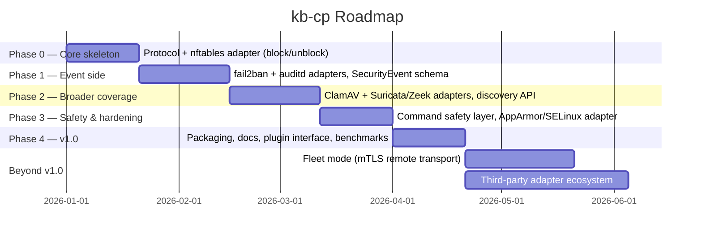

1. **Phase 0** — Protocol skeleton (gRPC over UDS), single adapter end to end: `nftables` `block_ip`/`unblock_ip`, CLI to drive it. Usable v0.1.
2. **Phase 1** — `fail2ban` and `auditd` adapters; establish the `SecurityEvent` schema and streaming API.
3. **Phase 2** — `ClamAV` and `Suricata`/`Zeek` adapters; capability-discovery API.
4. **Phase 3** — Command safety layer (validation, dry-run, hash-chained audit trail); `AppArmor`/`SELinux` adapter.
5. **Phase 4 (v1.0)** — Packaging (static binaries + systemd units + install script), adapter plugin interface, published benchmark suite, docs site.
6. **Beyond v1.0** — Multi-host fleet mode (same protocol, mTLS remote transport, a fleet-aware `kb-cpctl --host` flag); a documented process for third parties to contribute or privately maintain their own adapters against the stable plugin interface (Chapter 21); further adapters as demand emerges (e.g. `wazuh`/`OSSEC` agent integration) beyond the file-integrity/rootkit-detection coverage (Chapter 31) already in scope for v1.0.

## 31. Adapter: File Integrity & Rootkit Detection (rkhunter / chkrootkit / AIDE)

**Capability group:** `file_integrity`
**Capabilities:** `run_rootkit_scan`, `get_last_scan_result`, `check_file_integrity_baseline`, `update_integrity_baseline`

Established host-integrity tools split cleanly into two jobs, and the adapter is organized the same way: **rootkit/anomaly scanners** (rkhunter, chkrootkit), which run a battery of heuristic checks and produce a report, and **file integrity monitors** (AIDE), which compare the live filesystem against a cryptographic baseline and report drift.

| Backing tool | Native integration | Fallback |
|---|---|---|
| `rkhunter` | none — rkhunter is a shell-script-driven batch scanner with no daemon/socket | CLI shell-out (`rkhunter --check --sk --report-warnings-only`), stdout parsed against a stable, versioned line-format grammar |
| `chkrootkit` | none | CLI shell-out (`chkrootkit -q`), output lines matched against a per-check regex table maintained alongside the adapter's tests |
| `AIDE` | none, but the database format is documented and stable | CLI shell-out (`aide --check`) for comparison runs; adapter reads AIDE's own report file directly rather than re-parsing stdout, since the report file has a more stable structure than terminal output |

```bash
# Illustrative: what the adapter actually shells out to for a rootkit scan
rkhunter --check --sk --report-warnings-only --nocolors
# exit code 0 = clean, 1 = warnings found -- adapter treats exit code as the
# primary signal and line-parsing as detail enrichment, never the other way around
```

> **Why CLI shell-out is the whole story here, not just a fallback:** unlike the firewall or antivirus adapters, none of these three tools were ever built with a daemon-and-socket model in mind — they are intentionally simple, infrequently-run batch scripts, and that simplicity is part of their trustworthiness (fewer moving parts to compromise). Wrapping them in a persistent daemon of their own would work against their design, not with it. The adapter instead focuses its engineering effort on parsing their output *robustly*: every parser ships a table of recognized output lines per supported tool version (Chapter 32), fails closed (treats an unparseable line as "needs manual review," never as "clean"), and is tested against captured real output from every supported version in CI.

### 31.1 Scan scheduling and result caching

Unlike the always-warm daemons behind other adapters, these tools are batch scanners that can take minutes to run. `run_rootkit_scan` supports an `async: true` flag — the call returns immediately with a scan handle, and `get_last_scan_result` (or a `StreamIDSAlerts`-style subscription tagged with `source_tool: "rkhunter"`) is used to retrieve the result once complete. The adapter also runs a configurable periodic scan (default: daily, off-peak) independent of any explicit caller request, since these tools are traditionally operated this way and callers should get a recent result instantly rather than always paying the full scan cost synchronously.

### 31.2 AIDE baseline lifecycle

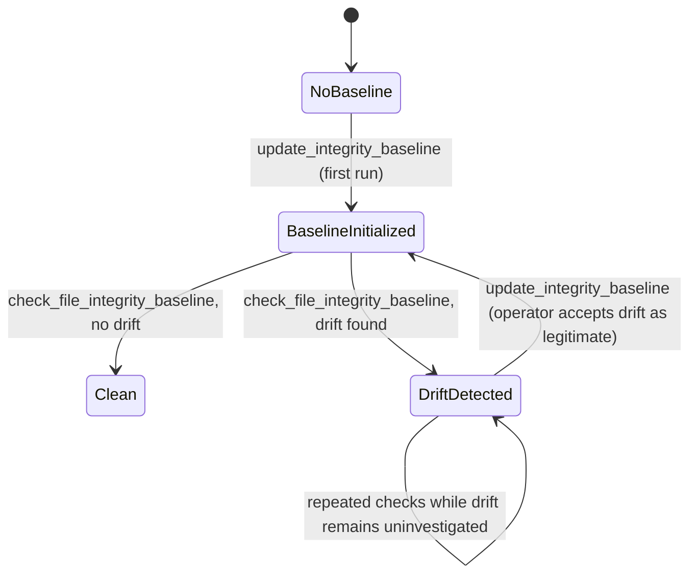

`update_integrity_baseline` is deliberately never called automatically by kb-cp itself in response to `DriftDetected` — re-baselining after unexplained drift is a decision that erases the evidence of what changed, so it always requires an explicit, audited caller action (an operator, or an upstream system that has already investigated the drift and made a decision). This mirrors the same "kb-cp does not make policy decisions, it executes explicit ones" principle from Chapter 17.

## 32. Tool Version Compatibility Matrix

Every adapter targets a documented minimum tool version and is tested in CI against that version plus the latest stable release at time of writing. Version drift in a tool's own CLI output or API shape is one of the most common real-world sources of adapter breakage, so this matrix is treated as a living, test-enforced contract, not a one-time note.

| Tool | Minimum supported version | Latest tested version | Known API/behavior differences across the range |
|---|---|---|---|
| `nftables` | 0.9.0 | 1.0.x | JSON API (`nft -j`) stabilized in 0.9.3; earlier 0.9.x point releases have minor schema differences in set-element representation — adapter detects `nft --version` at discovery time and selects a schema variant accordingly |
| `iptables` (legacy) | 1.8.0 | 1.8.x | `iptables-legacy` vs `iptables-nft` backend selection affects whether rules are visible to the nftables adapter too — the registry's discovery step (Chapter 9) checks `update-alternatives --display iptables` (or distro equivalent) to avoid two adapters fighting over the same underlying ruleset |
| `firewalld` | 0.8.0 | 1.x | D-Bus interface (`org.fedoraproject.FirewallD1`) has been stable across this range; rich-rule syntax gained IPv6 CIDR normalization in 0.9 — adapter normalizes both representations to one internal form regardless of version |
| `fail2ban` | 0.10.0 | 1.0.x | Control socket protocol unchanged since 0.9; `0.10.x` added structured `get <jail> banip --with-time` — adapter uses it when available (detected via `fail2ban-client version`) and falls back to plain `banip` on older installs |
| `auditd` | 2.8.0 | 3.1.x | Netlink record format is stable across this whole range; `ausearch`'s `--format json` (used for one-shot queries) was only added in 3.0 — pre-3.0 hosts fall back to the interpreted-text format with a dedicated parser |
| `ClamAV` (`clamd`) | 0.103 | 1.x | `INSTREAM` command unchanged; `clamd.conf`'s `StreamMaxLength` default changed between major versions and affects large-file scanning — adapter reads the configured value at discovery time rather than assuming a default |
| `Suricata` | 6.0 | 7.x | `eve.json` schema is additive-stable across this range for the fields the adapter consumes; `alert.severity` scale is unchanged since Suricata 4.x |
| `AppArmor` | 2.13 | 4.x | `aa-status --json` (preferred, avoids text parsing) was added in AppArmor 3.0 — pre-3.0 hosts fall back to parsing `aa-status`'s human-readable text, a stable but slower path |
| `SELinux` (via `libselinux`) | 2.9 | 3.x | Core query/set API used by the adapter has been ABI-stable across this range |

> **Policy on dropping support for an old version:** an adapter may drop a minimum-version floor only after (a) the fallback code path has been in the tree, tested, and unused-in-CI for at least one release cycle, and (b) the version being dropped is old enough that upstream itself no longer receives security patches for it. This keeps the compatibility matrix honest rather than aspirational.

## 33. Rollback & Undo Semantics

Several of the established tools kb-cp ports already have their own native notion of "this action is temporary" — fail2ban's ban duration, an nftables rule with a kernel-level timeout. kb-cp's unified layer represents this consistently across every adapter rather than leaving it as a per-tool implementation detail callers need to know about.

### 33.1 Two undo models, one consistent shape

| Model | How it's expressed | Adapters that use it |
|---|---|---|
| **TTL-based automatic expiry** | `ttl_seconds` on the request; the adapter (not the caller) is responsible for the eventual automatic undo | Firewall (`block_ip`), Brute-force protection (`ban_ip`) |
| **Explicit undo call** | A paired `Unblock`/`Unban`/`RemoveProfile`-style capability referencing the original action's `rule_reference`/handle | All adapters that produce a durable, reversible effect |

Both models are always available together — a TTL-based block can still be undone early via the explicit call, and a permanent (`ttl_seconds: 0`) block can only ever be undone explicitly. This is deliberate: an operator should never be stuck waiting out a TTL they no longer want, and a caller who *does* want automatic cleanup should never have to remember to call an explicit undo later.

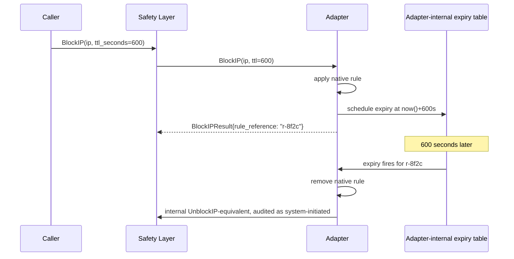

### 33.2 Expiry survives a daemon restart

The TTL expiry table (Chapter 10.1 introduced this for the firewall adapter specifically; the same pattern applies to every adapter that supports TTLs) is persisted to local disk, not held only in memory — a kb-cp daemon restart must not either (a) lose track of a pending expiry, leaving a "temporary" block permanent forever, or (b) fire all pending expiries immediately on restart out of confusion about elapsed time. On startup, each adapter reloads its expiry table and recomputes remaining TTL from the persisted absolute expiry timestamp, not from the original relative duration.

### 33.3 Undo actions are audited identically to the original action

An automatic TTL-driven expiry produces its own `AuditRecord` (Chapter 28), tagged as system-initiated (`caller_uid` set to a reserved value meaning "kb-cp itself, TTL expiry" rather than a real uid) rather than silently happening off the audit trail. Reviewing "why is this IP no longer blocked" must be exactly as answerable as reviewing "why is this IP blocked" in the first place.

## 34. Worked Case Study: Blocking a Suspicious IP End-to-End

This chapter traces one concrete call through every layer described so far, with the actual wire payloads shown, to make the abstract architecture in Chapters 7–20 concrete.

**Scenario:** an automated caller (a script watching authentication logs) has decided `198.51.100.23` should be blocked for 30 minutes.

**Step 1 — the gRPC call, as JSON (what protoc-gen would produce for debugging/logging purposes):**

```json
{
  "method": "kbcp.v1.Firewall/BlockIP",
  "request": {
    "ip_or_cidr": "198.51.100.23/32",
    "reason": "5 failed SSH auth attempts in 60s",
    "ttl_seconds": 1800,
    "dry_run": false
  }
}
```

**Step 2 — Safety Layer validation** (Chapter 17): CIDR syntax checked (`198.51.100.23/32` parses as a valid single-host CIDR), `reason` is non-empty, `ttl_seconds` (1800) is within the configured bound (`default_dry_run_ttl_seconds: 3600` from Chapter 24 caps previews, but a real, non-dry-run TTL is bounded by a separate, larger configured ceiling — default 86400). Request passes.

**Step 3 — Adapter Registry routing** (Chapter 9.3): capability group `firewall` resolves to the `nftables` adapter per this host's discovered preference order.

**Step 4 — nftables adapter native call:**

```json
// what the adapter sends to `nft -j -f -`
{
  "nftables": [
    {
      "add": {
        "rule": {
          "family": "inet",
          "table": "kbcp",
          "chain": "kbcp_block",
          "expr": [
            { "match": { "left": { "payload": { "protocol": "ip", "field": "saddr" } },
                         "op": "==", "right": "198.51.100.23" } },
            { "drop": null }
          ],
          "comment": "kbcp:r-9a41:exp=1735689600"
        }
      }
    }
  ]
}
```

Note the `comment` field encodes both the kb-cp rule reference (`r-9a41`, satisfying the rule-ownership tagging from Chapter 10.2) and the absolute expiry Unix timestamp (satisfying the persisted-expiry requirement from Chapter 33.2) directly in the native rule — so even a from-scratch inspection of the raw nftables ruleset (`nft list ruleset`) shows enough context to understand what a kb-cp-owned rule is for, without needing kb-cp's own database to interpret it.

**Step 5 — result and audit record:**

```json
{
  "result": { "applied": true, "adapter_used": "nftables", "rule_reference": "r-9a41" },
  "audit_record": {
    "record_id": "ar-2f88e1",
    "caller_uid": 1000,
    "capability": "firewall.BlockIP",
    "dry_run": false,
    "prev_record_hash": "…",
    "record_hash": "…"
  }
}
```

**Step 6 — 30 minutes later**, the expiry table (Chapter 33.1) fires, the adapter issues the matching `delete rule` nftables command referencing the same rule handle, and a second, system-initiated `AuditRecord` is written closing the loop.

## 35. Troubleshooting & FAQ

**"`kb-cpctl status` shows an adapter as `Unavailable`, but I know the tool is installed."**
Check that the tool's control surface (socket, binary path) matches what kb-cp's config expects (Chapter 24) — a nonstandard install path is the most common cause. Discovery logs (Chapter 28's operational log) record exactly what path/socket was probed and what error resulted; this is always the first thing to check before assuming a deeper problem.

**"A `dry_run: true` call returned a preview, but I'm not fully sure it matches what would really happen."**
Dry-run previews are generated by the same code path that would apply the real change, up to the final native-tool call (Chapter 17) — for adapters where the native tool itself can do a true dry-run (nftables can validate a ruleset without committing it), the preview uses that. For adapters without a native dry-run concept (fail2ban has no "would-ban" mode), the preview is kb-cp's own best-effort rendering of the intended native call, clearly labeled as such in the response so callers don't over-trust it as tool-verified.

**"Two capability calls for the same IP raced and I'm not sure which one 'won.'"**
Each adapter serializes native calls that touch the same underlying resource (Chapter 9's registry routes to one adapter instance per capability group, and that instance processes its native-tool calls sequentially per resource) — there is no scenario where two concurrent `BlockIP` calls for the same IP produce two conflicting native rules. The audit trail (Chapter 28) shows the true order of both calls and which one actually resulted in the final applied state.

**"`query_audit_events` is much slower than the other capabilities — is that a bug?"**
No — it's documented as the slowest capability by design (Chapter 26), since the `ausearch`/`auparse` path is CLI shell-out over historical log data, not a live socket. Callers with latency-sensitive needs should use `stream_audit_events` for anything going forward from "now" and reserve `query_audit_events` for genuinely historical lookups.

**"An adapter plugin I wrote crashes — does that take down the whole daemon?"**
No — third-party adapter plugins run as separate processes (Chapter 21), communicating over their own local gRPC socket. A plugin crash surfaces as that one capability group transitioning to `Unavailable`; every other adapter, and the core daemon itself, keeps running unaffected.

**"The audit log's hash chain reports a break — what do I do?"**
Treat this as a potential tamper event, not a bug to route around (Chapter 29.3's runbook covers this) — do not simply reset or truncate the chain to make the error go away. Pull from an external append-only mirror if one is configured, and investigate host integrity before trusting the local audit log again.

## Appendix A: Full Protobuf Schema Reference

```protobuf
syntax = "proto3";
package kbcp.v1;

import "google/protobuf/timestamp.proto";

// ---- Shared types ----

enum Severity {
  INFO = 0;
  LOW = 1;
  MEDIUM = 2;
  HIGH = 3;
  CRITICAL = 4;
}

enum AdapterStatus {
  UNDISCOVERED = 0;
  DISCOVERED = 1;
  ACTIVE = 2;
  DEGRADED = 3;
  UNAVAILABLE = 4;
}

message SecurityEvent {
  string event_id = 1;
  google.protobuf.Timestamp occurred_at = 2;
  Severity severity = 3;
  string source_tool = 4;
  string capability_group = 5;
  string subject = 6;
  string action_taken = 7;
  string summary = 8;
  bytes raw_payload = 9;
  map<string, string> tags = 10;
}

message AuditRecord {
  string record_id = 1;
  google.protobuf.Timestamp timestamp = 2;
  uint32 caller_uid = 3;
  string capability = 4;
  bytes request_payload = 5;
  bytes result_payload = 6;
  bool dry_run = 7;
  string prev_record_hash = 8;
  string record_hash = 9;
}

// ---- Firewall ----

service Firewall {
  rpc BlockIP(BlockIPRequest) returns (BlockIPResult);
  rpc UnblockIP(UnblockIPRequest) returns (UnblockIPResult);
  rpc AllowPort(AllowPortRequest) returns (AllowPortResult);
  rpc DenyPort(DenyPortRequest) returns (DenyPortResult);
  rpc RateLimit(RateLimitRequest) returns (RateLimitResult);
  rpc ListRules(Empty) returns (RuleList);
}

message BlockIPRequest {
  string ip_or_cidr = 1;
  string reason = 2;
  uint32 ttl_seconds = 3;
  bool dry_run = 4;
}
message BlockIPResult {
  bool applied = 1;
  string adapter_used = 2;
  string rule_reference = 3;
}
message UnblockIPRequest { string rule_reference = 1; }
message UnblockIPResult { bool applied = 1; }
message AllowPortRequest { uint32 port = 1; string proto = 2; bool dry_run = 3; }
message AllowPortResult { bool applied = 1; string rule_reference = 2; }
message DenyPortRequest { uint32 port = 1; string proto = 2; bool dry_run = 3; }
message DenyPortResult { bool applied = 1; string rule_reference = 2; }
message RateLimitRequest { string ip_or_cidr = 1; uint32 max_per_minute = 2; bool dry_run = 3; }
message RateLimitResult { bool applied = 1; string rule_reference = 2; }
message RuleList { repeated FirewallRule rules = 1; }
message FirewallRule {
  string reference = 1;
  string description = 2;
  google.protobuf.Timestamp created_at = 3;
  uint32 ttl_remaining_seconds = 4;
}

// ---- Brute-force protection ----

service BruteForceProtection {
  rpc BanIP(BanIPRequest) returns (BanIPResult);
  rpc UnbanIP(UnbanIPRequest) returns (UnbanIPResult);
  rpc ListBanned(ListBannedRequest) returns (BannedList);
  rpc GetJailStatus(Empty) returns (JailStatusList);
}

message BanIPRequest { string ip = 1; string jail = 2; bool dry_run = 3; }
message BanIPResult { bool applied = 1; string jail = 2; }
message UnbanIPRequest { string ip = 1; string jail = 2; }
message UnbanIPResult { bool applied = 1; }
message ListBannedRequest { string jail = 1; }
message BannedList { repeated string ips = 1; }
message JailStatusList { repeated JailStatus jails = 1; }
message JailStatus { string name = 1; uint32 currently_banned = 2; bool active = 3; }

// ---- Audit ----

service Audit {
  rpc QueryAuditEvents(AuditQuery) returns (SecurityEventList);
  rpc GetAuditRules(Empty) returns (AuditRuleList);
  rpc StreamAuditEvents(Empty) returns (stream SecurityEvent);
}

message AuditQuery {
  google.protobuf.Timestamp since = 1;
  google.protobuf.Timestamp until = 2;
  string filter_subject = 3;
}
message SecurityEventList { repeated SecurityEvent events = 1; }
message AuditRuleList { repeated string rules = 1; }

// ---- Malware scan ----

service MalwareScan {
  rpc ScanFile(ScanFileRequest) returns (ScanFileResult);
  rpc ScanPath(ScanPathRequest) returns (stream ScanFileResult);
  rpc GetScanEngineStatus(Empty) returns (EngineStatus);
  rpc UpdateSignatures(Empty) returns (UpdateResult);
}

message ScanFileRequest { string path = 1; bool quarantine_on_detect = 2; }
message ScanFileResult {
  bool clean = 1;
  repeated string signatures_matched = 2;
  string adapter_used = 3;
  string quarantined_to = 4;
}
message ScanPathRequest { string path = 1; bool recursive = 2; bool quarantine_on_detect = 3; }
message EngineStatus { string version = 1; google.protobuf.Timestamp signatures_updated_at = 2; }
message UpdateResult { bool updated = 1; string new_version = 2; }

// ---- Intrusion detection ----

service IntrusionDetection {
  rpc GetIDSAlerts(AlertQuery) returns (SecurityEventList);
  rpc StreamIDSAlerts(Empty) returns (stream SecurityEvent);
  rpc GetEngineStatus(Empty) returns (EngineStatus);
}

message AlertQuery {
  google.protobuf.Timestamp since = 1;
  Severity min_severity = 2;
}

// ---- MAC enforcement ----

service MACEnforcement {
  rpc EnforceProfile(EnforceProfileRequest) returns (EnforceProfileResult);
  rpc SetComplainMode(SetComplainModeRequest) returns (SetComplainModeResult);
  rpc GetMACStatus(Empty) returns (MACStatus);
  rpc ListProfiles(Empty) returns (ProfileList);
}

message EnforceProfileRequest { string profile = 1; bool dry_run = 2; }
message EnforceProfileResult { bool applied = 1; }
message SetComplainModeRequest { string profile = 1; }
message SetComplainModeResult { bool applied = 1; }
message MACStatus { string backend = 1; string mode = 2; }
message ProfileList { repeated string profiles = 1; }

// ---- File integrity & rootkit detection ----

service FileIntegrity {
  rpc RunRootkitScan(RunRootkitScanRequest) returns (ScanHandle);
  rpc GetLastScanResult(Empty) returns (RootkitScanResult);
  rpc CheckFileIntegrityBaseline(Empty) returns (IntegrityCheckResult);
  rpc UpdateIntegrityBaseline(Empty) returns (BaselineUpdateResult);
}

message RunRootkitScanRequest { bool async = 1; }
message ScanHandle { string scan_id = 1; }
message RootkitScanResult {
  string scan_id = 1;
  google.protobuf.Timestamp completed_at = 2;
  bool clean = 3;
  repeated string warnings = 4;
  string adapter_used = 5; // "rkhunter" or "chkrootkit"
}
message IntegrityCheckResult {
  bool drift_detected = 1;
  repeated string changed_paths = 2;
  google.protobuf.Timestamp baseline_created_at = 3;
}
message BaselineUpdateResult { bool updated = 1; google.protobuf.Timestamp updated_at = 2; }

// ---- Discovery ----

service Discovery {
  rpc GetHostCapabilities(Empty) returns (HostCapabilities);
}

message HostCapabilities {
  repeated CapabilityGroupStatus groups = 1;
}
message CapabilityGroupStatus {
  string group = 1;
  string active_adapter = 2;
  AdapterStatus status = 3;
  repeated string available_alternatives = 4;
}

message Empty {}
```
