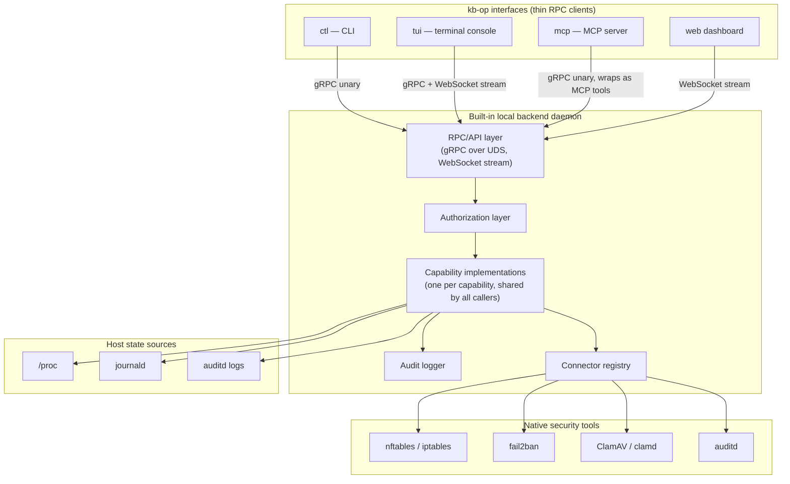
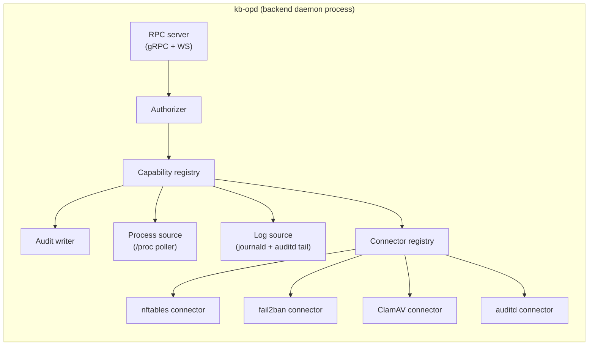
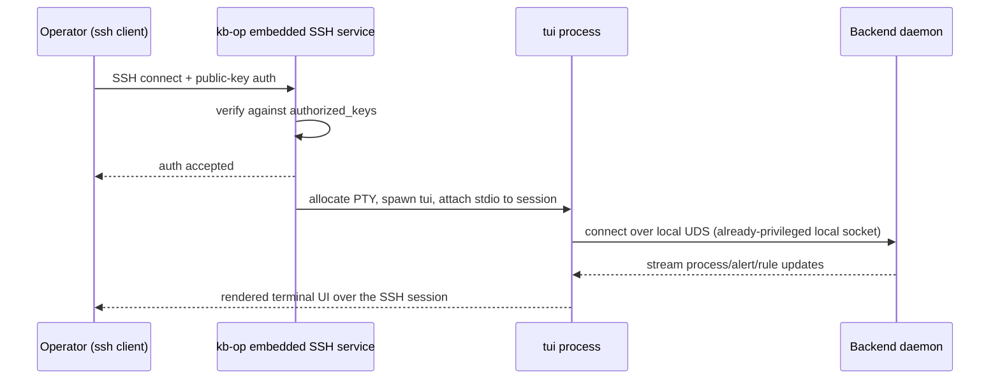
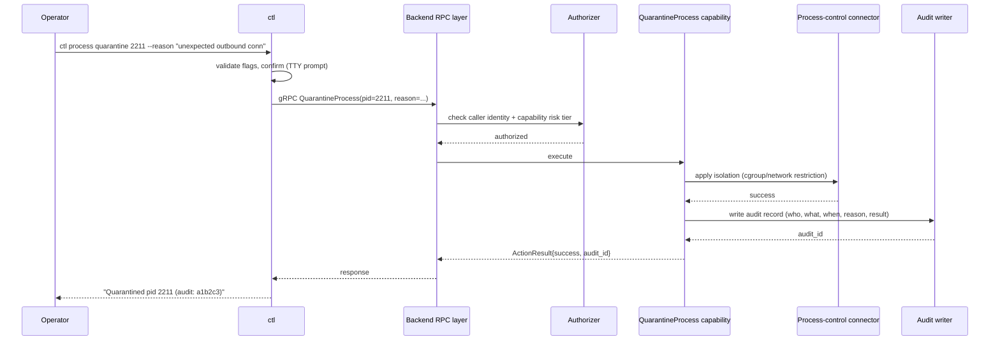
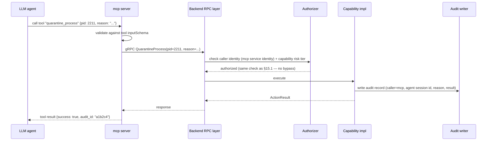
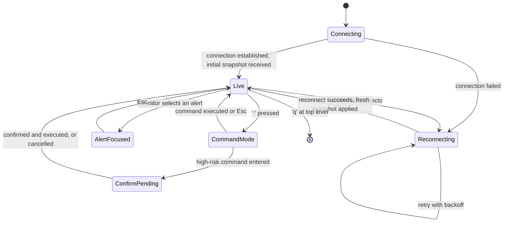
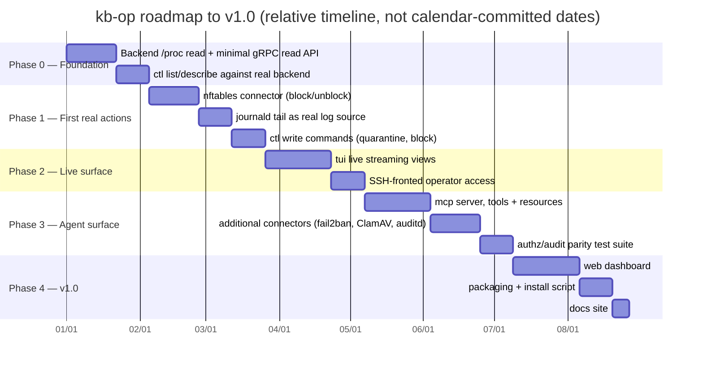

# kb-op

**A complete, standalone unified interface product for Linux server workloads and security applications — CLI (`ctl`), TUI, and MCP, with its own built-in backend**

Status: full end-to-end project specification — designed to be built, shipped, and used entirely on its own
Track: Developer experience / Interfaces
Document version: 1.0

> **This is a whole product, not a piece of a bigger system.** Everything needed to build and ship this on its own — vision, architecture, tech stack, roadmap to v1.0 — is in this one document. Unlike a typical "just a CLI wrapper" project, kb-op owns its own backend (Chapter 8) so it doesn't require any other system to be useful. A solo engineer should be able to start a fresh repository, use nothing but this document, and build toward a working v1.0.

---

## Table of Contents

1. [Executive Summary](#1-executive-summary)
2. [Vision & Mission](#2-vision--mission)
3. [Problem Statement & Motivation](#3-problem-statement--motivation)
4. [Landscape & Prior Art](#4-landscape--prior-art)
5. [Design Philosophy](#5-design-philosophy)
6. [Glossary of Terms](#6-glossary-of-terms)
7. [High-Level Architecture Overview](#7-high-level-architecture-overview)
8. [Built-in Local Backend Daemon — Deep Dive](#8-built-in-local-backend-daemon--deep-dive)
9. [`ctl` — CLI Client Deep Dive](#9-ctl--cli-client-deep-dive)
10. [`tui` — Terminal Console Deep Dive](#10-tui--terminal-console-deep-dive)
11. [`mcp` — Model Context Protocol Server Deep Dive](#11-mcp--model-context-protocol-server-deep-dive)
12. [Web Dashboard Deep Dive](#12-web-dashboard-deep-dive)
13. [SSH-Fronted Operator Access](#13-ssh-fronted-operator-access)
14. [Backend RPC Contract & Protobuf Service Definition](#14-backend-rpc-contract--protobuf-service-definition)
15. [Data Flow Walkthroughs](#15-data-flow-walkthroughs)
16. [Authorization Model](#16-authorization-model)
17. [Audit Logging Architecture](#17-audit-logging-architecture)
18. [Capability Catalog](#18-capability-catalog)
19. [Backend Swappability](#19-backend-swappability)
20. [State & Session Model](#20-state--session-model)
21. [TUI State Machine](#21-tui-state-machine)
22. [MCP Tool Contract Stability & Versioning](#22-mcp-tool-contract-stability--versioning)
23. [Tech Stack & Rationale](#23-tech-stack--rationale)
24. [Repository Layout & Build System](#24-repository-layout--build-system)
25. [Configuration Reference](#25-configuration-reference)
26. [Security Model & Threat Model](#26-security-model--threat-model)
27. [Performance Engineering](#27-performance-engineering)
28. [Reliability & Failure Modes](#28-reliability--failure-modes)
29. [Observability, Logging & Debugging](#29-observability-logging--debugging)
30. [Testing Strategy](#30-testing-strategy)
31. [Deployment & Packaging](#31-deployment--packaging)
32. [Operations Runbook](#32-operations-runbook)
33. [Roadmap to v1.0 and Beyond](#33-roadmap-to-v10-and-beyond)
34. [Worked Operator Walkthrough](#34-worked-operator-walkthrough)
35. [Troubleshooting & FAQ](#35-troubleshooting--faq)
36. [MCP Prompt Template Reference](#36-mcp-prompt-template-reference)
37. [Appendix A: Full `ctl` Command Reference](#appendix-a-full-ctl-command-reference)
38. [Appendix B: Full MCP Tool Reference](#appendix-b-full-mcp-tool-reference)

---

## 1. Executive Summary

`kb-op` is a self-contained operator platform for Linux server security work. It ships four consumer-facing surfaces — a scriptable CLI (`ctl`), a live terminal console (`tui`), a Model Context Protocol server (`mcp`) for LLM agents and IDE assistants, and a browser dashboard for visualization — all backed by exactly one thing this project also owns and ships: a local backend daemon that reads real host state (`/proc`, `journald`, `auditd`) and drives real, already-installed security tooling (`nftables`/`iptables`, `fail2ban`, `ClamAV`, `auditd`) through their native control surfaces.

The product thesis is simple: every other security operations tool forces you to choose between automation-friendly (CLI, but poor situational awareness), operator-friendly (a TUI or GUI, but hard to script), or agent-friendly (an API, usually bolted on last and inconsistently). `kb-op` refuses the choice — one backend, one authorization model, one audit trail, four front-ends that are each excellent at what they're good at and structurally incapable of drifting out of sync with each other, because none of them contain their own copy of the logic.

This document specifies the whole thing end to end: what the backend daemon does and how, what each of the four interfaces looks like and how it talks to the backend, the RPC contract that binds them together, the authorization and audit model that makes the "safe for an LLM agent to drive too" claim actually true, and a phased roadmap from an empty repository to a packaged v1.0.

## 2. Vision & Mission

**Vision.** A server operator — human or AI — should never have to ask "which tool do I use for this," "will this action be logged the same way no matter how I did it," or "can I script what I just did by hand." One backend. One set of capabilities. Four doors into it, each built for how a different kind of consumer actually works.

**Mission statement.** Ship a single installable product that gives any Linux server a working, auditable, scriptable, LLM-accessible operator surface over its own security posture and standard security tooling — without requiring any other software to be installed, deployed, or trusted first.

**Non-goals.**

- `kb-op` is not a detection engine. It observes what the host and its installed tools already know; it does not itself decide what is anomalous. (A more sophisticated detection/response system could sit behind the same backend contract later — see Chapter 19 — but that is explicitly out of scope for this project's v1.0.)
- `kb-op` is not a fleet management system. Every design decision in this document assumes a single host talking to its own local backend daemon over a Unix domain socket. Multi-host fleet orchestration is a plausible *future* extension, not a v1.0 requirement, and is called out wherever it would otherwise creep into scope.
- `kb-op` does not reimplement `nftables`, `fail2ban`, or `ClamAV`. It drives them. Reimplementing proven security tooling is both wasted effort and a security regression — someone else's tool has already had its edge cases found in production, by more traffic than this project will ever see alone.

## 3. Problem Statement & Motivation

Security operations tooling has historically forced an uncomfortable choice among three shapes, each of which is good at one thing and actively bad at the other two:

1. **Rich GUI / web dashboard.** Excellent for exploration — you can see a process tree, a graph of connections, a timeline of alerts. Terrible for automation: nobody wants to click through a dashboard in a CI pipeline, and "click here" is not a reproducible artifact you can put in a runbook or a Git diff.
2. **CLI.** Excellent for automation and repeatability — a `ctl` command is scriptable, diffable, and composable with the rest of a Unix toolchain. Poor for live situational awareness: polling a CLI in a loop to watch what's happening right now is a bad simulation of a live view.
3. **Bolted-on LLM/agent integration.** Increasingly common, and increasingly a liability when done last: an agent integration built after the "real" interfaces already exist tends to either wrap the CLI's text output (fragile — output format changes silently break the agent) or get its own thinner, less-audited path to the same underlying actions (dangerous — the agent ends up with *less* oversight than a human operator, exactly backwards from what you'd want).

The failure mode common to all three, when they're built as separate efforts rather than one project with multiple faces, is **drift**: the CLI supports an action the TUI doesn't, the TUI's containment flow logs differently than the CLI's, the MCP server exposes a tool that quietly stopped matching what the CLI does after a refactor nobody propagated. Each of these is a small bug individually. In aggregate, across a real deployment, they add up to "nobody actually knows what this system will do when you ask it to do something," which is precisely the property you cannot tolerate in anything that touches containment, quarantine, or firewall state.

`kb-op`'s answer: don't build three-to-four tools that happen to target the same system. Build **one system** — the backend daemon — and four **thin, interchangeable doors** into it. A capability exists exactly once, in exactly one place, and every door that exposes it is structurally required to call the same code path to do it.

## 4. Landscape & Prior Art

No project needs to be built in a vacuum. The following existing tools are directly relevant reference points — each gets something right that `kb-op` deliberately borrows, and in a couple of cases, something worth explicitly not repeating.

| Project | What it gets right | What to borrow | What to avoid repeating |
|---|---|---|---|
| `kubectl` | Consistent verb/noun command grammar (`get`, `describe`, `delete` + resource type) scales to hundreds of subcommands without becoming unlearnable | Verb/noun grammar, `-o json`/`-o yaml` structured output convention, consistent exit-code semantics | Its plugin ecosystem sprawl — kb-op should keep its capability surface curated, not infinitely pluggable via third-party binaries with no contract |
| `k9s` | A keyboard-driven live TUI over the same API `kubectl` uses — no separate "TUI backend," it's a first-class consumer of the same cluster API | The exact relationship this project wants between `tui` and the backend daemon: a full alternate front-end, not a wrapper around the CLI | Its own configuration/theming complexity — start minimal |
| Official MCP SDKs (Go / TypeScript / Python reference servers) | Clean separation of tools (actions), resources (read-only context), and prompts (reusable workflow templates) as three distinct primitives | That three-primitive model directly — Chapter 11 uses it as-is | Some reference servers under-specify authorization, assuming the MCP transport boundary itself is the security boundary — kb-op explicitly does not assume this (Chapter 16) |
| `docker`/`docker compose` CLI | Extremely low friction for the 80% case (`docker ps`, `docker logs`) while still exposing full control for the 20% case | Sensible defaults with escape hatches (`--json` opts into machine output; humans get a table by default) | Its historical single-daemon-as-root model — kb-op's backend daemon should run with the minimum privilege each connector actually needs, not blanket root |
| `htop` / `btop` | Extremely fast perceived responsiveness for a live process view, minimal input latency | The rendering discipline (Chapter 27) — a live TUI must never visibly stutter on a normal host | N/A — narrow scope tool, not a broader reference for the RPC/auth layers |
| SSH itself | The access-control-at-the-transport-boundary pattern: your identity is established once, at connection time, by a mechanism (public-key auth) that is itself extremely well understood | Using SSH as the operator-access transport rather than inventing a new auth handshake (Chapter 13) | N/A |

## 5. Design Philosophy

Four principles govern every design decision in this document. Where a later chapter seems to contradict one of these, the later chapter is wrong and should be revised — these are load-bearing, not aspirational.

> **One capability, one implementation, N front-ends.** If `ctl`, `tui`, and `mcp` each need their own logic for "what does quarantine actually do," something is architected wrong. That logic belongs in the backend daemon, and all four interfaces are thin RPC callers — full stop. No interface is permitted to contain business logic that isn't equally available to the others through the same RPC method.

> **Same authorization everywhere.** An MCP tool call, a `ctl` command, and a TUI keypress that all resolve to the same backend RPC method must be subject to the exact same permission checks, evaluated in the exact same code path. No interface gets a shortcut, and critically, no interface gets a *narrower* check either — an LLM agent calling `quarantine_process` via MCP must clear the same bar a human typing `ctl process quarantine` does, not a lower one.

> **Audit at the point of the RPC call, not per-interface.** If auditing is implemented separately in the CLI, the TUI, and the MCP server, one of them will eventually drift and under-log — this is not a hypothetical, it is the default outcome of duplicated logic maintained by different people at different times. Audit centrally, in the backend, at the exact point where an action actually executes, so it is structurally impossible for any interface to bypass it, including a future interface nobody has written yet.

> **Terminal-first, browser-optional.** Every capability that matters operationally must be reachable and usable from `ctl` or `tui` alone, with no browser required. The web dashboard is allowed to add pure visualization value on top (a force-directed process graph, a historical chart) but must never be the *only* way to do something operationally important — an operator SSH'd into a headless box with no browser access must never be blocked.

## 6. Glossary of Terms

| Term | Definition |
|---|---|
| **Backend daemon** | The single long-running process this project ships that owns all host state reads and all tool-driving writes. Everything else is a client of it. |
| **Capability** | One discrete, named action or query the backend exposes (e.g. `quarantine_process`, `list_processes`). The unit of authorization and audit. |
| **Connector** | A backend-internal module that knows how to talk to one specific external tool's native interface (e.g. the fail2ban connector, the nftables connector). |
| **RPC** | Remote Procedure Call — here, a typed method call made by a client (`ctl`, `tui`, `mcp`, dashboard) to the backend daemon over gRPC. |
| **UDS** | Unix Domain Socket — a local, filesystem-path-addressed socket used for same-host IPC; faster and more easily permissioned than a TCP loopback socket. |
| **MCP** | Model Context Protocol — an open protocol for exposing tools, resources, and prompts to LLM-based clients in a structured, discoverable way. |
| **MCP tool** | An MCP primitive representing a callable action with a defined input schema and output shape — kb-op's MCP tools are 1:1 wrappers around backend RPC methods. |
| **MCP resource** | An MCP primitive representing readable, addressable context (not an action) — e.g. "current threat posture" as a resource an agent can read without "calling" anything. |
| **MCP prompt** | An MCP primitive representing a reusable prompt template for a common workflow (e.g. "investigate this PID") that an agent or IDE can surface to a user. |
| **Session** | A live, stateful connection from `tui` (or occasionally a long-running `mcp` client) to the backend daemon, over which streaming updates are pushed. |
| **Quorum / blast radius** | Not applicable to kb-op directly (that's an agent-swarm concept) — kb-op's equivalent concept is *capability risk tier* (Chapter 16), which gates which capabilities require extra confirmation. |
| **Connector fallback** | The behavior of a connector shelling out to a tool's CLI when no better native socket/API integration exists for that tool. |

## 7. High-Level Architecture Overview



Reading this diagram: every interface terminates at the same RPC/API layer. Nothing downstream of that layer knows or cares which interface originated a call. Authorization and audit sit structurally *between* the API layer and the capability implementations, so no capability can be invoked — by any caller — without passing through both.

## 8. Built-in Local Backend Daemon — Deep Dive

This is the chapter that makes the rest of the document real. Without a working backend, `ctl`/`tui`/`mcp`/dashboard are four clients pointed at nothing.

### 8.1 Responsibilities

The backend daemon has exactly two jobs, both described precisely so scope doesn't creep:

1. **Read host state** and expose it as structured data over RPC: running processes (from `/proc`), recent security-relevant log events (from `journald` and `auditd`'s own log/socket interface), and the live status of each connected tool (is `fail2ban` running, what jails exist, is `nftables` reachable).
2. **Drive host security tools** on behalf of an authorized, audited RPC call: block/unblock an address, ban/unban a host in `fail2ban`, scan a path with `ClamAV`, query `auditd` rules — always via each tool's own native control surface, never by reimplementing what that tool does.

Everything else in this document is in service of exposing those two jobs safely, consistently, and fast.

### 8.2 Internal structure



- **RPC server**: accepts gRPC unary calls (for one-shot capability invocations) and upgrades to a WebSocket or gRPC server-streaming call for anything that needs live push (process list changes, new alerts).
- **Authorizer**: a single function every RPC handler calls before doing anything else — see Chapter 16.
- **Capability registry**: a table mapping capability name → implementation function + risk tier + required permission. This is the single source of truth for "what can this daemon do" — Chapter 18's catalog is generated from this table, not maintained separately by hand.
- **Audit writer**: appends a structured record for every capability invocation, success or failure — see Chapter 17.
- **Process source**: polls `/proc/[pid]/*` on an interval (default 1s, configurable) and diffs against the previous snapshot to produce process-appeared / process-exited events for streaming consumers.
- **Log source**: tails `journald` via its native API (not by shelling out to `journalctl -f` and parsing text) and tails `auditd`'s own log output (or reads from its socket where available), normalizing both into one internal event shape.
- **Connector registry**: holds one connector per supported tool; see 8.3.

### 8.3 Connector design

Each connector is responsible for exactly one external tool and exposes a small, tool-specific Go interface internally (something like `Block(cidr string) error`, `Status() (ConnectorStatus, error)`) that the capability implementations call. Connectors prefer, in order:

1. A native control socket, if the tool has one (fail2ban's `fail2ban-client` socket, ClamAV's `clamd` socket).
2. A native structured API, if the tool has one (nftables' JSON-based `nft -j` interface).
3. CLI shell-out with careful output parsing, only when neither of the above exists.

Connector fallback to CLI shell-out must be logged at daemon startup as a visible warning — an operator should always be able to tell, from a single `ctl backend status` call, which connectors are running in "fast native" mode versus "shell-out fallback" mode, because the latter has materially worse latency and error-handling characteristics.

### 8.4 Capability discovery

At startup, the daemon probes for the presence and version of each supported tool (`which nft`, checking for the fail2ban socket, checking for `clamd` reachability) and builds a live capability-availability table. A capability whose only connector isn't available on this host is not silently missing — `ctl capability list` (and the equivalent MCP resource) reports it as `unavailable: fail2ban not installed`, not as a blank hole in the command tree. This matters enormously for the MCP surface in particular: an LLM agent must be able to discover what it can and cannot do on this specific host without trial and error.

### 8.5 Process model

The daemon is a single OS process. It runs as a dedicated system user (`kb-op`), not root, with narrowly scoped capabilities granted per connector need (e.g. `CAP_NET_ADMIN` only if the nftables connector is active) rather than running the whole daemon with blanket root — see Chapter 26 for the full privilege model.

## 9. `ctl` — CLI Client Deep Dive

### 9.1 Command taxonomy

`ctl` follows a verb-scoped-by-noun grammar, one level deeper than `kubectl`'s flat noun-then-verb where doing so improves clarity for a security operations vocabulary:

```
ctl <resource> <verb> [args] [flags]

ctl process list
ctl process describe <pid>
ctl process quarantine <pid> [--reason "..."]
ctl process release <pid>

ctl firewall block <cidr> [--reason "..."] [--ttl 1h]
ctl firewall unblock <cidr>
ctl firewall rules

ctl jail list                 # fail2ban jails
ctl jail ban <ip> --jail sshd
ctl jail unban <ip> --jail sshd

ctl scan file <path>
ctl scan status <scan-id>

ctl audit query --since 1h --severity high
ctl audit export --format json --out audit.json

ctl policy reload
ctl capability list
ctl backend status
```

### 9.2 Flag conventions

- `--json` on any read command switches output from a human-formatted table to newline-delimited or array JSON — never a hybrid, never "pretty JSON by default, `--json` makes it uglier"; JSON output is always machine-oriented (no color codes, no box-drawing characters).
- `--reason` is required (not optional) on every capability whose risk tier is `high` or above (Chapter 16) — the CLI itself enforces this client-side as a fast-fail UX nicety, in addition to the backend enforcing it authoritatively.
- `--yes`/`-y` skips an interactive confirmation prompt for high-risk actions; without it, a TTY session prompts, a non-TTY (CI) invocation fails closed and requires the flag explicitly — never silently proceeds without a human or an explicit flag in an unattended context.
- Exit codes: `0` success, `1` generic failure, `2` authorization denied, `3` backend unreachable, `4` invalid arguments. Scripts can branch on these without parsing text.

### 9.3 Illustrative command implementation sketch

```go
// cmd/ctl/process.go — illustrative, not complete
var quarantineCmd = &cobra.Command{
    Use:   "quarantine <pid>",
    Short: "Quarantine a running process",
    Args:  cobra.ExactArgs(1),
    RunE: func(cmd *cobra.Command, args []string) error {
        pid, err := strconv.Atoi(args[0])
        if err != nil {
            return fmt.Errorf("invalid pid: %w", err)
        }
        reason, _ := cmd.Flags().GetString("reason")
        if reason == "" {
            return fmt.Errorf("--reason is required for this action")
        }
        if !cmd.Flags().Changed("yes") && isInteractive() {
            if !confirm(fmt.Sprintf("Quarantine pid %d? [y/N] ", pid)) {
                return nil
            }
        }
        client := backend.MustConnect()
        resp, err := client.QuarantineProcess(cmd.Context(), &pb.QuarantineProcessRequest{
            Pid:    int32(pid),
            Reason: reason,
        })
        if err != nil {
            return mapRPCError(err) // translates gRPC status -> ctl exit code
        }
        printResult(resp, jsonFlag(cmd))
        return nil
    },
}
```

### 9.4 Output formatting

Table output uses fixed-width columns with a documented, stable column order per resource type (documented in Chapter 25's reference alongside config, not repeated per-command) — a script that greps column 3 of `ctl process list` today should still find the same field in a year, or the column order change should be flagged as a breaking change in the changelog.

## 10. `tui` — Terminal Console Deep Dive

### 10.1 Layout

```
┌─ kb-op ─────────────────────────────────────────────── host: web-03 ─┐
│ [1] Processes   [2] Alerts   [3] Firewall   [4] Query   [?] Help      │
├─────────────────────────────────────────────────────────────────────┤
│  PID    USER      CPU%   MEM%   STATE     COMMAND                     │
│  1044   www-data  2.1    0.8    running   nginx: worker process       │
│  1102   root      0.0    0.3    running   sshd: operator [priv]       │
│  2211   app       14.7   3.2    running   python3 worker.py           │
│  ...                                                                   │
├─────────────────────────────────────────────────────────────────────┤
│ ⚠ 3 alerts in last 15m  •  fail2ban: sshd(2 banned)  •  nft: 14 rules │
├─────────────────────────────────────────────────────────────────────┤
│ > _                                              [q]uit [/]search      │
└─────────────────────────────────────────────────────────────────────┘
```

- **Header bar**: current host, top-level view tabs, always visible.
- **Main pane**: the active view (process table, alert feed, firewall rule list, or an interactive query console).
- **Status bar**: a persistent, always-on summary of the most operationally relevant live counters (active alerts, banned IPs, rule count) so an operator glancing at any view still has situational awareness without switching tabs.
- **Command line**: a `:`-prefixed or `/`-prefixed command line (vim-style) for issuing the same capabilities `ctl` exposes, without leaving the TUI.

### 10.2 Keyboard model

| Key | Action |
|---|---|
| `1`–`4` | Switch top-level view |
| `j`/`k` or arrows | Move selection |
| `Enter` | Open detail view for selected row |
| `q` | Quarantine selected process (prompts for reason, then confirmation) |
| `b` | Block selected IP/CIDR (from a connection or alert row) |
| `/` | Enter search/filter mode for the current view |
| `:` | Enter command mode (full capability access via typed command) |
| `Ctrl-R` | Force refresh / reconnect to backend |
| `?` | Help overlay listing all bindings for the current view |
| `Esc` | Cancel current input / close overlay |

No destructive keybinding fires immediately on a single keypress without a confirmation step — this is a deliberate, non-negotiable UX rule given what these actions do (Chapter 26 covers why blast-radius-aware confirmation matters even for a human directly at the keyboard).

### 10.3 Rendering approach sketch

```rust
// illustrative — not complete
fn render(frame: &mut Frame, app: &AppState) {
    let chunks = Layout::default()
        .direction(Direction::Vertical)
        .constraints([
            Constraint::Length(1),  // header
            Constraint::Min(3),     // main pane
            Constraint::Length(1),  // status bar
            Constraint::Length(1),  // command line
        ])
        .split(frame.size());

    render_header(frame, chunks[0], app);
    match app.active_view {
        View::Processes => render_process_table(frame, chunks[1], &app.processes),
        View::Alerts    => render_alert_feed(frame, chunks[1], &app.alerts),
        View::Firewall  => render_firewall_rules(frame, chunks[1], &app.rules),
        View::Query     => render_query_console(frame, chunks[1], &app.query_state),
    }
    render_status_bar(frame, chunks[2], app);
    render_command_line(frame, chunks[3], &app.command_line);
}
```

### 10.4 Live updates

`tui` opens one persistent streaming RPC to the backend on launch and applies incoming diffs (process appeared/exited, new alert, rule changed) directly to in-memory view state — it does not poll. See Chapter 20 for the session/streaming model and Chapter 27 for the render-latency budget this implies.

### 10.5 Alert-focused view mockup

Pressing `Enter` on a row in the alert feed switches the main pane into a detail view for that alert, without leaving the surrounding chrome:

```
┌─ kb-op ─────────────────────────────────────────────── host: web-03 ─┐
│ [1] Processes   [2] Alerts   [3] Firewall   [4] Query   [?] Help      │
├─────────────────────────────────────────────────────────────────────┤
│ ALERT #a91f — HIGH — 14:22:07                                         │
│                                                                         │
│  Source:    auditd (rule: unexpected-setuid)                          │
│  Process:   2211 (python3 worker.py), uid transition 1000 -> 0        │
│  Host:      web-03                                                    │
│  Related:   3 audit records in the last 60s (press 'r' to view)       │
│                                                                         │
│  Suggested actions:                                                   │
│   [q] Quarantine pid 2211                                             │
│   [i] Open investigate_process prompt for pid 2211                    │
│   [Esc] Back to alert feed                                            │
├─────────────────────────────────────────────────────────────────────┤
│ ⚠ 3 alerts in last 15m  •  fail2ban: sshd(2 banned)  •  nft: 14 rules │
├─────────────────────────────────────────────────────────────────────┤
│ > _                                              [q]uit [/]search      │
└─────────────────────────────────────────────────────────────────────┘
```

The detail view's "suggested actions" are not a separate code path — `q` here invokes the exact same `QuarantineProcess` RPC as the process-table binding in §10.2, and `i` surfaces the same `investigate_process` MCP prompt template defined in Chapter 36, rendered as a guided text flow inside the TUI rather than requiring a separate agent client. Reusing the prompt template here, instead of writing bespoke TUI investigation logic, is a direct application of the one-capability-one-implementation principle (Chapter 5) — the guided investigation flow is authored once and is usable from an LLM client or from a human sitting at the TUI.

### 10.6 Command-mode overlay mockup

Pressing `:` opens a bottom-anchored overlay with tab-completion over the full capability catalog (Chapter 18), so an operator never has to leave the keyboard-driven flow to reach a capability that has no dedicated keybinding:

```
┌─ kb-op ─────────────────────────────────────────────── host: web-03 ─┐
│ [1] Processes   [2] Alerts   [3] Firewall   [4] Query   [?] Help      │
├─────────────────────────────────────────────────────────────────────┤
│  (main pane dimmed, previous view still visible underneath)           │
├─────────────────────────────────────────────────────────────────────┤
│ :jail ban 203.0.113.9 --jail sshd --reason "repeated auth failures"  │
│ ┌───────────────────────────────────────────────────────────────┐   │
│ │ jail ban <ip> --jail <name> [--reason "..."]                    │   │
│ │   Ban a host in the named fail2ban jail.  risk tier: high       │   │
│ └───────────────────────────────────────────────────────────────┘   │
├─────────────────────────────────────────────────────────────────────┤
│ [Tab] complete  [Enter] execute  [Esc] cancel                        │
└─────────────────────────────────────────────────────────────────────┘
```

Because the entered line is `high` risk tier, executing it does not fire immediately on `Enter` — per the no-single-keypress-destructive-action rule (§10.2), it drops into the same `ConfirmPending` state shown in the TUI state machine (Chapter 21) before the backend ever sees the RPC call.

## 11. `mcp` — Model Context Protocol Server Deep Dive

### 11.1 Why MCP, specifically

An LLM agent or IDE assistant needs a *discoverable, typed* way to know what it can do and what it's looking at — free-text CLI help output is not a reliable contract for a model to parse. MCP's three primitives map cleanly onto what this project already has:

- **Tools** → capabilities that do something (1:1 with backend RPC methods that mutate state or trigger an action).
- **Resources** → capabilities that are pure reads, exposed as addressable, subscribable context rather than "calls" (current process list, current threat posture summary, recent alert digest).
- **Prompts** → reusable workflow templates ("investigate process", "triage new alert") that bundle several tool/resource reads into a suggested reasoning flow a client can surface to its user.

### 11.2 Illustrative tool definition

```json
{
  "name": "quarantine_process",
  "description": "Quarantine a running process on the host, isolating it from further execution and network access. Requires a reason. This is a high-risk action subject to the same authorization and audit as an operator running `ctl process quarantine`.",
  "inputSchema": {
    "type": "object",
    "properties": {
      "pid": { "type": "integer", "description": "Process ID to quarantine" },
      "reason": { "type": "string", "description": "Human-readable justification, required" }
    },
    "required": ["pid", "reason"]
  }
}
```

### 11.3 Resource examples

| Resource URI | Contents |
|---|---|
| `kbop://processes` | Current process list snapshot, same shape as `ctl process list --json` |
| `kbop://alerts/recent` | Alerts from the last 15 minutes, severity-sorted |
| `kbop://firewall/rules` | Current nftables/iptables rule set |
| `kbop://capabilities` | The live capability-availability table from §8.4 — critical for an agent to self-discover what's actually usable on this host |

### 11.4 Prompt template example

```json
{
  "name": "investigate_process",
  "description": "Guided investigation of a specific process: pulls process detail, recent related audit events, and open network connections, then suggests next steps.",
  "arguments": [
    { "name": "pid", "description": "Process ID to investigate", "required": true }
  ]
}
```

### 11.5 Non-negotiable rule

> This is the single most important sentence in this chapter: **the MCP server enforces the exact same authorization and audit-logging as every other interface, with zero exceptions.** An LLM agent must never have a shortcut around controls a human operator would be subject to. Concretely: the MCP server is implemented as an RPC client identical in privilege to `ctl` — it does not get a bypass flag, a service-account superuser token, or a separate lower-friction code path. If a capability requires confirmation for a human, the equivalent MCP tool call requires the `reason` field and is gated by the same risk-tier check server-side (Chapter 16), regardless of what the calling agent does or doesn't do client-side.

### 11.6 Transport

The MCP server speaks standard MCP transport (stdio for local IDE-integration use, or HTTP+SSE for networked agent clients) on its front, and is itself just another gRPC client of the backend daemon on its back — see Chapter 7's diagram. It holds no state of its own beyond what's needed to translate MCP requests into backend RPC calls and responses back.

## 12. Web Dashboard Deep Dive

### 12.1 Purpose and scope

The dashboard exists strictly for visualization that a terminal genuinely cannot do well: a force-directed graph of process/network relationships, a historical time-series chart of alert volume, a heatmap of firewall rule hit counts over time. It is explicitly **not** where any operationally important action should be exclusively available — per the terminal-first principle (Chapter 5), everything the dashboard can trigger must also be reachable from `ctl`/`tui`.

### 12.2 Views

| View | Content |
|---|---|
| Overview | Host summary tiles (process count, alert count, banned IPs, rule count), sparkline trends |
| Process graph | Force-directed graph, nodes = processes, edges = parent/child + observed network connections |
| Alert timeline | Historical, filterable, zoomable alert volume over time by severity |
| Firewall rule explorer | Current rule set with hit-count annotations, sortable/filterable |

### 12.3 Data path

The dashboard connects over WebSocket for live tiles/timeline updates and issues normal unary gRPC-Web (or a thin REST shim over the same backend RPCs) for anything request/response-shaped like loading historical data for a custom time range. It carries no independent business logic — every number on screen traces back to a backend RPC response.

## 13. SSH-Fronted Operator Access

### 13.1 Rationale

Rather than exposing the backend daemon's RPC port on the network and inventing a bespoke auth handshake for remote `tui` access, `kb-op` uses SSH itself as the access-control transport: an embedded, hardened SSH service accepts connections, authenticates via public key only (no password fallback, ever), and on success spawns a `tui` session attached to that connection's PTY. The operator never touches the raw RPC socket directly over the network — SSH access *is* the auth boundary, and SSH's own well-understood security properties (key-based identity, host-key pinning against MITM) are reused rather than reinvented.

### 13.2 Design



### 13.3 Key management

- Host keys: persistent Ed25519 keypair generated once at install time and stored at a fixed, root-owned path — persistent host keys avoid MITM warnings on operator reconnection, which matters because an operator who's trained to click through host-key-changed warnings has been trained to ignore the one time it's real.
- Client authorization: a standard `authorized_keys`-format file, one key per authorized operator, no password authentication path compiled in at all (not merely disabled by default — this removes an entire class of credential-stuffing risk from the product).
- Session logging: every SSH session (source IP, key fingerprint, session duration) is logged independently of the audit log described in Chapter 17 — this is connection-level logging, not action-level, and both are needed.

## 14. Backend RPC Contract & Protobuf Service Definition

### 14.1 Service sketch

```protobuf
// illustrative excerpt — not the complete service definition
syntax = "proto3";
package kbop.v1;

service KbOp {
  rpc ListProcesses(ListProcessesRequest) returns (ListProcessesResponse);
  rpc StreamProcesses(StreamProcessesRequest) returns (stream ProcessEvent);
  rpc QuarantineProcess(QuarantineProcessRequest) returns (ActionResult);
  rpc ReleaseProcess(ReleaseProcessRequest) returns (ActionResult);

  rpc BlockAddress(BlockAddressRequest) returns (ActionResult);
  rpc UnblockAddress(UnblockAddressRequest) returns (ActionResult);
  rpc ListFirewallRules(ListFirewallRulesRequest) returns (ListFirewallRulesResponse);

  rpc BanHost(BanHostRequest) returns (ActionResult);
  rpc UnbanHost(UnbanHostRequest) returns (ActionResult);
  rpc ListJails(ListJailsRequest) returns (ListJailsResponse);

  rpc ScanPath(ScanPathRequest) returns (ScanResult);

  rpc QueryAuditLog(QueryAuditLogRequest) returns (QueryAuditLogResponse);
  rpc StreamAlerts(StreamAlertsRequest) returns (stream AlertEvent);

  rpc ListCapabilities(ListCapabilitiesRequest) returns (ListCapabilitiesResponse);
  rpc GetBackendStatus(GetBackendStatusRequest) returns (BackendStatus);
}

message ActionResult {
  bool success = 1;
  string message = 2;
  string audit_id = 3;   // correlates the action to its audit-log entry
}
```

### 14.2 Design rules for the contract

- Every mutating RPC returns an `audit_id` so a caller (and a human reading a log later) can always tie an action's result back to the exact audit record for it — see Chapter 17.
- Every mutating RPC accepts a `reason` field; it is required server-side for any capability at risk tier `high` or above regardless of whether the calling client also enforces it (defense in depth, per Chapter 16).
- Streaming RPCs (`StreamProcesses`, `StreamAlerts`) use gRPC server-streaming for gRPC-native clients (`tui`, `mcp` where long-lived) and are also exposed over a WebSocket gateway for the dashboard, translating the same underlying event stream rather than maintaining two implementations of it.
- The `.proto` files are the single source of truth for the contract; all four clients generate their bindings from the same files, in CI, so a contract change that isn't reflected in a client fails the build rather than silently shipping a mismatch.

## 15. Data Flow Walkthroughs

### 15.1 `ctl process quarantine` end to end



### 15.2 MCP tool call end to end



The two diagrams above are deliberately near-identical past the client's own request-shaping step — that similarity *is* the design, not a coincidence.

## 16. Authorization Model

### 16.1 Identity

Every RPC caller is identified before any capability executes:

- `ctl` and `tui`, connecting over local UDS, are identified via `SO_PEERCRED` — the kernel-verified UID of the connecting process — mapped to an operator identity via a local identity/role file (or, for multi-operator hosts, backed by system groups).
- `mcp`, when running as a local stdio-transport server, is identified the same way (it's just another local process). When running as a networked HTTP+SSE server for remote agent access, callers authenticate via a scoped bearer token issued out-of-band, mapped to a distinct "agent" identity class that is never granted a broader role than the least-privileged human operator role by default.

### 16.2 Risk tiers

| Tier | Examples | Required |
|---|---|---|
| `read` | list processes, list rules, query audit log | Valid identity only |
| `low` | reload policy view (read-only reload preview) | Valid identity + operator role |
| `medium` | scan a path, describe a jail | Valid identity + operator role, logged |
| `high` | quarantine/release a process, block/unblock an address, ban/unban a host | Valid identity + operator role + `reason` field populated + logged with elevated detail |
| `critical` | (reserved for future capabilities with fleet- or host-wide blast radius, e.g. a full firewall flush) | Everything `high` requires, plus explicit two-step confirmation even for scripted callers (a `--confirm-critical` flag that must match a value printed by a prior dry-run call) |

### 16.3 Enforcement point

> Authorization is evaluated exactly once per RPC call, inside the backend daemon, before the capability implementation runs — never inside a client. A client-side check (like `ctl`'s confirmation prompt) is a UX nicety for the human at the keyboard, not a security control; the backend must independently re-verify everything, because a client cannot be trusted to have checked correctly, or at all, or to not have been modified.

## 17. Audit Logging Architecture

### 17.1 What gets logged

Every capability invocation — success or failure, `read` tier or `critical` tier — produces one structured audit record: timestamp, caller identity, capability name, input parameters (redacted where they'd contain sensitive payload data, e.g. scanned file contents are never logged, only the path and result), the `reason` field if present, the result, and a monotonically chained hash linking it to the previous record.

### 17.2 Tamper-evidence

Each audit record includes a hash of the previous record, so the log forms a hash chain — an attacker (or a compromised backend) who edits or deletes a historical record breaks the chain from that point forward, which is detectable by an independent verification pass (`ctl audit verify`) that any operator can run without needing to trust the daemon that wrote the log. The chain does not by itself *prevent* tampering (that requires write-once storage or remote log shipping, both noted as v1.0+ hardening options in Chapter 33) — it makes tampering **detectable**, which is the property that actually matters for a security tool's own audit trail.

### 17.3 Query and export

`ctl audit query` and the equivalent MCP resource (`kbop://audit/recent`) support filtering by time range, capability, caller, and severity. `ctl audit export` produces a portable, independently-verifiable export (records + chain) suitable for handing to an external SIEM or a compliance reviewer.

## 18. Capability Catalog

The following table is generated from the backend's capability registry (§8.2) — this is the canonical list of what kb-op can do, and how each capability surfaces on each interface. Any capability added to the registry must add a row here in the same change.

| Capability | Risk tier | `ctl` command | `tui` binding | MCP tool/resource | Dashboard view |
|---|---|---|---|---|---|
| List processes | `read` | `ctl process list` | Processes view (default) | `kbop://processes` (resource) | Overview, process graph |
| Describe process | `read` | `ctl process describe <pid>` | `Enter` on selected row | `describe_process` (tool) | Process graph node click |
| Quarantine process | `high` | `ctl process quarantine <pid>` | `q` | `quarantine_process` (tool) | — (terminal-first only) |
| Release process | `high` | `ctl process release <pid>` | `r` (on quarantined row) | `release_process` (tool) | — |
| Block address | `high` | `ctl firewall block <cidr>` | `b` | `block_address` (tool) | — |
| Unblock address | `high` | `ctl firewall unblock <cidr>` | `u` (on blocked row) | `unblock_address` (tool) | — |
| List firewall rules | `read` | `ctl firewall rules` | Firewall view | `kbop://firewall/rules` (resource) | Firewall rule explorer |
| Ban host (jail) | `high` | `ctl jail ban <ip> --jail <name>` | `:jail ban ...` | `ban_host` (tool) | — |
| Unban host (jail) | `high` | `ctl jail unban <ip> --jail <name>` | `:jail unban ...` | `unban_host` (tool) | — |
| List jails | `read` | `ctl jail list` | Firewall view (jails tab) | `kbop://jails` (resource) | Overview tile |
| Scan path | `medium` | `ctl scan file <path>` | `:scan <path>` | `scan_path` (tool) | — |
| Query audit log | `read` | `ctl audit query` | `:audit query ...` | `kbop://audit/recent` (resource) | Alert timeline (as annotations) |
| Export audit log | `read` | `ctl audit export` | `:audit export ...` | — (export is a client-side operation on query results) | — |
| Verify audit chain | `read` | `ctl audit verify` | — | — | — |
| Reload policy | `low` | `ctl policy reload` | `:policy reload` | `reload_policy` (tool) | — |
| List capabilities | `read` | `ctl capability list` | `?` help overlay includes this | `kbop://capabilities` (resource) | — |
| Backend status | `read` | `ctl backend status` | Status bar (always visible) | `kbop://status` (resource) | Overview tiles |

## 19. Backend Swappability

The RPC contract (Chapter 14) is defined independently of the built-in backend's implementation. Any process that implements the same `.proto` service and speaks the same authorization/audit expectations can sit behind `ctl`/`tui`/`mcp`/dashboard in place of the built-in daemon. This is deliberately kept as an *optional* extension point, not a v1.0 requirement — the built-in backend (Chapter 8) is what ships and is what every interface is tested against. A future, more sophisticated backend (e.g. one doing fleet-wide correlation or ML-driven scoring) becoming available later is a plausible reason to use this extension point; it is explicitly not something v1.0 needs to anticipate beyond keeping the contract clean.

## 20. State & Session Model

### 20.1 `ctl`

Stateless, request/response only. Each invocation opens a connection, makes one or more RPC calls, and exits. No session persists between invocations beyond whatever the OS/shell environment carries (e.g. a configured default backend socket path).

### 20.2 `tui`

Opens one long-lived connection on launch, used for both unary calls (issuing an action) and a server-streaming subscription (receiving live updates). On disconnect (network blip, backend restart), `tui` enters a visible "reconnecting" state (never silently shows stale data as if it were live — see Chapter 28) and resubscribes on reconnect, requesting a fresh full snapshot before resuming diffs.

### 20.3 `mcp`

Stateless per tool-call in the common case (stdio-transport, IDE-integrated use). For networked HTTP+SSE agent access, a session may persist across multiple tool calls within one agent conversation, but carries no privilege escalation across calls — each call is independently authorized as if it were the first.

## 21. TUI State Machine



The `Reconnecting` state is rendered distinctly (a visible banner, dimmed data) rather than silently freezing the last-known view — an operator must always be able to tell live data from stale data at a glance.

## 22. MCP Tool Contract Stability & Versioning

> Treat MCP tool definitions as a stable public contract once shipped. An agent workflow built against `quarantine_process` breaking silently because the tool's parameters changed shape is a worse failure mode than a CLI flag rename, because there is no human in the loop to notice that the help text changed.

Rules that follow from this:

- Adding an optional field to a tool's input schema is non-breaking and may ship in a minor version.
- Removing a field, renaming a field, or changing a field's required-ness is breaking and requires either a new tool name (`quarantine_process_v2`) or a major version bump of the MCP server's advertised capability set, with the old tool kept available and marked deprecated for at least one full release cycle.
- The `kbop://capabilities` resource includes a schema version for each tool, so a well-behaved agent client can detect a version it doesn't recognize and degrade gracefully rather than calling blind.

## 23. Tech Stack & Rationale

| Component | Choice | Why |
|---|---|---|
| Local backend daemon | Go | Strong concurrency primitives for fan-out to multiple tool connectors plus fan-in from `/proc`/log sources; single static binary output simplifies packaging |
| `ctl` | Go, Cobra | Best-in-class CLI framework ecosystem; shares a language and generated-client code with the backend |
| `tui` | Rust, `ratatui` | Fast, low-resource terminal rendering with a mature immediate-mode-style widget ecosystem; strong async gRPC client support via `tonic` |
| `mcp` | Go or TypeScript, official MCP SDK | Both have mature first-party MCP server SDKs; pick whichever language has the cleaner generated gRPC client bindings available at implementation time |
| Web dashboard | React + TypeScript, D3.js (graph) and Recharts (time series) | Standard, well-supported stack for the visualization-heavy views a terminal can't do well |
| Transport | gRPC over UDS (local, unary + server-streaming); WebSocket gateway for the dashboard | Fast and simply permissioned for same-host callers; no network exposure by default |
| Config format | TOML | More ergonomic than YAML for hand-edited operator config, avoids YAML's well-known parsing footguns |
| Embedded SSH service | Go, `golang.org/x/crypto/ssh` | Same language as the backend daemon it's embedded in; well-audited primitive library rather than a bespoke SSH implementation |

## 24. Repository Layout & Build System

```
kb-op/
├── backend/                # backend daemon (Go)
│   ├── cmd/kbopd/           # daemon entrypoint
│   ├── internal/rpc/        # gRPC server, WebSocket gateway
│   ├── internal/authz/      # authorization layer
│   ├── internal/audit/      # audit writer + chain verification
│   ├── internal/capability/ # capability registry + implementations
│   ├── internal/connector/  # one package per tool connector
│   │   ├── nftables/
│   │   ├── fail2ban/
│   │   ├── clamav/
│   │   └── auditd/
│   ├── internal/hoststate/  # /proc poller, journald/auditd tail
│   └── internal/ssh/        # embedded SSH service + PTY spawn
├── proto/                  # .proto service definitions, single source of truth
├── ctl/                    # CLI client (Go, Cobra)
├── tui/                    # terminal console (Rust, ratatui)
├── mcp/                    # MCP server
├── dashboard/               # web dashboard (React + TS)
├── docs/                   # this document and any ADRs
├── scripts/                 # install scripts, dev environment setup
└── tests/                   # integration tests, mock backend fixtures
```

Build orchestration: a top-level `Makefile` (or `Taskfile`) with targets per component (`make backend`, `make ctl`, `make tui`, `make mcp`, `make dashboard`, `make all`), plus a `make proto` target that regenerates all client bindings from `proto/` and fails the build if generated code doesn't match what's committed (catches contract drift at build time, not runtime).

## 25. Configuration Reference

| Key | Component | Default | Description |
|---|---|---|---|
| `backend.socket_path` | backend, all clients | `/run/kb-op/kbopd.sock` | UDS path for the RPC server |
| `backend.log_level` | backend | `info` | `debug`/`info`/`warn`/`error` |
| `backend.proc_poll_interval` | backend | `1s` | `/proc` polling cadence |
| `backend.connectors.nftables.enabled` | backend | `true` (if `nft` found) | Toggle per-connector |
| `backend.connectors.fail2ban.socket_path` | backend | `/var/run/fail2ban/fail2ban.sock` | Native socket path |
| `backend.connectors.clamav.socket_path` | backend | `/var/run/clamav/clamd.ctl` | Native socket path |
| `audit.log_path` | backend | `/var/log/kb-op/audit.log` | Append-only audit log location |
| `ssh.host_key_path` | backend | `/etc/kb-op/ssh_host_ed25519_key` | Persistent SSH host key |
| `ssh.authorized_keys_path` | backend | `/etc/kb-op/authorized_keys` | Operator public keys |
| `mcp.transport` | mcp | `stdio` | `stdio` or `http-sse` |
| `mcp.http_sse.bind_addr` | mcp | `127.0.0.1:8090` | Only used when transport is `http-sse` |
| `ctl.default_output` | ctl | `table` | `table` or `json` |
| `dashboard.bind_addr` | dashboard | `127.0.0.1:8091` | Dev-server / production bind address |

Configuration is read from a single TOML file (`/etc/kb-op/config.toml`) with environment-variable overrides (`KBOP_<SECTION>_<KEY>`) for containerized or CI deployment convenience.

## 26. Security Model & Threat Model

### 26.1 Privilege model

The backend daemon runs as a dedicated non-root system user. Individual OS capabilities (e.g. `CAP_NET_ADMIN` for the nftables connector) are granted narrowly via the packaging's systemd unit (`AmbientCapabilities=`), not via running the whole process as root — a bug in the ClamAV connector should not have the ability to rewrite firewall rules, and vice versa.

### 26.2 MCP as a potential privilege-escalation shortcut — and its mitigations

The single biggest novel risk this architecture introduces relative to a CLI-only tool is that an LLM agent, potentially acting semi-autonomously and potentially manipulated by adversarial input it's processing (a classic prompt-injection scenario), gets a structured, low-friction way to trigger real actions. Mitigations, several already covered elsewhere and restated here as a consolidated threat-model view:

| Threat | Mitigation | Where specified |
|---|---|---|
| Agent granted broader privilege than a human by default | Agent identity class capped at least-privileged operator role by default; must be explicitly elevated per-deployment | §16.1 |
| Agent bypasses confirmation a human would face | `reason` field required server-side for `high`+ tier regardless of client; risk-tier gating enforced in the backend, not the client | §16.3, §16.2 |
| Prompt-injected instruction causes an unwanted high-risk tool call | Out of scope for kb-op itself to fully solve (this is a property of the calling agent's own defenses) — but kb-op ensures every such call is fully audited with caller identity and reason, and rate considerations below limit blast radius | §17, §26.3 |
| Stale/incorrect MCP tool contract causes an agent to call something unintended | Tool contract stability rules (Chapter 22) | §22 |
| Compromised MCP transport (networked HTTP+SSE mode) used to impersonate an agent | Scoped bearer tokens, distinct identity class, same authz pipeline as everything else | §16.1 |

### 26.3 Rate limiting on high-risk actions

The backend enforces a configurable rate limit on `high`/`critical` tier capability invocations per identity per time window (default: 10 high-risk actions per identity per 5 minutes) — not to prevent a legitimate burst of operator activity during a real incident (the limit is deliberately generous), but to bound the damage of a malfunctioning or manipulated automated caller (an agent stuck in a loop, a buggy script) before a human necessarily notices.

### 26.4 Input validation

All RPC inputs are validated server-side regardless of client-side validation already performed (CIDR format for block/unblock, PID existence for process actions, path existence and permission for scan) — the backend treats every client, including its own bundled `ctl`, as an untrusted input source at the RPC boundary.

## 27. Performance Engineering

### 27.1 TUI render latency budget

A live TUI that visibly stutters undermines the entire "live operator surface" value proposition. Target budget: input-to-redraw latency under 16ms for any local interaction (selection movement, view switch), and under 100ms from a backend-pushed event (new alert, process change) to that event being reflected on screen, including network/IPC hop over the local UDS.

### 27.2 RPC call budget

Unary RPC calls over local UDS should complete in single-digit milliseconds for `read`-tier capabilities backed by already-cached state (e.g. the last `/proc` poll snapshot), and under 100ms for `high`-tier capabilities that involve an actual connector round-trip to an external tool (e.g. an `nft` rule application) — the latter budget is dominated by the external tool's own latency, not kb-op's overhead, and should be benchmarked and documented per-connector so a regression in, say, the fail2ban connector is immediately visible rather than attributed vaguely to "the backend is slow."

### 27.3 Process source scaling

The `/proc` poller's cost scales with process count; on a host with several thousand processes, a naive full-rescan-every-tick approach becomes the dominant cost. Mitigation: incremental scanning (only re-read `/proc/[pid]/stat` for PIDs known to have changed since last tick, detected cheaply via `/proc`'s own directory-entry churn) rather than a full stat-everything sweep every second.

## 28. Reliability & Failure Modes

| Failure | Detection | Behavior |
|---|---|---|
| Backend daemon crashes | Client RPC calls fail with `Unavailable` | `ctl` exits with code 3 and a clear message; `tui` enters `Reconnecting` state (Chapter 21), retries with exponential backoff, never silently freezes on stale data |
| Backend daemon restarts (e.g. after an update) | Same as above, followed by successful reconnect | Systemd unit configured with automatic restart; `tui`/`mcp` sessions reconnect and request a fresh full snapshot rather than assuming continuity |
| A connector's underlying tool (e.g. fail2ban) is stopped externally | Connector's periodic health check fails | Capability-availability table (§8.4) marks that capability `unavailable` live; in-flight calls to it fail fast with a clear "connector unavailable" error, not a hang |
| Audit log write fails (disk full, permission issue) | Audit writer returns an error | The triggering capability call **fails closed** — an action whose audit record cannot be written must not be allowed to execute; this is a deliberate trade of availability for guaranteed auditability on the actions that matter most |
| SSH host key file is lost/corrupted | Daemon fails to start SSH service | Daemon logs a clear startup error and continues running its RPC/local-socket surface (local `ctl`/`tui` still work) but does not silently regenerate a new host key, which would break operator trust-on-first-use expectations without an explicit, logged operator action |

## 29. Observability, Logging & Debugging

- **Structured logs**: the backend daemon emits structured (JSON) logs to stdout/systemd-journal, separate from the audit log (Chapter 17) — operational logs are for debugging the daemon itself; the audit log is for reconstructing what actions were taken and by whom, and the two must never be merged into one stream or one retention policy.
- **Metrics**: basic operational metrics (RPC call counts/latencies by method, connector health, `/proc` poll duration) exposed on a local-only metrics endpoint in a standard format (Prometheus text exposition), so operators who already run a metrics stack can scrape it without kb-op needing to ship its own dashboard for this purpose.
- **`ctl backend status`**: a single command that surfaces daemon uptime, connector availability table, current RPC error rate, and audit-chain verification status — the first command to run when something seems wrong.
- **Debug mode**: `--debug` on `ctl`/`tui` enables verbose RPC tracing (request/response payloads, timing) to a local file, off by default given payloads may include sensitive host state.

## 30. Testing Strategy

### 30.1 Mock backend

A lightweight mock implementation of the same `.proto` service, returning canned or seeded-random data, lives in `tests/mockbackend/`. All four client interfaces (`ctl`, `tui`, `mcp`, dashboard) have an integration test suite that runs against this mock backend rather than a real daemon with real connectors — this makes CI fast and deterministic, and makes it possible to build/test any one interface without the others.

### 30.2 Per-interface parity tests

A dedicated parity test suite issues the same logical action (e.g. "quarantine pid 1234 with reason X") through each of `ctl`, a scripted `tui` key-sequence harness, and a direct MCP tool call, against the mock backend, and asserts all three produce an equivalent RPC call with equivalent parameters — this is the automated enforcement of the "one capability, one implementation" principle (Chapter 5), catching drift at CI time rather than in production.

### 30.3 Connector tests

Each connector has its own integration test suite that runs against a real instance of its target tool in a disposable container (a real `fail2ban`, a real `nftables` in a network namespace, a real `clamd`) — mocking the connector's own target tool is explicitly avoided, because the whole value of a connector is correctly speaking that tool's real native protocol, and a mock of that protocol can silently drift from the real thing exactly the way tool-specific glue code always eventually does.

### 30.4 Authorization and audit tests

A dedicated suite asserts, for every capability in the registry, that: an unauthenticated caller is rejected, an under-privileged caller is rejected, a `high`-tier call without `reason` is rejected, every successful and failed call produces exactly one audit record, and the audit chain remains valid after each test run.

## 31. Deployment & Packaging

- **Single install**: the backend daemon, `ctl`, `tui`, and `mcp` ship as a single package (`.deb`/`.rpm`, or a install script for other distros) installing to standard paths, with a systemd unit for the daemon (`kb-opd.service`) and a `Restart=on-failure` policy.
- **Dashboard**: shipped as a static build served by the backend daemon itself on a local-only port by default (no separate web server dependency), with a documented option to reverse-proxy it behind the operator's own TLS-terminating proxy if remote browser access is desired.
- **Configuration on first install**: an install-time step generates the SSH host key (§13.3), creates the dedicated `kb-op` system user, and writes a starter `config.toml` with auto-detected connector availability.
- **Upgrades**: the daemon supports a graceful drain (finish in-flight RPCs, reject new ones with a clear "upgrading" status) before a systemd-managed restart during an in-place upgrade, so `tui` sessions get a clean `Reconnecting` transition rather than an abrupt disconnect indistinguishable from a crash.

## 32. Operations Runbook

| Situation | First command | Likely next step |
|---|---|---|
| "Is kb-op healthy?" | `ctl backend status` | Check connector availability table for anything unexpectedly `unavailable` |
| "Did anyone quarantine anything recently?" | `ctl audit query --capability quarantine_process --since 24h` | Cross-reference `audit_id` with `tui`/agent session logs if the actor needs more context |
| "I suspect the audit log was tampered with" | `ctl audit verify` | If chain verification fails, treat as a security incident — this is exactly the scenario the hash chain (§17.2) exists to surface |
| "An operator can't SSH in" | Check `authorized_keys` on the host matches the operator's expected public key | Re-add key, no daemon restart required — the SSH service re-reads the file per connection attempt |
| "TUI shows stale data" | Check for a visible `Reconnecting` banner (§21) | If not visibly reconnecting but data looks stale, this is a bug — file it; the state machine is designed to make this state impossible to hide |
| "An MCP agent took an action I didn't expect" | `ctl audit query --caller mcp --since 1h` | Every MCP-originated action has full audit detail including the reason field the agent supplied — start there |

## 33. Roadmap to v1.0 and Beyond



### Phase 0 — Foundation
Backend daemon reads `/proc` and exposes a minimal gRPC read API. `ctl list`/`describe` work against the real backend. This alone is a usable, demoable v0.1.

### Phase 1 — First real actions
One real enforcement connector (nftables) and one real log source (journald tail). `ctl` gains write commands. Authorization and audit logging land here, not later — every write capability from this phase onward is built authorized-and-audited from day one, never retrofitted.

### Phase 2 — Live surface
`tui` with live streaming views against the same backend. SSH-fronted access becomes the primary remote entry point.

### Phase 3 — Agent surface
`mcp` server exposing the same capabilities as MCP tools/resources, verified for authz/audit parity against `ctl` via the automated parity suite (§30.2). Remaining connectors (fail2ban, ClamAV, auditd) come online.

### Phase 4 — v1.0
Web dashboard for the visualization-only views. Full packaging (single install, systemd unit, docs site). At this point the product is a complete, standalone, installable operator platform requiring nothing else.

### Beyond v1.0 (explicitly out of scope for this document, noted for completeness)
- Multi-host fleet mode, reusing the same RPC contract with a remote transport.
- A pluggable connector interface so third parties can add support for additional tools without modifying the core daemon.
- Write-once/remote-shipped audit log storage as a stronger tamper-*prevention* (not just detection) guarantee.
- A pluggable, swapped-in backend implementing richer detection/correlation logic behind the same contract (Chapter 19).

## 34. Worked Operator Walkthrough

This chapter narrates one complete, realistic operator session end to end, cross-referencing exactly which RPC calls and chapters cover each step. It exists so a new contributor can read one linear story and see how the pieces in Chapters 7–21 actually compose in practice, rather than only ever seeing them described independently.

### 34.1 Scenario

An operator, `priya`, is paged at 14:20 by an external alerting channel (out of scope for kb-op itself — kb-op is what she uses once she's already been told something is worth looking at) about unusual outbound traffic from `web-03`.

### 34.2 Step by step

**1. Connecting.** Priya runs `ssh kb-op@web-03`. The embedded SSH service (Chapter 13) authenticates her public key against `authorized_keys`, allocates a PTY, and spawns `tui` attached to the session. `tui` opens its long-lived RPC connection to the backend daemon over the local UDS and requests an initial snapshot — the TUI state machine (Chapter 21) moves from `Connecting` to `Live`.

**2. Orientation.** The status bar (§10.1) already shows `⚠ 3 alerts in last 15m`. Priya presses `2` to switch to the Alerts view — a local, already-cached view switch, no RPC call needed, since the alert feed was already streaming in the background per §20.2.

**3. Investigating.** She selects the top alert (severity `HIGH`, `unexpected-setuid` from process 2211) and presses `Enter`, landing on the alert-focused detail view from §10.5. She presses `i` to open the `investigate_process` guided flow (Chapter 36) for pid 2211. Behind the scenes this issues three read-tier RPC calls in sequence — `DescribeProcess(2211)`, `QueryAuditLog(pid=2211, since=15m)`, and a connections lookup — each independently authorized per §16.2 (all `read` tier, so only a valid identity is required, no `reason`).

**4. Corroborating.** The investigation view surfaces that pid 2211 (`python3 worker.py`, normally running as `app`) briefly transitioned to `uid 0` and opened an outbound connection to an address outside the host's normal egress pattern. This matches the paging alert. Priya decides to act.

**5. Acting.** She presses `Esc` to return to the alert-focused view, then `q` to quarantine. Per §10.2's confirmation rule, this does not fire immediately — the TUI's `ConfirmPending` state (Chapter 21) opens a small prompt asking for a `reason` (required at `high` tier per §16.2) and a `y`/`N` confirmation. She types `"uid transition + unexpected egress, pid 2211"` and confirms.

**6. What happens on confirm.** This follows exactly the sequence diagram in §15.1: `tui` issues `QuarantineProcess(pid=2211, reason="...")` over gRPC, the backend's authorizer checks Priya's identity and the `high` risk tier requirement, the capability implementation applies the isolation via the process-control connector, and the audit writer appends a chained record and returns an `audit_id`. `tui` renders `Quarantined pid 2211 (audit: c7e2a1)` in the status line.

**7. Following up.** Priya presses `:` and types `firewall block 203.0.113.44 --reason "destination of unauthorized egress from pid 2211, audit c7e2a1" --yes` to also block the destination address at the firewall level, cross-referencing the earlier audit ID in this new action's own reason field — a habit the audit query interface in the next step makes valuable.

**8. Verifying the trail.** Once the incident is stable, she runs (from a separate terminal, using `ctl` directly rather than the TUI's command mode) `ctl audit query --since 30m --caller priya --format json` and confirms both actions are present, correctly chained, with matching `audit_id`s and legible `reason` fields — exactly the query pattern described in the runbook (Chapter 32, row 2).

### 34.3 What this walkthrough demonstrates

- Every action Priya took — whether through a keybinding, the TUI's command mode, or a separate `ctl` invocation — passed through the identical authorization and audit path described in Chapters 16–17. Nothing about *how* she issued a command changed *what* was enforced or logged.
- The guided investigation flow (`investigate_process`) is the same MCP prompt template an LLM agent would use (Chapter 36), just rendered inside the TUI instead of an agent's chat surface — confirming the reuse claim made in §10.5.
- No step required leaving the terminal, per the terminal-first principle (Chapter 5).

## 35. Troubleshooting & FAQ

This chapter collects the failure reports a new deployment is most likely to generate in its first weeks, organized by symptom.

### 35.1 "The backend daemon won't start"

| Check | Command | Likely cause |
|---|---|---|
| Is the socket path writable? | `ls -la /run/kb-op/` | `kb-op` system user lacks permission on `/run/kb-op/`; re-run the install script's user/permission step |
| Are required capabilities granted? | `systemctl show kb-opd -p AmbientCapabilities` | A connector needing `CAP_NET_ADMIN` (nftables) is enabled but the systemd unit wasn't regenerated after enabling it — re-run `make install-unit` or the packaged equivalent |
| Is the config file valid TOML? | `kb-opd --check-config` | A hand-edited `config.toml` has a syntax error; the daemon intentionally refuses to start on invalid config rather than falling back to defaults silently |
| Is another process already bound to the socket path? | `ss -lx | grep kbopd.sock` | A previous crashed instance left a stale socket file; remove it only after confirming via `ps` that no `kbopd` process is actually running |

### 35.2 "`tui` connects but shows no data" / "`tui` can't connect at all"

- First check `ctl backend status` from a separate session — if that also fails, the problem is the backend, not the TUI (see 35.1).
- If `ctl backend status` succeeds but `tui` still shows nothing, confirm the TUI is pointed at the same socket path as `ctl` (`KBOP_BACKEND_SOCKET_PATH` env var or `backend.socket_path` in config, §25) — a common first-deployment mistake is a stale path left over from a manual test run.
- If `tui` shows a persistent `Reconnecting` banner (§21) rather than silence, that is the system working correctly and telling you exactly what's wrong — it is never a bug in itself; treat it as a backend-availability problem per 35.1.

### 35.3 "MCP tool calls return permission-denied"

- Confirm the calling identity's role. Per §16.1, an `mcp` caller (local stdio or networked HTTP+SSE) is mapped to an identity the same way any other caller is — a permission-denied on a `high`-tier tool most often means the agent identity class hasn't been granted the operator role for that capability, which is the correct default-deny behavior, not a bug (§26.2).
- Confirm the tool call included a non-empty `reason` field for `high`+ tier tools — the backend rejects these server-side per §16.3 regardless of what the MCP schema's `required` array says client-side, so a client that skips schema validation will still be correctly rejected.
- Use `kbop://capabilities` (the resource, not a tool call) to have the agent itself check what it can actually do on this host before attempting an action — this sidesteps a whole class of "why did this fail" confusion by making availability and permission self-discoverable (§8.4).

### 35.4 "SSH access isn't working for a new operator"

- Confirm the operator's public key is present, on its own line, in `ssh.authorized_keys_path` (§25) — the SSH service re-reads this file per connection attempt, so no daemon restart is required after adding a key, and a restart is never the fix here.
- Confirm the key type is one the embedded SSH service accepts (Ed25519 or RSA ≥ 3072-bit by default; weaker key types are intentionally rejected, not silently downgraded).
- If the connection is refused before authentication is even attempted, confirm the host's normal SSH daemon (if any) isn't competing for the same port — kb-op's embedded SSH service is typically deployed on a distinct port from any pre-existing OpenSSH server on the box, documented per-deployment in the install notes.

### 35.5 "A connector shows as `unavailable` but the underlying tool is definitely running"

- Re-check the connector's expected socket/binary path against the tool's actual configuration (§25's connector-specific keys) — a non-default install path for `fail2ban` or `clamd` is the most common cause.
- Check `ctl backend status` for the connector's last health-check error message — this is surfaced verbatim from the connector's own probe (§8.4) rather than a generic "unavailable," specifically so this class of problem is diagnosable from one command.

### 35.6 "The audit chain failed verification"

Per §17.2, this is treated as a security incident, not a bug report to quietly work around. Do not attempt to "repair" the chain by regenerating it. The runbook (Chapter 32, row 3) is the correct next step: stop routine operations against the affected host's audit trail, preserve the log file as-is for investigation, and escalate.

## 36. MCP Prompt Template Reference

Prompt templates (Chapter 11's third MCP primitive) bundle several resource reads and, where appropriate, a suggested tool call into one named, reusable workflow that an agent or IDE surfaces to its user rather than requiring the user to know which raw tools/resources to chain together manually. This chapter specifies the templates kb-op ships with in v1.0.

### 36.1 `investigate_process`

Already introduced in §11.4; full specification:

```json
{
  "name": "investigate_process",
  "description": "Guided investigation of a specific process: pulls process detail, recent related audit events, and open network connections, then suggests next steps such as quarantine if warranted.",
  "arguments": [
    { "name": "pid", "description": "Process ID to investigate", "required": true }
  ]
}
```

**Template text** (rendered with `{{pid}}` substituted):

> Investigate process `{{pid}}` on this host. Call `describe_process` for `{{pid}}`, then `kbop://audit/recent` filtered to this pid over the last 15 minutes, then check for open network connections associated with this pid. Summarize: what is this process, has its privilege or network behavior changed recently, and does anything here warrant a `quarantine_process` call. If you recommend quarantine, state the exact `reason` text you would use.

This is the same flow the TUI's `i` binding drives internally (§10.5) — the template text above is effectively the specification the TUI's built-in equivalent is implemented against, kept in this document as the single source of truth for both.

### 36.2 `triage_alert`

```json
{
  "name": "triage_alert",
  "description": "Given a specific alert ID, gather its full context and produce a structured triage summary with a recommended severity and next action.",
  "arguments": [
    { "name": "alert_id", "description": "Alert identifier from the alert feed", "required": true }
  ]
}
```

**Template text:**

> Triage alert `{{alert_id}}`. Read its full record via `kbop://alerts/recent`, identify the associated process and/or address if any, and use `investigate_process` or a direct `kbop://firewall/rules` read as appropriate to gather corroborating context. Produce: (1) a one-sentence summary, (2) confirmed severity (agree or disagree with the alert's own severity field, with reasoning), (3) a recommended next action — no action, monitor, or a specific `high`-tier tool call with the exact `reason` text you would use if a human approves it. Do not call any `high`-tier tool yourself as part of this template — recommend it and stop.

> **Design rationale:** this template deliberately stops short of taking action itself, even though the underlying tools would technically allow it. A triage template's job is to compress investigation time for whoever — human or a more autonomous downstream agent — makes the actual call; baking an automatic action into a template used for many different alerts, under many different deployment risk tolerances, would quietly reintroduce exactly the "did the agent get a shortcut around a human decision" risk Chapter 26 works to close off everywhere else.

### 36.3 `summarize_threat_posture`

```json
{
  "name": "summarize_threat_posture",
  "description": "Produce a current-state summary of this host's security posture: active alerts, banned hosts, firewall rule count and recent changes, and connector health.",
  "arguments": []
}
```

**Template text:**

> Summarize the current security posture of this host. Read `kbop://status`, `kbop://alerts/recent`, `kbop://jails`, and `kbop://firewall/rules`. Produce a short-form report: overall health (green/yellow/red, with reasoning), count and severity breakdown of recent alerts, any hosts currently banned and by which jail, and any connector reporting `unavailable` (Chapter 8.4) which would mean this summary itself is incomplete for that tool's data.

This template is the natural first thing an operator (or an on-call escalation bot ahead of paging a human) runs at the start of a session — it takes no arguments and touches only `read`-tier resources, so it is safe to run with no elevated agent identity at all.

### 36.4 `explain_recent_action`

```json
{
  "name": "explain_recent_action",
  "description": "Given an audit_id, explain what action was taken, by whom, why, and whether it is still in effect.",
  "arguments": [
    { "name": "audit_id", "description": "Audit record identifier, as returned by any mutating tool call or shown in ctl/tui output", "required": true }
  ]
}
```

**Template text:**

> Explain audit record `{{audit_id}}`. Read it via `kbop://audit/recent` (filtered/looked up by ID) and produce a plain-language explanation: what capability was invoked, by which caller identity, with what stated reason, and what the current live state implies about whether the effect is still active (e.g. is the process still quarantined, is the address still blocked) — cross-reference the relevant `read`-tier resource (`describe_process`, `kbop://firewall/rules`, `kbop://jails`) to answer that last part rather than assuming the original action is still in effect.

This template exists specifically to make the audit log (Chapter 17) useful to more than just the operator who wrote a given `reason` field — a different operator, days later, handed only an `audit_id`, should be able to reconstruct full context without archaeology.

## Appendix A: Full `ctl` Command Reference

This appendix expands every row of the Capability Catalog (Chapter 18) into a concrete invocation with example output. It is generated from the same capability registry described in §8.2 — in the real repository this appendix should be produced by a doc-generation step reading the registry directly, so it cannot silently drift from what the backend actually implements; the content below is what that generator would currently produce.

### A.1 `read`-tier commands

```
$ ctl process list --json
[
  {"pid": 1044, "user": "www-data", "cpu_pct": 2.1, "mem_pct": 0.8, "state": "running", "command": "nginx: worker process"},
  {"pid": 1102, "user": "root",     "cpu_pct": 0.0, "mem_pct": 0.3, "state": "running", "command": "sshd: operator [priv]"}
]

$ ctl process describe 2211 --json
{"pid": 2211, "user": "app", "ppid": 1, "started": "2026-07-30T13:58:02Z",
 "command": "python3 worker.py", "cgroup": "/system.slice/worker.service",
 "open_connections": 3, "recent_uid_transitions": []}

$ ctl firewall rules --json
[{"chain": "input", "rule": "tcp dport 22 accept"}, {"chain": "input", "rule": "ip saddr 203.0.113.44 drop"}]

$ ctl jail list --json
[{"jail": "sshd", "banned_count": 2, "enabled": true}]

$ ctl audit query --since 1h --severity high --json
[{"audit_id": "c7e2a1", "capability": "quarantine_process", "caller": "priya",
  "reason": "uid transition + unexpected egress, pid 2211", "result": "success",
  "timestamp": "2026-07-30T14:24:11Z"}]

$ ctl audit export --format json --out audit-2026-07-30.json
wrote 412 records (chain verified) to audit-2026-07-30.json

$ ctl audit verify
chain OK: 4,118 records, no gaps detected

$ ctl capability list --json
[{"name": "quarantine_process", "tier": "high", "available": true},
 {"name": "scan_path", "tier": "medium", "available": true},
 {"name": "ban_host", "tier": "high", "available": false, "reason": "fail2ban not installed"}]

$ ctl backend status
uptime: 4d 02h   connectors: nftables(ok) fail2ban(ok) clamav(ok) auditd(ok)
rpc error rate (5m): 0.0%   audit chain: verified 00:02:14 ago
```

### A.2 `low`/`medium`-tier commands

```
$ ctl policy reload
policy reloaded (audit: b2f901)

$ ctl scan file /var/www/uploads/invoice.pdf --json
{"path": "/var/www/uploads/invoice.pdf", "result": "clean", "engine": "clamav",
 "signature_db_date": "2026-07-30", "scan_id": "s-88231", "audit_id": "b2fa12"}
```

### A.3 `high`-tier commands

```
$ ctl process quarantine 2211 --reason "uid transition + unexpected egress, pid 2211"
Quarantine pid 2211? [y/N] y
Quarantined pid 2211 (audit: c7e2a1)

$ ctl process release 2211 --reason "confirmed benign after investigation, ticket OPS-4471"
Released pid 2211 (audit: c7e2a4)

$ ctl firewall block 203.0.113.44 --reason "destination of unauthorized egress from pid 2211, audit c7e2a1" --yes
Blocked 203.0.113.44 (audit: c7e2b0)

$ ctl firewall unblock 203.0.113.44 --reason "block superseded by upstream ISP takedown, ticket OPS-4471"
Unblocked 203.0.113.44 (audit: c7e2c9)

$ ctl jail ban 198.51.100.7 --jail sshd --reason "repeated auth failures, see audit c7e19a"
Banned 198.51.100.7 in jail sshd (audit: c7e2d1)

$ ctl jail unban 198.51.100.7 --jail sshd --reason "confirmed legitimate operator, key was misconfigured"
Unbanned 198.51.100.7 from jail sshd (audit: c7e2d8)
```

Every `high`-tier example above includes `--reason` inline, matching the client-side fast-fail rule in §9.2 — omitting it produces a `4` exit code and an error before any RPC call is attempted, saving a round trip for the most common scripting mistake.

## Appendix B: Full MCP Tool Reference

This appendix lists every mutating capability's complete MCP tool definition. `quarantine_process` is specified fully in §11.2 and is not repeated verbatim here; its entry below shows only the fields that differ in kind from what's already shown there, for a mutating tool at the same risk tier.

### B.1 `release_process`

```json
{
  "name": "release_process",
  "description": "Release a previously quarantined process, restoring its normal execution and network access. Requires a reason. Subject to the same authorization and audit as ctl process release.",
  "inputSchema": {
    "type": "object",
    "properties": {
      "pid": { "type": "integer", "description": "Process ID to release" },
      "reason": { "type": "string", "description": "Human-readable justification, required" }
    },
    "required": ["pid", "reason"]
  }
}
```
Example call: `{"pid": 2211, "reason": "confirmed benign after investigation, ticket OPS-4471"}`
Example response: `{"success": true, "message": "Released pid 2211", "audit_id": "c7e2a4"}`

### B.2 `block_address`

```json
{
  "name": "block_address",
  "description": "Block an IP address or CIDR range at the host firewall. Requires a reason. High-risk action.",
  "inputSchema": {
    "type": "object",
    "properties": {
      "cidr": { "type": "string", "description": "IP address or CIDR range to block, e.g. 203.0.113.44 or 203.0.113.0/24" },
      "reason": { "type": "string", "description": "Human-readable justification, required" },
      "ttl": { "type": "string", "description": "Optional auto-expiry duration, e.g. '1h'. Omit for a persistent block." }
    },
    "required": ["cidr", "reason"]
  }
}
```
Example call: `{"cidr": "203.0.113.44", "reason": "destination of unauthorized egress from pid 2211, audit c7e2a1"}`
Example response: `{"success": true, "message": "Blocked 203.0.113.44", "audit_id": "c7e2b0"}`

### B.3 `unblock_address`

```json
{
  "name": "unblock_address",
  "description": "Remove a previously applied firewall block for an IP address or CIDR range. Requires a reason.",
  "inputSchema": {
    "type": "object",
    "properties": {
      "cidr": { "type": "string", "description": "IP address or CIDR range to unblock" },
      "reason": { "type": "string", "description": "Human-readable justification, required" }
    },
    "required": ["cidr", "reason"]
  }
}
```
Example call: `{"cidr": "203.0.113.44", "reason": "block superseded by upstream ISP takedown, ticket OPS-4471"}`
Example response: `{"success": true, "message": "Unblocked 203.0.113.44", "audit_id": "c7e2c9"}`

### B.4 `ban_host` / `unban_host`

```json
{
  "name": "ban_host",
  "description": "Ban a host address in a named fail2ban jail. Requires a reason.",
  "inputSchema": {
    "type": "object",
    "properties": {
      "ip": { "type": "string", "description": "Address to ban" },
      "jail": { "type": "string", "description": "Target jail name, e.g. 'sshd'" },
      "reason": { "type": "string", "description": "Human-readable justification, required" }
    },
    "required": ["ip", "jail", "reason"]
  }
}
```
Example call: `{"ip": "198.51.100.7", "jail": "sshd", "reason": "repeated auth failures, see audit c7e19a"}`
Example response: `{"success": true, "message": "Banned 198.51.100.7 in jail sshd", "audit_id": "c7e2d1"}`

`unban_host` mirrors this schema exactly, substituting description and semantics for the inverse action; omitted here to avoid duplicating an identical schema shape.

### B.5 `scan_path`

```json
{
  "name": "scan_path",
  "description": "Scan a file or directory path for malware using the host's configured AV engine. Medium risk — does not require a reason, but is fully audited.",
  "inputSchema": {
    "type": "object",
    "properties": {
      "path": { "type": "string", "description": "Absolute filesystem path to scan" }
    },
    "required": ["path"]
  }
}
```
Example call: `{"path": "/var/www/uploads/invoice.pdf"}`
Example response: `{"success": true, "result": "clean", "scan_id": "s-88231", "audit_id": "b2fa12"}`

### B.6 `reload_policy`

```json
{
  "name": "reload_policy",
  "description": "Reload the backend's policy configuration from disk without restarting the daemon. Low risk.",
  "inputSchema": { "type": "object", "properties": {}, "required": [] }
}
```
Example call: `{}`
Example response: `{"success": true, "message": "policy reloaded", "audit_id": "b2f901"}`

### B.7 Schema-shape consistency note

> Every tool in this appendix follows the same shape: an `inputSchema` whose `required` array always includes `reason` for any tool whose underlying capability is `high` tier or above, a response that always includes `audit_id`, and a `description` field that states the risk framing in plain language rather than leaving an agent to infer it. This consistency is enforced by the same doc/schema generation step that produces Appendix A from the capability registry (§8.2) — an engineer adding a new `high`-tier capability without a `reason` field in its schema should get a build-time failure, not a runtime surprise for whichever agent calls it first.
