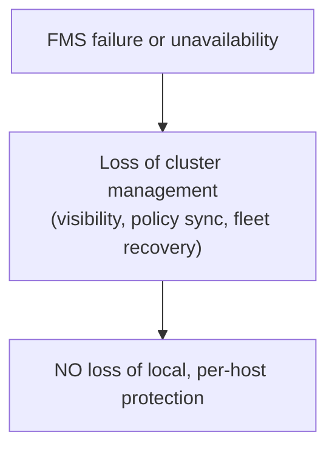
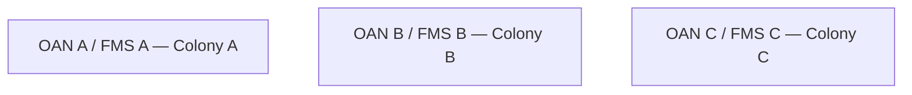
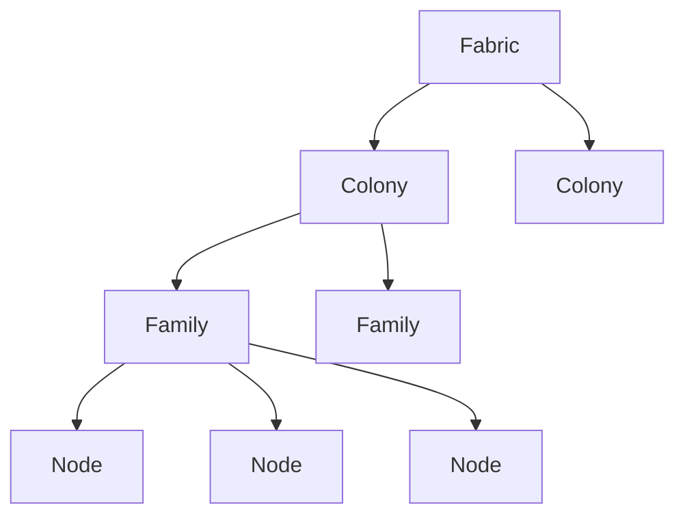
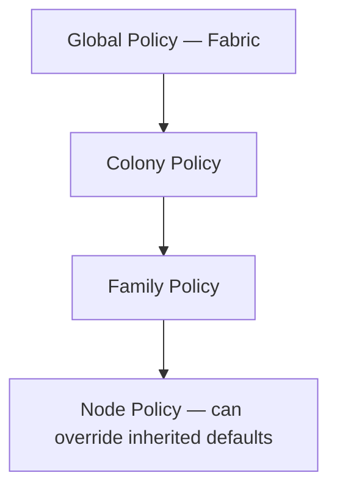
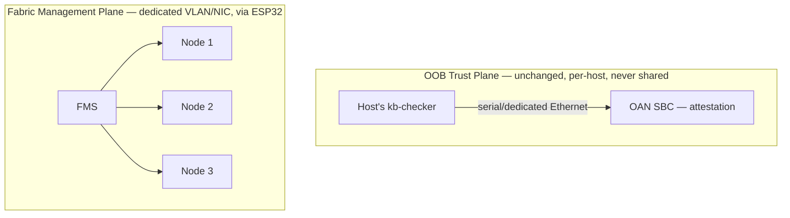
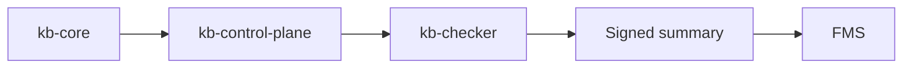
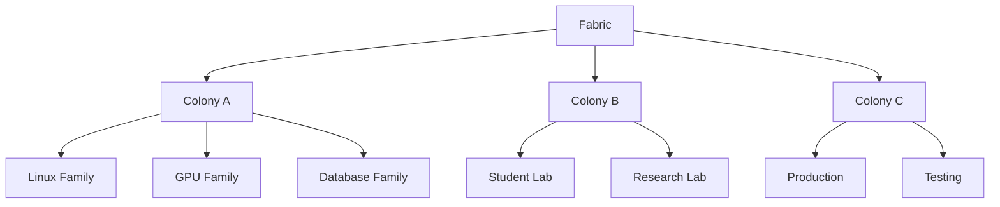

# Fabric Management Service (FMS)

**Version:** 0.1 (proposal)
**Component:** Sub-service of the [Out-of-Band Attestation Node (OAN)](oan-hardware-appliance.md) — expands OAN §9 "Cluster Support"
**Status:** Proposed — not implemented. No code, no wire protocol, no schema exists yet. This document exists so the fleet-management design survives between sessions/reviews, per the same handoff discipline as [`oan-hardware-appliance.md`](oan-hardware-appliance.md).

> **Fabric Management Service (FMS)** is the distributed orchestration and management subsystem of OAN. It transforms multiple independent Kernel Borderlands deployments into a single coordinated **Kernel Borderlands Fabric**, providing centralized discovery, organization, policy management, monitoring, and recovery while preserving each node's independent runtime protection.

This document is **entirely design-direction, not a spec**. OAN's own hardware/single-host design ([`oan-hardware-appliance.md`](oan-hardware-appliance.md)) is itself unimplemented; FMS is the next layer up from that and should not be built before a single-OAN, single-host prototype exists and works (see Open Questions, §14).

---

# 1. Purpose

Kernel Borderlands can protect a single Linux machine, and OAN (as scoped in its own doc) can attest and fence a single host.

FMS extends this by letting one OAN supervise and coordinate an entire fleet of protected systems — instead of viewing every KB instance independently, FMS organizes them into a structured fabric that can be monitored and managed centrally.

---

# 2. Position Inside OAN

FMS is one of several services proposed to run on OAN's SBC (see [`oan-hardware-appliance.md`](oan-hardware-appliance.md) §4.1):

- Attestation Service
- Integrity Service
- Recovery Service
- **Fabric Management Service (FMS)**
- Event Store
- Dashboard API
- Local Database

None of these other services are designed yet either — OAN's doc describes the SBC's responsibilities at the same level of generality. FMS is called out separately here because fleet coordination is a large enough concern to need its own document, not because it's more settled than its siblings.

OAN provides the trusted hardware platform. FMS provides the distributed management layer on top of it.

---

# 3. Design Goals

FMS is intended to provide:

- Centralized fleet management
- Scalable multi-host coordination
- Hierarchical organization
- Policy consistency
- Cross-host visibility
- Automated recovery orchestration
- Cluster lifecycle management

**without weakening the independent trust guarantees OAN provides per host.** Decided (§3.1): this holds by construction, not by discipline, because of the Local Autonomy Principle below — FMS is classified as operationally important but not security-critical, and sits entirely on a separate communication plane from attestation/recovery (§11).

## 3.1 Local Autonomy Principle

> **Every KB node must remain fully capable of protecting itself without FMS.**

FMS is never part of the runtime security path.

**Without FMS**, every node still has: `kb-core`, `kb-control-plane`, `kb-checker`, local OAN attestation, local recovery, local containment, local fencing. Nothing changes.

**With FMS**, the fleet additionally gets: fleet visibility, policy synchronization, fabric-wide recovery, cluster inventory, event aggregation.

Service classification:

| Component | Security-critical? |
|---|---|
| `kb-core` | Yes |
| `kb-control-plane` | Yes |
| `kb-checker` | Yes |
| OAN (attestation/recovery services) | Yes |
| **FMS** | **No** — operationally important, not security-critical |

### Future: multi-OAN scale

Each Colony (`oan-hardware-appliance.md` doesn't yet define multi-OAN behavior — this is direction, not a decision) keeps its own OAN and its own FMS instance:

No global master. Each Colony remains autonomous even if OANs are later given some way to synchronize with each other — see Open Question 5 (§14), still unresolved: this principle says *what* the relationship should look like (no single top-level authority), not the *protocol* for it.

---

# 4. Fabric Model

A Kernel Borderlands deployment under FMS is called a **Fabric**. Within a Fabric, systems are organized hierarchically: Fabric → Colony → Family → Node.

---

# 5. Fabric Colonies

A **Fabric Colony** represents a deployment boundary managed by a single OAN.

Examples: a computer science laboratory, an AI research cluster, a data center, a department's infrastructure, an enterprise office.

A colony groups multiple related Families under one operational environment. Responsibilities:

- Administrative boundary
- Shared infrastructure
- Shared OAN
- Recovery coordination
- Resource inventory

---

# 6. Fabric Families

A **Fabric Family** is a logical grouping of nodes inside a colony, letting administrators organize systems by purpose rather than physical location — e.g. an "AI Family," "Linux Lab Family," "Research Family," "Faculty Family," "GPU Family," "Database Family."

Families provide:

- Shared security policies
- Shared updates
- Shared dashboards
- Shared configuration
- Shared alert routing

---

# 7. Nodes

Each protected Kernel Borderlands deployment becomes a Fabric Node — a desktop, workstation, laptop, server, VM, or edge device.

Each node contains the standard KB stack: `kb-core`, `kb-control-plane`, `kb-checker`, `kb-op`, and optionally `kb-aads`.

---

# 8. Responsibilities

**Illustrative only** — none of the below has a designed protocol, schema, or API yet (§14). Listed as the intended responsibility surface.

## 8.1 Fabric Discovery
Automatically discovers new KB deployments: node discovery, automatic registration, hardware fingerprinting, platform detection, version discovery.

## 8.2 Node Registry
Maintains the inventory: node ID, hostname, platform, kernel version, KB version, family, colony, health, trust status, last heartbeat, assigned policies.

## 8.3 Membership Management
Handles: join Fabric, leave Fabric, node removal, family migration, colony reassignment.

## 8.4 Health Monitoring
Continuously monitors: host availability, CPU, memory, storage, network, `kb-core`, `kb-checker`, OAN connectivity, heartbeat.

## 8.5 Policy Management
Lets administrators define security policy once and deploy it to the entire Fabric, a Colony, a Family, or an individual Node. Policies include detection rules, runtime restrictions, response thresholds, integrity settings.

## 8.6 Configuration Management
Synchronizes runtime configuration, feature flags, rule sets, service configuration.

## 8.7 Event Aggregation
Collects security events from every node: unified timeline, event search, event indexing, historical records.

## 8.8 Cross-Host Correlation
**The least-designed responsibility here.** Intended to detect lateral movement, coordinated attacks, shared indicators, multi-node compromise, and simultaneous anomalies across the fleet — but "detect lateral movement across hosts" is itself a substantial detection-engineering problem (closer in scope to `kb-aads`'s job on a single host than to fleet management), not a natural extension of discovery/registry/policy sync. Needs its own design pass before being treated as a committed feature — see Open Question 3 (§14).

## 8.9 Recovery Coordination
Coordinates distributed recovery: multi-node quarantine, Fabric-wide recovery, emergency policy deployment, controlled restart order.

## 8.10 Deployment Management
Version inventory, compatibility verification, controlled rollout, update orchestration.

---

# 9. Policy Scope

Policies may target different hierarchy levels, with node-specific policy overriding higher-level defaults where explicitly configured:

---

# 10. Internal Components

**Illustrative only** — a components list, not an architecture:

- Discovery Engine
- Registry
- Membership Manager
- Fabric Engine
- Colony Manager
- Family Manager
- Health Monitor
- Policy Manager
- Configuration Manager
- Event Aggregator
- Correlation Engine
- Recovery Coordinator
- Deployment Manager
- Dashboard API

---

# 11. Communication

**Illustrative only** — no wire protocol exists yet (§14 Open Question 3), but the transport *principle* is decided (§3.1 of `oan-hardware-appliance.md`): FMS runs entirely on OAN's **Fabric Management Plane**, never the **Out-of-Band Trust Plane**. These are two different channels that never share transport, by design — not two names for the same link.

This mirrors the enterprise BMC pattern: a dedicated management interface (BMC → admin) is kept separate from the production OS's network path, for the same reason — the management plane must never become a route into the trust-establishing plane.

## 11.1 What crosses the Fabric plane

Not raw kernel state. Each node is intended to report a **signed summary**, produced by the existing pipeline, not new raw-telemetry access:

FMS receives: health, alerts, inventory, version, integrity status.
FMS does **not** receive: raw BPF maps, raw telemetry, privileged runtime state.

## 11.2 Network hardening

The Fabric Management Plane should run on a dedicated VLAN, a dedicated management NIC, or a physically isolated switch — exactly the enterprise management-network pattern, not best-effort segmentation on the same network as production traffic.

This resolves what was previously an open conflict with `oan-hardware-appliance.md` §3's "never the host's primary network" principle: that principle constrains the **OOB Trust Plane** only. The Fabric Management Plane was always going to need ordinary networking to reach multiple hosts — the fix isn't to avoid networking, it's to make sure that network can never reach the trust plane, and to minimize what crosses it (§11.1) even if it's compromised.

---

# 12. Relationship with Other OAN Services

| Service | Responsibility |
|---|---|
| Attestation Service | Cryptographic identity verification |
| Integrity Service | Runtime integrity validation |
| Recovery Service | Local recovery and hardware fencing |
| **Fabric Management Service** | Distributed management and orchestration |
| Event Store | Persistent event storage |
| Dashboard API | Administrative interface |

FMS **does not perform attestation itself**. It is intended to consume trusted outputs from the Attestation and Integrity Services to make management decisions across the fabric — none of those services are designed yet either (§2), so this boundary is a design intention, not something that can be verified against working code.

---

# 13. Scalability (illustrative example)

The intent is for a single OAN to manage a small lab, while larger environments deploy multiple OANs, each supervising its own colony or set of colonies — keeping policy management, monitoring, recovery, and orchestration scalable without changing the underlying trust model OAN establishes. Whether the trust model actually holds unchanged at multi-OAN scale is unverified (§14).

---

# 14. Open Questions / Not Yet Designed

### Resolved

1. ~~Does centralizing fleet management reintroduce the single-point-of-failure problem OAN exists to avoid per-host?~~ **Resolved by the Local Autonomy Principle (§3.1)**: FMS is classified non-security-critical and never sits in the runtime security path — an FMS outage or compromise costs fleet visibility/coordination, not per-host protection, by construction (every node keeps full local `kb-core`/`kb-control-plane`/`kb-checker`/OAN protection independent of FMS).
2. ~~Network exposure of the fleet-reporting channel conflicts with OAN's "never the host's primary network" principle.~~ **Resolved by the Two Communication Planes principle (§3.1 of `oan-hardware-appliance.md`, §11 here)**: that principle constrains only the OOB Trust Plane. FMS runs on a separate Fabric Management Plane (dedicated VLAN/NIC/isolated switch, carried on the ESP32), which structurally cannot reach the trust plane, and which only ever carries signed summaries, not raw telemetry (§11.1).

### Still open

3. **Cross-Host Correlation (§8.8) is undesigned and may not belong in FMS at all.** Lateral-movement/coordinated-attack detection is a detection-engineering problem, not a fleet-management one — needs a decision on whether this is FMS's job, a `kb-aads`-adjacent job, or out of scope entirely.
4. **Wire protocol for OAN↔FMS↔Node communication** (§11) — format, transport, auth, cadence: none defined. The plane is decided; the protocol on it is not.
5. **Multi-OAN trust model at scale** (§3.1) — "no global master, each Colony autonomous" is now a stated principle, but the actual protocol/trust relationship for OANs that later synchronize with each other is undefined.
6. **Prerequisite ordering** — this entire document assumes OAN's single-host hardware design is built and working first. No FMS work should start before that (status line at top).
7. **Signed-summary format and signing key provenance** (§11.1) — new from this pass: what "signed" means concretely (whose key, sealed via which TPM operation, verified by FMS how) is unspecified — likely ties into `oan-hardware-appliance.md`'s own unresolved TPM integration point (its §14 Open Question 4).

---

# 15. Relationship to Existing Documentation

This document expands `oan-hardware-appliance.md` §9 ("Cluster Support — Future Work"), which it should be read as detailing, not superseding — the parent doc's framing of cluster support as **explicitly out of prototype scope** still applies here in full. It does not modify any implemented KB behavior, wire contract, or socket topology. The Two Communication Planes principle (`oan-hardware-appliance.md` §3.1) is the load-bearing resolution this document builds on: FMS's entire communication design (§11) depends on staying on the Fabric Management Plane and never touching the OOB Trust Plane.
