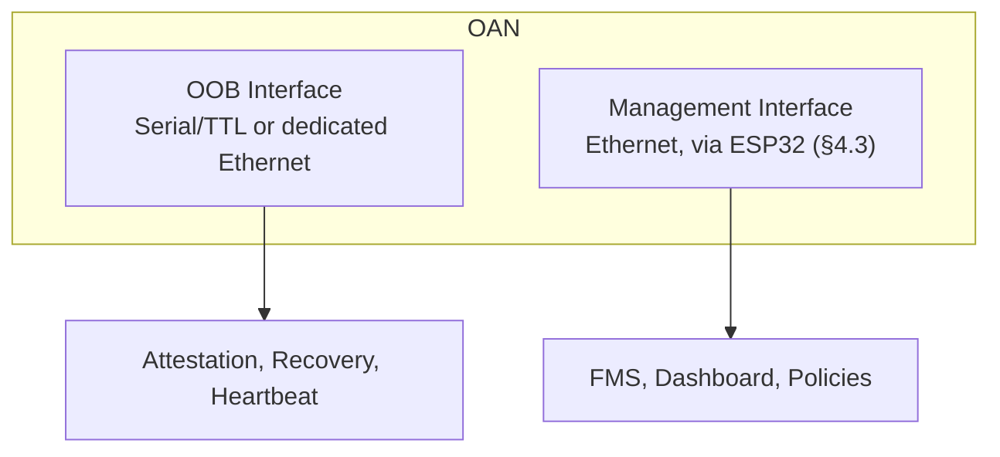
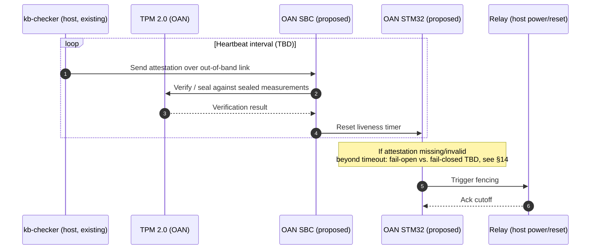
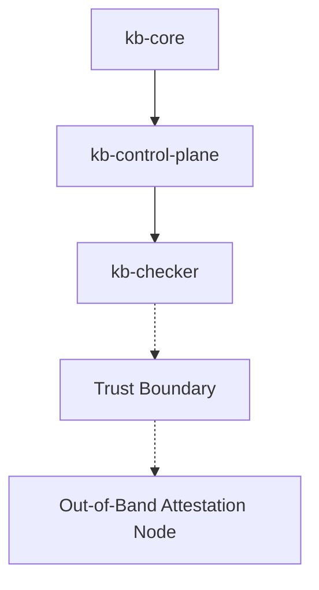
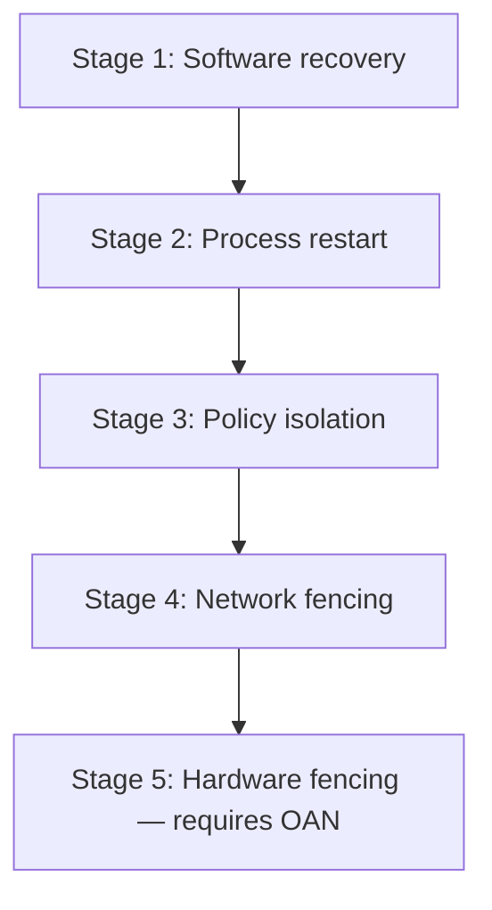
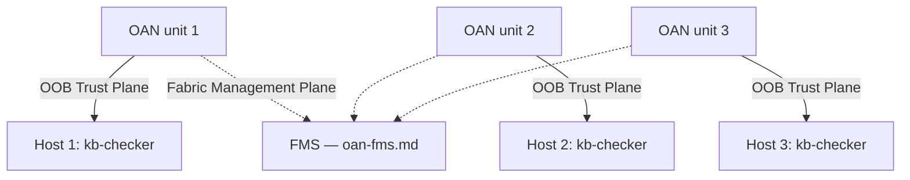
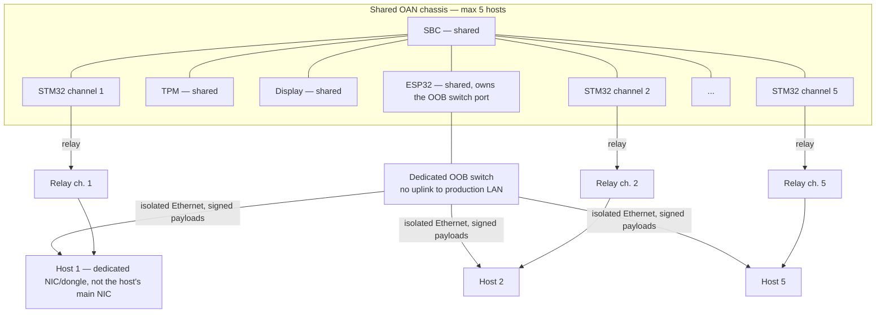
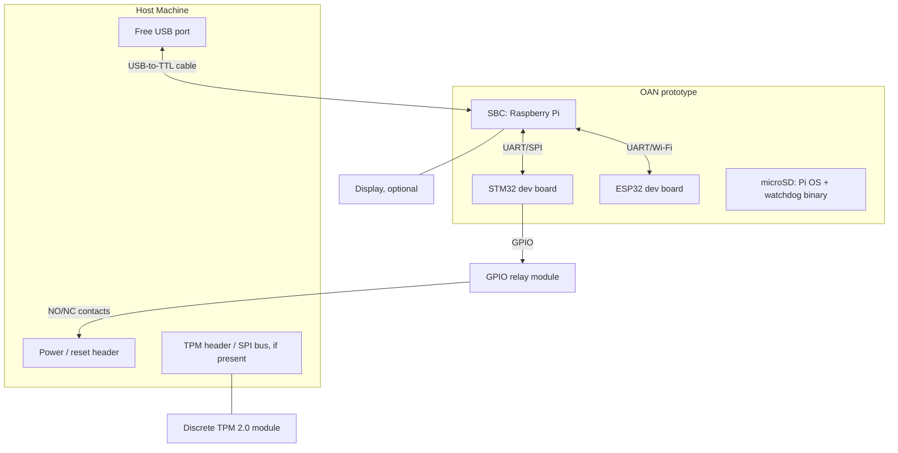

# Out-of-Band Attestation Node (OAN)

> A Hardware-Assisted Independent Trust and Verification Appliance for Kernel Borderlands

**Version:** 0.2 (proposal — supersedes v0.1's "KBC Hardware Watchdog" framing)
**Component:** Proposed new subsystem, external to `kb-checker` (working name `kb-hw/` — directory does not exist yet; see Open Question 1 in §14)
**Status:** Proposed — not implemented. No code, no wire contract, no build target, no repository directory exists yet. This document exists so the idea, threat model, and hardware bill of materials survive between sessions/reviews.

---

# 1. Overview & Motivation

## 1.1 Purpose

`kb-checker` is KB's independent safety/integrity watchdog — see [`kb-checker/README.md`](../../kb-checker/README.md). Its entire job is to watch the rest of the platform (`kb-core`, `kb-control-plane`) from outside their failure domain, using a KISS design (zero persistent state, zero network exposure, delegation to OS primitives) so the watchdog itself stays simple enough to trust.

Today, "outside their failure domain" only means *a separate process, on the same host, under the same kernel*. The **Out-of-Band Attestation Node (OAN)** extends that isolation boundary to genuinely separate hardware: a physically independent appliance — its own processor(s), memory, storage, power, and communication channels — that supervises and attests the integrity of Kernel Borderlands from outside the monitored host's trust boundary entirely.

OAN's role is **not to replace** `kb-checker`, but to become the **external trust anchor** for the entire Kernel Borderlands ecosystem, continuing the "external, structurally-independent watchdog" role `kb-checker` already exists to fill.

## 1.2 Why This Problem Exists

`kb-core`'s eBPF sensors run at Ring 0. If an attacker achieves a full kernel compromise, they are operating at the same privilege level as the sensor that's supposed to catch them. `kb-checker` already anticipates this partially — its integrity checks (JIT signature audits, BPF map self-heal, heartbeat liveness) exist specifically because `kb-core` telemetry can't be blindly trusted.

But `kb-checker` itself still runs as a userspace process on the same physical machine, communicating over local UDS sockets (`kba.sock`, `kbc.sock`). A sufficiently privileged kernel-level attacker controls the same kernel that arbitrates those sockets, the same scheduler that runs (or starves) the `kb-checker` process, and the same power/reset state of the box. Software-only isolation on a single host has a ceiling: the watchdog and the thing it watches ultimately share one root of trust (the CPU + kernel).

This is the same class of problem CPM solves for containment authorization (see [`CPM.md`](../CPM.md) §1.2) — "the security platform's own components must be immune to the failure modes they're meant to prevent" — but at the hardware/trust-boundary layer instead of the containment-authorization layer.

## 1.3 Design Goal

Move the *last* line of defense off the host entirely. A physically separate node, with its own compute and its own power domain, attests to and can fence the host without depending on that host's kernel being honest. This does not replace `kb-checker`'s existing software role — it gives KB an external anchor point for the one failure mode no same-host component can structurally cover alone: total kernel compromise.

## 1.4 Why This Sits Outside the Five Subsystems

v0.1 of this document scoped OAN as a `kb-checker` hardware extension. As of v0.2, it's deliberately reframed as its own subsystem, not "part of" `kb-checker`, because:

- OAN's own internal design (§4) now spans three processors (SBC, STM32, ESP32) and their own firmware toolchains — outside the Rust/KISS scope `kb-checker` is held to (see [`kb-checker/README.md`](../../kb-checker/README.md)'s KISS pillars, which should **not** be diluted by folding this in).
- Cluster supervision of *many* hosts (§9) is a fleet-management concern, not a single-host watchdog concern.
- It is a physical appliance with its own enclosure, display, and power domain (§11) — a different kind of deliverable than a binary in a subsystem directory.

It still talks to `kb-checker` specifically, not `kb-core` or `kb-control-plane` directly, for the same reason as v0.1: `kb-checker` is the only KB component whose stated purpose is external verification, so it's the natural attestation source on the host side. `kb-control-plane` and `kb-aads` remain telemetry *consumers* that don't have an independent "is the kernel lying to me" problem; `kb-op` remains an interface layer with no watchdog role.

---

# 2. Design Philosophy

Four principles, deliberately mirroring `kb-checker`'s own KISS pillars at the hardware layer instead of the software layer:

- **Out-of-Band** — never depends on the monitored operating system for its own execution.
- **Independent** — own CPU, memory, storage, and power; no shared failure domain with the host.
- **Hardware Rooted** — trust originates from hardware (TPM 2.0), not software claims.
- **Fail-Safe** — able to take protective action even when the monitored host cannot cooperate (failure semantics still unresolved — see Open Question 2 in §14).

---

# 3. High-Level Architecture

**Illustrative only** — internal bus choices, exact host-side connector, and message formats are not designed yet (§14).

```mermaid
graph LR
    subgraph HOST["KB Host — existing"]
        CORE["kb-core<br/>eBPF sensors, Ring 0"]
      CP[ "kb-control-plane<br/>(kbd)"]
        KBC["kb-checker<br/>existing, software"]
        CORE --> CP
        CP -. "UDS: kba.sock/kbc.sock" .-> KBC
    end

    subgraph OAN["Out-of-Band Attestation Node — proposed"]
        SBC["SBC<br/>attestation engine, policy, dashboard"]
        STM32["STM32<br/>deterministic safety controller"]
        ESP32["ESP32<br/>management/comms processor"]
        TPM["TPM 2.0<br/>hardware root of trust"]
        DISP["Display"]
        SBC --- STM32
        SBC --- ESP32
        SBC --- TPM
        SBC --- DISP
  end

    KBC <-->|"OOB Trust Plane:<br/>serial or dedicated Ethernet<br/>never the host's primary network"| SBC
    ESP32 <-.->|"Fabric Management Plane:<br/>dedicated VLAN/NIC, signed summaries only"| FMSNODES["Other Fabric nodes — see oan-fms.md"]
    STM32 -->|"relay control"| RELAY["Relay Controller"]
    RELAY -->|"power / reset cutoff"| HOST
```

- **Link**: deliberately *not* the host's normal network path (per `kb-checker`'s existing "no network footprint" pillar — the out-of-band link should not become a new attack surface reachable from the host's regular network stack).
- **TPM 2.0**: measured boot + sealing of OAN's own integrity state, and/or the host's `kb-checker` state (§4.4, §14 Open Question 4), so a compromised kernel can't forge what it reports upstream.
- **Relay/fencing**: physical power or reset cutoff OAN can trigger independently of host software cooperating — the hardware analogue of `kb-checker`'s existing 3-layer quarantine containment (`systemctl stop` → `SIGKILL` → `iptables` drop, see its README's flow diagram), as a last-resort layer *below* all three (§8).

## 3.1 Two Communication Planes

Decided (v0.2): OAN exposes **two independent communication planes**, on separate interfaces, that never share transport — resolving what was an open question in earlier drafts about how fleet management (§9, `oan-fms.md`) could coexist with the "never the host's primary network" principle above.



- **Out-of-Band Trust Plane** — the SBC's dedicated, point-to-point link to the host's `kb-checker` (§3 diagram above): attestation, heartbeat, recovery triggers. Isolated from the host's production networking. This *is* the hardware trust boundary — nothing on this plane is optional or shared with other hosts.
- **Fabric Management Plane** — a secured management network used by FMS (`oan-fms.md`) for fleet orchestration, policy distribution, inventory, and event aggregation. Operational, not trust-establishing; does not participate in runtime attestation. Naturally maps onto the ESP32's existing "management/comms processor" role (§4.3) — the ESP32 already never makes security decisions, which is exactly the property this plane needs.

Attestation and trust never depend on the management network. Fabric management accepts the realities of distributed systems (ordinary Ethernet, multiple hosts) without weakening the hardware trust model, because it structurally cannot reach the OOB plane.

---

# 4. Internal Hardware

**Illustrative only** — exact part numbers, bus wiring, and firmware are not designed yet; costs are tracked in §10.

## 4.1 SBC

Example candidates: Raspberry Pi 5, Intel N100 mini PC.

Responsibilities:
- Main attestation engine
- Policy engine
- Cluster management (§9)
- Dashboard
- Cryptographic verification
- Local database
- Logging

This is the "brain" of OAN — the counterpart to `kb-checker`'s role on the host side, but running on independent hardware.

## 4.2 STM32

Purpose: dedicated deterministic safety controller.

Responsibilities:
- Hardware watchdog
- Independent timers
- Heartbeat supervision
- Relay control
- Emergency fencing
- Safe-state controller

The STM32 continues operating even if Linux on the SBC crashes — this is the point of splitting it out from the SBC rather than running the watchdog timer as a Linux process, which would reintroduce the same "watchdog shares a failure domain with what it watches" problem OAN exists to solve, just one level down.

### 4.2.1 Why a Dedicated MCU, Not the SBC or the ESP32

**Why not let the SBC drive the relay directly?** Because then fencing depends on Linux being alive and scheduled promptly. If the SBC hangs, panics, or is simply busy at the wrong moment, the relay decision hangs with it — recreating, one level down, the exact "watchdog shares a failure domain with what it watches" problem OAN exists to solve for the host (§1.2).

**Why not use the ESP32, since it's already onboard (§4.3)?** Because the ESP32 runs a full WiFi/networking stack — a much larger, more remotely-reachable attack surface, and the piece most likely to run stock SDK code with known CVEs. Putting fencing authority there would hand the least-trusted onboard chip the most consequential action.

**What the STM32 specifically provides that neither of those does:**
- A hardware independent watchdog timer (IWDG) peripheral — a native chip feature built exactly for "if nothing resets me in time, act," not something bolted on in software.
- No OS, no network stack, no scheduler — one small deterministic firmware loop, so a heartbeat-timeout decision fires in a fixed, predictable number of cycles rather than "whenever Linux gets around to it."
- Its own clock and power behavior independent of the SBC — an SBC crash, freeze, or even attacker code execution *on* the SBC doesn't reach it, because it isn't running general-purpose software there's anything to exploit into.
- Cheap and simple precisely because it isn't doing policy/attestation logic (that stays on the SBC) — it only watches a timer and flips a relay, a job small enough for a $10–$25 commodity board to do with high confidence, no custom safety-rated silicon required.

Shorthand for the three-chip split: **SBC = brain** (complex, capable, but crashable), **ESP32 = mouth** (talks to the network, never decides anything), **STM32 = spinal reflex** (dumb, minimal, but keeps firing even if the brain goes dark).

## 4.3 ESP32

Purpose: dedicated management processor.

Responsibilities:
- Secondary communication processor
- Device discovery
- Secure provisioning
- Maintenance interface
- Recovery channel
- Optional wireless management

The ESP32 never makes security decisions — only manages communication. Keeping it out of the trust-critical path matters: it is the component most likely to run stock networking stacks/SDKs with a larger attack surface than the STM32's minimal firmware, so it must not be able to authorize fencing or attestation results on its own.

This is also, as of v0.2, the designated carrier for the **Fabric Management Plane** (§3.1): fleet-facing traffic (FMS, dashboards, policy sync — see `oan-fms.md`) is intended to run through the ESP32, physically and logically separate from the SBC's direct OOB link to the host's `kb-checker`. The ESP32's existing "no security decisions" constraint is precisely what makes it safe to also carry ordinary networked, multi-host traffic — a compromise of the ESP32/management plane cannot reach the attestation/relay path, which lives on the SBC/STM32/TPM side instead.

## 4.4 TPM 2.0

Purpose: hardware root of trust.

Responsibilities:
- Key storage
- Measured boot
- Secure key generation
- Integrity measurements
- Attestation signing

Whether the TPM seals OAN's own state, the host's `kb-checker` state, or both is unresolved — see Open Question 4 in §14 (carried over from v0.1).

## 4.5 Relay Controller

Purpose: physical isolation, driven by the STM32 (§4.2), not the SBC — so fencing survives an SBC-side (Linux) crash or compromise.

Capabilities:
- Reset host
- Power cycle host
- Fence compromised machine

Only used after software recovery has failed (§8).

## 4.6 Display

Displays:
- Host status
- Integrity state
- Threat level
- Heartbeat
- Cluster health
- TPM status
- Relay status
- Event log

Useful during demonstrations and diagnostics; not on the trust-critical path (it's a read-only reflection of state the SBC/STM32 already hold, not an input to any decision).

---

# 5. Functional Responsibilities

OAN continuously:
- Verifies host integrity.
- Confirms `kb-checker` liveness.
- Validates TPM measurements.
- Detects heartbeat loss.
- Verifies watchdog responses.
- Detects suspicious silence.
- Logs security events.
- Coordinates recovery.
- Performs last-resort fencing.

---

# 6. Proposed Attestation / Heartbeat Flow

**Illustrative only** — no wire protocol exists yet (§14 Open Question 1, carried over from v0.1). This shows the intended shape of the interaction, not a contract to build against.



---

# 7. Relationship with Kernel Borderlands



Everything above the trust boundary may fail. Everything below remains independent.

---

# 8. Recovery Hierarchy

**Illustrative only** — how this maps onto `kb-checker`'s existing 3-layer software chain (`systemctl stop` → `SIGKILL` → `iptables` drop, see [`kb-checker/README.md`](../../kb-checker/README.md)) is not decided (§14 Open Question 3, carried over from v0.1). The mapping below is a first guess, not a design.



Only Stage 5 requires OAN; Stages 1-4 are entirely within `kb-checker`'s existing software authority.

Tentative mapping to `kb-checker`'s existing chain (needs confirmation, not a commitment):

| OAN stage | Likely existing `kb-checker` equivalent |
|---|---|
| 1. Software recovery | JIT signature audit / BPF map self-heal |
| 2. Process restart | `systemctl stop kb-sensor` → `SIGKILL` |
| 3. Policy isolation | CPM containment policy actions |
| 4. Network fencing | `iptables` network drop |
| 5. Hardware fencing | OAN relay cutoff (new) |

---

# 9. Cluster Support (Future Work — out of prototype scope)

This is explicitly **not** part of the bench-buildable prototype scoped in §10 — a single-host attestation link is the whole prototype goal. Everything in this section is direction, not a commitment, and — as of this pass — deliberately covers **two different models** for "one OAN, many hosts" rather than picking one, because they trade off differently and the prototype doesn't force a choice yet.

The one constraint that holds under **both** models, non-negotiably: the OOB Trust Plane (attestation + relay fencing, §3.1) is physical and point-to-point. It cannot be shared over ordinary networking between hosts — that would just recreate the same-network attack surface OAN exists to avoid. What can differ between models is only *where the other end of that physical link terminates*.

## 9.1 Model A — Dedicated OAN per Host

Each host gets its own complete OAN unit, exactly as built out in §4/§10 (its own SBC, STM32, ESP32, TPM, relay, display).



Simplest to reason about: every host's trust boundary is entirely self-contained hardware, with no shared failure domain between hosts at all. FMS, if present, only adds fleet visibility/policy on top (per the Local Autonomy Principle, `oan-fms.md` §3.1) — it never changes what any single OAN unit can do on its own. Costs scale linearly with host count, since each host duplicates the full BOM (§10).

## 9.2 Model B — Shared Chassis, Capped at 5 Hosts

**Decided (this pass): a Model B chassis serves a hard maximum of 5 hosts.** Below the cap, everything below is direction. Above it, deploy another chassis rather than growing one further — see rationale at the end of this subsection.

One physical box hosts up to 5 independent STM32+relay channels behind a single shared SBC, ESP32, TPM, and display. The transport for those channels is a **dedicated, physically isolated Ethernet segment** — its own small unmanaged switch, with no uplink to the production LAN — not point-to-point serial cable runs. Serial only worked as a mental model for "a couple of machines on the same desk"; it doesn't hold up even at 5 hosts spread across a lab bench, and the isolated-Ethernet form is exactly what enterprise BMC/IPMI management networks and managed PDUs already do at this scale, for the same trust reason: physically/logically separate from anything the host's own kernel drives, so a rooted host can go silent or send garbage on it but can't forge a valid signed attestation or reach other hosts' channels.



Each host's OOB link terminates on a dedicated interface distinct from that host's own main NIC — a small dongle or the STM32/companion channel itself, not a VLAN carved out of the host's primary network path. A VLAN on the host's own NIC doesn't count as out-of-band: the host's kernel still drives that interface and can block or forge traffic on it. Power fencing scales the same way a rack PDU does — a single 5–8 outlet managed relay/PDU block, control channel on the same isolated switch, rather than 5 loose single relay modules.

**Why cap at 5, not scale one chassis further:**
- **Blast radius.** If the shared chassis itself fails or is physically tampered with, only 5 hosts lose OOB coverage, not the whole lab. Model A's per-host isolation is fully preserved at small scale; Model B trades some of that away for cost, and 5 is where that trade stops being worth pushing further.
- **Commodity part sizes.** 5-8 channel relay/PDU boards and 5-8 port unmanaged switches are the natural off-the-shelf sizes — going bigger means custom boards instead of commodity ones, which changes the cost model in §9.3 entirely.
- **USB/GPIO fan-out on the SBC.** A Raspberry Pi's USB and GPIO budget gets cramped well before 10+ channels; 5 keeps the shared SBC side of the design within what a stock board (no custom PCB) can drive.

A lab of 30 machines under this cap needs **6 Model B chassis units**, each with its own isolated switch segment, each independently reporting up to FMS (§9.4) — not one giant chassis and not 30 individual OAN units.

### 9.2.1 What Each Host Needs vs. What's Shared

Model B does **not** make per-host hardware free — it only removes the *redundant* per-host hardware. Every host still needs its own physical wiring, because fencing and attestation are inherently host-specific:

- **Per host, always required, never shared:** a relay tap wired into that host's own power/reset header (fencing has to switch that machine's power specifically), a dedicated OOB link endpoint (a small dongle/NIC distinct from the host's normal network card, not a VLAN on it — the host's own kernel still drives that), and the STM32 channel logic watching that one link/relay pair.
- **Shared once, across up to 5 hosts:** the SBC (attestation engine, policy, dashboard), the ESP32 (owns the isolated switch port, fleet-facing comms), the TPM (root of trust), and the display.

So the "one main OAN" for a group of up to 5 desktops is the shared brain — each desktop just gets cheap wiring back to it, not its own copy of the brain. Past 5 desktops, that stops working and you stand up another independent chassis (another "main OAN") for the next batch, rather than growing one chassis indefinitely (§9.2's blast-radius/commodity-part reasoning above).

## 9.3 Cost Comparison

Splitting §10's BOM into "shared once per chassis" (SBC, microSD, ESP32, TPM, display) vs. "per host" (STM32, relay channel, OOB link hardware) components — INR at the same approximate ~₹87/USD used in §10:

| | Cost (USD) | Cost (INR) |
|---|---|---|
| Shared once, per chassis (Model B only) | $74–$148 | ₹6,440–₹12,880 |
| Per host — Model A (full unit) | $105–$215 | ₹9,135–₹18,705 |
| Per host — Model B (one channel, within the 5-host cap) | $32–$47 | ₹2,785–₹4,090 |

Worked examples — single (1), triple (3), and pentagon (5, the cap) host configurations, all within **one** Model B chassis, plus the 30-host lab case needing 6 chassis:

| Config | Hosts | Chassis | Model A total (USD / INR) | Model B total (USD / INR) |
|---|---|---|---|---|
| Single | 1 | 1 | $105–$215 / ₹9,135–₹18,705 | $106–$195 / ₹9,220–₹16,965 |
| Triple | 3 | 1 | $315–$645 / ₹27,405–₹56,115 | $170–$289 / ₹14,790–₹25,145 |
| Pentagon (cap) | 5 | 1 | $525–$1,075 / ₹45,675–₹93,525 | $234–$383 / ₹20,360–₹33,320 |
| Lab (worked example, §9.2) | 30 | 6 | $3,150–$6,450 / ₹2,74,050–₹5,61,150 | $1,404–$2,298 / ₹1,22,150–₹1,99,925 |

Each Model B total = one chassis's shared cost + (per-host cost × hosts on that chassis); the lab row sums that across all 6 chassis.

### 9.3.1 Per-Host Cost Breakdown

The $32–$47 / ₹2,785–₹4,090 per-host figure is four parts, not one:

| Part | Cost (USD) | Cost (INR) | Note |
|---|---|---|---|
| STM32 dev board (that host's channel) | $10–$25 | ₹870–₹2,175 | e.g. Nucleo-F103RB or "Blue Pill" F103C8 |
| Relay (that host's fencing channel) | $6 | ₹520 | cheaper per-channel if bought as part of a shared 5–8 channel relay/PDU board rather than individually |
| OOB dongle/link hardware | $8 | ₹700 | **approximate** — still borrowing Model A's serial-cable line item as a stand-in, not yet priced against an actual small Ethernet dongle/module (§14 Open Question 9) |
| Wiring/connectors | $8 | ₹700 | jumper wire, connector, cable run to that host |
| **Total per host** | **$32–$47** | **₹2,785–₹4,090** | |

### 9.3.2 Marginal Cost of Filling a Chassis to the 5-Host Cap

The shared chassis (SBC + ESP32 + TPM + display) is bought exactly **once** per chassis, at $74–$148 / ₹6,440–₹12,880, regardless of whether it's serving 1 host or the full 5-host cap — it does not change as hosts are added, only as a new chassis is stood up past host 5 (§9.2). Every host added past the first pays only the per-host line from §9.3.1:

| Adding host # | Extra cost (USD) | Extra cost (INR) |
|---|---|---|
| 2nd | $32–$47 | ₹2,785–₹4,090 |
| 3rd | $32–$47 | ₹2,785–₹4,090 |
| 4th | $32–$47 | ₹2,785–₹4,090 |
| 5th | $32–$47 | ₹2,785–₹4,090 |
| **Total extra, hosts 2–5** | **$128–$188** | **₹11,140–₹16,360** |

So filling one chassis from a single host up to the full 5-host Family/Colony costs the fixed chassis price once ($74–$148), plus $128–$188 in incremental per-host wiring — landing at the Pentagon row's $234–$383 / ₹20,360–₹33,320 total above. The cost curve is flat on the expensive shared parts and only climbs on cheap, per-host wiring, which is the entire point of Model B over Model A.

Model B stays markedly cheaper at any scale past a handful of hosts, and the gap holds even with the 5-host cap forcing multiple chassis, because each chassis still amortizes its SBC/TPM/ESP32/display cost across 5 hosts instead of 1. A multi-channel relay/PDU board further undercuts buying N single-relay modules per chassis. Model A stays simpler to build and reason about for one host, or for hosts that aren't physically near each other — which is exactly the bench prototype's situation, hence §10 is written as Model A only.

### 9.3.3 Per-Person Split (Team of 10), Model B

| Config | Hosts | Model B total (USD) | Model B total (INR) | Per person (USD) | Per person (INR) |
|---|---|---|---|---|---|
| Single | 1 | $106–$195 | ₹9,220–₹16,965 | $10.60–$19.50 | ₹922–₹1,697 |
| Triple | 3 | $170–$289 | ₹14,790–₹25,145 | $17.00–$28.90 | ₹1,479–₹2,515 |
| Pentagon (cap) | 5 | $234–$383 | ₹20,360–₹33,320 | $23.40–$38.30 | ₹2,036–₹3,332 |

### 9.3.4 Single vs. Pentagon: Where the Money Actually Goes Further

Pentagon costs roughly **2.2x more per person** than Single ($23.40–$38.30 vs. $10.60–$19.50) — but for that, it covers **5x the hosts**, not 1. Looked at per-host instead of per-person, the ranking flips: Single is **$106.00–$195.00/host** (no chassis to amortize — one host carries the entire shared cost), Triple is **$56.67–$96.33/host**, and Pentagon is **$46.80–$76.60/host** — under half of Single's per-host cost, because the shared SBC/ESP32/TPM/display gets spread across 5 machines instead of 1. This is the same ~2.3–2.5x ratio the cost-reduced BOM in `oan-cheap.md` §5.2 shows — the effect comes from chassis-sharing arithmetic, not from which parts were bought, so it holds regardless of BOM tier.

So for a team actually protecting more than one machine, Single is the worse deal per host covered, not the cheaper one — the higher Pentagon total buys proportionally far more for a comparatively small bump in per-person cost. Single only makes sense when there's genuinely just one host to protect, or when hosts aren't co-located and can't share a chassis at all (Model A, §9.1).

## 9.4 Relationship to FMS

Both models can sit underneath FMS (`oan-fms.md`) unchanged — FMS coordinates whatever OAN units/chassis exist (one per host in Model A, one 5-host-capped chassis in Model B — e.g. 6 chassis for the 30-host lab example in §9.2) over the Fabric Management Plane, and never touches the OOB Trust Plane in either case. Choosing between Model A and B, and how many Model B chassis a Colony needs, is a hardware-topology decision; it doesn't change FMS's design, and a real deployment could mix both (shared chassis for lab benches, dedicated units for remote/standalone hosts elsewhere) without FMS needing to know the difference.

Design direction for the fleet layer itself — fleet hierarchy (Fabric/Colony/Family/Node), discovery, policy inheritance, cross-host correlation, recovery coordination — is written up separately as the **Fabric Management Service (FMS)**: see [`oan-fms.md`](oan-fms.md). It is proposed as an SBC-side service *within* OAN (§4.1), not a separate appliance, and is scoped explicitly to come after a working single-host OAN prototype, not before. FMS runs on the Fabric Management Plane (§3.1), separate from this doc's OOB Trust Plane, and is classified non-security-critical (`oan-fms.md` §3.1) so that fleet coordination never sits in the runtime security path of any individual host.

---

# 10. Bill of Materials (Prototype Scope)

Scoped to a bench-buildable single-host prototype for a physical review demo — not the production appliance described in §11. No FPGA/DPU inline-hardware tier (evaluated and dropped, see §10.2).

| Component | Purpose | Est. Cost (USD) | Est. Cost (INR) |
|---|---|---|---|
| Raspberry Pi 4/5 (or Pi Zero 2 W) | SBC — attestation engine, off-host | $35–$80 | ₹3,050–₹6,950 |
| microSD card (32GB+) | Pi OS + watchdog binary | $8 | ₹700 |
| STM32 dev board (e.g. Nucleo-F103RB or "Blue Pill" F103C8) | Deterministic safety controller, relay control | $10–$25 | ₹875–₹2,175 |
| ESP32 dev board (e.g. ESP32-WROOM DevKitC) | Management/comms processor | $6–$10 | ₹525–₹875 |
| USB-to-TTL serial cable (FTDI/CP2102) | Out-of-band link, host ↔ SBC | $8 | ₹700 |
| *(alt.)* Dedicated 2nd Ethernet NIC + cable | Out-of-band link if demoing network attestation instead of serial | $10–$20 | ₹875–₹1,750 |
| Discrete TPM 2.0 module (LPC/SPI breakout) | Hardware root of trust, if host/SBC board lacks one | $20–$40 | ₹1,750–₹3,500 |
| GPIO relay module | Physical power/reset fencing of host, demo visual | $6 | ₹525 |
| Jumper wires + small breadboard/perfboard | Wiring for TPM, STM32, ESP32, relay | $8 | ₹700 |
| I2C OLED/LCD display (optional) | Live status readout for the demo | $5–$10 | ₹440–₹875 |
| **Total** | | **~$105–$215** | **~₹9,150–₹18,700** |

INR figures are an approximate conversion at ~₹87/USD (rough, for scoping only — not a sourcing quote; actual India import/GST pricing on these boards runs higher than a flat conversion, particularly for the Pi and TPM module).

Host side: existing dev machine running `kb-core`/`kb-control-plane`/`kb-checker` — needs a free USB/serial port and, if used, a TPM header. No new host hardware required.

The three-processor split (SBC + STM32 + ESP32) is more hardware than v0.1's single-Pi design, but each board is still a $10–$25 commodity dev board, not custom silicon — the added cost is modest relative to what it buys: a watchdog timer (STM32) that survives the SBC's own Linux crashing.

## 10.1 Wiring Sketch (illustrative)



## 10.2 Tiers Considered and Rejected (for now)

- **Inline hardware (smart NIC/FPGA/DPU)** sitting in the data path, independently observing traffic/syscalls without trusting host telemetry at all — the most complete answer, but real DPU hardware runs $1.5k–$8k+ and even a cheap Zynq-class FPGA prototype ($150–$300) needs RTL/embedded toolchain work spanning weeks. Rejected for the initial prototype on cost/scope; noted as a possible future tier, not pursued further here.

---

# 11. Physical Appliance (Production Concept — beyond prototype scope)

This section describes the intended *production* form factor, not the bench prototype in §10. Treat as aspirational/design-direction, not a build target.

Front:
- LCD/Touch display
- Power LED
- Healthy LED
- Alert LED
- Fenced LED

Rear:
- Ethernet
- USB
- Serial
- GPIO
- Power
- Relay connector

Internally: SBC, STM32, ESP32, TPM, relay board, cooling, power regulation — all enclosed as a single hardware appliance.

---

# 12. Why This Architecture?

Each component has one clearly defined responsibility:

| Component | Responsibility |
|---|---|
| **SBC** | Decision making, attestation, management |
| **STM32** | Deterministic safety, watchdog, relay control |
| **ESP32** | Management communication and provisioning |
| **TPM** | Hardware trust anchor |
| **Relay** | Physical host fencing |
| **Display** | Local operational interface |

This separation avoids overlapping functionality while improving resilience — no single processor is both "makes the security decision" and "runs the general-purpose networked OS."

---

# 13. Research Contribution (intended, if built)

If implemented, OAN would extend Kernel Borderlands beyond a software-only runtime defense framework by introducing a hardware-assisted trust layer: an independent verification domain capable of monitoring host integrity, validating runtime attestation, coordinating recovery, and performing last-resort hardware fencing without relying on the monitored operating system. Separating trust across dedicated hardware components would reduce the impact of complete host compromise and provide a foundation for secure, scalable runtime protection of individual hosts and, eventually, clusters (§9).

This framing needs validation against prior work (industry HSM/BMC-based watchdogs, academic out-of-band attestation literature) before being asserted as a paper-worthy contribution — not yet done; see §14.

---

# 14. Open Questions / Not Yet Designed

This is a proposal, not a spec. The following track what's worked out and what still needs to be, per [`CPM.md`](../CPM.md)/[`cpm-implementation.md`](../cpm-implementation.md)'s pattern, before any implementation begins.

### Resolved

2. ~~**Failure semantics.** What OAN does if the link itself drops (fail-open vs. fail-closed on the relay) needs an explicit decision, mirroring CPM's "fail closed toward protection" principle (§2.2 of `CPM.md`).~~ **Resolved as a per-deployment policy switch, defaulting to fail-closed.** The relay's behavior on a dropped link, or an attestation that's missing or fails verification past the configured timeout, is a configured decision, not a single hardwired reflex — defaults to fail-closed (fence), mirroring CPM's own "fail closed toward protection" principle (§2.2 of `CPM.md`), with fail-open available as an explicit opt-in for availability-critical hosts where an unattended, unverified fencing event would itself be an unacceptable outage. Full attacker-cost reasoning for why fail-closed is the right default: `latex/oan/main.tex` §8.
3. ~~**Relationship to existing `kb-checker` quarantine flow.** Whether hardware fencing sits strictly below the existing `systemctl` → `SIGKILL` → `iptables` chain (per the tentative table in §8), can be triggered independently of it, or the 5-stage hierarchy in §8 should replace that framing entirely.~~ **Resolved: OAN is strictly Stage 5 of 5, below `kb-checker`'s existing software chain, never in parallel with it.** Stage 1 (JIT signature audit/BPF map self-heal) → Stage 2 (`systemctl stop` → `SIGKILL`) → Stage 3 (CPM containment policy actions) → Stage 4 (`iptables` network drop) → Stage 5 (OAN relay cutoff, requires OAN). A healthy host never reaches Stage 5 — the four software stages above it are expected to resolve the overwhelming majority of real incidents on their own. Confirms §8's tentative table as the actual design, not just a first guess.
4. ~~**TPM integration point.** Whether sealing happens against OAN's own SBC/STM32 state, against `kb-checker`'s state on the host, against `kb-core`'s eBPF bytecode signatures it already audits, or some combination.~~ **Resolved: two separate TPMs, two separate jobs, neither substitutable for the other.** OAN's own TPM (§4.4) is unchanged from this doc's original framing — it seals OAN's own SBC/STM32 integrity state and verifies what `kb-checker` reports against sealed reference measurements. A second, independent trust anchor is the *host's own* TPM 2.0 (discrete or firmware — Intel PTT/AMD fTPM, already present on essentially any real deployment target, zero new hardware): `kb-checker`'s own OOB signing key lives there instead of in process RAM, with its usage sealed to the host's own measured-boot chain (`TPM2_PolicyPCR` against PCRs extended by firmware → bootloader → kernel/initrd → IMA's runtime module-load measurements) — a rootkit loading a new kernel module invalidates that seal permanently, until reboot. The split is load-bearing, not a style choice: a TPM can only make a hardware-backed statement about the machine it is physically part of, so OAN's own TPM structurally cannot attest to the host's measured-boot chain from across the OOB link. Full mechanism, attacker-cost analysis, honestly-scoped residual gaps (memory-corruption-only exploits that never load a module, physical TPM bus sniffing, `kexec`/`/dev/mem` as bypasses of the measured-boot assumption unless signature-gated), and a runnable `tpm2-tools` demo walkthrough: [`oan-rootkit-resistance.md`](oan-rootkit-resistance.md) and `latex/oan/main.tex` §21.

### Still open

1. **Repository placement and exact naming.** §1.4 decided OAN is a standalone subsystem, not a `kb-checker` extension, but the working name `kb-hw/` is a placeholder — needs an actual decision (`kb-hw/`, `kb-oan/`, other) and, once created, an entry in the repository layout table in [`CLAUDE.md`](../../CLAUDE.md) and its own `README.md` following the pattern of the other five subsystems.
5. **Wire/protocol over the out-of-band link.** What the SBC and `kb-checker` actually exchange (attestation format, heartbeat cadence, fencing trigger conditions). No contract exists yet; do not assume one.
6. **Internal SBC↔STM32↔ESP32 protocol.** New in v0.2 — how the three onboard processors talk to each other (bus choice, message format, and critically, how the SBC's attestation verdict reaches the STM32 in a way the STM32 can trust without itself re-implementing crypto verification).
7. **Cluster protocol (§9).** Design direction now written up in [`oan-fms.md`](oan-fms.md) (Fabric Management Service), but entirely undesigned at the protocol/schema level and flagged as future work, not prototype scope — see that doc's own Open Questions.
8. **Research contribution claims (§13).** Need a literature comparison (HSM/BMC-based watchdogs, academic OOB attestation work) before being asserted as novel in any paper draft.
9. **Model B's isolated-Ethernet BOM is approximate, not itemized.** §9.2/§9.3 cost Model B's per-host link using the same $32–$47 line items as Model A's serial cable (STM32 + relay + link hardware + wiring), but the transport was revised to a dedicated isolated-Ethernet dongle/NIC per host plus a shared 5–8 port unmanaged switch per chassis — neither the per-host dongle nor the shared switch has its own priced BOM line yet. Likely similar order of magnitude (a small Ethernet module is roughly serial-cable cost; a small unmanaged switch is ~$15–$25 one-time per chassis) but not confirmed.
10. **§9.2's 5-host cap and isolated-Ethernet transport are decided as design principles, not as a built/tested reference design.** Neither Model A nor Model B has been chosen as *the* prototype target — §10's BOM stays Model A only because that's what the single-host bench prototype needs; a Model B chassis (with its custom breakout PCB/enclosure, once beyond loose dev boards) is unbuilt and unbudgeted beyond the approximate figures in §9.3.
11. **PCR-sealing's own wire-level details (new, from item 4's resolution).** Which PCR banks the host-side seal binds to, the TPM2 policy-session mechanics (`tpm2-tools`/`tpm2-tss`, `TPM2_StartAuthSession` + `TPM2_PolicyPCR`), and where the re-sealing process lives operationally (every legitimate kernel update or intentionally-added module needs the key re-sealed against a new expected PCR digest, or it locks itself out for no security reason) — flagged in `oan-rootkit-resistance.md`, not yet a protocol spec.

---

# 15. Relationship to Existing Documentation

This proposal does not modify or conflict with any existing spec. It continues the "external, structurally-independent watchdog" principle `kb-checker` already embodies ([`kb-checker/README.md`](../../kb-checker/README.md)) and that CPM applies at the authorization layer ([`CPM.md`](../CPM.md)), but — as of v0.2 — as its own future subsystem rather than a `kb-checker` extension (§1.4). No changes to wire contracts ([`docs/architecture/kbd-contracts.md`](../architecture/kbd-contracts.md)), socket topology ([`docs/architecture/boot_sequence_spec.md`](../architecture/boot_sequence_spec.md)), or `kb-checker`'s KISS constraints are proposed here — those constraints should carry over to `kb-checker`'s side of the OAN link (attestation reporting) even though OAN itself, as a separate subsystem, is not bound by them.
