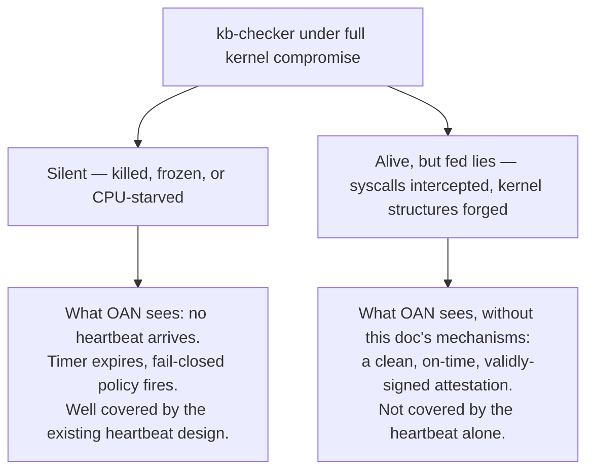
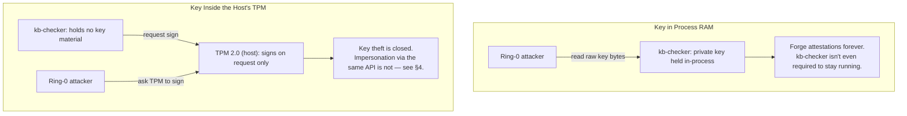
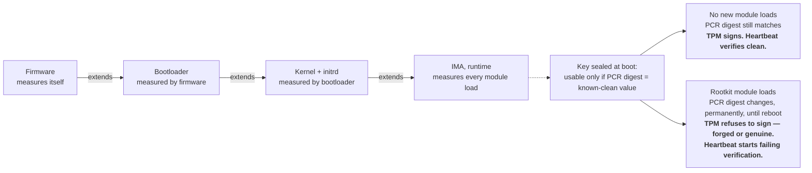
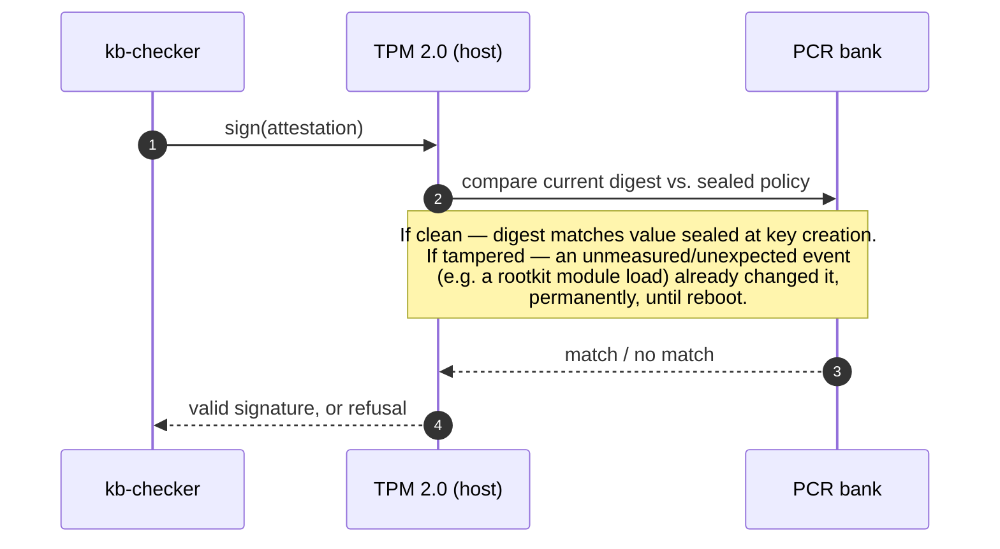
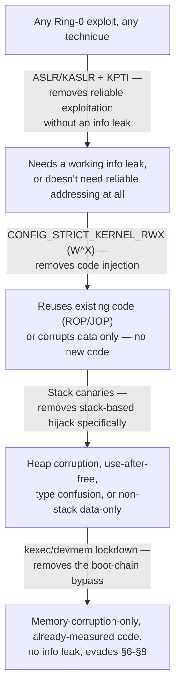
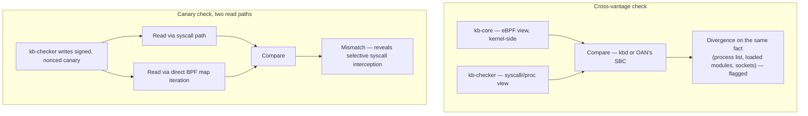

# OAN — Rootkit & Boot-Time Compromise Resistance (`oan-rootkit-resistance.md`)

**Version:** 0.1 (proposal)
**Component:** Addendum to the [Out-of-Band Attestation Node](oan-hardware-appliance.md) — expands and resolves its §14 Open Question 4 ("TPM integration point")
**Status:** Proposed — not implemented. Design direction only: no wire protocol, no TPM policy-session code, nothing built. Exists so this design survives between sessions, per the same handoff discipline as `oan-hardware-appliance.md`. A worked-through, runnable demo of the core mechanism (§10) exists and has been exercised on real hardware, but that is a standalone proof-of-concept of the TPM mechanics, not an implementation of OAN itself.

> This document answers one question precisely: every guarantee in `oan-hardware-appliance.md` rests on one witness, `kb-checker`. If `kb-checker` itself is compromised — not killed, not silent, but alive and lying — what, if anything, can OAN still do about it?

---

# 1. The Question, Stated Precisely

If an attacker achieves full kernel (Ring 0) compromise, they are not outside `kb-checker`'s world — they are underneath it. Every fact `kb-checker` observes (process lists, loaded modules, BPF map contents, `/proc` entries) ultimately comes from the same kernel the attacker now controls. That splits into two structurally different failure modes:



**Silence** is already solved, structurally, by the existing OOB heartbeat: the STM32's liveness timer never took input from the host to begin with, so it doesn't need to know *why* the heartbeat stopped, only that it did.

**Lying** is harder, because a compromised kernel can feed `kb-checker` forged answers to the exact syscalls it uses to check on `kb-core` and itself, and `kb-checker` — running its real, unmodified code — will faithfully sign and send an attestation that is, from its own vantage point, completely honest. This is a **confused-deputy problem**: `kb-checker`'s *code integrity* can be real while its *inputs* are poisoned below the layer it can see. (The term comes from the classic computer-security literature on a trusted-but-manipulable intermediary tricked into misusing its own authority on an attacker's behalf — the shape of the problem here is the same one, one layer down.)

**The limit that doesn't move:** nothing below makes `kb-checker` trustworthy again once the kernel beneath it is compromised — that is not achievable in software, full stop. What follows narrows the set of attacks that can succeed *without leaving a detectable trace*, using components already in OAN's design, at zero additional hardware cost. The goal shifts from "prevent the lie" to "make the lie expensive, and turn a failure into evidence."

---

# 2. Already Closed: Self-Containment (CPM)

One piece of this is already done, in the codebase, not just on paper. The Critical Process Module's protected-component floor previously covered `kb-sensor`, `kb-agent`, `kbctl`, `policy-engine`, and `dashboard` — but not `kb-checker`. That meant a malfunctioning or manipulated detection engine could get `kb-checker` itself recommended for containment through KB's *own* pipeline, with nothing to stop it. `kb-checker` (and `kbd`, which also covers CPM's "policy-engine" since policy evaluation runs inside the `kbd` process) are now in CPM's compiled-in floor, with real, documented install paths — see [`CPM.md`](../CPM.md) §3.3/§5.2/§7.1 and `kb-core/userspace/sensor/kbd_sensor.c`.

Worth being precise about which gap this closes: CPM is an authorization gate in front of KB's *own* containment pipeline ([`CPM.md`](../CPM.md) §2.4, "no self-containment, ever"). A kernel-resident rootkit that never asks `contained_pids_map` for permission — because it corrupts scheduler state or task structures directly — never touches the path CPM guards. What it *does* buy: the "silent" branch above no longer has "KB's own logic turned on itself" as a candidate cause. Silence now points more specifically at something external.

Also hardened, at the same time, and directly protecting CPM's own data: `BPF_F_RDONLY_PROG` on `contained_pids_map` and `protected_exec_paths_map` (no in-kernel BPF program can write either, only userspace), and `bpf_map_freeze()` on `kb_sensitive_paths` (permanently read-only, kernel and userspace both, applied only after its last legitimate startup write — `protected_exec_paths_map` and `protected_workload_paths_map` stay unfrozen deliberately, since both take legitimate writes after startup and freezing either would silently break a real feature, CWP's live workload registration specifically).

---

# 3. Getting the Key Out of Host Memory

Before anything about detecting a lie: there is a sharper, more immediate version of this problem worth closing first. If `kb-checker`'s OOB signing key sits in its own process's RAM, a Ring-0 attacker doesn't need `kb-checker` alive and lying at all. They can read the key straight out of memory and forge attestations directly — or simply kill `kb-checker` and impersonate it from then on, forever, with no watchdog left to notice.



**Which TPM.** Every mechanism in this and the next section uses the **host's own** TPM 2.0 — physically on the protected machine, not OAN's. A TPM can only make a hardware-backed statement about the machine it is part of; OAN's own TPM ([`oan-hardware-appliance.md`](oan-hardware-appliance.md) §4.4) can seal OAN's own integrity and verify what `kb-checker` reports, but it cannot attest to the host's measured-boot chain from across the OOB link — there is no hardware path between them. Essentially every modern server or workstation already ships with one, discrete or firmware (Intel PTT, AMD fTPM), for Secure Boot or disk encryption. Zero new hardware, and no tension with [`oan-cheap.md`](oan-cheap.md) §3.7's rejection of fTPM: that argument is specifically about not substituting the host's fTPM for *OAN's own* independent trust anchor. Using the host's already-present TPM for a host-local job is a different question, and this is precisely the case where a firmware TPM is exactly what `oan-cheap.md` itself calls "genuinely free."

This is a protocol decision, not a bill-of-materials change — the host's own TPM is already there on essentially any real deployment target. `kb-checker` asks it to sign; the private key never exists in host RAM at all. But a root-level attacker can still simply place the *same request* `kb-checker` would have made — the TPM, by itself, doesn't know or care who is asking, it only knows what key was asked for. Key-in-TPM stops **theft**. It does not, on its own, stop **impersonation**. That requires one more piece.

---

# 4. The Critical Piece: Sealing Key Usage to Measured Boot State

This is the one mitigation in this document that doesn't just raise the cost of a same-privilege-level attack — it removes the attacker's ability to use the key at all, for an entire class of compromise, without `kb-checker` needing to notice anything.

## 4.1 The Mechanism

TPM 2.0 Platform Configuration Registers (PCRs) are not writable — only *extendable*: each measurement folds into the register as `PCR_new = H(PCR_old ‖ measurement)`. This makes every PCR a one-way, cumulative hash chain rooted at boot. Firmware measures itself, then measures the bootloader; the bootloader measures the kernel image and initrd before executing them; and, at runtime, the Integrity Measurement Architecture (IMA — standard Linux, no new hardware) extends a PCR every time a kernel module loads.



A key can be created with a `TPM2_PolicyPCR` authorization policy: a digest computed over chosen PCR values at seal time. From then on, the TPM performs a signing operation with that key only if the *current* PCR values, hashed the same way, match that digest — checked entirely inside the chip. There is no step in that sequence a same-privilege-level attacker can intercept, because the attacker is not inside the TPM.



## 4.2 Before and After, From the Attacker's Side

| Key custody | What the attacker needs |
|---|---|
| Key in process RAM | Any Ring-0 primitive, from any privilege-escalation class. Read the key, forge forever. |
| Key in TPM, unsealed | Any Ring-0 primitive, plus the ability to call the TPM's signing API — trivial once root. Theft is closed; impersonation is not. |
| Key in TPM, PCR-sealed | Ring-0 achieved via a path that never extends the sealed PCRs — narrowed from "any privilege escalation" down to memory-corruption-only exploitation of already-loaded, already-measured code, with zero new modules, for as long as the attacker wants to keep forging. |

The important property isn't just "harder" — it's **self-terminating**. A rootkit that needs to load anything, even something auxiliary, even temporarily, doesn't get an error and a chance to route around it while staying resident. The key goes dark for the rest of that boot session, full stop, the moment the PCR extends. Most real persistent Linux rootkits ship as loadable modules, because writing durable kernel-level capability without ever loading new code is a substantially harder engineering problem than the alternative — so this closes the well-trodden path, not a rare one.

This is also what turns a bare fencing event into a specific claim (§8): if the TPM starts refusing to sign, that is not "something is wrong, generically." It is "the measured-boot state changed since this key was sealed" — about as close to a direct rootkit or bootkit signature as this design can produce without new hardware.

## 4.3 What This Does Not Close

- **Memory-corruption-only exploits.** An attack path that reaches Ring 0 purely through in-place patching of already-loaded, already-measured code — no new module, ever — extends no PCR and trips nothing. Narrower than "any rootkit," not zero — narrower still once §5's mitigations are stacked on top.
- **Physical TPM bus sniffing.** A discrete TPM communicating over an unencrypted LPC/SPI bus is a documented attack class (the same category demonstrated against BitLocker on some hardware). Requires physical board access, not a remote exploit — TPM 2.0 parameter-encryption sessions mitigate it, at zero new hardware cost.
- **Upstream compromise of the measurement chain itself** (firmware, bootloader, Secure Boot bypass) is a different, higher-effort threat class this doesn't address — and isn't really OAN's problem to solve; it's the layer OAN's own trust starts from.
- **Real operational cost.** Every legitimate kernel update or intentionally-added module requires re-sealing the key against a new expected PCR digest. That is a key-management process that has to actually exist and be exercised correctly — skip it once and a routine patch locks the key out for no security reason; build a habit of re-sealing without checking *why* the PCR changed, and the whole mechanism is quietly defeated. (Open Question 11, `oan-hardware-appliance.md` §14.)

---

# 5. Narrowing the Memory-Corruption Gap

PCR-sealing leaves exactly one gap open: an attacker whose path to Ring 0 never triggers a measured event. That isn't one attack, it's a category — and most of it can be narrowed further with mitigations that already ship in mainline Linux and mainstream compilers, at zero new hardware cost.



- **ASLR/KASLR** randomizes where the kernel and its structures land in memory on every boot; a bug that doesn't know where anything is usually just crashes the machine. **KPTI**'s role is more specific than it first looks: it closes Meltdown-class speculative-execution reads of kernel memory from userspace — one of the most practical ways to defeat KASLR before ever triggering the corruption bug.
- **Stack canaries** (`-fstack-protector-strong` and family) place a random value next to the return address; a stack overflow overwrites the canary before it reaches anything that matters. Scope-limited: stack overflows only, not heap corruption, use-after-free, or type confusion. Intel CET's hardware shadow stack (`SHSTK`) is a stronger version, needing a CET-capable CPU — a software-only shadow stack exists too and is weaker; the two shouldn't be conflated.
- **`CONFIG_STRICT_KERNEL_RWX`** enforces W^X (write XOR execute) on kernel memory — blocks the classic "corrupt memory, inject shellcode, jump to it" technique directly, but is silent on return-oriented/jump-oriented programming (ROP/JOP) and data-only attacks, which inject no new code at all. This is the sharpest technique that survives every mitigation stacked at once, and what the bottom box above is built from. Caveat: can break legacy/out-of-tree kernel modules that self-modify code at runtime — a one-time compatibility check, not an ongoing risk.
- **`kexec`/`/dev/mem` lockdown.** §4's entire guarantee assumes new code only enters the kernel through a path IMA measures. `kexec_load` boots a completely different kernel image without a hardware reset and without going back through firmware/bootloader measurement — the PCR values would simply never reflect it. Linux's `kernel_lockdown` LSM already gates `kexec_load` and permits `kexec_file_load` only for signed images — the same signature-enforcement principle §4 already leans on for modules, applied to the other path that can introduce an unmeasured kernel. `CONFIG_STRICT_DEVMEM` closes the more direct version of the same problem.
- **LKRG (Linux Kernel Runtime Guard), report-only.** For the residual sliver that survives everything above — a ROP/JOP or data-only exploit against already-measured code — an active kernel-resident integrity monitor can still add value, with one condition: LKRG runs at the *same* privilege level as the exploit it's trying to catch, so it is explicitly **not** a hardware-anchored mechanism the way §4's PCR-sealing is; it is a same-privilege-level race, and its more aggressive response modes (killing the process, panicking the box) are a real, documented production-availability risk. Run it in logging/alert-only mode, and feed its findings into §8's classification as one more signal, never as an autonomous enforcement action — the only place that gets to take a disruptive action should stay OAN's own deliberately-chosen relay policy (§8 of `oan-hardware-appliance.md`), not a second, uncoordinated kill switch racing the attacker inside the kernel. Deployed this way, LKRG must also be part of the measured baseline itself, loaded early enough that its own presence is expected, not an unmeasured surprise.

| Layer | Removes | Cost / caveat |
|---|---|---|
| ASLR/KASLR + KPTI | Reliable exploitation without a separate info leak | Near zero; on by default on most current kernels |
| `STRICT_KERNEL_RWX` | Code-injection exploitation | May break legacy/out-of-tree modules; silent on ROP/JOP/data-only |
| Stack canaries | Stack-based control-flow hijack | Sub-1% overhead; scope-limited to stack overflows |
| `kexec`/`devmem` lockdown | Bypass of the measured-boot chain itself | Breaks unsigned-image `kexec` workflows unless images are signed |
| LKRG, report-only | Same-privilege-level detection of what survives every layer above | Real CPU overhead (low single digits, workload-dependent); must run report-only in production |

---

# 6. Cross-Checking Views That Should Never Disagree

PCR-sealing narrows the field; it doesn't cover the memory-corruption gap above. The remaining mitigations target exactly that gap — a live, correctly-keyed `kb-checker` whose *inputs* have been quietly poisoned — using observation paths this design already has, compared against each other rather than trusted individually.



`kb-core` (eBPF, kernel-side) and `kb-checker` (syscall/`/proc`-side) already observe overlapping facts — process lists, loaded modules, open sockets — through different code paths. A rootkit that hooks the syscall table to lie to `kb-checker` isn't automatically clever enough to also hide from an eBPF hook watching the same fact from a different angle, and vice versa — maintaining two consistent lies across two independent code paths is strictly harder than maintaining one. Forwarding both views to a single comparison point (`kbd`, or OAN's SBC over the OOB link) costs nothing new to build; it's a comparison, not a component.

The canary variant sharpens this further: have `kb-checker` periodically write a signed, nonced value into a BPF map, then read it back two ways — once through the normal syscall path, once through direct BPF map iteration. A rootkit intercepting one path but not the other reveals itself the moment the two answers disagree.

---

# 7. Timing and Clock Cross-Checks

Interception adds latency even when the forged output looks perfect. Have `kb-checker` include its own attestation-generation time in the signed payload, and have OAN's SBC track the *distribution* of that latency over the heartbeat interval, not any single sample — a single slow heartbeat is noise, a sustained shift in the shape of the distribution is a side channel: evidence that something now sits between `kb-checker` and the kernel, independent of whether the reported content is plausible.

OAN's SBC also has its own independent wall clock by construction — it is a physically separate computer. Have `kb-checker`'s attestation carry a monotonic counter and an uptime figure, and have the SBC flag any inconsistency against the real elapsed time since the last good heartbeat. Catches stealth restarts, clock manipulation, or replay of an old, genuinely-valid attestation.

---

# 8. Classify the Failure, Don't Just Fence

Fencing alone answers "do something." It doesn't answer "what happened," and a report that just says *OAN tripped* is barely more useful than silence itself. The mitigations above don't need to share one fencing trigger — they need to feed one classification, attached to the recovery event and surfaced through FMS.

| Bucket | Trigger | What it means |
|---|---|---|
| Silence | No heartbeat arrives before timeout | Process-level failure — `kb-checker` killed, frozen, or starved. Could be a crash; could be malicious. CPM (§2) rules out KB's own pipeline as the cause. |
| Cryptographic failure | Heartbeat arrives, TPM signature or PCR-policy check fails (§4) | High-confidence: measured-boot state changed unexpectedly. The closest thing to a direct rootkit/bootkit signature this design can produce. |
| Content implausibility | Signature valid, but canary, cross-vantage, or timing invariants fail (§6–§7) | `kb-checker` is alive and its key is intact, but something beneath it is lying to it — the confused-deputy case, specifically. |

That classification is the difference between "OAN tripped" and "OAN tripped, category: cryptographic failure, consistent with an unauthorized kernel module load." The second is something an operator can actually act on.

The same match-the-response-to-what's-actually-needed judgment applies one layer down, at deployment time rather than incident time: `kbd.service` and `kb-checker.service` run with only conservative systemd hardening, not the fuller capability-stripping and filesystem lockdown, because `kb-checker`'s own Tampering Containment Protocol genuinely needs root and `CAP_KILL`/`CAP_NET_ADMIN`/bpffs-delete rights for its last-resort lockdown — a capability set gotten wrong there would fail silently until the one moment it matters most. `kbagents`/`kbopd`/`kbopt` get the full lockdown, safe precisely because none of them have anything resembling that need (`docs/architecture/boot_sequence_spec.md`).

---

# 9. Fleet-Level Correlation

None of §6–§7 needs to be a hard trip-wire on its own — a single near-miss on one host might be noise. But `kb-aads` and FMS's cross-host correlation ([`oan-fms.md`](oan-fms.md) §8.8, already a stated if underdesigned responsibility) can watch for the same *pattern* of near-misses showing up across multiple hosts around the same time — a much stronger signal of deliberate, coordinated compromise than any one host's isolated anomaly, at no cost beyond forwarding signals that already exist to a layer that already exists.

---

# 10. Demo Environment: Trying This on Real Hardware

Section 4's mechanism is testable on unmodified, real hardware — most laptops and desktops built in the last several years already have everything it needs, and this exact walkthrough has been run and verified live, not just written down.

**Checking for a TPM, on Linux:**

```bash
ls /dev/tpm*                              # /dev/tpm0, /dev/tpmrm0 present?
cat /sys/class/tpm/tpm0/tpm_version_major # should print 2
dmesg | grep -i tpm                       # kernel's own boot-time detection
sudo pacman -S tpm2-tools                 # Arch and derivatives
sudo apt install tpm2-tools               # Debian/Ubuntu
```

If nothing shows up, the chip may still exist but be disabled in firmware ("Intel PTT"/"AMD fTPM"/"Security Device" in BIOS/UEFI setup) — a firmware setting, not a Linux one.

**Before touching anything:** check first whether the machine already relies on the TPM for disk encryption (`systemd-cryptenroll`, Clevis+Tang, or similar) — creating or evicting TPM objects could interfere with an existing unlock path. Either way, this walkthrough deliberately never touches PCRs 0–10, the ones any real boot chain (firmware, bootloader, kernel, IMA) actually measures into — it uses PCR 16, one of a small number the TCG spec defines as resettable "debug" registers, untouched by any standard Linux boot and resettable without a reboot:

```bash
tpm2_pcrread sha256:16   # confirm baseline: should be all-zero

# 1. Primary key, owner hierarchy
tpm2_createprimary -C o -c primary.ctx

# 2. Trial session to compute the policy digest for "PCR 16 unchanged"
tpm2_startauthsession -S session.ctx
tpm2_policypcr -S session.ctx -l sha256:16 -L policy.digest
tpm2_flushcontext session.ctx

# 3. Seal a test secret under that policy
echo -n "test-secret" | tpm2_create -C primary.ctx -u seal.pub \
    -r seal.priv -L policy.digest -i-
tpm2_load -C primary.ctx -u seal.pub -r seal.priv -c seal.ctx

# 4. Real policy session, satisfy it, unseal -- should print "test-secret"
tpm2_startauthsession --policy-session -S session.ctx
tpm2_policypcr -S session.ctx -l sha256:16
tpm2_unseal -c seal.ctx -p session:session.ctx
tpm2_flushcontext session.ctx

# 5. Extend PCR 16 -- stand-in for an unmeasured/unexpected boot event
tpm2_pcrextend 16:sha256=$(echo -n "rootkit" | sha256sum | cut -d' ' -f1)

# 6. Same unseal, fresh session -- now fails
tpm2_startauthsession --policy-session -S session2.ctx
tpm2_policypcr -S session2.ctx -l sha256:16
tpm2_unseal -c seal.ctx -p session:session2.ctx
tpm2_flushcontext session2.ctx

# 7. Clean up -- PCR 16 resets without a reboot, unlike 0-15
tpm2_pcrreset 16
```

Step 6 is the demonstration: identical request, identical secret, identical key — the only thing that changed is the PCR value, and the TPM refuses regardless of whether the request is the legitimate caller or an attacker replaying the exact same commands. Exact flag names can shift slightly between `tpm2-tools` releases; `man tpm2_<command>` for the installed version usually resolves it in one look.

---

# 11. What This Closes, and What Remains Open

| Mitigation | Defends against | Residual gap |
|---|---|---|
| `kb-checker` in CPM's floor | KB's own containment pipeline turning on its own watchdog | Nothing outside that pipeline |
| BPF map hardening (§2) | In-kernel or late-stage writes to CPM's own protected-list/containment maps | Writes from userspace where a map isn't frozen |
| kb-core compiler hardening | Reliable memory-corruption exploitation of kb-core's own userspace daemon | Same residual as the row below |
| Key moved into the host's TPM | Passive key extraction from host RAM | Active impersonation via the same signing API |
| PCR-sealed key usage (host TPM) | Impersonation by any attacker whose path to Ring 0 loaded new code | Memory-corruption-only exploits; physical TPM bus attacks; upstream firmware compromise |
| Memory-corruption narrowing (§5) | Reliable exploitation, code injection, stack hijack, and the measured-boot bypass, layered | A ROP/JOP or data-only exploit with no info leak, evading every cross-check |
| Cross-vantage & canary checks (§6) | Selective syscall interception leaving kb-core's independent view untouched | A rootkit that fakes both views consistently |
| Timing & clock cross-checks (§7) | Interception latency; stealth restarts; attestation replay | Attacks with no measurable timing footprint |
| Failure classification (§8) | Turning a generic alarm into actionable evidence | Doesn't itself detect anything new |
| Fleet-level correlation (§9) | Coordinated, multi-host compromise below any single host's hard threshold | A single, isolated, well-executed compromise on one host |

---

# 12. Open Questions / Not Yet Designed

1. **PCR bank selection and re-sealing ownership.** Which PCR banks the host-side seal binds to in practice (bootloader/kernel-image PCRs, IMA's runtime PCR, or both), and who/what owns the re-sealing process when a legitimate kernel update or intentionally-added module changes the expected digest. No operational process defined yet.
2. **TPM2 policy-session wire mechanics.** The actual `tpm2-tools`/`tpm2-tss` integration inside `kb-checker` itself (`TPM2_StartAuthSession` + `TPM2_PolicyPCR`, session lifecycle, error handling on TPM refusal) — §10's walkthrough is a standalone proof of the mechanism, not `kb-checker` code.
3. **LKRG deployment decision.** Whether LKRG is adopted at all is left to the deployer in this document (§5) — if yes, its exact policy configuration (report-only enforced how), packaging, and kernel-version compatibility tracking are undesigned.
4. **Cross-vantage comparison point.** Whether the `kb-core`-vs-`kb-checker` divergence check (§6) lives in `kbd` or on OAN's SBC is unresolved — affects latency, trust placement, and whether it depends on the OOB link's bandwidth/cadence.
5. **Fleet-correlation ownership for near-miss signals (§9).** Same open question already carried in [`oan-fms.md`](oan-fms.md) §14 item 3 (cross-host correlation generally) — this document adds specific signal types (timing drift, canary mismatches) to whatever eventually gets built there.
6. **Canary storage and rotation.** Where the signed, nonced canary value (§6) actually lives (which BPF map, how often rotated, collision/replay handling) is described only at the concept level.

---

# 13. Relationship to Existing Documentation

This document does not modify `oan-hardware-appliance.md`'s architecture — it resolves that document's own §14 Open Question 4 and expands on it. It assumes the OOB heartbeat, the two-communication-planes split, and the STM32/relay fencing design from that document unchanged. It also assumes and does not modify [`CPM.md`](../CPM.md)'s existing authorization-gate design (§2 here only documents that `kb-checker` is now in its protected floor, a change already made in that document). Where this document references the host's own TPM, that is explicitly *not* the TPM in `oan-hardware-appliance.md`'s own bill of materials (§4.4, §10 there) — see §3 above for why the two cannot substitute for each other.
