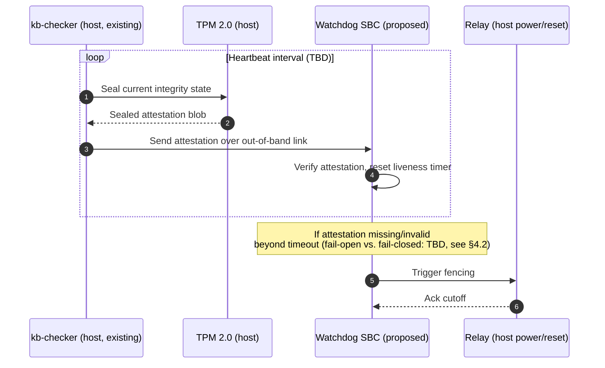
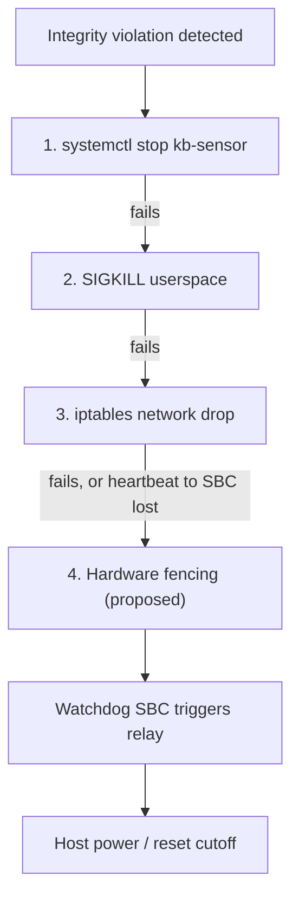
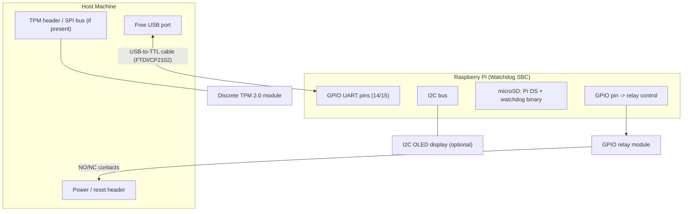

# KBC Hardware Watchdog (Out-of-Band Attestation Node)

**Version:** 0.1 (proposal)
**Component:** `kb-checker` (KBC) — hardware extension
**Status:** Proposed — not implemented. No code, no wire contract, no build target exists yet. This document exists so the idea, threat model, and a minimal bill of materials survive between sessions/reviews.

---

# 1. Overview & Motivation

## 1.1 Purpose

`kb-checker` is KB's independent safety/integrity watchdog — see [`kb-checker/README.md`](../../kb-checker/README.md). Its entire job is to watch the rest of the platform (`kb-core`, `kb-control-plane`) from outside their failure domain, using a KISS design (zero persistent state, zero network exposure, delegation to OS primitives) so that the watchdog itself stays simple enough to trust.

Today, "outside their failure domain" only means *a separate process, on the same host, under the same kernel*. This proposal explores extending that isolation boundary to genuinely separate hardware: a small single-board computer (SBC) wired to the host out-of-band, running an independent attestation/watchdog role alongside (not replacing) the existing Rust `kb-checker` binary.

## 1.2 Why This Problem Exists

`kb-core`'s eBPF sensors run at Ring 0. If an attacker achieves a full kernel compromise, they are operating at the same privilege level as the sensor that's supposed to catch them. `kb-checker` already anticipates this partially — its integrity checks (JIT signature audits, BPF map self-heal, heartbeat liveness) exist specifically because `kb-core` telemetry can't be blindly trusted.

But `kb-checker` itself still runs as a userspace process on the same physical machine, communicating over local UDS sockets (`kba.sock`, `kbc.sock`). A sufficiently privileged kernel-level attacker controls the same kernel that arbitrates those sockets, the same scheduler that runs (or starves) the `kb-checker` process, and the same power/reset state of the box. Software-only isolation on a single host has a ceiling: the watchdog and the thing it watches ultimately share one root of trust (the CPU + kernel).

This is the same class of problem CPM solves for containment authorization (see [`CPM.md`](CPM.md) §1.2) — "the security platform's own components must be immune to the failure modes they're meant to prevent" — but at the hardware/trust-boundary layer instead of the containment-authorization layer.

## 1.3 Design Goal

Move the *last* line of defense off the host entirely. A physically separate node, with its own compute and its own power domain, attests to and can fence the host without depending on that host's kernel being honest. This does not replace `kb-checker`'s existing software role — it gives it an external anchor point for the one failure mode it structurally cannot cover alone: total kernel compromise on its own machine.

## 1.4 Why `kb-checker` and Not the Other Subsystems

Scoped to `kb-checker` deliberately, not as an oversight:

- `kb-control-plane` and `kb-aads` are *consumers* of telemetry that already passed through `kb-core` — they don't have an independent "is the kernel lying to me" problem distinct from the one `kb-checker` already exists to catch.
- `kb-op` is an interface layer; it has no watchdog role.
- `kb-checker` is the only component whose stated purpose is external verification. Extending it to real hardware is a continuation of its existing role, not a new one.

---

# 2. Proposed Architecture

```mermaid
graph LR
    subgraph HOST["KB Host (existing)"]
        CORE["kb-core<br/>eBPF sensors, Ring 0"]
        CP["kb-control-plane<br/>(kbd)"]
        KBC["kb-checker<br/>(existing, software)"]
        TPMHW["TPM 2.0<br/>(hardware root of trust)"]
        CORE --> CP
        CP -. UDS: kba.sock/kbc.sock .-> KBC
        KBC --- TPMHW
    end

    subgraph SBC["Watchdog SBC — proposed"]
        ATT["Attestation / heartbeat logic"]
        FENCE["Relay fencing control (GPIO)"]
        ATT --> FENCE
    end

    KBC <-->|"out-of-band link<br/>(serial TTL or dedicated NIC —<br/>never the host's primary network)"| ATT
    FENCE -->|"power / reset cutoff"| HOST
```

- **Link**: deliberately *not* the host's normal network path (per `kb-checker`'s existing "no network footprint" pillar — the out-of-band link should not become a new attack surface reachable from the host's regular network stack).
- **TPM 2.0**: measured boot + sealing of `kb-checker`'s own integrity state, so a compromised kernel can't forge what it reports upstream.
- **Relay/fencing**: physical power or reset cutoff the SBC can trigger independently of host software cooperating — the hardware analogue of `kb-checker`'s existing 3-layer quarantine containment (`systemctl stop` → `SIGKILL` → `iptables` drop, see its README's flow diagram), as a last-resort layer *below* all three.

## 2.1 Proposed Attestation / Heartbeat Flow (illustrative)

**Illustrative only** — no wire protocol exists yet (see §4.1). This shows the intended shape of the interaction, not a contract to build against.



## 2.2 Fencing as an Extension of the Existing Quarantine Chain (illustrative)

`kb-checker` already escalates through a 3-layer software chain on tampering (see its [README](../../kb-checker/README.md) flow diagram). This proposal adds hardware fencing as a fourth, physically-independent layer below it — exact trigger conditions unresolved, see §4.3.



---

# 3. Bill of Materials (Prototype Scope)

Scoped to a bench-buildable prototype for a physical review demo — no FPGA/DPU inline-hardware tier (evaluated and dropped: real line-rate inline hardware costs $1.5k–$8k+ and needs RTL/embedded firmware work disproportionate to a demo; see discussion below).

| Component | Purpose | Est. Cost |
|---|---|---|
| Raspberry Pi 4/5 (or Pi Zero 2 W) | Independent watchdog/attestation node, off-host | $35–$80 |
| microSD card (32GB+) | Pi OS + watchdog binary | $8 |
| USB-to-TTL serial cable (FTDI/CP2102) | Out-of-band link, host ↔ watchdog | $8 |
| *(alt.)* Dedicated 2nd Ethernet NIC + cable | Out-of-band link if demoing network attestation instead of serial | $10–$20 |
| Discrete TPM 2.0 module (LPC/SPI breakout) | Hardware root of trust, if host board lacks one | $20–$40 |
| GPIO relay module | Physical power/reset fencing of host, demo visual | $6 |
| Jumper wires + small breadboard/perfboard | Wiring for TPM + relay | $5 |
| I2C OLED/LCD display (optional) | Live status readout on the Pi itself | $5–$10 |
| **Total** | | **~$90–$180** |

Host side: existing dev machine running `kb-core`/`kb-control-plane`/`kb-checker` — needs a free USB/serial port and, if used, a TPM header. No new host hardware required.

## 3.1 Physical Wiring (illustrative)

Pin-level wiring for the prototype BOM above — a bench layout, not a schematic.



## 3.2 Tiers Considered and Rejected (for now)

- **Inline hardware (smart NIC/FPGA/DPU)** sitting in the data path, independently observing traffic/syscalls without trusting host telemetry at all — the most complete answer, but real DPU hardware runs $1.5k–$8k+ and even a cheap Zynq-class FPGA prototype ($150–$300) needs RTL/embedded toolchain work spanning weeks. Rejected for the initial prototype on cost/scope; noted here as a possible future tier, not pursued further in this document.

---

# 4. Open Questions / Not Yet Designed

This is a proposal, not a spec. The following are explicitly unresolved and should be worked out (and this doc updated, or a follow-up implementation doc written, per [`CPM.md`](CPM.md)/[`cpm-implementation.md`](cpm-implementation.md)'s pattern) before any implementation begins:

1. **Wire/protocol over the out-of-band link** — what the SBC and `kb-checker` actually exchange (attestation format, heartbeat cadence, fencing trigger conditions). No contract exists yet; do not assume one.
2. **Failure semantics** — what the SBC does if the link itself drops (fail-open vs. fail-closed on the relay) needs an explicit decision, mirroring CPM's "fail closed toward protection" principle (§2.2 of `CPM.md`).
3. **Relationship to existing `kb-checker` quarantine flow** — whether hardware fencing sits strictly below the existing `systemctl` → `SIGKILL` → `iptables` chain, or can be triggered independently of it.
4. **TPM integration point** — whether sealing happens against `kb-checker`'s own binary/state, or against `kb-core`'s eBPF bytecode signatures it already audits (see `kb-checker/src/integrity/`).
5. **Whether this belongs in the `kb-checker` repo/build at all**, or should be a new top-level directory (e.g. `kb-hw/`) given it's a different toolchain (embedded/Pi OS) entirely outside the five subsystems' existing language boundaries (C/Go/Python/Rust/TS).

---

# 5. Relationship to Existing Documentation

This proposal does not modify or conflict with any existing spec. It extends the role described for `kb-checker` in [`kb-checker/README.md`](../../kb-checker/README.md) and follows the same "external, structurally-independent watchdog" principle CPM applies at the authorization layer ([`CPM.md`](CPM.md)). No changes to wire contracts ([`docs/architecture/kbd-contracts.md`](../architecture/kbd-contracts.md)), socket topology ([`docs/architecture/boot_sequence_spec.md`](../architecture/boot_sequence_spec.md)), or `kb-checker`'s KISS constraints are proposed here — those constraints should carry over to any hardware companion component design.
