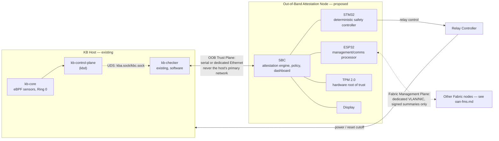
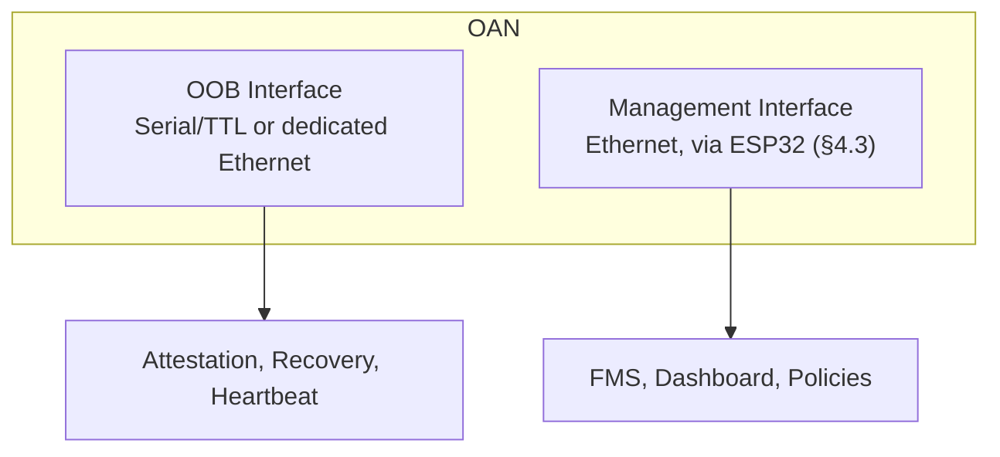
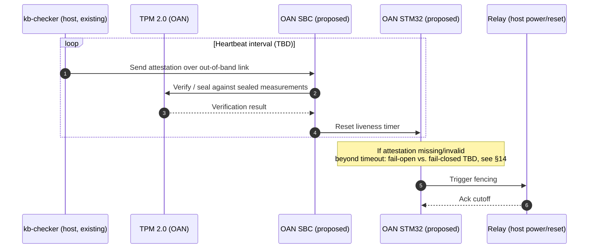
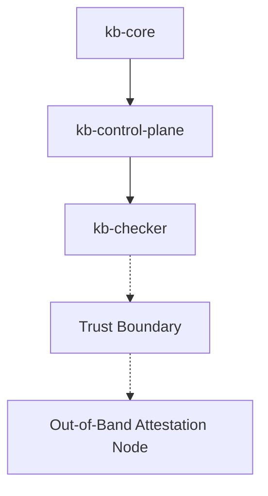
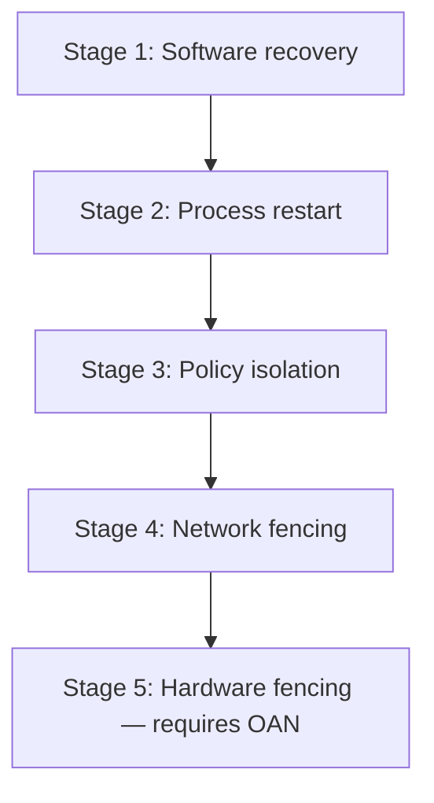
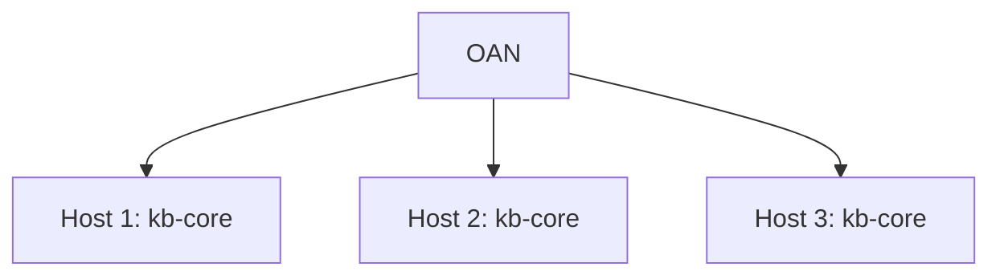
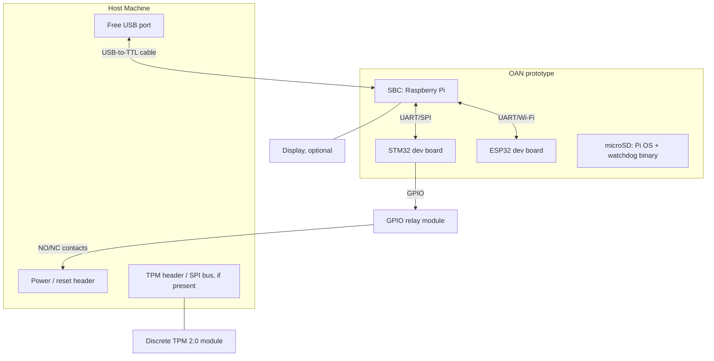

# Out-of-Band Attestation Node (OAN)

> A Hardware-Assisted Independent Trust and Verification Appliance for Kernel Borderlands

**Version:** 0.2 (proposal — supersedes v0.1's "KBC Hardware Watchdog" framing)
**Component:** Proposed new subsystem, external to `kb-checker` (working name `kb-hw/` — directory does not exist yet; see Open Question 1 in §14)
**Status:** Proposed — not implemented. No code, no wire contract, no build target, no repository directory exists yet. This document exists so the idea, threat model, and hardware bill of materials survive between sessions/reviews.

---

# 1. Overview & Motivation

## 1.1 Purpose

`kb-checker` is KB's independent safety/integrity watchdog — see [`kb-checker/README.md`](../../kb-checker/README.md). Its entire job is to watch the rest of the platform (`kb-core`, `kb-control-plane`) from outside their failure domain, using a KISS design (zero persistent state, zero network exposure, delegation to OS primitives) so the watchdog itself stays simple enough to trust.

Today, "outside their failure domain" only means *a separate process, on the same host, under the same kernel*. The **Out-of-Band Attestation Node (OAN)** extends that isolation boundary to genuinely separate hardware: a physically independent appliance — its own processor(s), memory, storage, power, and communication channels — that supervises and attests the integrity of Kernel Borderlands from outside the monitored host's trust boundary entirely.

OAN's role is **not to replace** `kb-checker`, but to become the **external trust anchor** for the entire Kernel Borderlands ecosystem, continuing the "external, structurally-independent watchdog" role `kb-checker` already exists to fill.

## 1.2 Why This Problem Exists

`kb-core`'s eBPF sensors run at Ring 0. If an attacker achieves a full kernel compromise, they are operating at the same privilege level as the sensor that's supposed to catch them. `kb-checker` already anticipates this partially — its integrity checks (JIT signature audits, BPF map self-heal, heartbeat liveness) exist specifically because `kb-core` telemetry can't be blindly trusted.

But `kb-checker` itself still runs as a userspace process on the same physical machine, communicating over local UDS sockets (`kba.sock`, `kbc.sock`). A sufficiently privileged kernel-level attacker controls the same kernel that arbitrates those sockets, the same scheduler that runs (or starves) the `kb-checker` process, and the same power/reset state of the box. Software-only isolation on a single host has a ceiling: the watchdog and the thing it watches ultimately share one root of trust (the CPU + kernel).

This is the same class of problem CPM solves for containment authorization (see [`CPM.md`](CPM.md) §1.2) — "the security platform's own components must be immune to the failure modes they're meant to prevent" — but at the hardware/trust-boundary layer instead of the containment-authorization layer.

## 1.3 Design Goal

Move the *last* line of defense off the host entirely. A physically separate node, with its own compute and its own power domain, attests to and can fence the host without depending on that host's kernel being honest. This does not replace `kb-checker`'s existing software role — it gives KB an external anchor point for the one failure mode no same-host component can structurally cover alone: total kernel compromise.

## 1.4 Why This Sits Outside the Five Subsystems

v0.1 of this document scoped OAN as a `kb-checker` hardware extension. As of v0.2, it's deliberately reframed as its own subsystem, not "part of" `kb-checker`, because:

- OAN's own internal design (§4) now spans three processors (SBC, STM32, ESP32) and their own firmware toolchains — outside the Rust/KISS scope `kb-checker` is held to (see [`kb-checker/README.md`](../../kb-checker/README.md)'s KISS pillars, which should **not** be diluted by folding this in).
- Cluster supervision of *many* hosts (§9) is a fleet-management concern, not a single-host watchdog concern.
- It is a physical appliance with its own enclosure, display, and power domain (§11) — a different kind of deliverable than a binary in a subsystem directory.

It still talks to `kb-checker` specifically, not `kb-core` or `kb-control-plane` directly, for the same reason as v0.1: `kb-checker` is the only KB component whose stated purpose is external verification, so it's the natural attestation source on the host side. `kb-control-plane` and `kb-aads` remain telemetry *consumers* that don't have an independent "is the kernel lying to me" problem; `kb-op` remains an interface layer with no watchdog role.

---

# 2. Design Philosophy

Four principles, deliberately mirroring `kb-checker`'s own KISS pillars at the hardware layer instead of the software layer:

- **Out-of-Band** — never depends on the monitored operating system for its own execution.
- **Independent** — own CPU, memory, storage, and power; no shared failure domain with the host.
- **Hardware Rooted** — trust originates from hardware (TPM 2.0), not software claims.
- **Fail-Safe** — able to take protective action even when the monitored host cannot cooperate (failure semantics still unresolved — see Open Question 2 in §14).

---

# 3. High-Level Architecture

**Illustrative only** — internal bus choices, exact host-side connector, and message formats are not designed yet (§14).

- **Link**: deliberately *not* the host's normal network path (per `kb-checker`'s existing "no network footprint" pillar — the out-of-band link should not become a new attack surface reachable from the host's regular network stack).
- **TPM 2.0**: measured boot + sealing of OAN's own integrity state, and/or the host's `kb-checker` state (§4.4, §14 Open Question 4), so a compromised kernel can't forge what it reports upstream.
- **Relay/fencing**: physical power or reset cutoff OAN can trigger independently of host software cooperating — the hardware analogue of `kb-checker`'s existing 3-layer quarantine containment (`systemctl stop` → `SIGKILL` → `iptables` drop, see its README's flow diagram), as a last-resort layer *below* all three (§8).

## 3.1 Two Communication Planes

Decided (v0.2): OAN exposes **two independent communication planes**, on separate interfaces, that never share transport — resolving what was an open question in earlier drafts about how fleet management (§9, `oan-fms.md`) could coexist with the "never the host's primary network" principle above.

- **Out-of-Band Trust Plane** — the SBC's dedicated, point-to-point link to the host's `kb-checker` (§3 diagram above): attestation, heartbeat, recovery triggers. Isolated from the host's production networking. This *is* the hardware trust boundary — nothing on this plane is optional or shared with other hosts.
- **Fabric Management Plane** — a secured management network used by FMS (`oan-fms.md`) for fleet orchestration, policy distribution, inventory, and event aggregation. Operational, not trust-establishing; does not participate in runtime attestation. Naturally maps onto the ESP32's existing "management/comms processor" role (§4.3) — the ESP32 already never makes security decisions, which is exactly the property this plane needs.

Attestation and trust never depend on the management network. Fabric management accepts the realities of distributed systems (ordinary Ethernet, multiple hosts) without weakening the hardware trust model, because it structurally cannot reach the OOB plane.

---

# 4. Internal Hardware

**Illustrative only** — exact part numbers, bus wiring, and firmware are not designed yet; costs are tracked in §10.

## 4.1 SBC

Example candidates: Raspberry Pi 5, Intel N100 mini PC.

Responsibilities:
- Main attestation engine
- Policy engine
- Cluster management (§9)
- Dashboard
- Cryptographic verification
- Local database
- Logging

This is the "brain" of OAN — the counterpart to `kb-checker`'s role on the host side, but running on independent hardware.

## 4.2 STM32

Purpose: dedicated deterministic safety controller.

Responsibilities:
- Hardware watchdog
- Independent timers
- Heartbeat supervision
- Relay control
- Emergency fencing
- Safe-state controller

The STM32 continues operating even if Linux on the SBC crashes — this is the point of splitting it out from the SBC rather than running the watchdog timer as a Linux process, which would reintroduce the same "watchdog shares a failure domain with what it watches" problem OAN exists to solve, just one level down.

## 4.3 ESP32

Purpose: dedicated management processor.

Responsibilities:
- Secondary communication processor
- Device discovery
- Secure provisioning
- Maintenance interface
- Recovery channel
- Optional wireless management

The ESP32 never makes security decisions — only manages communication. Keeping it out of the trust-critical path matters: it is the component most likely to run stock networking stacks/SDKs with a larger attack surface than the STM32's minimal firmware, so it must not be able to authorize fencing or attestation results on its own.

This is also, as of v0.2, the designated carrier for the **Fabric Management Plane** (§3.1): fleet-facing traffic (FMS, dashboards, policy sync — see `oan-fms.md`) is intended to run through the ESP32, physically and logically separate from the SBC's direct OOB link to the host's `kb-checker`. The ESP32's existing "no security decisions" constraint is precisely what makes it safe to also carry ordinary networked, multi-host traffic — a compromise of the ESP32/management plane cannot reach the attestation/relay path, which lives on the SBC/STM32/TPM side instead.

## 4.4 TPM 2.0

Purpose: hardware root of trust.

Responsibilities:
- Key storage
- Measured boot
- Secure key generation
- Integrity measurements
- Attestation signing

Whether the TPM seals OAN's own state, the host's `kb-checker` state, or both is unresolved — see Open Question 4 in §14 (carried over from v0.1).

## 4.5 Relay Controller

Purpose: physical isolation, driven by the STM32 (§4.2), not the SBC — so fencing survives an SBC-side (Linux) crash or compromise.

Capabilities:
- Reset host
- Power cycle host
- Fence compromised machine

Only used after software recovery has failed (§8).

## 4.6 Display

Displays:
- Host status
- Integrity state
- Threat level
- Heartbeat
- Cluster health
- TPM status
- Relay status
- Event log

Useful during demonstrations and diagnostics; not on the trust-critical path (it's a read-only reflection of state the SBC/STM32 already hold, not an input to any decision).

---

# 5. Functional Responsibilities

OAN continuously:
- Verifies host integrity.
- Confirms `kb-checker` liveness.
- Validates TPM measurements.
- Detects heartbeat loss.
- Verifies watchdog responses.
- Detects suspicious silence.
- Logs security events.
- Coordinates recovery.
- Performs last-resort fencing.

---

# 6. Proposed Attestation / Heartbeat Flow

**Illustrative only** — no wire protocol exists yet (§14 Open Question 1, carried over from v0.1). This shows the intended shape of the interaction, not a contract to build against.

---

# 7. Relationship with Kernel Borderlands

Everything above the trust boundary may fail. Everything below remains independent.

---

# 8. Recovery Hierarchy

**Illustrative only** — how this maps onto `kb-checker`'s existing 3-layer software chain (`systemctl stop` → `SIGKILL` → `iptables` drop, see [`kb-checker/README.md`](../../kb-checker/README.md)) is not decided (§14 Open Question 3, carried over from v0.1). The mapping below is a first guess, not a design.

Only Stage 5 requires OAN; Stages 1-4 are entirely within `kb-checker`'s existing software authority.

Tentative mapping to `kb-checker`'s existing chain (needs confirmation, not a commitment):

| OAN stage | Likely existing `kb-checker` equivalent |
|---|---|
| 1. Software recovery | JIT signature audit / BPF map self-heal |
| 2. Process restart | `systemctl stop kb-sensor` → `SIGKILL` |
| 3. Policy isolation | CPM containment policy actions |
| 4. Network fencing | `iptables` network drop |
| 5. Hardware fencing | OAN relay cutoff (new) |

---

# 9. Cluster Support (Future Work — out of prototype scope)

One appliance can, in principle, supervise many hosts:

This is explicitly **not** part of the bench-buildable prototype scoped in §10 — a single-host attestation link is the whole prototype goal. Listed here as direction, not a commitment:

- Fleet-wide policy management.
- Distributed attestation.
- Multi-host correlation.
- Coordinated response.

The detailed design direction for this — fleet hierarchy (Fabric/Colony/Family/Node), discovery, policy inheritance, cross-host correlation, recovery coordination — is written up separately as the **Fabric Management Service (FMS)**: see [`oan-fms.md`](oan-fms.md). It is proposed as an SBC-side service *within* OAN (§4.1), not a separate appliance, and is scoped explicitly to come after a working single-host OAN prototype, not before. FMS runs on the Fabric Management Plane (§3.1), separate from this doc's OOB Trust Plane, and is classified non-security-critical (`oan-fms.md` §3.1) so that fleet coordination never sits in the runtime security path of any individual host.

---

# 10. Bill of Materials (Prototype Scope)

Scoped to a bench-buildable single-host prototype for a physical review demo — not the production appliance described in §11. No FPGA/DPU inline-hardware tier (evaluated and dropped, see §10.2).

| Component | Purpose | Est. Cost |
|---|---|---|
| Raspberry Pi 4/5 (or Pi Zero 2 W) | SBC — attestation engine, off-host | $35–$80 |
| microSD card (32GB+) | Pi OS + watchdog binary | $8 |
| STM32 dev board (e.g. Nucleo-F103RB or "Blue Pill" F103C8) | Deterministic safety controller, relay control | $10–$25 |
| ESP32 dev board (e.g. ESP32-WROOM DevKitC) | Management/comms processor | $6–$10 |
| USB-to-TTL serial cable (FTDI/CP2102) | Out-of-band link, host ↔ SBC | $8 |
| *(alt.)* Dedicated 2nd Ethernet NIC + cable | Out-of-band link if demoing network attestation instead of serial | $10–$20 |
| Discrete TPM 2.0 module (LPC/SPI breakout) | Hardware root of trust, if host/SBC board lacks one | $20–$40 |
| GPIO relay module | Physical power/reset fencing of host, demo visual | $6 |
| Jumper wires + small breadboard/perfboard | Wiring for TPM, STM32, ESP32, relay | $8 |
| I2C OLED/LCD display (optional) | Live status readout for the demo | $5–$10 |
| **Total** | | **~$105–$215** |

Host side: existing dev machine running `kb-core`/`kb-control-plane`/`kb-checker` — needs a free USB/serial port and, if used, a TPM header. No new host hardware required.

The three-processor split (SBC + STM32 + ESP32) is more hardware than v0.1's single-Pi design, but each board is still a $10–$25 commodity dev board, not custom silicon — the added cost is modest relative to what it buys: a watchdog timer (STM32) that survives the SBC's own Linux crashing.

## 10.1 Wiring Sketch (illustrative)

## 10.2 Tiers Considered and Rejected (for now)

- **Inline hardware (smart NIC/FPGA/DPU)** sitting in the data path, independently observing traffic/syscalls without trusting host telemetry at all — the most complete answer, but real DPU hardware runs $1.5k–$8k+ and even a cheap Zynq-class FPGA prototype ($150–$300) needs RTL/embedded toolchain work spanning weeks. Rejected for the initial prototype on cost/scope; noted as a possible future tier, not pursued further here.

---

# 11. Physical Appliance (Production Concept — beyond prototype scope)

This section describes the intended *production* form factor, not the bench prototype in §10. Treat as aspirational/design-direction, not a build target.

Front:
- LCD/Touch display
- Power LED
- Healthy LED
- Alert LED
- Fenced LED

Rear:
- Ethernet
- USB
- Serial
- GPIO
- Power
- Relay connector

Internally: SBC, STM32, ESP32, TPM, relay board, cooling, power regulation — all enclosed as a single hardware appliance.

---

# 12. Why This Architecture?

Each component has one clearly defined responsibility:

| Component | Responsibility |
|---|---|
| **SBC** | Decision making, attestation, management |
| **STM32** | Deterministic safety, watchdog, relay control |
| **ESP32** | Management communication and provisioning |
| **TPM** | Hardware trust anchor |
| **Relay** | Physical host fencing |
| **Display** | Local operational interface |

This separation avoids overlapping functionality while improving resilience — no single processor is both "makes the security decision" and "runs the general-purpose networked OS."

---

# 13. Research Contribution (intended, if built)

If implemented, OAN would extend Kernel Borderlands beyond a software-only runtime defense framework by introducing a hardware-assisted trust layer: an independent verification domain capable of monitoring host integrity, validating runtime attestation, coordinating recovery, and performing last-resort hardware fencing without relying on the monitored operating system. Separating trust across dedicated hardware components would reduce the impact of complete host compromise and provide a foundation for secure, scalable runtime protection of individual hosts and, eventually, clusters (§9).

This framing needs validation against prior work (industry HSM/BMC-based watchdogs, academic out-of-band attestation literature) before being asserted as a paper-worthy contribution — not yet done; see §14.

---

# 14. Open Questions / Not Yet Designed

This is a proposal, not a spec. The following are explicitly unresolved and should be worked out (and this doc updated, or a follow-up implementation doc written, per [`CPM.md`](CPM.md)/[`cpm-implementation.md`](cpm-implementation.md)'s pattern) before any implementation begins:

1. **Repository placement and exact naming.** §1.4 decided OAN is a standalone subsystem, not a `kb-checker` extension, but the working name `kb-hw/` is a placeholder — needs an actual decision (`kb-hw/`, `kb-oan/`, other) and, once created, an entry in the repository layout table in [`CLAUDE.md`](../../CLAUDE.md) and its own `README.md` following the pattern of the other five subsystems.
2. **Failure semantics.** What OAN does if the link itself drops (fail-open vs. fail-closed on the relay) needs an explicit decision, mirroring CPM's "fail closed toward protection" principle (§2.2 of `CPM.md`).
3. **Relationship to existing `kb-checker` quarantine flow.** Whether hardware fencing sits strictly below the existing `systemctl` → `SIGKILL` → `iptables` chain (per the tentative table in §8), can be triggered independently of it, or the 5-stage hierarchy in §8 should replace that framing entirely.
4. **TPM integration point.** Whether sealing happens against OAN's own SBC/STM32 state, against `kb-checker`'s state on the host, against `kb-core`'s eBPF bytecode signatures it already audits (see `kb-checker/src/integrity/`), or some combination.
5. **Wire/protocol over the out-of-band link.** What the SBC and `kb-checker` actually exchange (attestation format, heartbeat cadence, fencing trigger conditions). No contract exists yet; do not assume one.
6. **Internal SBC↔STM32↔ESP32 protocol.** New in v0.2 — how the three onboard processors talk to each other (bus choice, message format, and critically, how the SBC's attestation verdict reaches the STM32 in a way the STM32 can trust without itself re-implementing crypto verification).
7. **Cluster protocol (§9).** Design direction now written up in [`oan-fms.md`](oan-fms.md) (Fabric Management Service), but entirely undesigned at the protocol/schema level and flagged as future work, not prototype scope — see that doc's own Open Questions.
8. **Research contribution claims (§13).** Need a literature comparison (HSM/BMC-based watchdogs, academic OOB attestation work) before being asserted as novel in any paper draft.

---

# 15. Relationship to Existing Documentation

This proposal does not modify or conflict with any existing spec. It continues the "external, structurally-independent watchdog" principle `kb-checker` already embodies ([`kb-checker/README.md`](../../kb-checker/README.md)) and that CPM applies at the authorization layer ([`CPM.md`](CPM.md)), but — as of v0.2 — as its own future subsystem rather than a `kb-checker` extension (§1.4). No changes to wire contracts ([`docs/architecture/kbd-contracts.md`](../architecture/kbd-contracts.md)), socket topology ([`docs/architecture/boot_sequence_spec.md`](../architecture/boot_sequence_spec.md)), or `kb-checker`'s KISS constraints are proposed here — those constraints should carry over to `kb-checker`'s side of the OAN link (attestation reporting) even though OAN itself, as a separate subsystem, is not bound by them.
