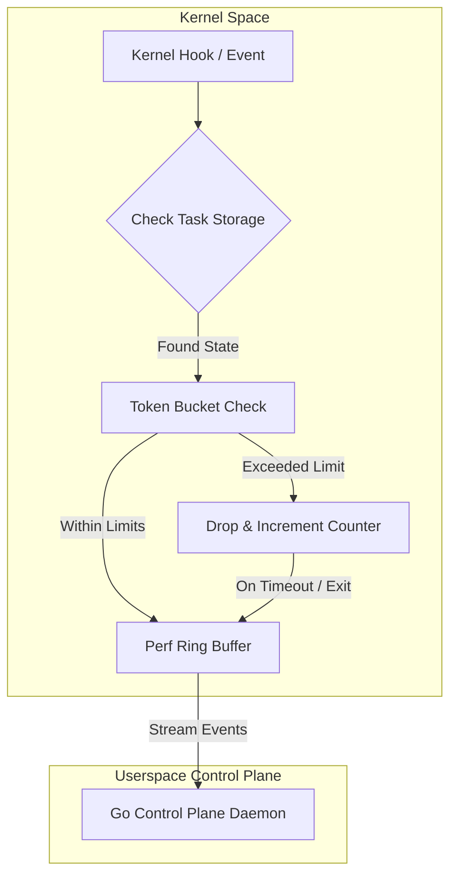

# eBPF Rate-Limiting and Performance Design Specification

This document details the aligned design architecture for Ring 0 dynamic event rate-limiting in the C sensor (`kb-core`).

---

## 1. Architectural Decisions



### A. Dynamic Event Rate-Limiting (Token Bucket)
- **Mechanism**: A token bucket algorithm runs directly inside the kernel hooks (Ring 0) to throttle events for chatty or abusive processes.
- **Eviction/Drop Policy**: When a process exceeds the allowed event rate, subsequent telemetry events are dropped before allocating ring buffer frames, saving CPU and memory transport costs.

### B. BPF Task Local Storage (`BPF_MAP_TYPE_TASK_STORAGE`)
- **State Storage**: Token bucket parameters (last bucket fill time, current tokens, drop counts) are stored directly inside the kernel's `task_struct` local storage.
- **Benefits**: Eliminates hash collisions, simplifies garbage collection, and automatically frees state memory when the process terminates.

### C. Aggregate Reporting
- **Mechanism**: Dropped events are accumulated as a local counter in the task storage.
- **Event Dispatch**: Instead of logging every dropped event, the C sensor emits a single `KB_EVENT_DROPPED_TELEMETRY` summary packet to the ring buffer when the rate-limiting window closes or when the process exits.

---

## 2. Kernel-Space Map Layout

```c
struct kb_token_bucket {
    __u64 last_time;
    __u64 tokens;
    __u64 dropped_count;
};

struct {
    __uint(type, BPF_MAP_TYPE_TASK_STORAGE);
    __uint(map_flags, BPF_F_NO_PREALLOC);
    __type(key, int);
    __type(value, struct kb_token_bucket);
} kb_rate_limit_map SEC(".maps");
```
