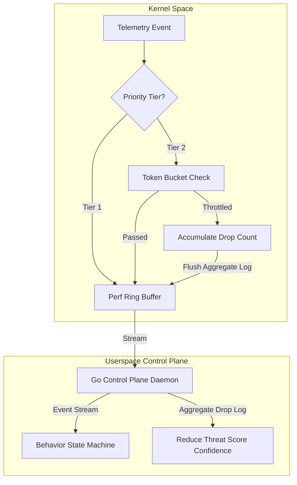

# eBPF Rate-Limiting and Performance Design Specification

This document details the aligned design architecture for Ring 0 dynamic event rate-limiting, event prioritization, and graceful degradation in the C sensor (`kb-core`).

---

## 1. Core Principles: Graceful Degradation under Overload

Dropping security telemetry events is inherently risky. Under extreme load, rather than failing blindly or dropping events indiscriminately, Kernel Borderlands implements a **graceful degradation** model designed around these core tenets:

1. **Intelligent Information Loss**: Never drop high-value security events. Focus throttling and aggregation strictly on low-value repetitive operations.
2. **Telemetry Loss Accounting**: Maintain strict accounting of lost or aggregated events so the userspace engine can factor uncertainty into process behavior analysis.
3. **Prevent Channel Starvation**: Prevent event storms from a single noisy process from blocking critical telemetry streams from other active processes.

---

## 2. Event Priority Classification Tiers

Events are classified into three distinct priority tiers within the eBPF kernel-space code:

| Tier | Priority | Event Types | Rate-Limiting Policy |
|---|---|---|---|
| **Tier 1** | **Critical (Non-Droppable)** | `Gain Root UID` (commit_creds), LSM denials (`-EACCES`), TLS write plaintext uprobes, memory injections (`process_vm_writev`), binary executions (`execve`). | **Always Transmit**. These events bypass the token bucket rate limiter and are always written to the ring buffer. |
| **Tier 2** | **Routine (Compressible)** | Repetitive file opens/reads/writes (sensitive paths excluded), socket connects, standard memory mappings (`mmap`, `mprotect`). | **Aggregate or Sample**. Under normal load, these are transmitted. Under overload, they are rolled up or throttled per-PID. |
| **Tier 3** | **Low-Value (High-Volume)** | Repetitive system configuration reads, benign context switches. | **Filtered at Source**. Suppressed directly in kernel-space based on local allowlist rules. |

---

## 3. Integration Workflow & Confidence Score Degradation



- **Uncertainty Propagation**: When the userspace engine receives a `KB_EVENT_DROPPED_TELEMETRY` summary packet containing the drop count for a specific PID, the Behavioral Scoring Engine automatically decreases its threat score confidence rating. This makes the potential information loss explicit to operators and downstream agents.

---

## 4. Hybrid State Storage & Compatibility Fallbacks

To maximize compatibility across different Linux environments while maintaining optimal performance on modern kernels, the C sensor utilizes a **hybrid storage topology**:

### A. Primary: BPF Task Local Storage (`BPF_MAP_TYPE_TASK_STORAGE`)
Used on kernels supporting task local storage with the target hooks (Linux 5.11+).
- **Pros**: State naturally follows process lifespan, eliminating PID reuse issues and userspace garbage collection sweeps. It guarantees local cache access without global hash lookups.
- **Cons**: Requires kernel support and restricts cross-process state correlation.

### B. Fallback: BPF LRU Hash Map (`BPF_MAP_TYPE_LRU_HASH`)
Used as a fallback for older kernels (Linux 5.8 to 5.10).
- **Pros**: Widely compatible. Bounded memory limits prevent kernel leaks, and stale entries are evicted automatically under memory pressure.
- **Cons**: Introduces global hash lookup latency on every event, and LRU eviction can trigger state loss during heavy event storms.

### C. Granularity: Per-Process (TGID) vs. Per-Thread (PID) Keying
- **Decision**: Rate-limiting limits and token buckets are applied at the **Per-Process (TGID)** level.
- **Rationale**: Since Kernel Borderlands evaluates state transitions and executes security/containment policies (e.g., LSM file blocks, CPU restrictions, or SIGKILL terminations) at the process/application level, the rate limiter keys metrics by TGID. This prevents multi-threaded processes from bypassing thread-level rate limits by spawning additional worker threads, and ensures an event storm in one thread throttles telemetry for the entire application, saving system resources.

---

## 5. Kernel-Space Map Layout

```c
struct kb_token_bucket {
    __u64 last_time;
    __u64 tokens;
    __u64 dropped_count;
    __u32 priority_bypass; // Flag indicating if Tier 1 bypass is active
};

/* Primary: Task Local Storage */
struct {
    __uint(type, BPF_MAP_TYPE_TASK_STORAGE);
    __uint(map_flags, BPF_F_NO_PREALLOC);
    __type(key, int);
    __type(value, struct kb_token_bucket);
} kb_rate_limit_task_map SEC(".maps");

/* Fallback: LRU Hash Map keyed by TGID + start time */
struct kb_lru_key {
    __u32 tgid;
    __u64 start_time;
};

struct {
    __uint(type, BPF_MAP_TYPE_LRU_HASH);
    __uint(max_entries, 10240);
    __type(key, struct kb_lru_key);
    __type(value, struct kb_token_bucket);
} kb_rate_limit_lru_map SEC(".maps");
```
