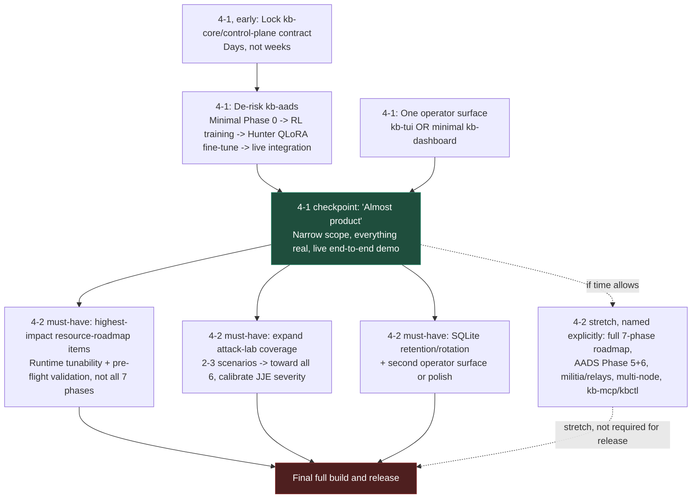

# Kernel Borderlands — 4-1/4-2 Goal & Prioritization

- **Document Version:** 1.1
- **Scope**: Cross-subsystem — all of `kb-core`, `kb-control-plane`, `kb-aads`, `kb-checker`, `kb-op`, plus supporting docs/infra.
- **Status:** Proposal — a prioritization plan, not a formally adopted schedule. Needs review by the team (`kb-team.md`) and academic advisor before being treated as committed.
- **Written:** 2026-07-24, following a session that took `kb-aads` from a non-functional skeleton (broken import, `ActorClassInheritanceException`) to a verified-running one, and surfaced how much of the rest of the system's ambition is still aspirational documentation rather than working code — this doc is a direct response to that finding: what to build, and in what order.
- **Timeline context — corrected from v1.0**: **4-1 is "Year 1," 4-2 is "Year 2"** — this is a single academic year (two semesters), not two calendar years. 4-1: prove the core thesis works, for real. 4-2: final full build and public release. This is a materially tighter timeline than the original draft assumed, and the "Year 2" scope below has been re-split into must-have vs. stretch accordingly — treating the full original list as a one-semester plan would not be credible.

---

## The core strategic call

**4-1 should prove the hardest, most novel claim end-to-end at small scale — not build broad production polish.** This is worth stating explicitly because it cuts against the natural instinct to make every subsystem more complete before moving on, and because the timeline is one semester, not a full year — there is materially less slack than the phrase "Year 1" implies.

Two things are true about this project, established over the course of this session's audit:
1. **`kb-core`/`kb-control-plane` are the most mature subsystems** — real wire protocol, real two-tier storage (ADR-1), real eBPF hooks, ~5.3K and ~6.6K hand-written lines respectively. This is well-trodden (if genuinely difficult) engineering territory: kernel telemetry sensors are a solved problem class, even though implementing one correctly is hard.
2. **`kb-aads` is where the actual research risk lives.** A trustworthy autonomous security-response system — the hybrid RL + agentic LLM design with JJE governance — is not a solved problem anywhere in the industry right now. It's also the subsystem that was the least implemented of all of them at the start of this session (broken imports, every decision point a hardcoded stub or TODO).

A thesis/major-project defense is served far better by "a real kernel-to-AI-to-enforcement pipeline that works end-to-end on 2-3 real attack scenarios" than by wide-but-shallow coverage across every planned feature. Narrow and real beats broad and stubbed — the entire finding of this session's audit was that stub code reads as more impressive than it is until someone actually runs it.

---

## 4-1 ("Year 1"): prove the core thesis works, for real

One semester. Treat every item below as competing for genuinely scarce time, not "the first year of two."

### 1. Lock the foundation — stabilize, don't rebuild

`kb-core`↔`kb-control-plane` is already the most mature part of the system. The priority here is stabilization, not new scope:
- Freeze `docs/architecture/kbd-contracts.md` (the wire/event contract) as early as possible in the semester. Every other subsystem — `kb-aads` especially — will start depending on it; contract churn late in the semester is expensive to propagate across four languages (C, Go, Rust, Python).
- Fix known bugs, don't add new hook points or new capability unless the demo scenario specifically requires it.
- **Budget a small, bounded amount of time here — days, not weeks.** This subsystem being more mature is a reason to spend *less* additional time on it, not more — resist the urge to keep polishing the part that already works instead of the part that doesn't.

### 2. De-risk `kb-aads` first — this is the semester's real work

Per [`docs/development/control-aads/aads-intelligence-roadmap.md`](../development/control-aads/aads-intelligence-roadmap.md), scoped down to what one semester can actually deliver:

- **Minimal Phase 0 (data)**: 2-3 attack-lab scenarios (not all 6), plus a benign baseline. Real, labeled, small — not exhaustive. Both output formats matter (RL-episode-shaped and agentic-trajectory-shaped), but depth of coverage doesn't.
- **Phase 1-2 (RL)**: get RLlib genuinely training Jury/Healer/Containment against the fixed `AADSEnv`, on the small real dataset above. An honestly-scoped, working reward model beats an elaborate, still-stubbed one.
- **Phase 3 (Hunter fine-tuning)**: one real QLoRA fine-tune, using the agentic/native-function-calling design already resolved (tool-call loop against `ControlPlaneClient`'s real methods, 5-call iteration cap, Qwen2.5 3B as the likely front-runner on tool-use support). This is the single highest-value artifact for a project defense — a small model that actually investigates and reasons, not a hardcoded threshold pretending to.
- **Phase 4 (integration)**: wire it all together so a live demo runs end-to-end on real trained artifacts, not stubs. **This is what "almost product" should mean by the end of 4-1** — not feature-complete, but everything present being genuinely real.

### 3. One operator surface, not four

Pick either `kb-tui` or a minimal `kb-dashboard` as the single visible demo surface, based on team frontend bandwidth. Defer `kb-mcp`, `kbctl` playbook tooling, and full dashboard polish (D3 swarm topology, pheromone visualization, knowledge graphs) to 4-2.

### Explicitly cut from 4-1

Cutting this list is as important as the scope above — these are all real, all documented, and all genuinely not needed to defend the thesis:

- `resource_management_roadmap.md`'s entire 7-phase tunability system (runtime tiers, auto-detection, thermal throttling, pre-flight validation, hardware docs, benchmark harness).
- SQLite retention/rotation (`kb-control-plane` Phase 4 of that same roadmap) — irrelevant at demo data volumes.
- The `<3%` overhead benchmark harness — a real credibility gap for a shipped product, not a blocker for a working demo.
- JJE's full courthouse authority with calibrated severity thresholds, containment militia, signal relays — sound architecture, not needed to show the core pipeline working.
- Roadmap Phase 5 (kb-checker validation gate for new checkpoints) and Phase 6 (vendor-centralized retraining, data egress/privacy design) — both genuinely undesigned as of this session, and both are production-deployment concerns, not proof-of-concept concerns.

---

## 4-2 ("Year 2"): final full build and release

One more semester. The original draft of this doc listed everything below as a flat "Year 2" list, sized for a full post-graduation calendar year — that doesn't fit one semester. Split into what a release actually needs vs. what should be named explicitly as stretch/post-release, rather than silently dropped or silently overcommitted to.

### Must-have for a credible "final full build and release"

- **From `resource_management_roadmap.md`**: just the highest-impact items, not all 7 phases — Phase 1's runtime tunability (the `BPF_F_NO_PREALLOC`/`LRU_HASH` fix alone is called out in that doc as the single highest-impact change, doable in isolation) and Phase 5 (pre-flight validation), so the release doesn't silently fail on unsupported kernels. Full Min/Recommended/Balanced/Max auto-detection (Phase 2) and thermal throttling (Phase 3) are real but not release-blocking.
- **From `aads-intelligence-roadmap.md`**: expand attack-lab coverage from 4-1's 2-3 scenarios toward the full six, and calibrate JJE's severity thresholds against that expanded data — this is what turns the 4-1 proof-of-concept into something that looks like a real product surface, not new architecture.
- **SQLite retention/rotation** (`kb-control-plane` Phase 4) — unbounded disk growth is a correctness bug for anything called a "release," not just a nice-to-have.
- **Second operator surface or polish on the first one** — whichever of `kb-tui`/`kb-dashboard` wasn't built in 4-1, or meaningful polish on the one that was, depending on team capacity.

### Explicitly stretch / likely post-release, name it rather than silently drop it

- The full `resource_management_roadmap.md` 7-phase plan, including the `<3%` overhead benchmark harness (Phase 7) and published hardware guidance (Phase 6).
- Roadmap Phase 5 (kb-checker validation gate design) and Phase 6 (vendor-centralized retraining pipeline: egress transport, checkpoint distribution, data privacy/consent) — both require real design work this doc doesn't do, not just implementation time, and both are genuinely large.
- Containment militia (squad lead/member split) and signal relays as separate implemented roles — the architecture is designed, but nothing says the 4-1 four-agent version can't ship as the release baseline while these get added after.
- Multi-node Ray cluster testing, `kb-mcp`, `kbctl` playbook tooling, real penetration testing, hardware compatibility matrix.

**If 4-2 turns out tighter than expected**, cut from the stretch list first, then narrow the must-have list itself (e.g., ship with attack-lab coverage at 4 scenarios instead of 6) before compromising on "everything shipped is real" — the same principle from 4-1 applies here.

---

## Sequencing summary

---

## Honest caveat

Even the 4-1 scope above is ambitious for one semester, and 4-2's must-have list is not small either. If either semester turns out tighter than expected, **cut scenario count and model sophistication before cutting "make it real, not stubbed,"** and cut from the stretch list before touching the must-have list. A tiny, honestly-scoped agentic Hunter that genuinely works is a stronger thesis artifact — and a stronger foundation for 4-2 — than a larger, more ambitious design that's still held together by hardcoded thresholds and TODOs, which is exactly the state `kb-aads` was in before this session started. Given the corrected one-year total timeline, this pressure is real, not hypothetical — build in a scope-review checkpoint partway through each semester rather than discovering the mismatch at the end.

---

## Changelog

- **2026-07-24**: Initial version, written as a direct response to this session's complexity audit and `kb-aads` scaffolding fixes — the finding that documentation ambition across this project significantly outpaces implementation, especially in `kb-aads`, directly motivates the "prove the hardest claim first, narrow and real" prioritization above. Originally scoped as a 2-calendar-year plan (4-1→4-2 as "Year 1," a separate post-graduation "Year 2").
- **2026-07-24**: Corrected per clarification: 4-1 *is* Year 1, 4-2 *is* Year 2 — this is one academic year total, not two calendar years. Re-split the former flat "Year 2" list into an explicit must-have vs. stretch breakdown, since the full original list does not credibly fit one semester. Updated the sequencing diagram and every section header accordingly.
