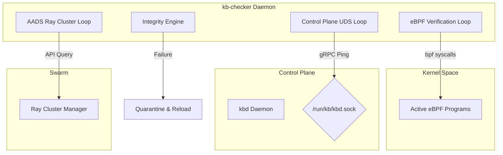

# Safety & Integrity Monitor Loops Design Specification

This document details the aligned design architecture for the Rust-based safety and integrity enforcement daemon (`kb-checker`) in Kernel Borderlands.

---

## 1. Architectural Decisions

### A. eBPF Hook Integrity Verification
- **Mechanism**: The daemon uses native `bpf` system calls (`BPF_PROG_GET_NEXT_ID`, `BPF_OBJ_GET_INFO_BY_FD`) via `libbpf-rs` to inspect active kernel program descriptors.
- **Validation**: Program bytecodes are hashed and compared directly against verified signature policies to detect unauthorized hook modifications or hijack attempts.

### B. Control Plane Availability Verification
- **Mechanism**: Initiates periodic gRPC ping handshakes over `/run/kb/kbd.sock`.
- **Latency Target**: Must complete connection and sign-response checks within a strict **100ms timeout**. Any connection refusal or timeout is flagged as a Control Plane hang.

### C. AADS Swarm Status Verification
- **Mechanism**: The checker queries the local Ray cluster manager node daemon API to verify active container execution states, cluster allocation metrics, and agent life states.

---

## 2. Containment and Auto-Recovery Protocol

If any integrity verification loop fails:
1. **Quarantine State Triggered**: The checker daemon communicates an emergency isolation state payload to the Control Plane gRPC gateway.
2. **Audit Logging**: An immutable, SHA-256 chained tamper-evident audit record is appended immediately to the L2 SQLite ledger.
3. **Skeleton Auto-Reload**: The checker invokes the native `kb-core` loader skeleton entry points to reload verified clean eBPF programs, restoring telemetry integrity.
