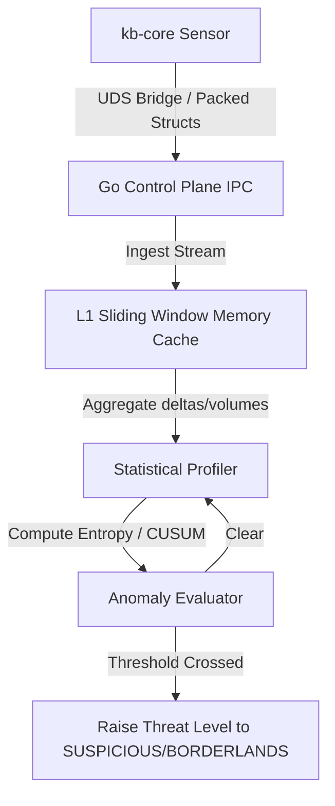

# Developer Guide: Slow Data Exfiltration Detection

This document provides architectural guidance and algorithm designs for Go Control Plane or Autonomous Agentic Detection System (AADS) developers to identify and alert on **Slow Data Exfiltration via Authorized Sockets** using the telemetry streams generated by the `kb-core` sensor.

---

## 1. The Threat: Low & Slow Exfiltration
Traditional intrusion detection systems (IDS) identify exfiltration by checking for high-volume spikes in outbound traffic. Attackers evade this by transferring data at extremely low rates (e.g., 100 bytes every 10 seconds) over pre-approved, standard sockets (like DNS, HTTPS, or active database connections). 

Because the target IPs and ports are authorized, connection-establishment alerts do not fire, and volume-based anomaly detectors are not triggered.

---

## 2. Telemetry and Data Points
The `kb-core` sensor generates granular network connect, bind, and syscall events. For exfiltration detection, the following properties in `struct kb_unified_event` are key:
*   `e->pid` and `e->comm`: The source process identity.
*   `e->daddr` and `e->dport`: The destination IP address and port.
*   `e->ts_ns`: Clock-monotonic nanosecond timestamp of the socket activity.
*   *Syscall telemetry*: System calls (`write`, `sendto`, `sendmsg`) can be monitored to extract packet payload sizes.

---

## 3. Recommended Detection Algorithms

### A. Shannon Entropy of Packet Intervals (Beaconing Detection)
Normal application traffic is bursty (e.g., human web browsing or batch API requests). Automated exfiltration scripts have high regularity (low entropy) in their transmission timing intervals.

1.  **Calculate Timing Deltas**: For a given `(pid, daddr, dport)` stream, calculate the difference between consecutive transmission timestamps:
    $$\Delta t_i = ts_i - ts_{i-1}$$
2.  **Bin the Deltas**: Distribute the deltas $\Delta t$ into time bins (e.g., 0-1s, 1-5s, 5-10s, 10-30s, >30s).
3.  **Compute Entropy ($H$)**:
    $$H = -\sum (p_i \log_2 p_i)$$
    where $p_i$ is the probability of a delta falling into bin $i$.
4.  **Verdict**: A low entropy value ($H \to 0$) indicates high regularity (a rigid timer loop exfiltrating data), signaling an active beacon.

### B. Cumulative Sum (CUSUM) Anomaly Detection
The CUSUM algorithm detects small, persistent shifts in the mean value of a process parameter (like average output bytes per second).

1.  **Define Baseline**: Establish the baseline mean transmission volume ($\mu$) and standard deviation ($\sigma$) during safe operation.
2.  **Compute Cumulative Deviations**:
    $$S_i = \max(0, S_{i-1} + (x_i - \mu - K))$$
    *   $x_i$: The measured data volume or frequency at sample $i$.
    *   $K$: Allowable slack parameter (usually $K = \frac{\sigma}{2}$).
3.  **Verdict**: If $S_i$ crosses a threshold ($H_{threshold} = 4\sigma$ or $5\sigma$), flag an anomaly. This catches gradual accumulative volume increases that remain below flat-threshold limits.

### C. Connection Lifecycle Autocorrelation
For long-lived authorized sockets, calculate the autocorrelation of traffic volume to detect recurring polling/exfiltration patterns:
$$R(\tau) = \frac{E[(X_t - \mu)(X_{t+\tau} - \mu)]}{\sigma^2}$$
If $R(\tau)$ shows strong periodic peaks at specific time-lags ($\tau$), the socket is executing automated data transfers.

---

## 4. Implementation Blueprint (Go Control Plane / AADS)

We recommend implementing this detection out-of-band on the Go Control Plane or in an AADS agent (e.g., `Hunter` or `Patroller` agent swarms) to prevent adding CPU overhead to the Ring 0 sensor.



### Go Implementation Example (L1 sliding window metrics)
```go
type NetFlowWindow struct {
	LastTimestamp uint64
	Intervals     []float64 // sliding window of delta seconds
	Sizes         []int64
}

func (w *NetFlowWindow) Push(tsNs uint64, size int64) {
	if w.LastTimestamp > 0 {
		deltaSec := float64(tsNs-w.LastTimestamp) / 1e9
		w.Intervals = append(w.Intervals, deltaSec)
		if len(w.Intervals) > 100 {
			w.Intervals = w.Intervals[1:]
		}
	}
	w.Sizes = append(w.Sizes, size)
	if len(w.Sizes) > 100 {
		w.Sizes = w.Sizes[1:]
	}
	w.LastTimestamp = tsNs
}

func (w *NetFlowWindow) CalculateTimingEntropy() float64 {
	if len(w.Intervals) < 10 {
		return 3.0 // not enough samples to profile
	}
	// Bin intervals: [0-1s, 1-5s, 5-10s, 10-30s, >30s]
	bins := make([]int, 5)
	for _, dt := range w.Intervals {
		if dt <= 1.0 { bins[0]++ } else if dt <= 5.0 { bins[1]++ } else if dt <= 10.0 { bins[2]++ } else if dt <= 30.0 { bins[3]++ } else { bins[4]++ }
	}
	entropy := 0.0
	total := float64(len(w.Intervals))
	for _, count := range bins {
		if count > 0 {
			p := float64(count) / total
			entropy -= p * math.Log2(p)
		}
	}
	return entropy
}
```

If the entropy dips below `1.2` while the cumulative volume over 1 hour exceeds `10 MB` from a non-interactive daemon, a `KB_REASON_RAPID_CONNECT_BURST` or custom exfiltration rule should be triggered, and the target namespace should be locked.
