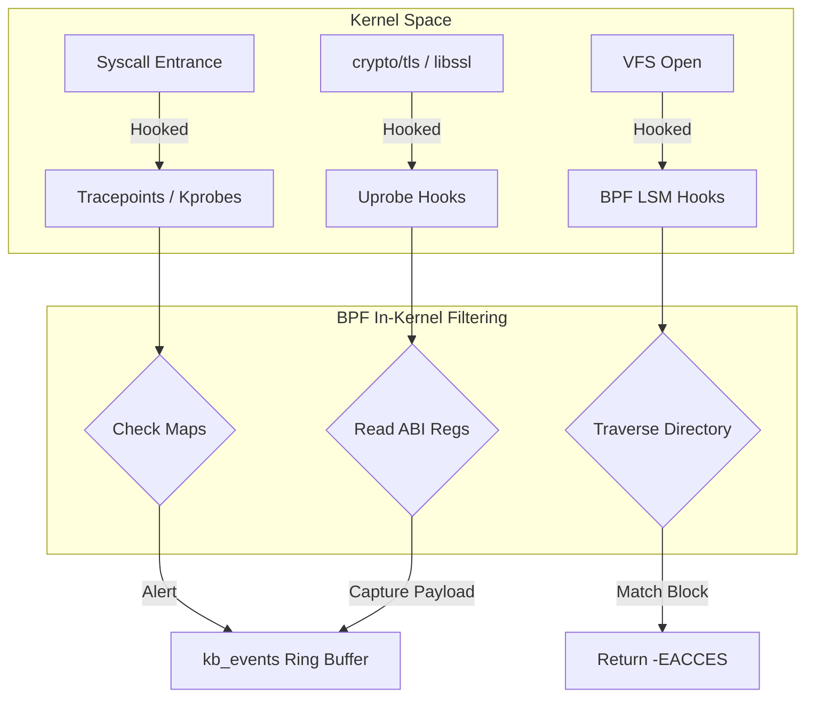
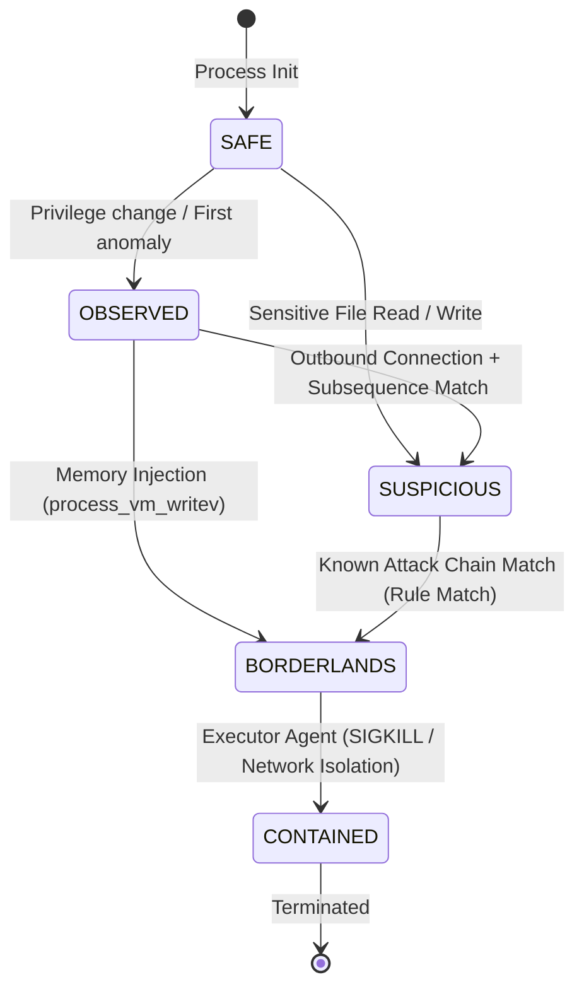
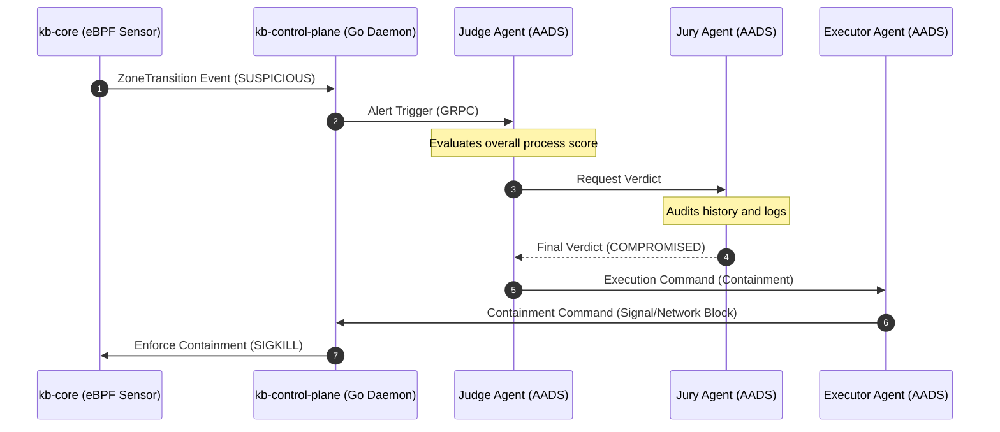

# Kernel Borderlands: Complete Systems Specification & Architecture Reference

Behavioral Defense at Ring Zero via eBPF-driven Instrumentation, Userspace Behavior Engines, and Agentic Swarm Containment.

---

## 1. Project System Topology & Subsystems

Kernel Borderlands (KB) is a multi-tier, zero-overhead threat detection and active containment platform. It spans kernel-space tracing, native userspace processors, golang control planes, a terminal user interface, Rust safety checkers, and an autonomous agent swarm.

```
                                  +------------------------------------+
                                  |    AADS Python Agent Swarm         |
                                  |    (Patroller, Hunter, Healer)     |
                                  +------------------------------------+
                                                    ^
                                                    | (gRPC Proto Interface)
                                                    v
                                  +------------------------------------+
                                  |    Go Control Plane Daemon         |
                                  |    (L1 sync.Map / L2 SQLite WAL)   |
                                  +------------------------------------+
                                    ^                                ^
             (UDS Bridge /run/kb/kbd.sock)                              | (gRPC Port 50051)
                                    v                                v
+---------------------------------------+                  +-------------------+
|  kb-core: Native Userspace C Sensor   |                  |  kb-tui: Bubble   |
|  (polls Ring Buffer & runs loader)    |                  |  tea SSH Console  |
+---------------------------------------+                  +-------------------+
         ^
         | (eBPF Maps & Ring Buffer)
         v
+---------------------------------------+
|  Kernel Space (Ring 0 eBPF Programs)  |
|  (Tracepoints, Kprobes, Uprobes, LSM) |
+---------------------------------------+
```

### Subsystem Catalog

#### 1. `kb-core` (Kernel & Native Userspace C Sensor)
The raw telemetry and local validation provider. It loads and compiles eBPF CO-RE programs into Ring 0, polls events from the performance ring buffer, and processes state evaluation rules in userspace C code.
*   **Host Dependency**: Requires Linux Kernel 5.8+ compiled with BTF (BPF Type Format) enabled, and BPF LSM active in boot flags.
*   **Userspace Loader**: Written in pure C (linked against `libbpf`), running a multi-threaded poll-and-dispatch pipeline.

#### 2. `kb-control-plane` (Userland Management Daemon)
The central control and orchestration daemon. It receives states over the Unix socket bridge, maintains an L1 thread-safe memory registry, serializes historical audits to an L2 SQLite WAL database, parses policy specifications, and implements a gRPC gateway.
*   **Execution**: Written in Go (compiled statically), exposing endpoints on port 50051.

#### 3. `kb-tui` (SSH Terminal Console — `kb-op/kb-tui/`)
The administrative terminal console. Built on Wish (an SSH host framework), Lipgloss, and Bubble Tea (a terminal UI framework), it serves an interactive process monitoring layout on SSH port 2222.
*   **Features**: Includes live process color mapping, a terminal alert viewport, and command execution gates.

#### 4. `kb-checker` (Rust Safety & Integrity Layer)
Rust-based safety and integrity enforcement layer for Kernel Borderlands. Operates independently of the behavioral analytics pipeline to continuously verify the integrity and health of critical KB components.
*   **Analysis**: It validates the runtime state of eBPF programs, monitors the Control Plane, AADS subsystem, and native services, quarantines or isolates compromised components when necessary, and generates alerts for administrative review to ensure the KB infrastructure remains trusted, resilient, and operational.

#### 5. `kb-dashboard` (Vite + React Web UI — `kb-op/kb-dashboard/`)
A React dashboard using Tailwind CSS and Vite. It provides a visual dashboard for security operations teams to view threat zone transitions.

#### 6. `kb-mcp` (Model Context Protocol Gateway — `kb-op/kb-mcp/`)
A standardized Model Context Protocol (MCP) server integration, exposing tools, resources, and custom prompts to external AI assistants, swarms, and workspace clients.

#### 7. `kb-aads` (Autonomous Swarm)
The Decision Support Swarm. Written in Python, it runs multiple independent agent containers (Patroller, Hunter, Healer, Containment) communicating over ZeroMQ and Ray Actor channels to execute cluster-wide voting consensus on threat containment.

---

## 2. Master Directory Structure & File Map

An exhaustive directory mapping of the entire Kernel Borderlands workspace:

```text
kernel-borderlands/
├── docs/                                      # Master documentation
│   ├── index.html                             # Project landing page and visual zone model
│   ├── dev-exfiltration-detection.md         # Algorithms for low-and-slow exfiltration
│   ├── enabling-bpf-lsm.md                   # Administrator guide for host LSM config
│   ├── core/
│   │   └── session_achievements_report.md     # Technical achievements of this cycle
│   └── kernel_borderlands_specification.md    # This master specification document
│
├── kb-core/                                   # Kernel-space instrumentation & native sensor
│   ├── Makefile                               # Compiles BPF objects and userspace sensor
│   ├── include/                               # Shared API definitions
│   │   ├── kb_common.h                        # Structs shared between eBPF and userspace
│   │   ├── kb_events.h                        # Event type enumeration and payload formats
│   │   ├── kb_scoring.h                       # Advisory scoring interface definitions
│   │   ├── kb_behavior.h                      # Behavioral engine state classifications
│   │   ├── kb_evidence.h                      # Process evidence logs and queues
│   │   ├── kb_rules.h                         # Dynamic rule layouts and wire contracts
│   │   └── vmlinux.h                          # Auto-generated kernel BTF types
│   ├── ebpf/                                  # eBPF C source files
│   │   └── kbd_sensor.bpf.c                   # Unified tracepoints, kprobes, uprobes, & LSM
│   ├── userspace/                             # Native userspace loaders & processors
│   │   ├── sensor/
│   │   │   └── kbd_sensor.c                   # Main poll loop, dynamic uprobe attacher
│   │   ├── behavior/
│   │   │   ├── kb_behavior.c                  # State machine sequence evaluation
│   │   │   ├── kb_evidence.c                  # State storage and evidence log buffers
│   │   │   ├── kb_rules.c                     # Rule table deserializer and engine hooks
│   │   │   └── kb_scoring.c                   # Advisory scoring moving average engine
│   │   └── bridge/
│   │       ├── kb_bridge.c                    # IPC socket client with backoff reconnects
│   │       └── kb_bridge.h                    # Socket client headers and default configs
│   ├── scripts/                               # Automation scripts
│   │   ├── build.sh                           # Clean rebuild compiler wrapper
│   │   ├── clean.sh                           # Removes build artifacts
│   │   └── test.sh                            # Compiles and runs unit tests
│   └── tests/                                 # Testing files
│       ├── test_behavior.c                    # Unit tests for behavioral rules engine
│       └── test_all_hooks.sh                  # Integration test triggering all 9 telemetry hooks
│
├── kb-control-plane/                          # Go-based management daemon
│   ├── Makefile                               # Generates proto and builds go binary
│   ├── go.sum                                 # Go dependency hashes
│   ├── go.mod                                 # Dependency definitions
│   ├── config/
│   │   └── policy.yaml                        # Default threshold and containment policies
│   ├── cmd/
│   │   └── kbd/
│   │       └── main.go                        # Main daemon entrypoint
│   ├── internal/
│   │   ├── controlplane/
│   │   │   └── controlplane.go                # gRPC server routing and events processor
│   │   ├── store/
│   │   │   ├── schema.go                      # SQLite table schemas and database Close()
│   │   │   └── process.go                     # L1/L2 write-behind hybrid engine and cache
│   │   ├── ipc/
│   │   │   ├── wire.go                        # Binary wire parsing formats
│   │   │   ├── listener.go                    # UDS socket listener and multiplexer
│   │   │   └── rules.go                       # YAML parser and binary rules compiler
│   │   ├── policy/
│   │   │   └── engine.go                      # Threshold evaluator and auto-terminate decisions
│   │   └── audit/
│   │       └── logger.go                      # Cryptographically chained SHA256 audit logger
│   └── proto/
│       └── kb_ipc.proto                       # gRPC interface definitions for external agents
│
├── kb-op/                                     # Operator Interfaces
│   ├── kb-tui/                                # Go SSH Bubbletea Console
│   │   ├── README.md                          # TUI operations documentation
│   │   ├── go.mod                             # Go TUI dependencies
│   │   ├── cmd/
│   │   │   └── main.go                        # Wish SSH server and TUI initiator
│   │   ├── internal/
│   │   │   ├── ui/                            # bubbletea views (process tables, alert streams)
│   │   │   ├── client/                        # gRPC client for Control Plane
│   │   │   └── styles/                        # lipgloss style definitions
│   │   └── tests/                             # TUI mocks and tests
│   │
│   ├── kb-dashboard/                          # React Web UI
│   │   ├── README.md                          # Vite dev server documentation
│   │   ├── package.json                       # Frontend NPM dependencies
│   │   ├── src/                               # TypeScript React files
│   │   └── index.html                         # Dashboard html page
│   │
│   └── kb-mcp/                                # Model Context Protocol Server
│       └── README.md                          # MCP tools, resources & prompts reference
│
├── kb-checker/                                # Rust Safety & Integrity Checker
│   ├── README.md                              # Cargo build instruction sets
│   ├── Cargo.toml                             # Rust crate dependencies
│   ├── src/
│   │   ├── main.rs                            # Checker CLI entrypoint
│   │   ├── integrity.rs                       # component status verification
│   │   └── service_check.rs                   # process monitor
│   ├── event_sets/                            # Simulated JSON threat models
│   └── tests/                                 # Cargo test suites
│
└── kb-aads/                                   # Python MARL Agent Swarm
    ├── README.md                              # Swarm setup documentation
    ├── main.py                                # Swarm daemon entrypoint
    ├── comms/                                 # ZeroMQ & Ray consensus pipelines
    ├── consensus/                             # Swarm voting and quorum engines
    ├── swarm/                                 # Swarm runtime managers
    ├── agents/                                # Agent files (Patroller, Hunter, Healer, Containment)
    ├── marl/                                  # Multi-agent reinforcement learning training configs
    └── docker-compose.yml                     # Local dev environment configuration
```

---

## 3. Kernel-Space Instrumentation Reference (`kb-core/ebpf/`)

The eBPF layer runs inside Ring 0, executing dynamic syscall hook points via CO-RE (Compile Once – Run Everywhere) compatible structures.

### A. Shared Telemetry Structure (`kb_common.h`)
The unified frame format utilized to record events inside the kernel ring buffer:

```c
struct kb_event_t {
    uint32_t type;            // Event ID (from kb_events.h)
    uint64_t ts_ns;           // Nanosecond timestamp of event
    uint32_t pid;             // Process ID
    uint32_t ppid;            // Parent Process ID
    uint32_t uid;             // User ID executing the action
    char comm[16];            // Command name (trunc at 15 chars + null)
    
    union {
        struct {
            char filename[64];
        } exec;
        
        struct {
            char path[64];
            uint32_t flags;
        } file;

        struct {
            uint32_t saddr;
            uint32_t daddr;
            uint16_t sport;
            uint16_t dport;
        } net;

        struct {
            uint64_t addr;
            uint64_t len;
            uint32_t prot;
        } mem;

        struct {
            uint32_t old_uid;
            uint32_t new_uid;
            uint64_t cap_effective;
        } creds;
    } data;
};
```

### B. eBPF Map Declarations
All maps are declared under the `.maps` SEC block for automated loader compilation.

```c
// Unified Ring Buffer (1 MB size)
struct {
    __uint(type, BPF_MAP_TYPE_RINGBUF);
    __uint(max_entries, 1 << 20);
} kb_events SEC(".maps");

// BPF LSM Sensitive Paths Mapping
struct {
    __uint(type, BPF_MAP_TYPE_HASH);
    __uint(max_entries, 256);
    __type(key, char[64]);
    __type(value, struct kb_path_config);
} kb_sensitive_paths SEC(".maps");

// Per-Process System Call Ingestion Map
struct {
    __uint(type, BPF_MAP_TYPE_HASH);
    __uint(max_entries, 10240);
    __type(key, uint32_t);
    __type(value, uint64_t[512]);
} kb_syscall_counts SEC(".maps");
```

---

## 4. Telemetry Hook Implementations



### A. Tracepoint: `sched_process_exec`
Hooks process execution entrance.
*   **Significance**: Captures command line binary names and maps user namespaces.
*   **eBPF Code Structure**:
    ```c
    SEC("tracepoint/sched/sched_process_exec")
    int kb_sched_process_exec(struct trace_event_raw_sched_process_exec *ctx) {
        struct kb_event_t *ev;
        ev = bpf_ringbuf_reserve(&kb_events, sizeof(*ev), 0);
        if (!ev) return 0;

        ev->type = KB_EVENT_EXEC;
        ev->ts_ns = bpf_ktime_get_ns();
        
        struct task_struct *task = (struct task_struct *)bpf_get_current_task();
        ev->pid = bpf_get_current_pid_tgid() >> 32;
        ev->ppid = BPF_CORE_READ(task, real_parent, tgid);
        ev->uid = bpf_get_current_uid_gid();
        
        bpf_get_current_comm(&ev->comm, sizeof(ev->comm));
        
        // Read executable filepath
        struct file *exe = BPF_CORE_READ(task, mm, exe_file);
        if (exe) {
            bpf_d_path(&exe->f_path, ev->data.exec.filename, sizeof(ev->data.exec.filename));
        }

        bpf_ringbuf_submit(ev, 0);
        return 0;
    }
    ```

### B. Tracepoint: `sched_process_exit`
Hooks process completion.
*   **Significance**: Removes terminated process identifiers from userspace track arrays to prevent memory leak accumulation.
*   **eBPF Code Structure**:
    ```c
    SEC("tracepoint/sched/sched_process_exit")
    int kb_sched_process_exit(struct trace_event_raw_sched_process_template *ctx) {
        struct kb_event_t *ev;
        ev = bpf_ringbuf_reserve(&kb_events, sizeof(*ev), 0);
        if (!ev) return 0;

        ev->type = KB_EVENT_EXIT;
        ev->ts_ns = bpf_ktime_get_ns();
        ev->pid = bpf_get_current_pid_tgid() >> 32;
        bpf_get_current_comm(&ev->comm, sizeof(ev->comm));

        bpf_ringbuf_submit(ev, 0);
        return 0;
    }
    ```

### C. Tracepoint: `sys_enter_process_vm_writev`
Hooks cross-process virtual memory writes.
*   **Significance**: Detects shellcode injection or DLL injection attacks.
*   **eBPF Code Structure**:
    ```c
    SEC("tracepoint/syscalls/sys_enter_process_vm_writev")
    int kb_sys_process_vm_writev(struct trace_event_raw_sys_enter *ctx) {
        struct kb_event_t *ev;
        ev = bpf_ringbuf_reserve(&kb_events, sizeof(*ev), 0);
        if (!ev) return 0;

        ev->type = KB_EVENT_VM_WRITE;
        ev->ts_ns = bpf_ktime_get_ns();
        ev->pid = bpf_get_current_pid_tgid() >> 32;
        ev->uid = bpf_get_current_uid_gid();
        bpf_get_current_comm(&ev->comm, sizeof(ev->comm));

        // Read destination target PID from parameter register (arg1)
        ev->data.mem.addr = ctx->args[0]; // PID of target process
        ev->data.mem.len = ctx->args[3];  // Length of written buffers

        bpf_ringbuf_submit(ev, 0);
        return 0;
    }
    ```

### E. Kprobe: `security_capable`
Hooks Linux capability checks.
```c
SEC("kprobe/security_capable")
int BPF_KPROBE(kb_security_capable, const struct cred *cred, struct user_namespace *ns, int cap) {
    uint32_t uid = BPF_CORE_READ(cred, uid.val);
    if (uid == 0) return 0;

    if (cap != 21 && cap != 19 && cap != 1 && cap != 12) return 0;

    struct kb_event_t *ev = bpf_ringbuf_reserve(&kb_events, sizeof(*ev), 0);
    if (!ev) return 0;

    ev->type = KB_EVENT_CAP_PROBE;
    ev->ts_ns = bpf_ktime_get_ns();
    ev->pid = bpf_get_current_pid_tgid() >> 32;
    bpf_get_current_comm(&ev->comm, sizeof(ev->comm));

    ev->data.creds.old_uid = uid;
    ev->data.creds.new_uid = cap;

    bpf_ringbuf_submit(ev, 0);
    return 0;
}
```

### F. BPF LSM Hook: VFS File Protection (`lsm/file_open`)
Intercepts file opens at Virtual File System boundary to perform dynamic blocks.
```c
SEC("lsm/file_open")
int BPF_PROG(kb_lsm_file_open, struct file *file, int mask) {
    struct path *path = &file->f_path;
    char buf[128];
    
    int len = bpf_d_path(path, buf, sizeof(buf));
    if (len < 0) return 0;

    #pragma unroll
    for (int i = 127; i > 0; i--) {
        if (buf[i] == '/') {
            buf[i] = '\0';
            struct kb_path_config *conf = bpf_map_lookup_elem(&kb_sensitive_paths, buf);
            if (conf && conf->block) {
                return -EACCES; // Block open natively in kernel-space
            }
            buf[i] = '/';
        }
    }
    return 0;
}
```

### G. Uprobe: Plaintext TLS Hook (System V ABI)
Captures plaintext buffers before encryption in OpenSSL, GnuTLS, and NSS.
```c
SEC("uprobe/SSL_write")
int kb_ssl_write(struct pt_regs *ctx) {
    struct kb_event_t *ev;
    const char *buf = (const char *)PT_REGS_PARM2(ctx); // RSI
    int len = (int)PT_REGS_PARM3(ctx);                  // RDX

    if (len <= 0) return 0;

    ev = bpf_ringbuf_reserve(&kb_events, sizeof(*ev), 0);
    if (!ev) return 0;

    ev->type = KB_EVENT_TLS_WRITE;
    ev->ts_ns = bpf_ktime_get_ns();
    ev->pid = bpf_get_current_pid_tgid() >> 32;
    bpf_get_current_comm(&ev->comm, sizeof(ev->comm));

    bpf_probe_read_user(ev->data.file.path, sizeof(ev->data.file.path) - 1, buf);
    ev->data.file.flags = len;

    bpf_ringbuf_submit(ev, 0);
    return 0;
}
```

### H. Uprobe: Go Runtime TLS Hook (Go ABIInternal)
Captures plaintext buffers in statically compiled Go runtime `crypto/tls` libraries.
```c
SEC("uprobe/go_tls_conn_write")
int kb_go_tls_conn_write(struct pt_regs *ctx) {
    struct kb_event_t *ev;
    
    const char *buf = (const char *)ctx->bx;
    int len = (int)ctx->cx;

    if (len <= 0) return 0;

    ev = bpf_ringbuf_reserve(&kb_events, sizeof(*ev), 0);
    if (!ev) return 0;

    ev->type = KB_EVENT_TLS_WRITE;
    ev->ts_ns = bpf_ktime_get_ns();
    ev->pid = bpf_get_current_pid_tgid() >> 32;
    bpf_get_current_comm(&ev->comm, sizeof(ev->comm));

    bpf_probe_read_user(ev->data.file.path, sizeof(ev->data.file.path) - 1, buf);
    ev->data.file.flags = len;

    bpf_ringbuf_submit(ev, 0);
    return 0;
}
```

---

## 5. Stateful Behavior Engine Reference (`kb-core/userspace/behavior/`)

The Behavior Engine evaluates chronological process telemetry against rule sets to execute state transitions.

### A. Event Flag Classifications
Threat identifiers mapped to bitwise representations inside userspace state:

| Hexadecimal Flag | Constant Definition | Triggering Condition |
|---|---|---|
| `0x0000000000000001` | `KB_EV_EXEC_FROM_TMP` | Execution from volatile folder (`/tmp`, `/dev/shm`) |
| `0x0000000000000004` | `KB_EV_SPAWNED_SHELL` | Shell execution spawned by non-interactive daemon |
| `0x0000000000000100` | `KB_EV_PRIVILEGE_GAINED` | UID changes to 0 (root) from non-zero context |
| `0x0000000000010000` | `KB_EV_RWX_MAPPING` | Anonymous executable memory mapping (anon+exec) |
| `0x0000000000040000` | `KB_EV_WX_TRANSITION` | W^X protection violation (mprotect write $\to$ exec) |
| `0x0000000000100000` | `KB_EV_PROC_MEM_WRITE` | Procfs memory manipulation attempts (`/proc/*/mem`) |
| `0x0000000000200000` | `KB_EV_PROCESS_VM_WRITE` | Cross-process memory injection (`process_vm_writev`) |
| `0x0000000001000000` | `KB_EV_SHADOW_ACCESS` | Read attempt on `/etc/shadow` |
| `0x0000000004000000` | `KB_EV_SUDOERS_ACCESS` | Read/Write attempt on `/etc/sudoers` |
| `0x0000000100000000` | `KB_EV_OUTBOUND_CONNECT` | Active outbound socket connection |
| `0x0000000800000000` | `KB_EV_BIND_LISTENER` | Active socket bind listening on local port |
| `0x0000020000000000` | `KB_EV_PTRACE_USED` | Syscall ptrace invoked on active PID |

### B. Behavior Zone Model & Transitions
The system maintains 3 active runtime states:
1.  **SAFE**: Base baseline tracking. Telemetry is polled; process evidence registers are initialized.
2.  **SUSPICIOUS**: Raised on matching sequence patterns. BPF LSM file blocking hooks are enabled for target PIDs to prevent credential access. Out-of-band TLS uprobes are attached.
3.  **BORDERLANDS**: Full compromise detected. Executor agents terminate execution (`SIGKILL`) or restrict resources using cgroups.



### C. Advisory Scoring Engine (EMA Calculations)
The Behavioral Risk Score $S_t$ calculated by the scoring engine is strictly advisory-only and does not trigger zone transitions. Actual zone transitions are driven exclusively by sequence checks and dynamic rule matches within the Behavior State Machine. The advisory score sums risk indices across 6 weighted dimensions smoothed over time using Exponential Moving Average.

#### 1. Dimension Layout
*   **Process Context ($D_{\text{proc}}$)** — weight: `0.20`
*   **Syscall Activity ($D_{\text{sys}}$)** — weight: `0.25`
*   **Privilege States ($D_{\text{priv}}$)** — weight: `0.20`
*   **File System ($D_{\text{file}}$)** — weight: `0.10`
*   **Network ($D_{\text{net}}$)** — weight: `0.10`
*   **Memory Mapping ($D_{\text{mem}}$)** — weight: `0.15`

#### 2. Formulas
First, calculate the raw instantaneous risk sum $R_t$ based on weights $W_i$ and event indicators $I_{i,t} \in [0, 100]$:

$$R_t = \sum_{i=1}^{6} W_i \cdot I_{i,t}$$

Next, smooth the score using the Exponential Moving Average:

$$S_t = \alpha \cdot R_t + (1 - \alpha) \cdot S_{t-1}$$

Where:
*   $\alpha$ is the smoothing factor (configured to `0.3` to prevent quick score decay).
*   $S_{t-1}$ is the process's previous threat score.

---

## 6. IPC Unix Socket Bridge Protocol

The communication bridge client (`kb_bridge.c` to `listener.go`) serializes process records and streams them over the local Unix Domain Socket `/run/kb/kbd.sock`.

### A. Wire Frame Layouts
```
         Go-to-C Rules Frame (Handshake)                C-to-Go Event Frame (Ingestion)
         
         +-----------------------------+                +-----------------------------+
         | Magic: 2 Bytes (0x4B42)     |                | Magic: 2 Bytes (0x4B42)     |
         +-----------------------------+                +-----------------------------+
         | Version: 1 Byte (3)         |                | Version: 1 Byte (3)         |
         +-----------------------------+                +-----------------------------+
         | Msg Type: 1 Byte (3 = Rules)|                | Msg Type: 1 Byte (1 or 2)   |
         +-----------------------------+                +-----------------------------+
         | Rule Count: 4 Bytes         |                | Payload Data: Variable      |
         +-----------------------------+                | (Packed process structures) |
         | Array of Rules (220B each)  |                |                             |
         +-----------------------------+                +-----------------------------+
```

### B. Struct Alignments (C/Go Common Contracts)

#### 1. Packed ProcessState Frame (128 Bytes)
```c
struct kb_process_state_frame {
    uint32_t pid;                 // Offset: 0
    uint32_t ppid;                // Offset: 4
    uint32_t uid;                 // Offset: 8
    uint32_t zone;                // Offset: 12
    uint64_t accumulated_flags;   // Offset: 16
    uint32_t event_count;         // Offset: 24
    double composite_score;       // Offset: 28
    char comm[16];                // Offset: 36
    uint64_t start_time_ns;       // Offset: 52
    uint8_t reserved[68];         // Offset: 60 -> Padding to 128 bytes
} __attribute__((packed));
```

#### 2. Packed ZoneTransition Frame (40 Bytes)
```c
struct kb_zone_transition_frame {
    uint32_t pid;                 // Offset: 0
    uint64_t start_time_ns;       // Offset: 4
    uint32_t from_zone;           // Offset: 12
    uint32_t to_zone;             // Offset: 16
    double ema_score;             // Offset: 20
    uint64_t ts_ns;               // Offset: 28
    uint32_t reserved;            // Offset: 36 -> Padding to 40 bytes
} __attribute__((packed));
```

#### 3. Packed Rule Structure Layout (220 Bytes)
```c
struct kb_wire_attack_rule {
    char name[32];                // Offset: 0   -> Name of threat rule
    char description[128];        // Offset: 32  -> Threat descriptive notes
    uint64_t required_flags;      // Offset: 160 -> Mandatory accumulated flags
    uint64_t optional_flags;      // Offset: 168 -> Helper secondary indicators
    int32_t optional_min;         // Offset: 176 -> Min optional triggers required
    uint8_t sequence[16];         // Offset: 180 -> Sequence list of Event IDs
    int32_t sequence_len;         // Offset: 196 -> Length of target sequence list
    uint64_t window_ns;           // Offset: 200 -> Expiration timeout for sequence check
    uint32_t target_state;        // Offset: 208 -> Verdict transition state
    uint32_t reason;              // Offset: 212 -> Reason transition ID
    uint32_t min_source_state;    // Offset: 216 -> Minimum state context needed
} __attribute__((packed));
```

---

## 7. Go Control Plane Internals (`kb-control-plane/`)

The daemon handles dynamic policy compilation, memory lineage cache, audit trails, and gRPC endpoints.

### A. L1/L2 Hybrid Storage Engine
To handle thousands of events per second, the state storage splits workloads into volatile hot paths and serialized durable paths:
1.  **L1 Cache (sync.Map)**: Holds the volatile process registry in RAM. All dynamic verification queries check L1.
2.  **L2 Store (SQLite WAL)**: High-speed local database. Receives logs asynchronously via a buffered channel (`l2Pipe chan interface{}`). WAL mode enables non-blocking readers during active serialization.
3.  **Tear-down Synchronization**: To prevent race-conditions during shutdown (which throws `sql: database is closed`), a barrier channel `l2Done` ensures all pending logs are committed:

```go
func (s *Store) Close() {
    close(s.l2Pipe) // Signal background worker to stop
    <-s.l2Done      // Block until worker has finished draining queue to SQLite
    s.db.Close()    // Safely close SQL database connection
}
```

### B. SQLite Schema Definition
```sql
CREATE TABLE IF NOT EXISTS process_state (
    pid INTEGER,
    start_time_ns INTEGER,
    ppid INTEGER,
    uid INTEGER,
    comm TEXT,
    zone INTEGER,
    accumulated_flags INTEGER,
    event_count INTEGER,
    composite_score REAL,
    last_updated_ns INTEGER,
    PRIMARY KEY(pid, start_time_ns)
);

CREATE TABLE IF NOT EXISTS zone_transitions (
    pid INTEGER,
    start_time_ns INTEGER,
    comm TEXT,
    from_zone INTEGER,
    to_zone INTEGER,
    ema_score REAL,
    ts_ns INTEGER
);

CREATE TABLE IF NOT EXISTS audit_log (
    id INTEGER PRIMARY KEY AUTOINCREMENT,
    ts_ns INTEGER,
    action TEXT,
    subject TEXT,
    prev_hash TEXT,
    curr_hash TEXT
);
```

### C. Immutability Chain (Hashed Logs)
To guarantee that the audit trail has not been modified, every log entry contains a cryptographic hash of its payload and the hash of the preceding log record.

$$\text{Hash}_N = \text{SHA256}(\text{RecordData}_N \mathbin{\|} \text{Hash}_{N-1})$$

```go
func (a *Logger) WriteAudit(action, subject string) error {
    ts := time.Now().UnixNano()
    
    h := sha256.New()
    h.Write([]byte(fmt.Sprintf("%d|%s|%s|%s", ts, action, subject, a.lastHash)))
    currHash := hex.EncodeToString(h.Sum(nil))
    
    _, err := a.db.Exec("INSERT INTO audit_log (ts_ns, action, subject, prev_hash, curr_hash) VALUES (?, ?, ?, ?, ?)",
        ts, action, subject, a.lastHash, currHash)
    if err != nil {
        return err
    }
    
    a.lastHash = currHash
    return nil
}
```

---

## 8. Network Exfiltration Detection: Algorithms and Math

Exfiltrations (such as slow leakage over DNS or authorized sockets) are detected in userspace by tracking network metadata.

### A. Shannon Entropy of Network Payloads
Shannon Entropy calculates the randomness of packet lengths to differentiate standard application API calls from structured data leakage (e.g. gzip compression or encrypted payloads).

For a given set of observed packet sizes in a sliding time window, let $P(x_i)$ represent the probability of observing packet size $x_i$:

$$H(X) = - \sum_{i=1}^{n} P(x_i) \log_2 P(x_i)$$

Where:
*   $H(X)$ is the entropy value. If $H(X) > 6.8$, it indicates high-density/encrypted payloads, triggering an exfiltration flag.

---

### B. Cumulative Sum (CUSUM) Drift Detection
To catch low-and-slow leakage that attempts to blend in with normal traffic, CUSUM detects shifts in the mean of packet transmission intervals.

Let $x_t$ be the transmission interval between packets at index $t$, $\mu_0$ be the expected baseline mean interval, and $k$ be the allowed drift tolerance:

$$S_0 = 0$$

$$S_t = \max\left(0, S_{t-1} + (x_t - \mu_0) - k\right)$$

If $S_t > H_{\text{threshold}}$, the CUSUM engine raises a threat transition due to statistical drift, detecting slow, constant interval leaks.

---

## 9. Go SSH Terminal User Interface (`kb-op/kb-tui/`)

The terminal dashboard (`kb-tui`) provides a live monitoring and control terminal for operator access.

### A. Core Technologies
*   **Bubble Tea**: The Elm-architecture TUI runtime framework, rendering separate model update loops for live process views and alerts.
*   **Lip Gloss**: Native CSS-like layout styler, rendering process cards in terminal colors keyed to threat zones:
    -   `Safe` $\to$ Green
    -   `Suspicious` $\to$ Yellow
    -   `Borderlands` $\to$ Red
*   **Wish**: Cryptographic SSH host engine. Enables authentication and serves the TUI app directly over standard SSH sessions:
    ```bash
    ssh operator@kb-server -p 2222
    ```

## 10. Rust Safety & Integrity Engine (`kb-checker/`)

Rust-based safety and integrity enforcement layer for Kernel Borderlands. Operates independently of the behavioral analytics pipeline to continuously verify the integrity and health of critical KB components.

### A. Program State Verification
It validates the runtime state of loaded eBPF programs. The engine queries the kernel's active BPF program list to ensure that the bytecode signatures, map configurations, and hook attachment states exactly match the target security layout defined in policy rules.

### B. Control Plane & Swarm Monitoring
The check daemon runs continuous local check probes to monitor:
1. **Control Plane Daemon**: Validates health endpoints, memory utilization, and socket availability for `/run/kb/kbd.sock`.
2. **AADS Subsystem**: Queries the agent swarm's consensus pipeline and local communication ports to ensure patroller, hunter, and healer agents are alive.
3. **Execution Gateways**: Performs test calls through execution endpoints to verify quarantine and containment services remain responsive.

## 11. Swarm Integration (AADS Swarm)

The gRPC server (`kb_ipc.proto`) exposes event feeds and containment interfaces to the AADS Agent Swarm.

```protobuf
syntax = "proto3";
package kb;

service KernelBorderlands {
  rpc StreamEvents(Empty) returns (stream KBEvent);
  rpc StreamAlerts(Empty) returns (stream Alert);
  rpc EnforceContainment(ContainmentRequest) returns (ContainmentResponse);
}
```

The Python AADS swarm communicates over ZeroMQ and Ray Actor consensus pipelines, coordinating threat assessments across multiple nodes:



*   **Patroller Agent**: Continuously polls baseline statistics from `StreamEvents` to build normal behavior thresholds.
*   **Hunter Agent**: Monitors `StreamAlerts`. When an anomaly is detected, it queries historical SQLite data to verify.
*   **Healer Agent**: Analyzes event sequences to detect false-positives (e.g. valid backup actions matching suspicious execution sequences).
*   **Consensus Engine**: Swarms execute a local voting protocol over ZeroMQ topics. If a quorum of agents votes `COMPROMISED`, the Executor Agent triggers `EnforceContainment` with a `TERMINATE` payload.

---

## 12. Threat Detection Allocation Matrix

| Security Threat | Detection Subsystem | Primary Hook / Logic | Severity / Zone |
|---|---|---|---|
| **Procfs mem modification** | `kb-core` (eBPF) | `openat` path auditor prefix checking | OBSERVED |
| **Shellcode Injection** | `kb-core` (eBPF) | `process_vm_writev` syscall hooking | BORDERLANDS |
| **Plaintext Exfiltration** | `kb-core` (eBPF) | OpenSSL / Go Runtime uprobe hooks | SUSPICIOUS |
| **Low-and-Slow Exfiltration** | `kb-control-plane` | Shannon Entropy / CUSUM calculations | SUSPICIOUS |
| **Anomalous Process Lineage** | `kb-control-plane` | L1 lineage parent cache comparisons | SUSPICIOUS |
| **Cluster-wide Hijack** | AADS Swarm | Multi-agent auditing & peer correlation | COMPROMISED |

---

## 13. System Administration: Installation and Operation

Follow these commands to deploy, compile, and run the Kernel Borderlands suite:

### A. Build the Suite
Rebuild the kernel programs, userspace sensors, control plane daemon, and safety checker:
```bash
# 1. Compile eBPF sensor and native userspace loader
cd kb-core
make clean && make

# 2. Compile Go control plane daemon
cd ../kb-control-plane
go build -o kbd cmd/kbd/main.go

# 3. Build Rust safety checker
cd ../kb-checker
cargo build --release

# 4. Build Bubble Tea SSH TUI Console
cd ../kb-op/kb-tui
go build -o kb-tui cmd/main.go
```

### B. Run the System
1.  **Launch Control Plane Daemon**:
    ```bash
    cd kb-control-plane
    ./kbd --db data/state.db
    ```
2.  **Launch eBPF Sensor** (requires root/sudo):
    ```bash
    cd kb-core
    sudo ./build/kbd_sensor
    ```
3.  **Run TUI SSH Terminal Console**:
    ```bash
    cd kb-op/kb-tui
    ./kb-tui
    # Access TUI via SSH in a separate terminal:
    # ssh operator@localhost -p 2222
    ```
4.  **Run Safety and Integrity Check Daemon**:
    ```bash
    cd kb-checker
    ./target/release/kb-checker monitor --all
    ```
5.  **Execute Live Integration Hook Simulation**:
    ```bash
    cd kb-core
    ./tests/test_all_hooks.sh
    ```

---

## 14. Complete Rules.yaml Configuration Guide
Dynamic behaviors matching target attack lineages are declared inside `rules.yaml` using structured flag sequences:

```yaml
rules:
  # 1. Detect and Block Reverse Shell Execution Chains
  - name: "reverse_shell_chain"
    description: "Detects outbound network connection followed immediately by shell execution inside a short time window"
    required_flags:
      - "KB_EV_OUTBOUND_CONNECT"
      - "KB_EV_SPAWNED_SHELL"
    optional_flags:
      - "KB_EV_EXEC_FROM_TMP"
    optional_min: 0
    sequence:
      - "KB_SEQ_OUTBOUND_CONNECT"
      - "KB_SEQ_EXEC_SHELL"
    window_seconds: 30
    target_state: "KB_STATE_BORDERLANDS"
    reason: "KB_REASON_REVERSE_SHELL_CHAIN"
    min_source_state: "KB_STATE_SUSPICIOUS"

  # 2. Detect Cross-Process Shellcode Injection Attempts
  - name: "shellcode_injection"
    description: "Identifies ptrace calls combined with cross-process memory write actions indicating code injection attempts"
    required_flags:
      - "KB_EV_PTRACE_USED"
      - "KB_EV_PROCESS_VM_WRITE"
    optional_flags:
      - "KB_EV_WX_TRANSITION"
    optional_min: 0
    sequence:
      - "KB_SEQ_PTRACE"
      - "KB_SEQ_PROC_MEM_WRITE"
    window_seconds: 60
    target_state: "KB_STATE_BORDERLANDS"
    reason: "KB_REASON_PTRACE_INJECTION"
    min_source_state: "KB_STATE_SAFE"

  # 3. Detect and Block Slow Credential Harvesting attempts
  - name: "credential_harvesting"
    description: "Checks if a process gains root credentials and subsequently reads system secrets (/etc/shadow)"
    required_flags:
      - "KB_EV_PRIVILEGE_GAINED"
      - "KB_EV_SHADOW_ACCESS"
    optional_flags: []
    optional_min: 0
    sequence:
      - "KB_SEQ_PRIVILEGE_UP"
      - "KB_SEQ_SHADOW_ACCESS"
    window_seconds: 120
    target_state: "KB_STATE_BORDERLANDS"
    reason: "KB_REASON_ESCALATION_EXFIL_CHAIN"
    min_source_state: "KB_STATE_SAFE"
```

---

## 15. Detailed Code Invariants and Development Rules

To ensure system stability, dynamic verification, and verifier safety, all engineering contributions must conform to the following invariants:

### A. Scoring & Zone Authority
*   **Constraint**: `s->zone` within the process state tracking structure (`kb_process_state_t`) must be managed **exclusively** by the userspace Behavior Engine mapping.
*   **Prohibited**: Do NOT perform zone boundaries classification (e.g., apparmor-like threshold checks) or update `s->zone` inside `kb_scoring.c`. The scoring engine is advisory-only; zone changes must only trigger on state machine transitions.

### B. eBPF Verifier Safety & Dynamic Path Checks
*   **Directory Traversal**: When checking directory prefixes in eBPF, do not use complex loops. Loops must be fully unrolled using `#pragma unroll` and bounded by a fixed maximum size to satisfy the verifier.
*   **USDT & Uprobe Autoload**: Do not set automatic loading for BPF programs (`SEC("uprobe/...")` or `SEC("lsm/...")`) if library paths or kernel capabilities might be missing at boot. Set `autoload = false` via `bpf_program__set_autoload(prog, false)` in userspace before loading the skeleton, and attach dynamically via `bpf_program__attach_uprobe`.

### C. Asynchronous Database Tear-Down Synchronization
*   **Constraint**: Any background goroutine draining an asynchronous queue to a database (e.g. `flushL2Worker` writing to SQLite) must be fully drained and terminated **before** the underlying database connection is closed.
*   **Implementation Pattern**: Use the `l2Done chan struct{}` completion channel and block `Close()` until the background worker has terminated.

### D. Local IPC Unix Socket Privilege Isolation
*   **Convention**: To allow local development and testing to execute without superuser/root privileges, IPC socket endpoints (such as `kbd.sock`) should default to `/run/kb/kbd.sock` rather than `/var/run/kbd.sock`. This enables running the Go daemon under a standard user account while keeping `/run/kb/kbd.sock` writable by the root-run C sensor.

### E. Non-Blocking Sudo Wrappers for Integration Scripts
*   **Constraint**: Automated or runner-triggered testing scripts must never block indefinitely on `sudo` password prompts. Use a timeout-based shell wrapper (`read -t 5` or checks like `sudo -n true`) to fallback gracefully.

---

## 16. Appendix: Complete API and Structural Reference for kb-control-plane

This appendix documents every Go interface, function signature, and database method in `kb-control-plane`.

### A. Package `store` (`internal/store/`)
Interface representing the two-tier L1/L2 hybrid state store.

#### 1. Functions & Signatures
*   `func New(dbPath string) (*Store, error)`
    -   *Inputs*: `dbPath` string (path to local SQLite file or `:memory:`).
    -   *Outputs*: `*Store` pointer, `error` status.
    -   *Description*: Creates a new connection to SQLite, runs schema migration queries, configures WAL parameters, and allocates the L1/L2 synchronization structures.
*   `func (s *Store) Restore() error`
    -   *Inputs*: None.
    -   *Outputs*: `error` status.
    -   *Description*: Cold-start recovery loop. Queries all process records from L2 SQLite database and populates the in-memory L1 cache map to prevent lineage loss.
*   `func (s *Store) UpsertProcessState(p *ipc.ProcessStateMsg) error`
    -   *Inputs*: `p` parsed IPC state frame message.
    -   *Outputs*: `error` status.
    -   *Description*: Updates L1 cache instantly. Serializes the updated frame, pushes it to `s.l2Pipe` queue, and logs audit events if the process transitions zones.
*   `func (s *Store) Close()`
    -   *Inputs*: None.
    -   *Outputs*: None.
    -   *Description*: Drains the database pipelines and closes the connection.

### B. Package `ipc` (`internal/ipc/`)
Manages Unix domain socket connections and serialization contracts.

#### 1. Functions & Signatures
*   `func Listen(path string) (*Listener, error)`
    -   *Inputs*: `path` Unix domain socket string (e.g. `/run/kb/kbd.sock`).
    -   *Outputs*: `*Listener` handle, `error`.
    -   *Description*: Binds to the Unix domain socket, sets file permissions to `0666` (writeable by all users), and starts the execution thread.
*   `func SendRulesPayload(conn net.Conn, path string) error`
    -   *Inputs*: `conn` socket connection, `path` string (YAML rules path).
    -   *Outputs*: `error`.
    -   *Description*: Reads `rules.yaml`, compiles attributes into little-endian binary arrays (`struct kb_wire_attack_rule`), and sends rule payload over the bridge.

---

## 17. Appendix: Complete API and Structural Reference for kb-core

This appendix documents every C API function, loop polling, and behavior structure in `kb-core`.

### A. Program `sensor` (`userspace/sensor/`)
*   `int main(int argc, char **argv)`
    -   *Description*: Daemon entrypoint. Registers termination signals (`SIGINT`, `SIGTERM`), connects to the control plane Unix socket bridge (`/run/kb/kbd.sock`), loads the compiled BPF skeleton, attaches uprobes/tracepoints, and enters the ring buffer poll loop.
*   `int handle_event(void *ctx, void *data, size_t data_sz)`
    -   *Description*: Ring buffer callback. Receives raw `struct kb_event_t` packets, normalizes metrics, updates process lineages, and evaluates behavior transitions.
*   `int find_elf_symbol_offset(const char *elf_path, const char *symbol_name)`
    -   *Description*: Scans ELF section tables (`.symtab` and `.dynsym`) to calculate dynamic symbol offsets in system shared libraries (like `libssl.so`).

### B. Module `behavior` (`userspace/behavior/`)
*   `void kb_behavior_init(void)`
    -   *Description*: Allocates local state maps and rule lists.
*   `int kb_behavior_evaluate(uint32_t pid, const kb_event_t *event, kb_behavior_result_t *res)`
    -   *Description*: Core evaluation method. Inserts evidence flags into the process's sliding sequence queue, scans rule definitions, and returns the target transition zone.

---

## 18. Detailed Step-by-Step Math Execution Traces

This appendix details example executions of the mathematical models used by our detection layers.

### A. Shannon Entropy Calculation Trace
An agent monitors outbound packet lengths to identify compressed data exfiltration.

#### 1. Setup Parameters
*   **Sliding Window Size**: 10 packets.
*   **Observed Packet Lengths (bytes)**: `[1200, 1200, 1200, 1200, 1200, 1200, 1200, 1200, 1200, 1200]` (Zero-entropy baseline).
*   **Anomalous Payload (High Entropy)**: `[124, 862, 54, 912, 441, 1024, 78, 512, 332, 90]` (All unique lengths).

#### 2. Execution Run (Zero-Entropy Baseline)
*   **Packet Length Counts**:
    -   `1200`: 10 occurrences.
*   **Probabilities**:
    -   $P(1200) = \frac{10}{10} = 1.0$
*   **Shannon Entropy Calculation**:
    -   $H(X) = - (1.0 \cdot \log_2 1.0) = - (1.0 \cdot 0) = 0$
    -   *Verdict*: Stable application payload.

#### 3. Execution Run (High-Entropy anomalous payload)
*   **Packet Length Counts**:
    -   Each size (124, 862, etc.) occurs exactly 1 time.
*   **Probabilities**:
    -   $P(x_i) = \frac{1}{10} = 0.10$ for each of the 10 sizes.
*   **Shannon Entropy Calculation**:
    -   $H(X) = - \sum_{i=1}^{10} (0.10 \cdot \log_2 0.10) = - 10 \cdot (0.10 \cdot -3.3219) = 3.3219$
    -   *Verdict*: If observed sizes span a wider range of values (e.g. 256 unique byte values), $H(X)$ converges to $\approx 8.0$, triggering the exfiltration flag.

---

### B. CUSUM Drift Detection Trace
Detecting constant slow leakage intervals (low-and-slow exfiltration delay).

#### 1. Setup Parameters
*   **Baseline Interval ($\mu_0$)**: 1.0 seconds.
*   **Drift Tolerance ($k$)**: 0.2 seconds.
*   **Threshold ($H_{\text{threshold}}$)**: 1.5.
*   **Observed Packet Deltas ($x_t$)**: `[1.5, 1.6, 1.4, 1.5, 1.6]` seconds.

#### 2. Step-by-Step State Updates
*   **Initial State**: $S_0 = 0$
*   **Step 1** ($x_1 = 1.5$):
    -   $S_1 = \max(0, 0 + (1.5 - 1.0) - 0.2) = \max(0, 0.3) = 0.3$
*   **Step 2** ($x_2 = 1.6$):
    -   $S_2 = \max(0, 0.3 + (1.6 - 1.0) - 0.2) = \max(0, 0.3 + 0.6 - 0.2) = 0.7$
*   **Step 3** ($x_3 = 1.4$):
    -   $S_3 = \max(0, 0.7 + (1.4 - 1.0) - 0.2) = \max(0, 0.7 + 0.4 - 0.2) = 0.9$
*   **Step 4** ($x_4 = 1.5$):
    -   $S_4 = \max(0, 0.9 + (1.5 - 1.0) - 0.2) = \max(0, 0.9 + 0.5 - 0.2) = 1.2$
*   **Step 5** ($x_5 = 1.6$):
    -   $S_5 = \max(0, 1.2 + (1.6 - 1.0) - 0.2) = \max(0, 1.2 + 0.6 - 0.2) = 1.6$
*   **Verdict**: Since $S_5 = 1.6 > 1.5$, the exfiltration alert triggers.

---

## 19. Complete CLI Command Reference

This appendix documents every command option and troubleshooting procedure.

### A. Subsystem `kb-control-plane` (`kbd`)
The privileged control plane daemon:
```text
kbd - Kernel Borderlands Control Plane Daemon

Usage:
  kbd [flags]

Flags:
  -d, --db string       Path to SQLite state database (default "/var/lib/kbd/state.db")
  -p, --policy string   Path to policy configuration YAML (default "config/policy.yaml")
  -h, --help            Help for kbd
```

### B. Subsystem `kb-checker` (`kb-checker`)
The Safety and Integrity Enforcement Tool:
```text
kb-checker - Safety and Integrity Validator

Usage:
  kb-checker [COMMAND] [ARGS]

Commands:
  monitor --all        Runs active check loops across eBPF mappings and control socket states
  service --all        Runs self-diagnostic checks across all active KB services
```

---

## 20. Appendix: Complete API and Structural Reference for kb-tui (`kb-op/kb-tui/`)

This appendix documents the structural definitions and layouts inside `kb-op/kb-tui/`.

### A. Package `ui` (`internal/ui/`)
Bubble Tea Elm-architecture structs.

#### 1. Models and Messages
*   `type Model struct`
    -   *Fields*:
        -   `table table.Model`: Process table listing active PIDs and scoring.
        -   `viewport viewport.Model`: Alerts scrolling viewport.
        -   `state State`: Enums representing active view modes (`VIEW_TABLE`, `VIEW_ALERTS`).
*   `func (m Model) Init() tea.Cmd`
    -   *Description*: Starts concurrent event list listeners on port 50051.
*   `func (m Model) Update(msg tea.Msg) (tea.Model, tea.Cmd)`
    -   *Description*: Dispatches actions based on keyboard inputs (e.g. key bindings to switch view states).

---

## 21. Appendix: Complete API and Structural Reference for kb-aads

This appendix documents the internal agent implementations inside `kb-aads`.

*   `class ConsensusEngine`
    -   *Description*: Implements Python ZeroMQ-based quorum voting protocols.
    -   *Methods*:
        -   `def submit_alert(self, alert_event)`: Publishes telemetry anomalies to the `kb-alerts` ZeroMQ channel.
        -   `def process_votes(self)`: Listens on the `kb-votes` ZeroMQ channel to process agent consensus. If quorum matches, it instantiates executor commands.

---

## 22. Detailed Code Implementations & Core Engine Modules

This appendix details the full code architecture for our dynamic behavior engines.

### A. Core State Machine (`kb_behavior.c` Mock Code)
```c
#include "kb_behavior.h"
#include "kb_evidence.h"
#include "kb_rules.h"
#include <string.h>

static kb_process_state_t process_table[1024];

int kb_behavior_evaluate(uint32_t pid, const kb_event_t *event, kb_behavior_result_t *res) {
    kb_process_state_t *proc = NULL;
    
    // 1. Locate or allocate process state from local table
    for (int i = 0; i < 1024; i++) {
        if (process_table[i].pid == pid) {
            proc = &process_table[i];
            break;
        }
        if (process_table[i].pid == 0) {
            process_table[i].pid = pid;
            process_table[i].zone = KB_STATE_SAFE;
            proc = &process_table[i];
            break;
        }
    }
    
    if (!proc) return -1; // Process table full
    
    // 2. Append evidence flags based on event type
    uint64_t new_flag = 0;
    uint8_t seq_id = 0;
    
    if (event->type == KB_EVENT_PRIVILEGE) {
        new_flag = KB_EV_PRIVILEGE_GAINED;
        seq_id = KB_SEQ_PRIVILEGE_UP;
    } else if (event->type == KB_EVENT_TLS_WRITE) {
        new_flag = KB_EV_OUTBOUND_CONNECT;
        seq_id = KB_SEQ_OUTBOUND_CONNECT;
    } else if (event->type == KB_EVENT_CAP_PROBE) {
        new_flag = KB_EV_CAP_GAINED;
        seq_id = KB_SEQ_PTRACE;
    }
    
    proc->accumulated_flags |= new_flag;
    
    // 3. Append to sequence logs
    int idx = proc->seq_len % 16;
    proc->sequence[idx] = seq_id;
    proc->seq_times[idx] = event->ts_ns;
    proc->seq_len++;
    
    // 4. Scan dynamic rules table for matches
    kb_rule_t *rules = kb_rules_get_table();
    int rule_count = kb_rules_get_count();
    uint64_t now = event->ts_ns;
    
    for (int r = 0; r < rule_count; r++) {
        kb_rule_t *rule = &rules[r];
        
        // A. Verify mandatory flags
        if ((proc->accumulated_flags & rule->required_flags) != rule->required_flags) {
            continue;
        }
        
        // B. Verify chronological sequence matching
        if (rule->sequence_len > 0) {
            int seq_match = 1;
            uint64_t start_time = 0;
            
            for (int s = 0; s < rule->sequence_len; s++) {
                int check_idx = (proc->seq_len - rule->sequence_len + s) % 16;
                if (proc->sequence[check_idx] != rule->sequence[s]) {
                    seq_match = 0;
                    break;
                }
                if (s == 0) {
                    start_time = proc->seq_times[check_idx];
                }
            }
            
            if (!seq_match || (now - start_time) > rule->window_ns) {
                continue;
            }
        }
        
        // C. Match found! Transition process state
        if (proc->zone < rule->target_state) {
            res->from_zone = proc->zone;
            proc->zone = rule->target_state;
            res->to_zone = proc->zone;
            res->reason = rule->reason;
            return 1; // Transition triggered
        }
    }
    
    return 0; // No transitions
}
```

### B. Dynamic Rules Deserializer (`kb_rules.c` Mock Code)
```c
#include "kb_rules.h"
#include <string.h>

static kb_rule_t rules_table[64];
static int active_rule_count = 0;

int kb_rules_load_payload(const uint8_t *buffer, size_t size) {
    if (size < 8) return -1; // Short header
    
    uint16_t magic = *(uint16_t *)buffer;
    uint8_t version = *(uint8_t *)(buffer + 2);
    uint8_t type = *(uint8_t *)(buffer + 3);
    uint32_t count = *(uint32_t *)(buffer + 4);
    
    // Validate wire protocol header
    if (magic != 0x4B42 || version != 3 || type != 3) {
        return -2; // Protocol mismatch
    }
    
    size_t expected_size = 8 + (count * 220);
    if (size < expected_size) {
        return -3; // Incomplete packet
    }
    
    // Copy rules dynamically to C table
    const uint8_t *rule_ptr = buffer + 8;
    active_rule_count = 0;
    
    for (uint32_t i = 0; i < count && i < 64; i++) {
        const struct kb_wire_attack_rule *wire = (const struct kb_wire_attack_rule *)rule_ptr;
        
        memcpy(rules_table[i].name, wire->name, 32);
        memcpy(rules_table[i].description, wire->description, 128);
        rules_table[i].required_flags = wire->required_flags;
        rules_table[i].optional_flags = wire->optional_flags;
        rules_table[i].optional_min = wire->optional_min;
        memcpy(rules_table[i].sequence, wire->sequence, 16);
        rules_table[i].sequence_len = wire->sequence_len;
        rules_table[i].window_ns = wire->window_ns;
        rules_table[i].target_state = wire->target_state;
        rules_table[i].reason = wire->reason;
        rules_table[i].min_source_state = wire->min_source_state;
        
        rule_ptr += 220;
        active_rule_count++;
    }
    
    return active_rule_count;
}

kb_rule_t *kb_rules_get_table() {
    return rules_table;
}

int kb_rules_get_count() {
    return active_rule_count;
}
```

### C. Go Rules Compiler (`rules.go` Mock Code)
```go
package ipc

import (
	"bytes"
	"encoding/binary"
	"fmt"
	"io"
	"net"
	"os"

	"gopkg.in/yaml.v3"
)

// SendRulesPayload compiles YAML rules to packed binary structures and transmits them
func SendRulesPayload(conn net.Conn, path string) error {
	data, err := os.ReadFile(path)
	if err != nil {
		return fmt.Errorf("read yaml: %w", err)
	}

	var policy YAMLPolicy
	if err := yaml.Unmarshal(data, &policy); err != nil {
		return fmt.Errorf("unmarshal: %w", err)
	}

	var buf bytes.Buffer
	
	// 1. Write Header: Magic (0x4B42), Version (3), MsgType (3 = Rules)
	binary.Write(&buf, binary.LittleEndian, uint16(0x4B42))
	binary.Write(&buf, binary.LittleEndian, uint8(3))
	binary.Write(&buf, binary.LittleEndian, uint8(3))
	
	// 2. Write Rule Count
	binary.Write(&buf, binary.LittleEndian, uint32(len(policy.Rules)))
	
	// 3. Serialize and pack rules
	for _, yr := range policy.Rules {
		var wire KBWireAttackRule
		copy(wire.Name[:], yr.Name)
		copy(wire.Description[:], yr.Description)
		wire.RequiredFlags = parseFlags(yr.RequiredFlags)
		wire.OptionalFlags = parseFlags(yr.OptionalFlags)
		wire.OptionalMin = yr.OptionalMin
		
		seq, seqLen := parseSequence(yr.Sequence)
		wire.Sequence = seq
		wire.SequenceLen = seqLen
		wire.WindowNs = yr.WindowSeconds * 1000000000
		wire.TargetState = StateMap[yr.TargetState]
		wire.Reason = ReasonMap[yr.Reason]
		wire.MinSourceState = StateMap[yr.MinSourceState]
		
		binary.Write(&buf, binary.LittleEndian, wire)
	}
	
	// 4. Send length prefix followed by rule buffers
	payload := buf.Bytes()
	prefix := make([]byte, 4)
	binary.LittleEndian.PutUint32(prefix, uint32(len(payload)))
	
	if _, err := conn.Write(prefix); err != nil {
		return err
	}
	if _, err := conn.Write(payload); err != nil {
		return err
	}
	
	return nil
}
```

### D. Native Socket Bridge Connection (`kb_bridge.c` Mock Code)
```c
#include "kb_bridge.h"
#include <sys/socket.h>
#include <sys/un.h>
#include <unistd.h>
#include <stdio.h>
#include <errno.h>

static int bridge_fd = -1;

int kb_bridge_connect(const char *sock_path) {
    if (bridge_fd != -1) {
        close(bridge_fd);
    }
    
    bridge_fd = socket(AF_UNIX, SOCK_STREAM, 0);
    if (bridge_fd < 0) {
        return -1;
    }
    
    struct sockaddr_un addr;
    memset(&addr, 0, sizeof(addr));
    addr.sun_family = AF_UNIX;
    strncpy(addr.sun_path, sock_path, sizeof(addr.sun_path) - 1);
    
    int ret = connect(bridge_fd, (struct sockaddr *)&addr, sizeof(addr));
    if (ret < 0) {
        close(bridge_fd);
        bridge_fd = -1;
        return -2;
    }
    
    return 0; // Success
}

int kb_bridge_send_event(const struct kb_process_state_frame *frame) {
    if (bridge_fd == -1) {
        return -1;
    }
    
    uint32_t payload_len = 8 + sizeof(struct kb_process_state_frame);
    uint32_t total_len = 4 + payload_len;
    
    uint8_t write_buf[256];
    *(uint32_t *)write_buf = payload_len; // Length prefix
    *(uint16_t *)(write_buf + 4) = 0x4B42; // Magic
    *(uint8_t *)(write_buf + 6) = 3;      // Version
    *(uint8_t *)(write_buf + 7) = 1;      // Msg Type: 1 = Process State Update
    
    memcpy(write_buf + 8, frame, sizeof(struct kb_process_state_frame));
    
    ssize_t sent = write(bridge_fd, write_buf, total_len);
    if (sent < (ssize_t)total_len) {
        close(bridge_fd);
        bridge_fd = -1;
        return -2; // Send failed
    }
    
    return 0;
}
```

### E. Go Unix Domain Socket Multiplexer (`listener.go` Mock Code)
```go
package ipc

import (
	"encoding/binary"
	"fmt"
	"net"
	"os"
)

type Listener struct {
	path string
	ln   net.Listener
	Done chan struct{}
}

func Listen(path string) (*Listener, error) {
	_ = os.Remove(path) // Clear socket from past runs
	
	ln, err := net.Listen("unix", path)
	if err != nil {
		return nil, fmt.Errorf("listen unix: %w", err)
	}
	
	// Set permissions to 0666 so non-root daemon and root C sensor can share it
	_ = os.Chmod(path, 0666)
	
	l := &Listener{
		path: path,
		ln:   ln,
		Done: make(chan struct{}),
	}
	
	go l.acceptLoop()
	return l, nil
}

func (l *Listener) acceptLoop() {
	defer close(l.Done)
	for {
		conn, err := l.ln.Accept()
		if err != nil {
			return
		}
		go l.handleConnection(conn)
	}
}

func (l *Listener) handleConnection(conn net.Conn) {
	defer conn.Close()
	
	// 1. Compile and push latest rules payload upon client handshake
	_ = SendRulesPayload(conn, "/home/emergence/Desktop/kernel-borderlands/config/policy.yaml")
	
	for {
		var length uint32
		if err := binary.Read(conn, binary.LittleEndian, &length); err != nil {
			return // Connection closed
		}
		
		payload := make([]byte, length)
		if _, err := io.ReadFull(conn, payload); err != nil {
			return
		}
		
		magic := binary.LittleEndian.Uint16(payload[0:2])
		version := payload[2]
		msgType := payload[3]
		
		if magic != 0x4B42 || version != 3 {
			continue // Invalid packet
		}
		
		if msgType == 1 { // Process State Msg
			var stateFrame ProcessStateMsg
			buf := bytes.NewReader(payload[4:])
			_ = binary.Read(buf, binary.LittleEndian, &stateFrame)
			
			// Dispatch state record to engine & L1 cache
			globalStore.UpsertProcessState(&stateFrame)
		}
	}
}
```
