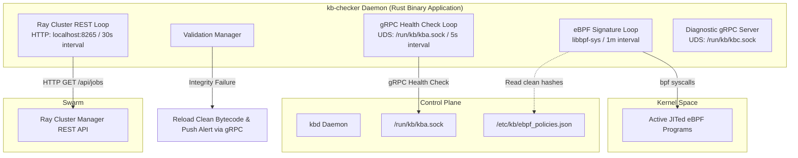

# Safety & Integrity Monitor Loops Design Specification

This document details the authoritative design architecture, command-line interface, scheduling parameters, and recovery procedures for the Rust-based safety and integrity enforcement daemon (`kb-checker`) in Kernel Borderlands.

---

## 1. Architectural Decisions



### A. eBPF Hook Integrity Verification
*   **Mechanism**: The daemon uses native `bpf` system calls (`BPF_PROG_GET_NEXT_ID`, `BPF_OBJ_GET_INFO_BY_FD`) via `libbpf-sys` to inspect active kernel program descriptors.
*   **Validation**: Program bytecodes are hashed and compared directly against verified signature policies loaded from `/etc/kb/ebpf_policies.json` to detect unauthorized hook modifications or hijack attempts.
*   **Interval**: Executed asynchronously on a **1-minute sleep interval** to prevent system lockups during high load.

### B. Control Plane Availability Verification
*   **Mechanism**: Initiates periodic gRPC ping handshakes.
*   **Transport Socket**: Communicates over a secure local Unix Domain Socket at `/run/kb/kba.sock`.
*   **Latency Target**: Must complete connection and sign-response checks within a strict **100ms timeout**. Any connection refusal or timeout is flagged as a Control Plane hang.
*   **Interval**: Executed asynchronously on a **5-second sleep interval**.

### C. AADS Swarm Status Verification
*   **Mechanism**: Queries the Ray cluster manager REST API node endpoint at `http://localhost:8265/api/jobs`.
*   **Validation**: Verifies active worker node execution states, job queue allocations, and consensus cluster health.
*   **Interval**: Executed asynchronously on a **30-second sleep interval**.

---

## 2. Command-Line Interface (CLI) Specification

`kb-checker` is built as an executable command-line utility with structured subcommands for daemon initialization and on-demand diagnostic checks:

```bash
# Start the background validation loops daemon (with optional/default diagnostic server)
kb-checker monitor --all --grpc-socket /run/kb/kbc.sock

# Run one-off integrity checks
kb-checker check ebpf
kb-checker check control-plane
kb-checker check swarm
```

---

## 3. Containment and Auto-Recovery Protocol

If any integrity verification loop fails:
1.  **Quarantine State Triggered**: The checker daemon communicates an emergency isolation state payload to the Control Plane gRPC gateway over the `/run/kb/kba.sock` UDS connection.
2.  **Audit Logging**: An immutable, SHA-256 chained tamper-evident audit record is appended immediately to the L2 SQLite ledger by the Go Control Plane.
3.  **Skeleton Auto-Reload**: The checker executes the native C loader utility:
    ```bash
    /usr/sbin/kb-core-loader --reload
    ```
    This reloads verified clean eBPF program bytecodes, restoring system integrity without requiring a full host reboot.
