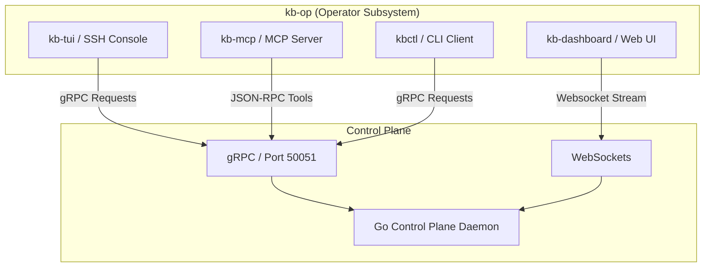

# KB Operator Interfaces (`kb-op/`)

This directory houses the administrative interfaces, dashboards, API servers, and command-line clients used by security operators to monitor, audit, and coordinate threat containment actions within Kernel Borderlands.

---

## 1. Subsystem Catalog



### A. Terminal Interface (`kb-tui/`)
- **Description**: A console built using Rust, ratatui, and tonic (gRPC). It provides a keyboard-driven interface to manage process states and threat mitigations without requiring browser access.
- **Served On**: SSH access is provided by `kbd` itself (host keys, `authorized_keys`, PTY allocation) — `kbd` spawns `kb-tui` attached to the session. `kb-tui` connects to the control plane's `KernelBorderlands` gRPC service over the Unix domain socket at `/run/kb/kba.sock`.
- **Features**: Live process color-coded lists, real-time alert feed, system telemetry header, an interactive query console, and keyboard execution triggers for containment actions.

### B. Web Dashboard (`kb-dashboard/`)
- **Description**: A modern React-based visualization panel compiled with Vite and TypeScript.
- **Features**: Interactive force-directed process swarm graphs (D3.js), historical threat-level distribution charts (Recharts), and low-latency state synchronization.
- **Port**: Development runs on port `5173`.

### C. MCP Integration Server (`kb-mcp/`)
- **Description**: Model Context Protocol (MCP) server written in Go or Rust.
- **Features**: Exposes standardized tools, resources, and prompt templates (e.g. `kb.get_process`, `kb.list_anomalies`, `kb.quarantine_process`) to external LLM clients, agent swarms, and IDE environments.

### D. Command-Line Client (`kbctl/`)
- **Description**: Cobra-based CLI client built with Go to interface directly with the control plane gRPC API.
- **Features**: Supports dynamic policy reloads, manual threat zone overrides, process isolation containment, and SHA-256 audit ledger exports.

---

## 2. Command Quick Reference

### Building and Launching the TUI Console
```bash
# Navigate to TUI directory
cd kb-op/kb-tui

# Build the ratatui console binary
cargo build --release

# Run locally (connects directly to kbd over /run/kb/kba.sock)
cargo run

# Or, over SSH: kbd handles the SSH server and PTY spawn, kb-tui is not dialed directly
ssh kb@kb-server
```

### Running the Web Dashboard
```bash
# Navigate to Dashboard directory
cd kb-op/kb-dashboard

# Install NPM dependencies
npm install

# Run Vite dev server
npm run dev
```

### Running the MCP Host Server
```bash
# Navigate to MCP directory
cd kb-op/kb-mcp

# Build the MCP server binary
go build -o kb-mcp main.go

# Run the server (JSON-RPC over stdio)
./kb-mcp
```

### Building the kbctl Command Line Client
```bash
# Navigate to kbctl directory
cd kb-op/kbctl

# Build the CLI binary
go build -o kbctl main.go

# Verify connection by triggering a policy reload
./kbctl policy reload
```

---

## 3. Design Aesthetics & Branding

All operator interfaces follow the Kernel Borderlands visual theme:
- **Primary Color Accents**: Neon Orange (`#FF5722`) and Toxic Matrix Green (`#00FF66`).
- **Layout Model**: Clean, responsive grid cards detailing threat zone statuses (`SAFE` $\to$ `SUSPICIOUS` $\to$ `BORDERLANDS`).
- **Interactions**: Subtle, non-intrusive micro-animations with zero layout shifts on resize or mode change.

## Owner
- Rupa — TUI, CLI Tooling & Operator Infra.